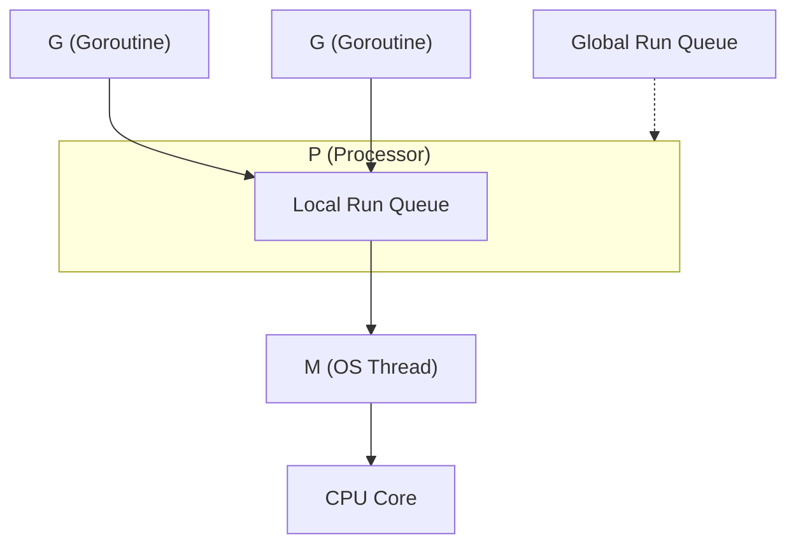

Go 言語の並行処理を支えるランタイムスケジューラは、**G・M・P モデル** と呼ばれるアーキテクチャで動作しています。この記事では、ランタイムの内部実装にまで踏み込みながら、インタラクティブなビジュアライゼーションを使ってスケジューリングの仕組みを解説します。

## G・M・P モデルの概要



## G・M・P の内部構造

### G（Goroutine）— `runtime.g` 構造体

Goroutine の実態は [`runtime/runtime2.go`](https://github.com/golang/go/blob/master/src/runtime/runtime2.go) に定義された `runtime.g` 構造体です。

```go
type g struct {
    stack       stack   // lo, hi — 現在のスタック範囲
    stackguard0 uintptr // プリエンプションチェックに使用
    m           *m      // 現在この G を実行している M
    sched       gobuf   // コンテキストスイッチ用の状態
    atomicstatus atomic.Uint32 // G の状態フラグ
    goid         uint64 // goroutine ID
    // ... 他多数
}
```

重要なフィールド:

- **`stack`** — 各 G は **初期 2KB** のスタックを持ちます（OS スレッドの 1〜8MB と比較して非常に小さい）。必要に応じて `runtime.morestack()` で自動的に拡張されます。
- **`sched` (`gobuf`)** — コンテキストスイッチ時に PC (Program Counter)、SP (Stack Pointer)、BP (Base Pointer) を保存する構造体。G が中断・再開される度にここに読み書きされます。
- **`stackguard0`** — 通常はスタックの下限付近のアドレス。プリエンプション時には特別な値 `stackPreempt` が設定されます。
- **`atomicstatus`** — G のライフサイクルを表す状態: `_Gidle` → `_Grunnable` → `_Grunning` → `_Gsyscall` / `_Gwaiting` → `_Gdead`

### M（Machine）— `runtime.m` 構造体

M は OS スレッドを 1:1 で表す構造体です（[`runtime/runtime2.go`](https://github.com/golang/go/blob/master/src/runtime/runtime2.go)）。

```go
type m struct {
    g0      *g     // スケジューリング用の特殊 G（大きなスタック）
    curg    *g     // 現在実行中のユーザー G
    p       *p     // 紐付いている P
    nextp   *p     // 起床時に紐付ける P
    spinning bool  // steal 先を探している状態
    // ...
}
```

- **`g0`** — 各 M に 1 つ存在する特殊な goroutine。`schedule()`、`findRunnable()`、GC などのランタイムコードは `g0` のスタック上で実行されます。`mcall()` でユーザー G から g0 に切り替えます。
- **`curg`** — 現在 M 上で実行中のユーザー goroutine。`execute()` で設定され、`goexit()` / preemption でクリアされます。
- **`spinning`** — M が Work Stealing のためにビジーループ中であることを示すフラグ。spinning M の数を制限することで CPU の無駄遣いを防ぎます。

### P（Processor）— `runtime.p` 構造体

P は「ユーザー Go コードを実行する権利」を表す論理的なリソースです（[`runtime/runtime2.go`](https://github.com/golang/go/blob/master/src/runtime/runtime2.go)）。

```go
type p struct {
    status    uint32 // _Pidle, _Prunning, _Psyscall, _Pgcstop, _Pdead
    runqhead  uint32 // ローカルキューの先頭インデックス
    runqtail  uint32 // ローカルキューの末尾インデックス
    runq      [256]guintptr // ローカル実行キュー（リングバッファ）
    runnext   guintptr      // 次に実行する G（キューよりも優先）
    gFree     struct { ... } // 再利用可能な G のフリーリスト
    // ...
}
```

- **`runq`** — **256 エントリの固定長リングバッファ**。ロックなしでアクセスできる（所有者 P のみが head を進め、steal はアトミック CAS で tail 側から取得）。
- **`runnext`** — 直前に生成された G を最優先で実行するための 1 スロットキャッシュ。局所性（locality）を高めるための最適化です。
- P の数は `GOMAXPROCS` で決まり、プログラム実行中は基本的に固定です。

## `schedule()` ループの詳細

全てのスケジューリング判断は [`runtime.schedule()`](https://github.com/golang/go/blob/master/src/runtime/proc.go) 関数で行われます（[`runtime/proc.go`](https://github.com/golang/go/blob/master/src/runtime/proc.go)）。M は g0 スタック上でこのループを回り続けます。

```go
func schedule() {
    // 公平性: 61回に1回はグローバルキューを優先
    if schedtick%61 == 0 {
        G = globrunqget(P)    // グローバルキューから取得
    }
    if G == nil {
        G = runqget(P)        // ① runnext → ② ローカルキュー
    }
    if G == nil {
        G = findRunnable(P)   // ③ ブロッキング探索
        // → globrunqget → netpoll → steal from random P
    }
    execute(G)  // gobuf 復元 → ユーザーコード実行
}
```

`findRunnable()` の探索順序:
1. **runnext** — 1 スロットキャッシュ
2. **ローカルキュー** — `runqget()` でリングバッファから取得
3. **グローバルキュー** — `globrunqget()` で `min(len/GOMAXPROCS+1, len/2)` 個をバッチ取得
4. **Netpoller** — `netpoll()` で I/O 完了した G を回収
5. **Work Stealing** — ランダムな P のキューから `runqsteal()` で半分を盗む

## スケジューラの動きを見てみよう

下のビジュアライゼーションでは、上記の内部動作をステップ実行で追体験できます。各ステップの解説にはランタイム関数名を含めています。

<GoRoutineVisualizer />

## プリエンプション（Preemption）の内部実装

### 協調的プリエンプション（Go 1.1〜）

Go コンパイラは全ての関数の先頭に **スタックチェックのプロローグ** を挿入します:

```asm
// 関数プロローグ（擬似コード）
MOV  AX, [G.stackguard0]
CMP  AX, SP
JBE  morestack          // スタック拡張 or プリエンプション
```

sysmon が `retake()` で 10ms 以上実行中の G を検知すると、`stackguard0` に `stackPreempt`（`0xfffffade`）を設定します。次の関数呼び出し時にプロローグでこの値が検出され、`morestack()` 経由で `gopreempt_m()` が呼ばれて G は _Grunnable に戻されます。

**問題**: `for {}` のような関数呼び出しを含まないタイトループではプリエンプションが効きません。

### 非同期プリエンプション（Go 1.14+）

Go 1.14 で **シグナルベースの非同期プリエンプション** が導入されました:

1. sysmon が `preemptone()` を呼ぶ
2. 対象 M に `SIGURG` シグナルを送信
3. シグナルハンドラ `doSigPreempt()` が実行され、現在の PC/SP を保存
4. G のスタック上に **asyncPreempt フレーム** を注入
5. G は中断され、schedule() に制御が戻る

```go
// runtime/signal_unix.go — https://github.com/golang/go/blob/master/src/runtime/signal_unix.go
func doSigPreempt(gp *g, ctxt *sigctxt) {
    if wantAsyncPreempt(gp) && isAsyncSafePoint(gp, ctxt.sigpc(), ctxt.sigsp(), ctxt.siglr()) {
        ctxt.pushCall(abi.FuncPCABI0(asyncPreempt), ctxt.rip())
    }
}
```

`isAsyncSafePoint()` は、GC のルートセットが正確に列挙できる安全なポイントでのみプリエンプションを許可します。

## sysmon — 監視デーモン

`sysmon` は **M に紐付かない** 特殊な goroutine で、独立した OS スレッド上でバックグラウンドループを回ります（[`runtime/proc.go`](https://github.com/golang/go/blob/master/src/runtime/proc.go)）。

```go
func sysmon() {
    for {
        usleep(delay) // 20μs 〜 10ms（適応的）
        // 1. Netpoller の結果を回収
        netpoll(0)
        // 2. 長時間の syscall → P を hand-off
        retake(now)
        // 3. 長時間実行中の G をプリエンプト
        // 4. GC の STW が必要な場合にシグナル送信
        // 5. 強制 GC のチェック（2分以上 GC がない場合）
    }
}
```

### [`retake()`](https://github.com/golang/go/blob/master/src/runtime/proc.go) の判定ロジック

```go
func retake(now int64) uint32 {
    for _, pp := range allp {
        s := pp.status
        if s == _Prunning {
            // 10ms 以上実行 → preemptone()
            if pd.schedwhen + 10ms < now {
                preemptone(pp)
            }
        } else if s == _Psyscall {
            // 20μs 以上 syscall 中 & 他に仕事がある → handoffp()
            if runqempty(pp) && sched.nmspinning + sched.npidle > 0 {
                continue // すぐには hand-off しない
            }
            handoffp(pp) // P を M から切り離す
        }
    }
}
```

## Netpoller — 非同期 I/O 統合

Go の全てのネットワーク I/O（`net.Conn.Read()` など）は **netpoller** を通じて非同期化されています。

1. G がネットワーク I/O を開始 → `runtime.pollWait()` で `gopark()` → G は _Gwaiting に
2. fd は epoll/kqueue/IOCP に登録される
3. `findRunnable()` や `sysmon` が定期的に `netpoll()` を呼び出し
4. I/O 完了した G を `injectglist()` で実行キューに戻す

```go
// ネットワーク I/O の内部フロー
conn.Read(buf)
  → internal/poll.FD.Read()
    → runtime.pollWait()
      → gopark(netpollblockcommit) // G を _Gwaiting に
// ... I/O 完了を epoll_wait で検知 ...
runtime.netpoll()
  → G を _Grunnable に戻す
  → injectglist() でキューに投入
```

syscall (`read(2)` 等) とは異なり、netpoller は **M をブロックしません**。これが `net/http` サーバーが大量の接続を少ない OS スレッドで捌ける理由です。

## G のライフサイクル — 状態遷移

```text
_Gidle → _Gdead → _Grunnable → _Grunning → _Gdead
                       ↑            ↓
                       ← ←  preempt ← ←
                       ↑            ↓
                       ← _Gwaiting ←  (chan/mutex/IO)
                       ↑            ↓
                       ← _Gsyscall ←  (syscall)
```

- **`_Grunnable`** — 実行可能だがまだ M に割り当てられていない
- **`_Grunning`** — M 上で実行中
- **`_Gwaiting`** — chan 受信、mutex、I/O 待ちなどでブロック中
- **`_Gsyscall`** — システムコール実行中（M もブロック）
- **`_Gdead`** — 完了。構造体は `gFree` リストにプールされ再利用される

## コンテキストスイッチのコスト

Go のコンテキストスイッチは OS のスレッドスイッチと比べて非常に軽量です:

| | Go goroutine | OS スレッド |
|---|---|---|
| **切り替え対象** | PC, SP, BP, 数個のレジスタ (`gobuf`) | 全レジスタ + ページテーブル + TLB flush |
| **コスト** | 約 100〜200ns | 約 1〜10μs |
| **スタックサイズ** | 初期 2KB（動的拡張） | 固定 1〜8MB |
| **生成コスト** | `runtime.newproc` ≈ 300ns | `pthread_create` ≈ 10〜30μs |

[`gobuf`](https://github.com/golang/go/blob/master/src/runtime/runtime2.go) の構造:

```go
type gobuf struct {
    sp   uintptr // スタックポインタ
    pc   uintptr // プログラムカウンタ
    g    guintptr
    ctxt unsafe.Pointer
    ret  uintptr
    lr   uintptr // ARM のリンクレジスタ
    bp   uintptr // ベースポインタ（フレームポインタ）
}
```

## GOMAXPROCS と実際のスレッド数

P の数は `GOMAXPROCS` で固定ですが、実際の M（OS スレッド）の数はそれ以上になりえます:

- syscall でブロックされた M は P を手放し、新しい M が生成される
- M の最大数はデフォルトで **10,000** (`runtime/debug.SetMaxThreads`)
- アイドル M はすぐには破棄されず、`midle` リストにプールされる

```go
runtime.GOMAXPROCS(4)  // P = 4 個
// でも M は 4 個以上存在しうる
// 例: 4つの P + syscall でブロック中の M が 10 個 = 合計 14 M
```

## まとめ

Go スケジューラの G・M・P モデルは、以下の仕組みで高効率な並行処理を実現しています:

1. **M:N スケジューリング** — 多数の G を少数の M に多重化
2. **ロックフリーのローカルキュー** — P 毎の 256 エントリリングバッファで競合なく G を管理
3. **Work Stealing** — アイドル P が他の P から仕事を盗んで負荷分散
4. **Hand-off** — syscall で M がブロックされても P が止まらない
5. **Netpoller** — ネットワーク I/O を epoll/kqueue で非同期化し、M をブロックしない
6. **協調的 + 非同期プリエンプション** — 関数プロローグ + SIGURG で公平な CPU 時間配分
7. **sysmon** — 独立スレッドで監視し、長時間 syscall/実行を検知して対処
