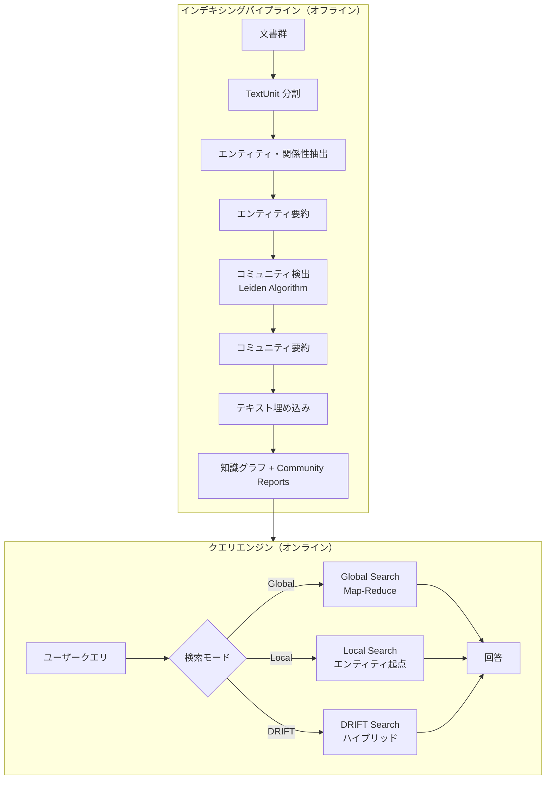
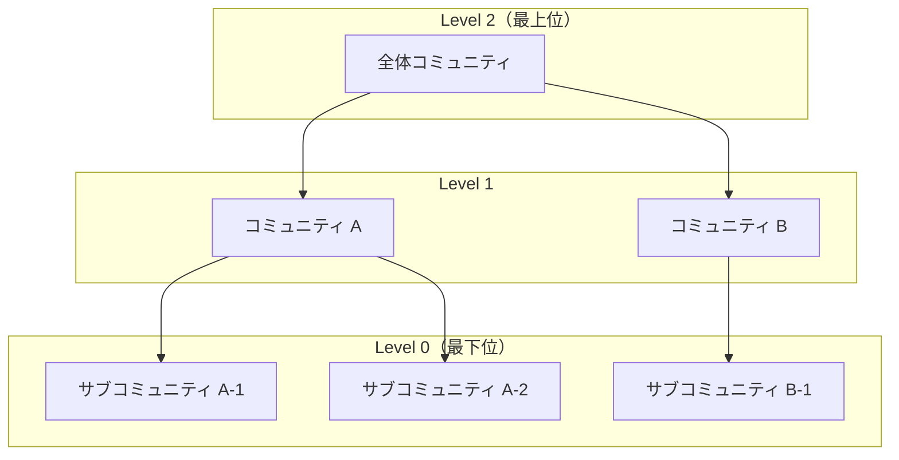
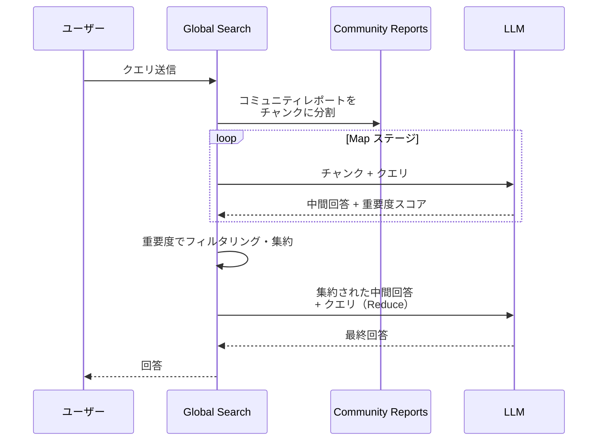
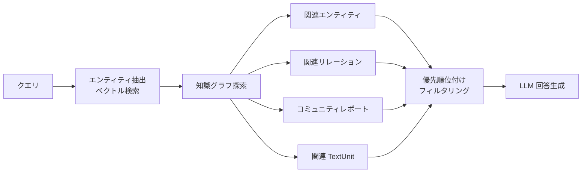
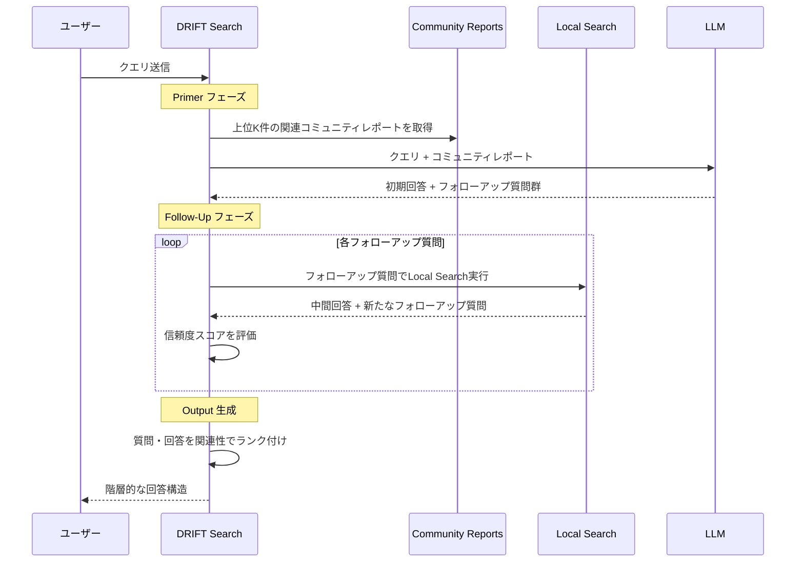

## はじめに ─ なぜ GraphRAG が必要なのか

Retrieval-Augmented Generation（RAG）は、LLM の回答品質を大幅に向上させる技術として広く採用されています。しかし、従来の **Baseline RAG**（ベクトル類似度検索ベースの RAG）には、根本的な限界があります。

### Baseline RAG の限界

従来の RAG は、ユーザーのクエリをベクトル化し、コーパス内のテキストチャンクとのコサイン類似度で上位 k 件を取得する仕組みです。この手法は以下の 2 つのケースで深刻な問題を抱えています。

#### 限界 1: 点と点をつなげない（Connect the dots）

回答に必要な情報が複数のドキュメントに分散しており、共通属性を介して横断的に推論する必要がある場合、ベクトル検索では適切なチャンクを取得できません。

例として、ある企業の社内文書群に対して「田中さんが関わったプロジェクトで、最終的に製品化されたものはどれか？」と質問するケースを考えます。この回答には少なくとも以下の情報が必要です。

- **文書 A**（人事記録）: 「田中太郎は 2023 年にプロジェクト Alpha に配属された」
- **文書 B**（議事録）: 「プロジェクト Alpha の成果物は品質検証フェーズに進んだ」
- **文書 C**（プレスリリース）: 「品質検証を通過した製品 X が 2024 年 3 月に発売された」

Baseline RAG は「田中さん」「製品化」に意味的に近いチャンクを探しますが、文書 B には田中さんの名前も「製品化」という単語も出てきません。結果として、Alpha → 品質検証 → 製品 X という情報の連鎖をたどれず、正しい回答を生成できません。

一方 GraphRAG なら、「田中太郎」→「プロジェクト Alpha」→「品質検証」→「製品 X」というエンティティ間の関係をグラフ上でたどることで、この質問に正確に回答できます。

#### 限界 2: 全体像を把握できない（Holistic understanding）

「このデータセットの主要テーマは何か？」のような要約・俯瞰型の質問に対して、ベクトル検索はクエリに意味的に近いチャンクしか返せず、データセット全体の構造を捉えることができません。

例えば、1,000 件のニュース記事を分析する際に「この期間のニュースの主要トピック Top 5 は？」と質問したとします。Baseline RAG は「トピック」「主要」に近いチャンクを探しますが、以下の問題が発生します。

- 「主要トピック」という言葉を含むチャンクは、実際の主要トピックとは全く無関係かもしれない
- データセット全体に広く分散したテーマは、どの個別チャンクにも十分にまとまっていない
- 結果として、LLM はたまたま取得できた数件のチャンクから無理やりテーマをでっちあげることになる

GraphRAG はこの問題を、**コミュニティレポート** で解決します。インデキシング時にデータセット全体の構造をコミュニティとして把握し、各コミュニティの要約を事前に生成しているため、「全体のテーマは？」という質問に対して、データセット全体を踏まえた構造的な回答が可能です。

### GraphRAG のアプローチ

[GraphRAG](https://github.com/microsoft/graphrag) は、Microsoft Research が開発した新しい RAG 手法です。非構造化テキストから LLM を使って **知識グラフ**（ナレッジグラフ）を構築し、そのグラフ構造を活用してクエリ時のコンテキストを強化します。

GraphRAG の中核的なアイデアは以下の 3 点です。

- **エンティティと関係性の抽出**: LLM がテキストから人物・組織・場所・概念などのエンティティと、それらの間の関係性を抽出し、知識グラフを構成する
- **階層的コミュニティ検出**: Leiden アルゴリズムを用いてグラフをクラスタリングし、意味的なコミュニティ階層を構築する
- **コミュニティレポートの事前生成**: 各コミュニティの内容を LLM で要約した「コミュニティレポート」を事前に生成し、クエリ時に活用する

この仕組みにより、Baseline RAG が苦手とする「横断的な推論」と「全体像の把握」の両方が可能になります。

> 📄 **論文**: [From Local to Global: A Graph RAG Approach to Query-Focused Summarization](https://arxiv.org/pdf/2404.16130) (arXiv, 2024)

### パラダイムシフト ─ 「点群の検索」から「意味グラフの探索」へ

Baseline RAG と GraphRAG の違いを、知識ベースの構造という観点で整理してみましょう。

Baseline RAG は文書をフラットなチャンクの集合として扱い、ベクトル空間上の「点」同士の距離だけで検索します。つまり、知識ベースは**座標のない点群** — 互いの関係性が見えない、バラバラの断片の山です。

GraphRAG はそこに**構造**を与えます。エンティティ（人・組織・概念など）をノード、それらの関係をエッジとしたグラフを構築することで、データセット内の意味的なつながり — 誰が何に関わり、何が何に影響し、どの概念同士が近いか — を明示的にモデル化します。さらに Leiden アルゴリズムでコミュニティ（意味的クラスター）を検出して階層化するので、「局所的な事実」から「全体的なテーマ」まで、異なる抽象度でデータを捉えられるようになります。

これを一言で表現すれば、GraphRAG とは**対象コーパスの意味空間をグラフとして構造化し、それを RAG の知識ベースとして活用する手法**です。ここでいう「意味空間」は世界全体の知識ではなく、あくまで入力文書から LLM が抽出したエンティティと関係に基づく、コーパスに閉じた意味空間である点に注意が必要です。文書に書かれていない知識は含まれないという制約は Baseline RAG と同じですが、文書内の情報を構造的に組織化する点が決定的に異なります。

```text
Baseline RAG:  文書 → フラットなチャンク群 → ベクトル距離で検索
GraphRAG:     文書 → 構造化された意味グラフ → グラフ探索＋コミュニティ要約で回答
```

---

## アーキテクチャ全体像

GraphRAG は大きく **インデキシングパイプライン**（オフライン処理）と **クエリエンジン**（オンライン処理）の 2 つのフェーズで構成されます。



---

## インデキシングパイプライン ─ 知識グラフ構築の 6 フェーズ

以下のインタラクティブなビジュアライザーで、GraphRAG のインデキシングパイプラインの各フェーズを順に確認できます。

<GraphRAGPipelineVisualizer />

### Phase 1: TextUnit の構成

最初のフェーズでは、入力文書をトークン単位の **チャンク（TextUnit）** に分割します。TextUnit は、以降のグラフ抽出の基本単位であり、抽出された知識の **出典参照（プロベナンス）** としても機能します。

- デフォルトのチャンクサイズは **1200 トークン**
- 大きなチャンクほど処理は高速だが、出力の粒度が粗くなる
- 各 TextUnit は文書との紐付けが保持される

```text
Document 1 → [TextUnit 1] [TextUnit 2]
Document 2 → [TextUnit 3] [TextUnit 4]
```

### Phase 2: ドキュメント処理

Documents テーブルを生成し、各ドキュメントと TextUnit の対応関係を記録します。これにより、最終的な回答から元のドキュメントまでトレースバックが可能になります。

### Phase 3: グラフ抽出

このフェーズが GraphRAG の核心です。3 つのサブステップで構成されます。

#### 3a. エンティティ・関係性抽出

各 TextUnit を LLM に入力し、以下を抽出します。

- **エンティティ**: タイトル、タイプ（人物・組織・場所・イベントなど）、説明
- **関係性**: ソースエンティティ、ターゲットエンティティ、説明

同じタイトル＋タイプのエンティティが複数の TextUnit から抽出された場合、それらの説明は配列としてマージされます。関係性も同様に、同じソース・ターゲットのペアの説明がマージされます。

```text
TextUnit → LLM → サブグラフ（エンティティ群 + 関係性群）
                    ↓
          グローバルグラフにマージ（説明は配列で集約）
```

#### 3b. エンティティ・関係性要約

マージされた説明の配列を LLM に渡し、各エンティティ・関係性に対して **単一の簡潔な説明** を生成します。これにより、すべてのエンティティと関係性が一貫した説明を持つようになります。

#### 3c. クレーム抽出（オプション）

TextUnit から独立して **コバリエイト（クレーム）** を抽出します。これは、エンティティに関する事実的主張で、時間的境界付きの評価済みステートメントとして表現されます。

> ⚠️ クレーム抽出はデフォルトで無効です。有効にするには通常、プロンプトチューニングが必要です。

### Phase 4: グラフ拡張 ─ コミュニティ検出

エンティティと関係性のグラフが構築されたら、**Leiden アルゴリズム** を適用して階層的なコミュニティ構造を検出します。

#### Leiden アルゴリズムとは

Leiden アルゴリズム（[Traag et al., 2019](https://arxiv.org/pdf/1810.08473.pdf)）は、Louvain アルゴリズムの改良版で、グラフのコミュニティ（クラスター）を検出するためのアルゴリズムです。主な特徴は以下の通りです。

1. **モジュラリティ最適化**: グラフの接続密度に基づいて、密に接続されたノード群をコミュニティとしてグループ化
2. **階層的検出**: 再帰的にコミュニティを検出し、コミュニティサイズの閾値に達するまでクラスタリングを繰り返す
3. **保証付き接続性**: Louvain と異なり、Leiden は各コミュニティ内の接続性を保証する



この階層構造により、データセットを異なる粒度で理解できます。上位レベルはデータセット全体のテーマを、下位レベルは局所的な詳細をそれぞれ捉えます。

### Phase 5: コミュニティ要約

各コミュニティの内容を LLM で要約し、**コミュニティレポート** を生成します。

- **エグゼクティブサマリー**: コミュニティ全体の概要
- **主要エンティティ**: コミュニティ内の重要なエンティティとその役割
- **関係性**: エンティティ間の主要な関係
- **クレーム**: 関連するクレーム（有効な場合）

上位レベルのコミュニティレポートほど広範なテーマを捉え、下位レベルほど詳細な情報を含みます。このレポートがクエリ時のコンテキストとして利用されます。

### Phase 6: テキスト埋め込み

最後に、下流のベクトル検索のためにテキスト埋め込みを生成します。

- **エンティティ説明** の埋め込み
- **TextUnit テキスト** の埋め込み
- **コミュニティレポート** の埋め込み

これらの埋め込みは設定されたベクトルストアに書き込まれます。

---

## GraphRAG の知識モデル

GraphRAG のインデキシングパイプラインは、以下のデータ型を出力します。

| データ型 | 説明 |
|---|---|
| **Document** | 入力文書。CSV の行または `.txt` ファイル |
| **TextUnit** | 分析用のテキストチャンク |
| **Entity** | TextUnit から抽出されたエンティティ（人物・場所・組織など） |
| **Relationship** | 2 つのエンティティ間の関係 |
| **Covariate** | 抽出されたクレーム情報（時間的境界付き） |
| **Community** | エンティティのクラスタリング結果 |
| **Community Report** | コミュニティの要約レポート |

出力はデフォルトで **Parquet テーブル** として保存されます。

---

## クエリエンジン ─ 4 つの検索モード

### Global Search ─ データセット全体の俯瞰

**Global Search** は、「データセット全体の主要テーマは何か？」のような、データセット全体にまたがる俯瞰的な質問に最適な検索モードです。

#### Map-Reduce 方式の処理フロー



1. **Map ステージ**: コミュニティレポートを事前定義サイズのチャンクに分割し、各チャンクに対して LLM で中間回答（ポイントリスト＋重要度スコア）を生成
2. **Reduce ステージ**: 最も重要なポイントを集約し、最終的な回答のコンテキストとして使用

> ⚠️ コミュニティ階層のどのレベルのレポートを使うかにより、回答の品質と処理コストが大きく変わります。低いレベルほど詳細な回答が得られますが、処理コストが増加します。

### Local Search ─ 特定エンティティの深掘り

**Local Search** は、「カモミールの治療効果は？」のような、特定のエンティティに関する質問に最適です。

#### 処理フロー

1. ユーザークエリからエンティティを抽出（エンティティ説明の埋め込みとのベクトル検索）
2. 抽出されたエンティティを **アクセスポイント** として知識グラフを探索
3. 関連するエンティティ、関係性、コバリエイト、コミュニティレポート、元の TextUnit を収集
4. トークン予算内で優先順位付け・フィルタリング
5. コンテキストウィンドウに収めて LLM で回答生成



### DRIFT Search ─ Global と Local のハイブリッド

**DRIFT Search**（Dynamic Reasoning and Inference with Flexible Traversal）は、Local Search にコミュニティ情報を組み込んだハイブリッド検索です。3 つのフェーズで構成されます。

1. **Primer フェーズ**: ユーザークエリと上位 K 件の意味的に関連するコミュニティレポートを比較し、初期回答とフォローアップ質問を生成
2. **Follow-Up フェーズ**: Local Search を使ってフォローアップ質問を精緻化し、追加の中間回答と新たなフォローアップ質問を生成
3. **Output Hierarchy**: 関連性でランク付けされた質問と回答の階層構造を出力

DRIFT Search は、Local Search の精度と Global Search の広範な文脈理解を兼ね備えています。



### Basic Search ─ 従来型ベクトル検索

GraphRAG には、比較用として従来型のベクトル RAG（Basic Search）も含まれています。上位 k 件の TextUnit チャンクをコンテキストとして使用します。

---

## Baseline RAG vs GraphRAG ─ 実例比較

Microsoft Research のブログでは、ウクライナ・ロシア紛争に関するニュースデータセット（VIINA）を用いた比較が紹介されています。

### 例 1: 横断的推論が必要なケース

**クエリ**: 「Novorossiya は何をしたか？」

| Baseline RAG | GraphRAG |
|---|---|
| テキストに具体的な情報がないため回答不可 | Novorossiya が関与した破壊活動の詳細を、エンティティ間の関係をたどって網羅的に回答（出典のプロベナンス付き） |

Baseline RAG はクエリに意味的に近いチャンクを取得しますが、「Novorossiya」に言及するチャンクが上位に来なかったため失敗します。一方 GraphRAG は、知識グラフ上で Novorossiya エンティティを起点に関連する関係性をたどり、複数のソースから情報を統合できます。

### 例 2: 全体テーマの把握

**クエリ**: 「データの主要テーマ Top 5 は？」

| Baseline RAG | GraphRAG |
|---|---|
| 無関係なテーマ（都市開発、経済など）を列挙 | 紛争・軍事活動、政治的動向、人道的影響など、データセットの本質に即したテーマを回答 |

Baseline RAG は「テーマ」という語に引きずられて無関係なチャンクを取得していますが、GraphRAG はコミュニティレポートを活用してデータセット全体の構造を正確に捉えています。

---

## Microsoft Agent Framework (C#) を用いた実装

ここからは、[Microsoft Agent Framework](https://github.com/microsoft/agent-framework) の C# ライブラリを使って、GraphRAG スタイルの検索拡張生成を実装する方法を見ていきます。Agent Framework はエージェントの構築・オーケストレーション・デプロイのための包括的フレームワークです。

### 前提条件

```text
- .NET 10 SDK 以降
- Azure OpenAI または OpenAI の API キー
- Azure CLI（Azure OpenAI 使用時: az login で認証）
```

### Step 1: プロジェクトセットアップ

まず、新しいコンソールプロジェクトを作成し、Microsoft Agent Framework の NuGet パッケージを追加します。`Microsoft.Agents.AI` がコアライブラリで、エージェントの抽象化や関数ツール機能を提供します。`Microsoft.Agents.AI.OpenAI` は Azure OpenAI / OpenAI への接続アダプターです。

```bash
mkdir GraphRAGDemo
cd GraphRAGDemo
dotnet new console
dotnet add package Microsoft.Agents.AI
dotnet add package Microsoft.Agents.AI.OpenAI
```

これで、Agent Framework を使った開発の準備が整いました。Azure OpenAI を使用する場合は、事前に `az login` で認証しておく必要があります。

### Step 2: 知識グラフのデータモデル定義

GraphRAG の知識モデルを C# の `record` 型で表現します。`record` は不変データを表すのに最適で、`with` 式によるイミュータブルな更新も可能です。GraphRAG の公式実装（Python）で定義されている知識モデルの各テーブルに対応する型を定義していきます。

```csharp
// Models/KnowledgeGraph.cs
// https://github.com/microsoft/graphrag — Knowledge Model の C# 表現

/// <summary>テキストチャンク — GraphRAG の分析基本単位</summary>
public record TextUnit(string Id, string Text, string DocumentId);

/// <summary>エンティティ — ナレッジグラフのノード</summary>
public record Entity(
    string Id,
    string Title,
    string Type,        // "person", "organization", "location", "event", ...
    string Description,
    int CommunityId,
    float[] Embedding);

/// <summary>関係性 — ナレッジグラフのエッジ</summary>
public record Relationship(
    string SourceId,
    string TargetId,
    string Description,
    double Weight);

/// <summary>コミュニティ — Leiden アルゴリズムで検出されたクラスター</summary>
public record Community(
    int Id,
    string Title,
    int Level,
    string Report);    // LLM 生成のコミュニティレポート
```

これらの `record` 型を使うことで、パイプラインの各フェーズで生成されるデータを型安全に扱えます。`Entity` の `Embedding` フィールドは Phase 6 のテキスト埋め込みフェーズで設定され、Local Search 時のベクトル検索に使用されます。

### Step 3: エンティティ・関係性抽出エージェント

Agent Framework の核心的な機能の 1 つが **関数ツール（Function Tools）** です。C# のメソッドに `[Description]` 属性を付けるだけで、Agent Framework が自動的に JSON Schema を生成し、LLM の Function Calling 機能と連携させます。ここでは、TextUnit からエンティティと関係性を抽出する関数ツールを定義します。

```csharp
// Agents/EntityExtractor.cs
// https://github.com/microsoft/agent-framework — Agent Framework の関数ツール機能を活用

using System.ComponentModel;
using Microsoft.Agents.AI;
using Microsoft.Extensions.AI;

public static class EntityExtractor
{
    /// <summary>
    /// TextUnit からエンティティと関係性を抽出する関数ツール。
    /// Agent Framework が自動的に JSON Schema を生成し、LLM の Function Calling で呼び出す。
    /// </summary>
    [Description("テキストからエンティティ（人物・組織・場所・概念）と関係性を抽出する")]
    public static string ExtractEntitiesAndRelationships(
        [Description("分析対象のテキストチャンク")] string textUnit,
        [Description("抽出対象のエンティティタイプ（カンマ区切り）")] string entityTypes = "person,organization,location,event,concept")
    {
        // この関数は LLM の Function Calling 経由で呼び出される。
        // 実際には、LLM からの構造化出力をパースして
        // エンティティと関係性のリストを返す。
        return $$"""
        {
            "entities": [
                {"title": "...", "type": "...", "description": "..."}
            ],
            "relationships": [
                {"source": "...", "target": "...", "description": "..."}
            ]
        }
        """;
    }
}
```

上記の `ExtractEntitiesAndRelationships` メソッドは、LLM が「テキストからエンティティを抽出したい」と判断した際に自動的に呼び出されます。`[Description]` 属性のテキストは LLM に渡される JSON Schema の一部となり、関数の目的やパラメータの意味を LLM に伝えます。実際のプロダクション実装では、このメソッド内で LLM の構造化出力（Structured Output）をパースし、型付きのエンティティ・関係性オブジェクトに変換します。

### Step 4: エンティティ抽出エージェントの構成

次に、上で定義した関数ツールを使うエージェントを構成します。Agent Framework の `AsAIAgent` 拡張メソッドにより、`ChatClient` をラップしてエージェントとして扱えるようにします。`instructions` パラメータでシステムプロンプトを設定し、`tools` パラメータで先ほどの関数ツールを登録します。

```csharp
// Program.cs — エンティティ抽出エージェントの構成
// https://github.com/microsoft/agent-framework/blob/main/dotnet/samples/02-agents/Agents/

using Azure.AI.OpenAI;
using Azure.Identity;
using Microsoft.Agents.AI;
using Microsoft.Extensions.AI;

var endpoint = Environment.GetEnvironmentVariable("AZURE_OPENAI_ENDPOINT")
    ?? throw new InvalidOperationException("AZURE_OPENAI_ENDPOINT is not set.");
var deploymentName =
    Environment.GetEnvironmentVariable("AZURE_OPENAI_DEPLOYMENT_NAME") ?? "gpt-4o";

// エンティティ抽出エージェントを構成
AIAgent extractionAgent = new AzureOpenAIClient(
        new Uri(endpoint),
        new DefaultAzureCredential())
    .GetChatClient(deploymentName)
    .AsAIAgent(
        instructions: """
            あなたは知識グラフ構築の専門家です。
            与えられたテキストから、以下を JSON 形式で抽出してください:
            1. エンティティ: タイトル、タイプ（person/organization/location/event/concept）、説明
            2. 関係性: ソースエンティティ、ターゲットエンティティ、関係の説明
            重複するエンティティは同じタイトルで統一してください。
            """,
        tools: [AIFunctionFactory.Create(EntityExtractor.ExtractEntitiesAndRelationships)]);
```

`AsAIAgent` の呼び出しチェーンに注目すると、`AzureOpenAIClient` → `GetChatClient` → `AsAIAgent` と進んでいます。この流れにより、Azure OpenAI の認証情報（`DefaultAzureCredential`）、モデルのデプロイメント名、エージェントの振る舞い（instructions / tools）が一箇所にまとまります。`DefaultAzureCredential` は開発環境では `az login` の認証情報を、本番環境ではマネージド ID を自動的に使い分けます。

### Step 5: コミュニティ検出の実装

GraphRAG のインデキシングパイプラインの Phase 4 にあたるコミュニティ検出を実装します。本家の GraphRAG は Python の `graspologic` ライブラリを使って Leiden アルゴリズムを実行しますが、ここでは C# でモジュラリティ最適化の基本ロジックを実装し、アルゴリズムの動作原理を示します。

主な処理の流れは以下の通りです。

1. エンティティ間の関係性から隣接リスト（adjacency list）を構築
2. 各エンティティを初期状態として独自のコミュニティに配置
3. 各エンティティについて、隣接ノードが最も多く所属するコミュニティに移動（モジュラリティゲインの最大化）
4. 改善が見られなくなるまでループを繰り返す

```csharp
// Services/CommunityDetector.cs
// Leiden アルゴリズムの簡略化実装

/// <summary>
/// Leiden アルゴリズムに基づく階層的コミュニティ検出。
/// GraphRAG では graspologic (Python) を使用するが、
/// C# 実装ではモジュラリティ最適化のコアロジックを示す。
/// </summary>
public class CommunityDetector
{
    /// <summary>
    /// グラフからコミュニティを検出する。
    /// </summary>
    /// <param name="entities">エンティティのリスト</param>
    /// <param name="relationships">関係性のリスト</param>
    /// <param name="maxCommunitySize">コミュニティの最大サイズ閾値</param>
    /// <returns>コミュニティのリスト</returns>
    public List<Community> DetectCommunities(
        List<Entity> entities,
        List<Relationship> relationships,
        int maxCommunitySize = 10)
    {
        // 1. 隣接リストを構築
        var adjacency = BuildAdjacencyList(entities, relationships);

        // 2. 初期化: 各ノードを独自のコミュニティに配置
        var assignments = entities.ToDictionary(e => e.Id, e => e.Id);

        // 3. モジュラリティ最適化ループ
        bool improved;
        do
        {
            improved = false;
            foreach (var entity in entities)
            {
                var bestCommunity = FindBestCommunity(
                    entity, adjacency, assignments);
                if (bestCommunity != assignments[entity.Id])
                {
                    assignments[entity.Id] = bestCommunity;
                    improved = true;
                }
            }
        } while (improved);

        // 4. コミュニティをグループ化して返却
        return assignments
            .GroupBy(a => a.Value)
            .Select((g, i) => new Community(
                Id: i,
                Title: $"Community {i}",
                Level: 0,
                Report: "")) // レポートは後続フェーズで生成
            .ToList();
    }

    private Dictionary<string, List<string>> BuildAdjacencyList(
        List<Entity> entities,
        List<Relationship> relationships)
    {
        var adj = entities.ToDictionary(e => e.Id, _ => new List<string>());
        foreach (var rel in relationships)
        {
            if (adj.ContainsKey(rel.SourceId))
                adj[rel.SourceId].Add(rel.TargetId);
            if (adj.ContainsKey(rel.TargetId))
                adj[rel.TargetId].Add(rel.SourceId);
        }
        return adj;
    }

    private string FindBestCommunity(
        Entity entity,
        Dictionary<string, List<string>> adjacency,
        Dictionary<string, string> assignments)
    {
        // 隣接ノードのコミュニティとのモジュラリティゲインを計算
        var neighbors = adjacency.GetValueOrDefault(entity.Id) ?? [];
        var communityScores = neighbors
            .GroupBy(n => assignments.GetValueOrDefault(n, n))
            .ToDictionary(g => g.Key, g => (double)g.Count());

        return communityScores.Count > 0
            ? communityScores.MaxBy(kv => kv.Value).Key
            : assignments[entity.Id];
    }
}
```

上記の実装は Leiden アルゴリズムの簡略版です。本格的な実装では、さらに以下の最適化が含まれます。

- **リファインメントフェーズ**: ローカル移動の後にコミュニティ内の接続性を保証するリファインメントを実行（Leiden 独自の改良点）
- **集約フェーズ**: コミュニティをスーパーノードとして集約し、再帰的にアルゴリズムを適用して階層構造を構築
- **解像度パラメータ**: コミュニティの粒度を制御するパラメータ（GraphRAG では `max_cluster_size` で制御）

プロダクション環境では、`graspologic` の C# バインディングや、igraph の .NET ラッパーを使うことを推奨します。

### Step 6: コミュニティレポート生成

Phase 5 にあたるコミュニティレポートの生成を実装します。`CommunityReporter` クラスは、コミュニティ内のエンティティと関係性の情報を LLM に渡し、構造化されたレポートを生成します。Agent Framework の `CreateSessionAsync` と `RunAsync` により、会話形式でエージェントとやり取りできます。

```csharp
// Services/CommunityReporter.cs
// https://github.com/microsoft/agent-framework — エージェントを使ったコミュニティ要約

public class CommunityReporter
{
    private readonly AIAgent _agent;

    public CommunityReporter(AIAgent agent)
    {
        _agent = agent;
    }

    /// <summary>
    /// コミュニティ内のエンティティと関係性から要約レポートを生成する。
    /// </summary>
    public async Task<string> GenerateReportAsync(
        Community community,
        List<Entity> entities,
        List<Relationship> relationships)
    {
        var context = BuildCommunityContext(entities, relationships);

        var session = await _agent.CreateSessionAsync();
        var response = await _agent.RunAsync(
            $"""
            以下のコミュニティのエンティティと関係性に基づいて、
            コミュニティレポートを生成してください。

            レポートには以下を含めてください:
            1. エグゼクティブサマリー（2-3文）
            2. 主要エンティティとその役割
            3. 重要な関係性
            4. 主要テーマ・傾向

            コミュニティデータ:
            {context}
            """,
            session);

        return response.Text;
    }

    private string BuildCommunityContext(
        List<Entity> entities,
        List<Relationship> relationships)
    {
        var sb = new System.Text.StringBuilder();
        sb.AppendLine("=== エンティティ ===");
        foreach (var e in entities)
            sb.AppendLine($"- {e.Title} ({e.Type}): {e.Description}");

        sb.AppendLine("\n=== 関係性 ===");
        foreach (var r in relationships)
            sb.AppendLine($"- {r.SourceId} → {r.TargetId}: {r.Description}");

        return sb.ToString();
    }
}
```

`BuildCommunityContext` メソッドはコンテキスト文字列を構築するヘルパーです。エンティティの一覧と関係性の一覧をテキスト形式で LLM に渡します。生成されるレポートには、エグゼクティブサマリー、主要エンティティ、関係性の要約、テーマ分析が含まれます。このレポートが GraphRAG のクエリ時に最も重要なコンテキスト素材となります。

### Step 7: Global Search の実装

Global Search は、GraphRAG のクエリモードの中でもっともリソースを消費しますが、データセット全体に関する俯瞰的な質問に対して優れた回答を生成します。ここでは、Map-Reduce パターンを使って実装します。Map ステージでは各コミュニティレポートのチャンクを並列に処理し、Reduce ステージで中間結果を統合して最終回答を生成します。

```csharp
// Search/GlobalSearch.cs
// https://github.com/microsoft/graphrag — Global Search の C# 実装

public class GlobalSearch
{
    private readonly AIAgent _mapAgent;
    private readonly AIAgent _reduceAgent;
    private readonly int _maxTokensPerChunk;

    public GlobalSearch(
        AIAgent mapAgent,
        AIAgent reduceAgent,
        int maxTokensPerChunk = 2000)
    {
        _mapAgent = mapAgent;
        _reduceAgent = reduceAgent;
        _maxTokensPerChunk = maxTokensPerChunk;
    }

    /// <summary>
    /// コミュニティレポートを Map-Reduce で処理し、
    /// データセット全体に関する質問に回答する。
    /// </summary>
    public async Task<string> SearchAsync(
        string query,
        List<Community> communities)
    {
        // === Map ステージ ===
        // コミュニティレポートをチャンクに分割し、並列処理
        var reportChunks = ChunkReports(communities);
        var intermediateTasks = reportChunks.Select(chunk =>
            MapAsync(query, chunk));
        var intermediateResults = await Task.WhenAll(intermediateTasks);

        // === Reduce ステージ ===
        // 中間結果を集約して最終回答を生成
        var aggregated = intermediateResults
            .SelectMany(r => r.Points)
            .OrderByDescending(p => p.Score)
            .Take(20) // 上位 20 ポイントに絞る
            .ToList();

        return await ReduceAsync(query, aggregated);
    }

    private async Task<MapResult> MapAsync(
        string query, string reportChunk)
    {
        var session = await _mapAgent.CreateSessionAsync();
        var response = await _mapAgent.RunAsync(
            $"""
            以下のコミュニティレポートに基づいて、
            質問に関連するポイントを抽出し、
            各ポイントに 0-100 の重要度スコアを付けてください。

            質問: {query}

            レポート:
            {reportChunk}
            """,
            session);

        // 構造化出力をパース（簡略化）
        return ParseMapResult(response.Text);
    }

    private async Task<string> ReduceAsync(
        string query, List<ScoredPoint> points)
    {
        var context = string.Join("\n",
            points.Select(p => $"[Score: {p.Score}] {p.Text}"));

        var session = await _reduceAgent.CreateSessionAsync();
        var response = await _reduceAgent.RunAsync(
            $"""
            以下の情報ポイントに基づいて、質問に包括的に回答してください。
            各ポイントは元のデータセットから抽出された重要な情報です。

            質問: {query}

            情報ポイント:
            {context}
            """,
            session);

        return response.Text;
    }

    private List<string> ChunkReports(List<Community> communities)
    {
        // コミュニティレポートをトークン制限に基づいてチャンク化
        var chunks = new List<string>();
        var current = new System.Text.StringBuilder();

        foreach (var community in communities)
        {
            if (current.Length > _maxTokensPerChunk * 4) // おおよその文字数
            {
                chunks.Add(current.ToString());
                current.Clear();
            }
            current.AppendLine(community.Report);
        }
        if (current.Length > 0)
            chunks.Add(current.ToString());

        return chunks;
    }

    private MapResult ParseMapResult(string response)
        => new(new List<ScoredPoint>
        {
            new(response, 80) // 簡略化: 実際には構造化パースが必要
        });
}

public record MapResult(List<ScoredPoint> Points);
public record ScoredPoint(string Text, int Score);
```

この実装のポイントは、Map ステージの並列化です。`Task.WhenAll` を使って各チャンクの処理を並列に実行することで、大量のコミュニティレポートがあっても効率的に処理できます。Reduce ステージでは `OrderByDescending(p => p.Score).Take(20)` として、最も重要な 20 ポイントに絞り込んでいます。これにより、トークン予算内に収めつつ、最も関連性の高い情報だけを最終回答のコンテキストに使用します。

### Step 8: Local Search の実装

Local Search は、特定のエンティティに関する質問に答えるクエリモードです。ユーザーのクエリから関連エンティティをベクトル検索で特定し、そこを起点に知識グラフを探索して、関連するエンティティ・関係性・コミュニティレポート・元の TextUnit を収集します。

```csharp
// Search/LocalSearch.cs
// https://github.com/microsoft/graphrag — Local Search の C# 実装

public class LocalSearch
{
    private readonly AIAgent _agent;
    private readonly IVectorStore _vectorStore;

    public LocalSearch(AIAgent agent, IVectorStore vectorStore)
    {
        _agent = agent;
        _vectorStore = vectorStore;
    }

    /// <summary>
    /// 特定エンティティに関する質問に対して、
    /// 知識グラフの局所的な探索により回答する。
    /// </summary>
    public async Task<string> SearchAsync(
        string query,
        List<Entity> entities,
        List<Relationship> relationships,
        List<Community> communities,
        List<TextUnit> textUnits)
    {
        // 1. クエリに関連するエンティティをベクトル検索で特定
        var seedEntities = await _vectorStore.SearchAsync(
            query, topK: 5, collection: "entities");

        // 2. 知識グラフ上で近傍を探索
        var context = new SearchContext();
        foreach (var seed in seedEntities)
        {
            // 関連エンティティを収集
            var relatedRels = relationships
                .Where(r => r.SourceId == seed.Id || r.TargetId == seed.Id)
                .ToList();
            context.Relationships.AddRange(relatedRels);

            // 関連コミュニティレポートを収集
            var entity = entities.First(e => e.Id == seed.Id);
            var community = communities
                .FirstOrDefault(c => c.Id == entity.CommunityId);
            if (community != null)
                context.CommunityReports.Add(community.Report);

            // 関連 TextUnit を収集
            context.TextUnits.AddRange(
                textUnits.Where(tu => tu.Text.Contains(entity.Title)));
        }

        // 3. コンテキストを優先順位付けしてトークン予算内に収める
        var contextText = context.BuildContextString(maxTokens: 4000);

        // 4. LLM で回答生成
        var session = await _agent.CreateSessionAsync();
        var response = await _agent.RunAsync(
            $"""
            以下のコンテキスト情報に基づいて質問に回答してください。
            回答には可能な限り具体的な情報源を引用してください。

            質問: {query}

            コンテキスト:
            {contextText}
            """,
            session);

        return response.Text;
    }
}

public interface IVectorStore
{
    Task<List<Entity>> SearchAsync(
        string query, int topK, string collection);
}

public class SearchContext
{
    public List<Relationship> Relationships { get; } = [];
    public List<string> CommunityReports { get; } = [];
    public List<TextUnit> TextUnits { get; } = [];

    public string BuildContextString(int maxTokens)
    {
        var sb = new System.Text.StringBuilder();

        sb.AppendLine("=== コミュニティレポート ===");
        foreach (var report in CommunityReports.Take(3))
            sb.AppendLine(report);

        sb.AppendLine("\n=== 関係性 ===");
        foreach (var rel in Relationships.Take(10))
            sb.AppendLine($"- {rel.SourceId} → {rel.TargetId}: {rel.Description}");

        sb.AppendLine("\n=== ソーステキスト ===");
        foreach (var tu in TextUnits.Take(5))
            sb.AppendLine($"[{tu.Id}] {tu.Text[..Math.Min(200, tu.Text.Length)]}...");

        return sb.ToString();
    }
}
```

`SearchContext` クラスでは、コミュニティレポート・関係性・ソーステキスト（TextUnit）の 3 種類のコンテキストを収集し、`BuildContextString` でトークン予算に収まるように切り詰めます。`Take(3)` や `Take(10)` の値を調整することで、コンテキストの構成比率を制御できます。実際の GraphRAG では、各データソースに対してトークン予算を按分するより精密な制御が行われます。

### Step 9: パイプライン全体のオーケストレーション

ここまでに実装した各コンポーネント（エンティティ抽出エージェント、コミュニティ検出、コミュニティレポート生成）を統合して、GraphRAG パイプライン全体を 1 つのクラスにまとめます。`GraphRAGPipeline` クラスは、Phase 1（TextUnit 分割）から Phase 5（コミュニティレポート生成）までを順に実行し、知識グラフインデックスを構築します。

```csharp
// Pipeline/GraphRAGPipeline.cs
// https://github.com/microsoft/agent-framework — ワークフローオーケストレーション

using Azure.AI.OpenAI;
using Azure.Identity;
using Microsoft.Agents.AI;
using Microsoft.Extensions.AI;

public class GraphRAGPipeline
{
    private readonly AIAgent _extractionAgent;
    private readonly AIAgent _summarizationAgent;
    private readonly CommunityDetector _communityDetector;
    private readonly CommunityReporter _communityReporter;

    public GraphRAGPipeline(string endpoint, string deploymentName)
    {
        var client = new AzureOpenAIClient(
            new Uri(endpoint),
            new DefaultAzureCredential());

        _extractionAgent = client
            .GetChatClient(deploymentName)
            .AsAIAgent(instructions: "エンティティと関係性を抽出する専門家エージェント");

        _summarizationAgent = client
            .GetChatClient(deploymentName)
            .AsAIAgent(instructions: "コミュニティレポートを生成する要約エージェント");

        _communityDetector = new CommunityDetector();
        _communityReporter = new CommunityReporter(_summarizationAgent);
    }

    /// <summary>
    /// GraphRAG インデキシングパイプラインを実行する。
    /// Phase 1〜5 を順に実行し、知識グラフインデックスを構築する。
    /// </summary>
    public async Task<KnowledgeGraphIndex> BuildIndexAsync(
        List<string> documents)
    {
        // Phase 1: TextUnit 分割
        var textUnits = ChunkDocuments(documents, chunkSize: 1200);

        // Phase 3: エンティティ・関係性抽出
        var (entities, relationships) =
            await ExtractGraphAsync(textUnits);

        // Phase 4: コミュニティ検出
        var communities = _communityDetector.DetectCommunities(
            entities, relationships);

        // Phase 5: コミュニティレポート生成
        foreach (var community in communities)
        {
            var communityEntities = entities
                .Where(e => e.CommunityId == community.Id)
                .ToList();
            var communityRels = relationships
                .Where(r => communityEntities.Any(e => e.Id == r.SourceId))
                .ToList();

            var report = await _communityReporter.GenerateReportAsync(
                community, communityEntities, communityRels);

            // レポートを更新
            communities[communities.IndexOf(community)] =
                community with { Report = report };
        }

        return new KnowledgeGraphIndex(
            textUnits, entities, relationships, communities);
    }

    private List<TextUnit> ChunkDocuments(
        List<string> documents, int chunkSize)
    {
        var units = new List<TextUnit>();
        int unitId = 0;
        for (int docIdx = 0; docIdx < documents.Count; docIdx++)
        {
            var doc = documents[docIdx];
            // 簡易的な文字ベースのチャンキング
            // 実装では tiktoken などのトークナイザーを使う
            for (int i = 0; i < doc.Length; i += chunkSize)
            {
                var chunk = doc[i..Math.Min(i + chunkSize, doc.Length)];
                units.Add(new TextUnit(
                    $"tu-{unitId++}", chunk, $"doc-{docIdx}"));
            }
        }
        return units;
    }

    private async Task<(List<Entity>, List<Relationship>)>
        ExtractGraphAsync(List<TextUnit> textUnits)
    {
        var allEntities = new List<Entity>();
        var allRelationships = new List<Relationship>();

        foreach (var tu in textUnits)
        {
            var session = await _extractionAgent.CreateSessionAsync();
            var response = await _extractionAgent.RunAsync(
                $"""
                以下のテキストからエンティティと関係性を抽出してください。
                JSON 形式で出力してください。

                テキスト:
                {tu.Text}
                """,
                session);

            // レスポンスをパースしてエンティティ・関係性に変換
            // （実装の簡略化のため省略）
        }

        return (allEntities, allRelationships);
    }
}

public record KnowledgeGraphIndex(
    List<TextUnit> TextUnits,
    List<Entity> Entities,
    List<Relationship> Relationships,
    List<Community> Communities);
```

`BuildIndexAsync` メソッドが全パイプラインのエントリーポイントです。引数に文書のリストを受け取り、TextUnit 分割→エンティティ抽出→コミュニティ検出→コミュニティレポート生成を順に実行します。`ChunkDocuments` は簡易的な文字ベースのチャンキングを行っていますが、プロダクション実装では `tiktoken` などのトークナイザーを使ってトークン数ベースで正確にチャンキングする必要があります。

### 使用例: パイプライン実行からクエリまで

最後に、上記のすべてのコンポーネントを組み合わせた完全な使用例を示します。インデキシングパイプラインの実行から、構築された知識グラフインデックスに対する Global Search の実行までの流れです。

```csharp
// Program.cs — 完全な使用例

var endpoint = Environment.GetEnvironmentVariable("AZURE_OPENAI_ENDPOINT")!;
var model = Environment.GetEnvironmentVariable("AZURE_OPENAI_DEPLOYMENT_NAME")
    ?? "gpt-4o";

// 1. インデキシングパイプラインを実行
var pipeline = new GraphRAGPipeline(endpoint, model);
var documents = new List<string>
{
    File.ReadAllText("data/document1.txt"),
    File.ReadAllText("data/document2.txt"),
};

var index = await pipeline.BuildIndexAsync(documents);
Console.WriteLine(
    $"Index built: {index.Entities.Count} entities, " +
    $"{index.Relationships.Count} relationships, " +
    $"{index.Communities.Count} communities");

// 2. Global Search — データセット全体のテーマを質問
var client = new AzureOpenAIClient(
    new Uri(endpoint), new DefaultAzureCredential());
var mapAgent = client.GetChatClient(model)
    .AsAIAgent(instructions: "情報ポイントを抽出し重要度スコアを付ける");
var reduceAgent = client.GetChatClient(model)
    .AsAIAgent(instructions: "情報ポイントを統合して包括的に回答する");

var globalSearch = new GlobalSearch(mapAgent, reduceAgent);
var globalAnswer = await globalSearch.SearchAsync(
    "このデータセットの主要テーマは何ですか？",
    index.Communities);
Console.WriteLine($"\n[Global Search]\n{globalAnswer}");

// 3. Local Search — 特定エンティティについて質問
// （IVectorStore の実装が必要）
```

---

## プロンプトチューニング

GraphRAG をカスタムデータセットで最大限に活用するには、プロンプトのチューニングが推奨されます。GraphRAG は自動プロンプトチューニング機能を提供しています。

```bash
# 自動プロンプトチューニングの実行
graphrag prompt-tune --root ./my-project
```

自動チューニング（`graphrag prompt-tune`）で生成されるプロンプトは以下の 3 つです。

| プロンプト | 用途 |
|---|---|
| `extract_graph` | エンティティ・関係性抽出の精度向上 |
| `summarize_descriptions` | エンティティ説明の品質向上 |
| `community_reports` | コミュニティレポートの形式・内容の調整 |

さらに、クエリ段階のプロンプト（Global Search の Map/Reduce プロンプト、Local Search のシステムプロンプトなど）は手動でカスタマイズ可能です。これらはカスタムプロンプトファイルを作成し、設定ファイルの対応する `prompt` フィールド（例: `local_search.prompt`、`global_search.map_prompt`）でパスを指定して調整します。

---

## GraphRAG の評価指標

Microsoft Research では、GraphRAG を以下の指標で評価しています（LLM-as-a-judge による相対評価）。

1. **包括性（Comprehensiveness）**: 質問のあらゆる側面をどれだけ網羅的にカバーしているか
2. **多様性（Diversity）**: 異なる視点や角度からの情報がどれだけ含まれているか
3. **エンパワーメント（Empowerment）**: 読者が誤解や誤った前提なしに、トピックを理解し情報に基づいた判断を行えるよう、回答がどれだけ支援しているか
4. **直接性（Directness）**: 質問に対してどれだけ具体的かつ明確に回答しているか（コントロール指標）

評価結果では、GraphRAG は**包括性**と**多様性**で Baseline RAG を一貫して大幅に上回っています。一方、**エンパワーメント**については結果が混合的（mixed）で、具体的な引用やソース提示の面で改善の余地があると報告されています。**直接性**では Baseline RAG の方が優れますが、これは包括性・多様性と本質的にトレードオフの関係にあるため、期待通りの結果です。

> 📄 論文の Section 6.1 では、SelfCheckGPT を用いた忠実性（Faithfulness）の評価が今後の課題として言及されています。

---

## コストとパフォーマンスの考慮事項

GraphRAG のインデキシングは **リソース集約的** な操作です。以下の点に注意してください。

| 考慮事項 | 詳細 |
|---|---|
| **LLM コスト** | エンティティ抽出・要約・コミュニティレポート生成で大量の LLM 呼び出しが発生 |
| **チャンクサイズ** | 1200 トークン（デフォルト）。大きくすると高速だが粒度が低下 |
| **コミュニティレベル** | Global Search で使用するレベルが低いほど詳細だがコスト増 |
| **NLP 抽出モード** | `extract_graph_nlp` 構成による高速抽出。LLM コストを大幅に削減可能 |

> 💡 **推奨**: まず小さなデータセットで試し、コストと品質のバランスを確認してから本番データセットに適用してください。

---

## GraphRAG のバリエーション

GraphRAG には、コストや用途に応じた複数のバリエーションがあります。

### NLP 抽出モード（`extract_graph_nlp`）

GraphRAG は、エンティティ・関係性の抽出を **LLM ではなく NLP（自然言語処理）** ベースで行う構成オプション（`extract_graph_nlp`）を提供しています。

- **メリット**: LLM 呼び出しを大幅に削減でき、インデキシングコストが劇的に低下
- **デメリット**: NLP ベースのため、LLM ベースの抽出と比較してエンティティの粒度や関係性の説明品質が低下する可能性がある
- **ユースケース**: 大規模データセットで予算が限られている場合、またはまず素早くプロトタイプを作りたい場合

NLP 抽出モードでは、クレーム抽出は常にスキップされます。

### LazyGraphRAG

LazyGraphRAG は、Microsoft Research が 2024 年 11 月に発表した手法で、**すべての LLM 処理をクエリ時まで遅延実行する** アプローチです。

- **インデキシング時**: NLP（名詞句抽出）でコンセプトと共起関係を抽出し、グラフ統計でコミュニティ構造を検出（LLM は一切使用しない）
- **クエリ時**: クエリに関連するテキストチャンクの関連性評価、クレーム抽出、回答生成に LLM を使用

```text
Standard GraphRAG: LLM ベースのインデキシング + 全レポートの事前生成（高コスト）
LazyGraphRAG:      NLP ベースのインデキシング、LLM 処理はすべてクエリ時に遅延実行（インデキシングコストはベクトル RAG と同等、GraphRAG の 0.1%）
```

LazyGraphRAG は、インデキシングコストをベクトル RAG と同等レベルまで削減しつつ、GraphRAG を上回るクエリ品質を実現することを目指しています。特に、一回限りのクエリ、探索的分析、ストリーミングデータのシナリオに有効です。

### バリエーション比較表

| 特性 | Standard GraphRAG | NLP 抽出モード | LazyGraphRAG |
|---|---|---|---|
| **エンティティ抽出** | LLM ベース | NLP ベース | NLP ベース |
| **インデキシングコスト** | 高い | 低い | 非常に低い（ベクトル RAG と同等） |
| **クエリレイテンシ** | 低い | 低い | やや高い |
| **回答品質** | 最高 | 良好 | 高い |
| **コミュニティレポート** | 事前生成 | 事前生成 | クエリ時に遅延生成 |
| **LLM 使用タイミング** | インデキシング時 + クエリ時 | 要約 + クエリ時 | クエリ時のみ |
| **最適ユースケース** | 品質重視のエンタープライズ | 大規模データ・予算制約 | 一回限りのクエリ・探索的分析 |

---

## 構成設定の例

GraphRAG の動作はYAML 設定ファイル（`settings.yml`）で細かく制御できます。`graphrag init` コマンドでテンプレートが生成されます。

```yaml
# settings.yml — 主要な設定パラメータ（graphrag init で生成）
completion_models:
  default_completion_model:
    model_provider: openai
    model: gpt-4o
    api_key: ${GRAPHRAG_API_KEY}
    # Azure OpenAI の場合
    # model_provider: azure
    # azure_deployment_name: your-deployment
    # api_base: https://your-resource.openai.azure.com

embedding_models:
  default_embedding_model:
    model_provider: openai
    model: text-embedding-3-small
    api_key: ${GRAPHRAG_API_KEY}

chunking:
  size: 1200          # TextUnit のチャンクサイズ（トークン数）
  overlap: 100        # チャンク間のオーバーラップ（トークン数）

extract_graph:
  max_gleanings: 1    # 追加抽出の回数（精度向上、コスト増）
  entity_types:       # 抽出するエンティティタイプ
    - person
    - organization
    - geo
    - event

community_reports:
  max_length: 2000    # レポートの最大長

cluster_graph:
  max_cluster_size: 10  # コミュニティの最大サイズ
```

---

## 制限事項と注意点

GraphRAG は強力ですが、万能ではありません。以下の制限事項を理解しておくことが重要です。

### コストに関する制限

- インデキシングには **大量の LLM API 呼び出し** が必要で、大規模データセットでは数百ドルのコストが発生する可能性があります
- コミュニティレポートの生成は特にコストが高く、コミュニティ数に比例してコストが増加します

### データ特性に関する制限

- **小規模データセット**: データが少ないと知識グラフが疎になり、コミュニティ検出の効果が薄れます。数十件以下の文書では Baseline RAG の方が効率的な場合があります
- **頻繁に更新されるデータ**: インデキシングは重い処理のため、リアルタイムに近いデータ更新が必要なシナリオには不向きです（LazyGraphRAG がこの問題を緩和）
- **高度に専門的なドメイン**: ニッチな技術ドメインでは LLM がエンティティを正確に抽出できず、プロンプトチューニングが必須になることがあります

### アーキテクチャ上の制限

- **質問の種類への依存**: すべてのクエリタイプで改善が見られるわけではありません。単純な事実検索では Baseline RAG と同等のパフォーマンスになることがあります
- **ハルシネーションリスク**: コミュニティレポートは LLM が生成するため、元のテキストに含まれない情報を含む可能性があります。SelfCheckGPT などの忠実性評価が重要です

---

## まとめ

GraphRAG は、従来の Baseline RAG の限界を知識グラフとコミュニティ構造の力で克服する革新的な手法です。

**要点の整理**:

- **インデキシング**: テキスト→TextUnit→エンティティ・関係性→コミュニティ→コミュニティレポート→埋め込みの 6 フェーズ
- **コミュニティ検出**: Leiden アルゴリズムによる階層的クラスタリングで、データセットを異なる粒度で理解
- **クエリモード**: Global（全体俯瞰）、Local（エンティティ中心）、DRIFT（ハイブリッド）の 3 モード
- **実装**: Microsoft Agent Framework (C#) を使って、関数ツール・エージェント・ワークフローの機能でパイプラインを構築可能

GraphRAG は、エンタープライズの非公開データに対する LLM の推論能力を大幅に向上させる強力なツールです。特に、「点と点をつなげる」横断的推論と「全体像を把握する」俯瞰的理解が求められるユースケースで、その真価を発揮します。

## 参考文献

- [GraphRAG GitHub リポジトリ](https://github.com/microsoft/graphrag)
- [GraphRAG 論文 (arXiv)](https://arxiv.org/pdf/2404.16130)
- [Microsoft Research Blog: GraphRAG](https://www.microsoft.com/en-us/research/blog/graphrag-unlocking-llm-discovery-on-narrative-private-data/)
- [Microsoft Agent Framework](https://github.com/microsoft/agent-framework)
- [Leiden アルゴリズム論文](https://arxiv.org/pdf/1810.08473.pdf)
- [GraphRAG ドキュメント](https://microsoft.github.io/graphrag/)
