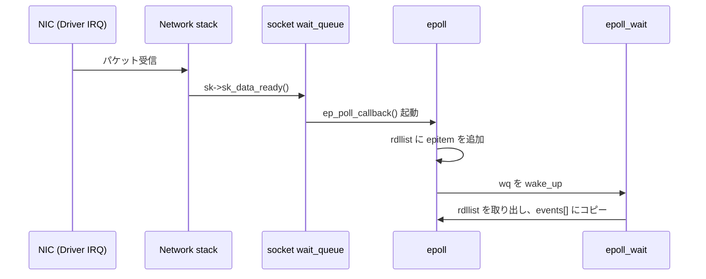
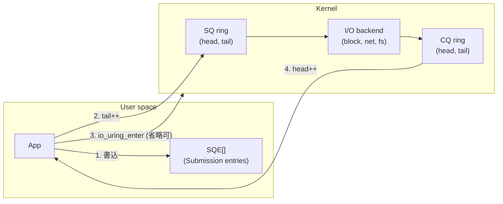
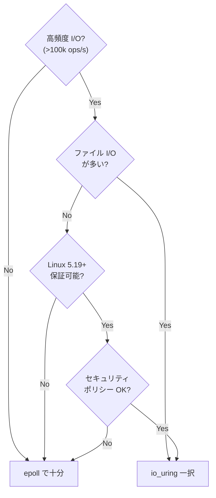

ネットワークサーバやデータベースの性能を突き詰めていくと、必ず突き当たる壁が <strong>I/O 多重化</strong> です。1 本のスレッドが 10 万本の TCP 接続を捌く、1 つの SSD の IOPS（I/O Operations Per Second、1 秒あたりに発行できる I/O 回数）を使い切る、そういう話の深層には `epoll` や `io_uring` といった Linux カーネルのインターフェースがあります。

本記事では、非同期 I/O の歴史を `select → poll → epoll → io_uring` の順に追いながら、<strong>カーネルがどのようにイベント通知とシステムコール削減を実現しているか</strong> を、実際のカーネル構造体とソースファイルを手がかりに掘り下げていきます。Node.js・nginx・PostgreSQL・ScyllaDB・tokio がなぜこの API を必要としたのか、その背景も含めて整理します。

> <strong>お店の対応で考える</strong>
>
> コールセンターのオペレーターを想像してください。電話がにわかに 10 万本鳴りそうです。
>
> - <strong>select / poll</strong> は 「10 万本の電話を一本ずつ見て『これ鳴ってる? これ鳴ってる?』と全部確認する」方式。鳴っていない電話を見る時間が無駄。
> - <strong>epoll</strong> は 「鳴った電話がランプで自動点灯する掲示板」。オペレーターは点灯したものだけ見ればいい。さらに「どの電話を監視するか」のリストはカーネル (電話局) に台帳として一度預けるだけで、毎回持ち歩かなくていい。
> - <strong>io_uring</strong> は 「もう電話を取らず、依頼票と完了票をカウンター越しに双方向でやりとりする」方式。通常モードでは 「票がたまったらベルを一度だけ鳴らす (`io_uring_enter` を 1 回呼ぶ)」、<strong>SQPOLL モード</strong>では 「カウンターの前に専任の担当者が常駐していて、票を置くそばから取りに行ってくれる」 — 後者では依頼側からの問い合わせ (syscall) すら不要、という極致です。
>
> この記事の結論を一言で言うなら「カーネルとユーザの間の『叫びかけ』をどこまで減らせるか」という戦いの歴史です。

## 1. なぜ非同期 I/O が必要なのか

### 1.1 同期 I/O のコスト構造

素朴なブロッキング I/O では、`read(fd, buf, n)` がデータ到着まで呼び出しスレッドを眠らせます。ここで `fd` は <strong>ファイルディスクリプタ</strong> — カーネルが開いたソケット・ファイル・パイプといったリソースを指す整数ハンドルで、「何番の窓口に話しかけるか」を表す背番号のようなものです。1 接続 = 1 スレッドのモデルでは以下のコストが累積します。

- <strong>スレッドスタック</strong>: Linux では既定 8MB (ユーザ空間 `ulimit -s`)。10k 接続で 80GB の仮想空間。
- <strong>コンテキストスイッチ</strong>: スイッチ 1 回は典型 1-3µs。参考までにメモリアクセスが数十 ns、syscall がサブµs オーダーなので、スイッチはスレッド操作の中でもとりわけ重い部類に入る。数十万スイッチ/秒で CPU が溶ける。
- <strong>カーネルスレッド構造体</strong>: `task_struct` が 1 つあたり数 KB 常駐。

これを超えるには <strong>1 スレッドで複数 I/O を多重化</strong> するしかありません。方法は 3 つ:

1. <strong>準備済み通知 (readiness)</strong> — カーネルに「どの fd が読める/書ける?」と問い合わせる。`select/poll/epoll`。
2. <strong>完了通知 (completion)</strong> — カーネルに「この I/O やっておいて、終わったら教えて」と依頼する。`aio`、`io_uring`。
3. <strong>ユーザ空間ポーリング</strong> — DPDK や SPDK のようにカーネルを迂回する。

長らく Linux は (1) に最適化されてきましたが、2019 年の `io_uring` の登場で (2) が第一級市民になりました。

### 1.2 readiness モデル vs completion モデル

| モデル | 代表 API | 思想 | 副作用 |
| --- | --- | --- | --- |
| Readiness | `select`, `poll`, `epoll`, `kqueue` (BSD) | カーネルが「準備できた」と通知、ユーザが実際の I/O を呼ぶ | I/O 1 回につき syscall 2 回（通知 + read/write） |
| Completion | Windows IOCP, POSIX `aio`, `io_uring` | カーネルに依頼し、完了だけ受け取る | I/O 1 回で syscall 0-1 回 |

ここで言う <strong>syscall (システムコール)</strong> は、ユーザ空間のプログラムがカーネル機能を呼び出すための特権モード切替のこと。トランポリン命令と CPU モード遷移を伴うため、単純な関数呼び出しとは桁違いに重く、現代 CPU でも 1 回 200–500 ns 程度 — 普通の関数呼び出し (< 10 ns) の 20〜50 倍です。後述の KPTI でさらに重くなります。

用語をもうひとつ。<strong>reactor</strong> は「ready になった fd を受け取って I/O を実行するループ」(epoll 型)、<strong>proactor</strong> は「I/O を依頼して完了通知を受け取るループ」(IOCP / io_uring 型) を指します。以下で epoll と io_uring の対比を見るとき、この 2 つの言葉が頭にあると見通しが良くなります。

Linux のファイル I/O では、ファイルは常に「読み込み可能」とみなされるため readiness モデルが機能せず（`epoll` は正規ファイル非対応）、<strong>完了モデルの I/O が本当に必要</strong> でした。これが `io_uring` 誕生の強い動機です。

## 2. 歴史: select → poll → epoll の系譜

> <strong>一言でいうと</strong>: select / poll は「監視したい fd 全部を毎回カーネルに渡し、カーネルが全部舐める」方式で $O(N)$。epoll はそれを「監視対象リストはカーネルに一度だけ預け、鳴った fd だけ返してもらう」構造に組み替えた、というだけの話です。

### 2.1 `select(2)` — 1983 年、BSD 4.2

最初期の I/O 多重化 API。

```c
int select(int nfds, fd_set *readfds, fd_set *writefds,
           fd_set *exceptfds, struct timeval *timeout);
```

`fd_set` は <strong>ビットマップ</strong>。POSIX で `FD_SETSIZE = 1024`（glibc 既定）という制約があり、大きな fd は表現できません。毎回の呼び出しで：

1. ユーザ空間で fd_set を組み立てる — $O(N)$
2. カーネルに全ビットマップをコピー — $O(N)$
3. カーネルが全 fd を舐めて状態を確認 — $O(N)$
4. 結果ビットマップをユーザ空間へコピー — $O(N)$

<strong>1 接続あたり毎回 $O(N)$ の全走査</strong>。接続数 1 万では耐えられません。

### 2.2 `poll(2)` — System V 由来（Linux は 2.1.23, 1997）

```c
int poll(struct pollfd *fds, nfds_t nfds, int timeout);

struct pollfd {
    int   fd;
    short events;   // 監視するイベント
    short revents;  // 返ってきたイベント
};
```

`fd_set` の 1024 制限は消えましたが、本質的に <strong>毎回配列コピー + 全走査</strong> という計算量問題は残っています。

### 2.3 C10K 問題と `epoll` — 2002 年、Linux 2.5.44

Dan Kegel の「C10K problem」論考 (1999) が提起した「1 万接続を 1 プロセスで処理する」課題。Davide Libenzi が実装した `epoll` は、2 つの根本的なブレイクスルーを達成しました。

- <strong>状態をカーネル側に保持</strong> する（毎回コピーしない）。
- <strong>準備完了した fd のリストを返す</strong>（全走査しない）。

## 3. `epoll` の内部

> <strong>一言でいうと</strong>: epoll は監視対象の fd を <strong>赤黒木</strong> で管理し、イベントが起きた fd だけを <strong>連結リスト (ready list)</strong> に移します。`epoll_wait` はそのリストから取り出して返すだけ — 全 fd を走査しない。これが $O(1)$ per 通知の正体です。

### 3.1 インターフェース

```c
int epoll_create1(int flags);
int epoll_ctl(int epfd, int op, int fd, struct epoll_event *event);
int epoll_wait(int epfd, struct epoll_event *events, int maxevents, int timeout);

struct epoll_event {
    uint32_t     events;
    epoll_data_t data;
};
```

- `epoll_create1()` — epoll インスタンスを作成し、fd を返す。
- `epoll_ctl()` — `EPOLL_CTL_ADD / MOD / DEL` で監視対象を変更。
- `epoll_wait()` — 準備完了した fd の配列を返す。ブロッキング/ノンブロッキング/タイムアウト。

### 3.2 カーネル内データ構造

Linux カーネルの `fs/eventpoll.c` を読むと、epoll のコアは 3 つの構造体です（主要フィールドのみ抜粋、以降の `struct` も同様）。

```c
// eventpoll.c
struct eventpoll {
    struct mutex       mtx;
    wait_queue_head_t  wq;          /* epoll_wait している task の待機列 */
    wait_queue_head_t  poll_wait;
    struct list_head   rdllist;     /* ready 状態のアイテム */
    struct rb_root_cached rbr;      /* 全監視アイテムの赤黒木 */
    struct epitem      *ovflist;    /* 通知中のオーバーフロー */
    /* ... */
};

struct epitem {
    struct rb_node       rbn;       /* eventpoll->rbr 内のノード */
    struct list_head     rdllink;   /* rdllist 内のリンク */
    struct epoll_filefd  ffd;       /* 監視対象の fd */
    struct eventpoll     *ep;
    struct list_head     pwqlist;   /* コールバック登録用 */
    struct epoll_event   event;
    /* ... */
};

struct eppoll_entry {
    struct list_head    llink;      /* epitem->pwqlist 内 */
    struct epitem       *base;
    wait_queue_entry_t  wait;       /* 監視対象ファイルの待機列に登録 */
    wait_queue_head_t   *whead;
};
```

要点：

- <strong>赤黒木 (red-black tree) `rbr`</strong>: 監視中の全 fd を保持する平衡二分探索木。追加・削除・検索が $O(\log N)$。
- <strong>ready list `rdllist`</strong>: イベント発生した `epitem`（監視項目 1 つ分の構造体）だけが連結される片方向リスト。`epoll_wait` はここから取り出すだけ → $O(1)$ per ready fd。
- <strong>`eppoll_entry`</strong>: 各監視対象ファイルの <strong>待機キュー (wait queue)</strong> に登録されるコールバック。
  - 補足: `wait_queue_head_t` は Linux カーネルの「眠らせて起こす」プリミティブ。条件変数に近く、ソケット・パイプ・その他ブロックしうるカーネルオブジェクトはそれぞれ自分の待機キューを持つ。

<strong>要するに</strong>: 3 つの構造体の役割は「`eventpoll` = 1 個の epoll インスタンス全体、`epitem` = 監視している fd 1 個の情報、`eppoll_entry` = その fd の待機キューに差し込むフック」。フックが発火したら `epitem` を `rdllist` に繋ぎ直す、それだけ。

### 3.3 イベントが `rdllist` に載る経路

たとえば TCP ソケットに新しいパケットが届く流れは:



- `sock_def_readable` → `wake_up_interruptible_sync_poll` → `ep_poll_callback` のパスで <strong>コールバックが呼ばれる</strong> (`fs/eventpoll.c:ep_poll_callback`)。
- コールバックは `rdllist` にアイテムを追加するだけで、割込コンテキストでも安全（`spin_lock` で保護。割込ハンドラはスケジューラを呼べないため、スリープするミューテックスは使えず、CPU を手放さずに回るスピンロックが必須となる）。
- 次に `epoll_wait` した task の待機キューを起こす。

### 3.4 Level Trigger (LT) と Edge Trigger (ET)

> <strong>一言でいうと</strong>: <strong>LT (レベルトリガ)</strong> = 読める/書ける状態が続く限り毎回通知する (安全寄り)、<strong>ET (エッジトリガ)</strong> = 状態が変化した瞬間だけ 1 回通知する (速いが読み切り責任あり)。

epoll 固有のトリガモード。ここを誤解すると深刻なバグが出ます。

| モード | 意味 | `read/write` の挙動 |
| --- | --- | --- |
| <strong>LT</strong> (既定) | 「まだ読める/書ける」間、通知し続ける | 1 回だけ読んで戻ってもよい。次も通知される。 |
| <strong>ET</strong> | 状態変化の瞬間だけ通知 | <strong>`EAGAIN` が返るまで全部読み切る必要</strong>。読み漏らすと二度と起きない。 |

ET の実装上のポイントは、`epoll_wait` がアイテムを `rdllist` から取り出す際の処理にあります。

```c
/* ep_send_events_proc (簡略化) */
list_for_each_entry_safe(epi, tmp, &txlist, rdllink) {
    revents = ep_item_poll(epi, ...);
    if (revents) {
        copy_to_user(events, ...);
        if (epi->event.events & EPOLLET) {
            /* ET: ready から外す。次にコールバックが来るまで出てこない */
        } else if (!(epi->event.events & EPOLLONESHOT)) {
            /* LT: ready に戻す */
            list_add_tail(&epi->rdllink, &ep->rdllist);
        }
    }
}
```

ET モードのほうが高性能（スプリアス通知がない）ですが、<strong>アプリケーションが正しくノンブロッキングループを回す</strong> 責任を負います。nginx や HAProxy は ET を使いますが、各イベントで `while (n = read(fd, ...), n > 0)` と書き切るのが標準的な書き方です。（ここでいう <strong>nginx の worker</strong> とは、nginx が起動時に CPU コア数程度 fork するワーカプロセスのことで、各ワーカーが独立に自分の epoll ループを回します。）

### 3.5 Thundering Herd と `EPOLLEXCLUSIVE`

複数プロセス・スレッドが同じ listening socket を `epoll` で待つと、1 接続の到着で全員が起きて 1 つだけが `accept()` 成功、残りは `EAGAIN` で戻る、という無駄が生じます。これが <strong>thundering herd (雷鳴の群れ)</strong> — 直訳通り「一抬に騒いで飛び出したが成果は 1 件だけ」という手配りだけが無駄になる状況です。

対策:

- <strong>`SO_REUSEPORT`</strong> (Linux 3.9+) — カーネルが fd レベルで受信を分散。nginx でよく使われる。
- <strong>`EPOLLEXCLUSIVE`</strong> (Linux 4.5+) — 1 イベントにつき 1 waiter だけ起こす。epoll の内部 wait_queue エントリに `WQ_FLAG_EXCLUSIVE` を立てる。

### 3.6 epoll の限界

それでも残る問題:

1. <strong>ファイル I/O に使えない</strong> — 通常ファイルはいつも「読める」。ディスクIOは必ずブロックする。
2. <strong>I/O 1 回につき syscall 2 回</strong> — `epoll_wait` と `read/write`。VDSO 化できない。
3. <strong>Spectre/Meltdown 後の syscall コスト増</strong> — KPTI (Kernel Page-Table Isolation、ユーザ空間とカーネル空間でページテーブルを分離する Meltdown 緩和策) による TLB フラッシュで syscall 1 回あたり 0.1-1µs。100 万 IOPS を狙うと syscall だけで CPU を 10–100% 食う計算になり、ここが頭打ちの原因になります。
4. <strong>複雑な I/O チェイン</strong> — `accept → read → parse → write` を 1 つのアトミック操作にできない。

これらが `io_uring` を必要とした根本的な動機です。

## 4. `io_uring` 前史: `aio(7)`, `epoll_ctl` 以外の試み

### 4.1 POSIX AIO と `libaio`

Linux には <strong>POSIX AIO (`aio_read`, `aio_write`)</strong>（glibc がユーザ空間スレッドでエミュレート）と、別物の <strong>Kernel AIO (`io_setup`, `io_submit`, `io_getevents`)</strong> がありました。

Kernel AIO (通称 `libaio`) は：

- <strong>Direct I/O (`O_DIRECT`) + ブロックデバイス限定</strong>。`O_DIRECT` はページキャッシュを迂回してアプリケーションのバッファとデバイスの間で直接 DMA させるフラグで、自前でキャッシュと I/O スケジューリングを行う DB 向け。バッファ付き I/O や通常ファイルでは実質的に同期動作。
- <strong>インターフェースが扱いにくい</strong>（`struct iocb` の配列、完了は `io_getevents` で回収）。
- メタデータ更新を伴う操作（`open`, `stat`, `close`）は対象外。

PostgreSQL や MySQL などは `libaio` を使っていましたが、汎用 API として普及しませんでした。汎用 AIO の欠如に長らく悩まされた PostgreSQL は、結局 v18 (2025) で <strong>独自の非同期 I/O 抽象層</strong>（`io_method` を `worker` / `io_uring` / `sync` から選べる構造）を自前で用意することになります。

### 4.2 `epoll_pwait2` と `signalfd/timerfd/eventfd`

`eventfd` は単一のカウンタを持つ fd で、他のサブシステムを `epoll` に統合するのに使われてきました（`libaio` の完了通知、`timerfd` の時刻通知、ユーザ空間からのプロセス間通知）。この「全部 fd にして epoll に流す」という文化が、Linux のイベントループ周りの設計を規定しています。

## 5. `io_uring` — 2019 年、Linux 5.1 から

> <strong>一言でいうと</strong>: 依頼票 (SQE) と完了票 (CQE) を書き込む 2 本の <strong>リングバッファ</strong> をカーネルと共有し、ポインタ (head/tail) の足し引きだけで I/O をやり取りする仕組み。syscall は「たまった依頼をまとめて通知」するときだけ、さらに SQPOLL モードではそれすら不要。

### 5.1 設計目標

Jens Axboe が LWN 記事<sup>[1]</sup> で掲げたゴール：

1. <strong>Truly asynchronous</strong> — あらゆる I/O 操作をブロックなしで依頼できる。
2. <strong>No copy, no allocation</strong> — ホットパスで syscall も malloc もしない。
3. <strong>Unified</strong> — ネット・ファイル・ブロック全部同じ API。
4. <strong>Extensible</strong> — 新しい操作 (opcode) を追加しやすい。

これを実現したのが <strong>共有リングバッファ</strong> という構造です。

### 5.2 アーキテクチャ: SQ と CQ

`io_uring` はカーネルとユーザ空間で 2 本のリングバッファを共有します。



- <strong>SQ (Submission Queue)</strong> — ユーザがエントリ (SQE、Submission Queue Entry の略) を書き込む方向。
- <strong>CQ (Completion Queue)</strong> — カーネルが完了エントリ (CQE、Completion Queue Entry) を書き込む方向。
- 両リングとも <strong>ユーザ・カーネル共有の mmap 領域</strong>。`mmap` はファイルやデバイスメモリ・匯名メモリをプロセスの仮想アドレス空間に「貼り付ける」 syscall で、ここではカーネル側とユーザ側の両方から触れる共有メモリとして使われます。

これが `io_uring` の核心です。<strong>エントリの書き込み・読み出しで syscall が発生しない</strong>。syscall は `io_uring_enter()` を呼ぶときだけ、しかもバッチで。

<strong>要するに</strong>: 従来の epoll が「毎回電話口まで行って用件を伝える」のに対し、io_uring は「カウンターに用件を書いた依頼票を置く→完了票を拾う」スタイル。票のやりとり自体は共有メモリ上のリングなので、カウンタに手を伸ばす (=syscall する) のは「まとめて渡す/受け取る」タイミングだけでよくなります。

<IoUringRingVisualizer />


### 5.3 SQE と CQE の構造

```c
/* <linux/io_uring.h> */
struct io_uring_sqe {
    __u8    opcode;     /* IORING_OP_READ, WRITE, ACCEPT, ... */
    __u8    flags;
    __u16   ioprio;
    __s32   fd;
    union {
        __u64 off;      /* オフセット */
        __u64 addr2;
    };
    union {
        __u64 addr;     /* バッファ */
    };
    __u32   len;
    union {
        __kernel_rwf_t rw_flags;
        __u32 fsync_flags;
        __u16 poll_events;
        /* ... */
    };
    __u64   user_data;  /* CQE でそのまま返ってくる任意値 */
    /* ... */
};

struct io_uring_cqe {
    __u64 user_data;    /* SQE で指定した値 */
    __s32 res;          /* syscall と同じ戻り値 (>= 0 or -errno) */
    __u32 flags;
};
```

`user_data` は、アプリケーションが「どの操作の完了か」を識別するための <strong>任意の 64 ビット値</strong>。ポインタや ID を詰めて使います。

<strong>要するに</strong>: SQE が「依頼票」、CQE が「その控えエリ」で、`user_data` は両者を紐づける背番号。アプリ側は「いくつ依頼が出ていて」「それぞれが何、を `user_data` で記憶しておき、戻ってきた CQE の `user_data` で元のコンテキストを引く。

### 5.4 リングバッファのセットアップ

ユーザ空間で必要な手順（`liburing` が隠蔽）:

1. `io_uring_setup(entries, params)` — カーネルに SQ/CQ を作らせ、各 ring の mmap オフセットを受け取る。
2. `mmap` で SQ ring、CQ ring、SQE 配列を共有する。カーネル 5.4 以降は `IORING_FEAT_SINGLE_MMAP` により SQ と CQ を 1 回の `mmap` でまとめて貼り付けられるので、合計 <strong>2 回の mmap</strong>（古いカーネルでは 3 回）で済む。
3. ユーザ側の `sq_head`/`sq_tail`/`cq_head`/`cq_tail` ポインタをリングヘッダから取得。

典型的なサイズは SQ = 128-4096、CQ = SQ × 2。カーネルは `get_user_pages`（ユーザ空間の仮想アドレスに対応する物理ページをピン留めし、カーネル／デバイスが安全に DMA できる状態にするヘルパ）で固定ページ化してマップします。

### 5.5 送信と完了のフロー

```c
/* シンプルな非 SQPOLL 例（liburing 使用） */
struct io_uring ring;
io_uring_queue_init(32, &ring, 0);

struct io_uring_sqe *sqe = io_uring_get_sqe(&ring);
io_uring_prep_read(sqe, fd, buf, len, offset);
io_uring_sqe_set_data(sqe, user_ptr);

io_uring_submit(&ring);     /* これが io_uring_enter(SUBMIT) を発行 */

struct io_uring_cqe *cqe;
io_uring_wait_cqe(&ring, &cqe);   /* 完了を待つ */
process_completion(cqe);
io_uring_cqe_seen(&ring, cqe);    /* head++ */
```

ここで重要なのは、複数 SQE を <strong>1 回の `io_uring_enter` でまとめて送れる</strong> こと。1 syscall で 1000 個の read を投げられるので、syscall コストが償却されます。具体的には、epoll だと 1 回の I/O に syscall 2 回 → 500 ns × 2 = 1μs かかるところが、io_uring で 1000 依頼をバッチすれば syscall 1 回を 1000 で割って一件あたり 0.5 ns 、というオーダーの圧縮がかかります。

### 5.6 メモリ順序とリング操作

共有メモリで `head`/`tail` を管理しているため、<strong>適切なメモリバリア</strong> が必要です。カーネルドキュメント (`io_uring.txt`) とヘッダ (`<linux/io_uring.h>`) は以下を要求します：

- SQE を書いてから `sq->tail` を更新する前に `smp_wmb` (= `io_uring_smp_wmb`, x86 では NOP、ARM では `dmb ish`)。
- `cq->tail` を読んでから CQE 本体を読む前に `smp_rmb`。

`smp_wmb` は「それ以前の書き込みが以後の書き込みより先に他コアから観測される」ことを保証するストア・ストアバリア、`smp_rmb` はロード・ロードの対応物です。

`liburing` の `io_uring_submit` / `io_uring_peek_cqe` がこれを正しく実装しているので、通常は直接触る必要はありません。

## 6. 高度なモード

> <strong>一言でいうと</strong>: SQPOLL・IOPOLL・Linked SQE・registered files/buffers・multishot は「syscall と準備コストをさらに削るためのオプション群」で、全部使う必要はない。

### 6.1 `IORING_SETUP_SQPOLL` — カーネルスレッドでポーリング

`io_uring_setup` に `IORING_SETUP_SQPOLL` を立てると、カーネルが <strong>専用スレッド</strong> を作って SQ を監視し続けます。ユーザ空間は SQE を置くだけ、`io_uring_enter` も不要。<strong>完全な syscall 0</strong> で I/O が出せます。つまり「カウンターに専任の担当者を常駐させて、依頼票を置いたそばから取りに行かせる」究極モードです。

```c
struct io_uring_params params = {
    .flags = IORING_SETUP_SQPOLL,
    .sq_thread_idle = 2000,  /* 2 秒アイドルで眠る */
};
io_uring_queue_init_params(entries, &ring, &params);
```

代償：

- カーネルスレッドが CPU を 1 コア使う（`sq_thread_idle` ミリ秒アイドルで眠る）。
- Linux 5.11 で root (`CAP_SYS_ADMIN`) 要件が撤廃され、SQPOLL 自体は非特権ユーザでも利用可能になりました。ただし `IORING_SETUP_SQ_AFF` で SQ スレッドを特定 CPU にピン留めする場合だけは今も `CAP_SYS_NICE` が必要です。

これは <strong>1 プロセスで NVMe を使い切る</strong> 用途（DB、高頻度取引、ScyllaDB のシャード・パー・コア）で真価を発揮します。

### 6.2 `IORING_SETUP_IOPOLL` — ブロックデバイスのビジーポーリング

`O_DIRECT` のブロック I/O は、カーネル内でブロックレイヤの完了を割込みでなく <strong>ビジーポーリング</strong> で取りに行けます。NVMe の μs オーダーのレイテンシではこれが優位です。

### 6.3 Linked SQEs (`IOSQE_IO_LINK`)

複数の操作を <strong>依存チェーン</strong> で投げられます。

```c
/* 例: 既知の fd に対して read → write を 1 回の enter で */
sqe1 = io_uring_get_sqe(); io_uring_prep_read(sqe1, fd, buf, len, 0);
sqe1->flags |= IOSQE_IO_LINK;

sqe2 = io_uring_get_sqe(); io_uring_prep_write(sqe2, fd, buf, len, 0);
io_uring_submit(&ring);
```

先行操作が失敗 (`res < 0`) すると後続は自動キャンセル。`IOSQE_IO_LINK` は <strong>実行順序を保証するだけ</strong> で、前の SQE の結果 fd を次の SQE に自動で渡す仕組みはない。`accept → read` のように「accept 結果の fd をそのまま使う」パターンを 1 回の submit でやりたい場合は、<strong>direct descriptor</strong>（`IORING_FILE_INDEX_ALLOC` と `IOSQE_FIXED_FILE`、カーネル 5.17+ の `IORING_FEAT_LINKED_FILE` による遅延 fd 解決）を使う。

### 6.4 Registered files / buffers

- <strong>`io_uring_register_files()`</strong> — fd 配列をカーネルに事前登録。SQE で fd の代わりに <strong>インデックス</strong> を使うと、`fget()/fput()` の参照カウントが省略される。
- <strong>`io_uring_register_buffers()`</strong> — ユーザバッファをピン留め登録し、I/O ごとの `get_user_pages` を省略。DMA-direct パスが有効に。

高 IOPS が必要な場合の鉄板最適化。ScyllaDB のベンチマークでは 20-40% の性能向上が報告されています。

### 6.5 Multishot (`IORING_OP_ACCEPT_MULTI`, Linux 5.19+)

1 つの SQE で <strong>複数回の完了</strong> を受け取れます。`accept` や `recv` で「キャンセルされるまでずっと完了を生成」させる仕組み。SQE 枯渇を防ぎ、従来必要だった「accept → SQE 再投入」のループが消えます。

### 6.6 Provided buffers (`IORING_OP_PROVIDE_BUFFERS`)

「受信バッファの割り当てをカーネルに任せる」機能。<strong>到着時に使えるバッファを選ぶ</strong> ことで、何千接続分のバッファを事前に確保する無駄を省きます。HTTP サーバで有効。

### 6.7 Operation opcodes (抜粋)

主要な opcode を挙げると：

| 分類 | 主な opcode |
| --- | --- |
| ネット | `ACCEPT`, `CONNECT`, `SEND`, `RECV`, `SENDMSG`, `RECVMSG`, `SHUTDOWN`, `CLOSE` |
| ファイル | `READ`, `WRITE`, `READV`, `WRITEV`, `FSYNC`, `FALLOCATE`, `OPENAT`, `STATX`, `RENAMEAT` |
| poll 系 | `POLL_ADD`, `POLL_REMOVE`, `POLL_MULTISHOT` |
| 同期 | `LINK_TIMEOUT`, `TIMEOUT`, `NOP`, `ASYNC_CANCEL` |
| メモリ | `MADVISE`, `FADVISE`, `SPLICE`, `TEE` |
| プロセス | `WAITID` (5.19+) |

<strong>カーネル側は各 opcode ごとに実装ファイル</strong>（`io_uring/net.c`, `io_uring/rw.c`, `io_uring/fs.c` など）を持ち、既存の VFS（Virtual File System、Linux がファイルシステム種別の差を吸収して提供する抽象層）／ソケット内部関数を呼び出します。

## 7. カーネル内部: `io_uring/` の中身

> <strong>一言でいうと</strong>: 1 つの SQE はカーネル内で `io_kiocb` というリクエスト構造体に化け、可能なら即時実行・ブロックしそうなら専用スレッドプール `io-wq` に委譲されます。完了したら mmap 共有の CQ リングに直接書き込んで呼び出し元を起こす、という流れ。

Linux 5.19 で `fs/io_uring.c` 一枚岩の実装がトップレベルの `io_uring/` ディレクトリに分割され、以降はサブシステムとして独立しました。主要ファイル：

```text
io_uring/
├── io_uring.c      # リング管理、enter syscall
├── sqpoll.c        # SQPOLL カーネルスレッド
├── rw.c            # read/write 系 opcode
├── net.c           # ネット系 opcode
├── fs.c            # openat/statx 系
├── poll.c          # IORING_OP_POLL_ADD
├── timeout.c       # TIMEOUT, LINK_TIMEOUT
├── cancel.c        # ASYNC_CANCEL
└── ... 30+ files
```

### 7.1 リクエスト構造体 `io_kiocb`

1 つの SQE ごとにカーネル内で割り当てられる構造体。

```c
struct io_kiocb {
    union {
        struct file     *file;
        struct io_cmd_data cmd;
    };
    u8                      opcode;
    io_req_flags_t          flags;
    struct io_cqe           cqe;           /* user_data, res, cflags */
    struct io_ring_ctx      *ctx;
    struct io_uring_task    *tctx;
    /* opcode-specific data, task work node, etc. */
    /* ... */
};
```

slab cache (`req_cachep`) からアロケートされ、完了後はリサイクルされます。ホットパスのメモリ確保を避けるため、`io_ring_ctx` ごとに <strong>小さなバッチのプリアロックキャッシュ</strong>（バージョンにより 128 前後）を保持しています。

### 7.2 非同期実行: `io-wq` プール

<strong>本当にブロックしうる操作</strong>（ディスク `read` がページキャッシュミスしたとき等）は、`io_uring` がカーネルスレッドプール `io-wq` に委譲します。つまり `io-wq` は「本当にブロックするものを隠しておくための裏方スレッドプール」です。各 `io_ring_ctx` ごとに `bounded`（ディスク用）と `unbounded`（ネット用）の 2 プール。アイドル時にはスレッドが解放されるので、`ps` で大量のカーネルスレッドが見えても心配ない設計になっています。

汎用の `workqueue` を使わず専用プールを持つのは、`io-wq` ワーカが <strong>submitter タスクのクレデンシャル（uid/gid, cgroup, nsproxy など）を引き継ぐ</strong> 必要があり、かつリング単位で NUMA ローカリティと優先度を制御したいため。汎用 workqueue はこれらの要件に合いません。

これはユーザから透過的で、<strong>「非同期で完了させられなければスレッドで待つ」</strong> というフォールバックが一貫性を担保します。epoll の「絶対ブロックしない」保証と質的に違うポイントです。

### 7.3 完了パス

```c
/* io_uring.c (概念コード) */
void io_req_task_complete(struct io_kiocb *req, io_tw_token_t tw)
{
    struct io_ring_ctx *ctx = req->ctx;
    io_cq_lock(ctx);
    io_fill_cqe_req(ctx, req);   /* CQE を ring に書く */
    io_cq_unlock_post(ctx);      /* タスクを起こす */
}
```

CQ ring への書き込みは `spin_lock` で保護された上で、<strong>コピーレス</strong>で行われます（ユーザ空間 mmap への直接書き込み）。

## 8. `io_uring` の落とし穴と運用

> <strong>一言でいうと</strong>: 強力だが脆弱性報告も多く、seccomp でも細かく制御できない。本番で使うなら最新 LTS カーネル + 観測ツール + ディストリビューションのポリシー確認が必須。

### 8.1 CVE とセキュリティ

非常に複雑で特権的な API なので、過去に多数の LPE (Local Privilege Escalation) 脆弱性が報告されました。

- <strong>CVE-2022-29582</strong>, <strong>CVE-2023-2598</strong>, <strong>CVE-2023-21400</strong>, <strong>CVE-2024-0582</strong> など。
- その結果、<strong>Google (Android/CrOS) や多くの LTS カーネルパッケージは `io_uring` を既定で無効化</strong>。
- RHEL 9.5 以降、`sysctl kernel.io_uring_disabled=1/2` で全面禁止 / root のみ許可が選べるようになった。

プロダクションで `io_uring` を使う場合、<strong>カーネルを常に最新 LTS にする</strong> ことと、seccomp で opcode を絞る運用が推奨されます。

### 8.2 観測性

- `strace` では `io_uring_enter` しか見えない。SQE の中身は見えません。
- 代替: `bpftrace`/`perf trace` で tracepoint (`io_uring:io_uring_submit_req` 等) を取る、`iouring-tools` のダンプを使う。
- カーネル側のカウンタ: `/proc/<pid>/io_uring` にリング統計が出る。

### 8.3 バッファ所有権

ユーザが submit したバッファは <strong>完了するまでカーネルが保持</strong> します。Rust で安全にラップするのが特に難しく、`tokio-uring` が独自のバッファトレイト (`IoBuf`) を導入した理由もここにあります (Rust の借用モデルと非互換)。

### 8.4 互換性の現実

2026 年時点の実装状況：

- <strong>カーネル</strong>: 5.1 (2019) 導入、5.19 (2022) で一通り成熟、6.x で継続改善。
- <strong>glibc</strong>: `io_uring` 本体を直接は提供せず、`liburing` が標準。
- <strong>Node.js</strong>: libuv v1.45 (2023) で非同期ファイル I/O 向けに io_uring が導入されたが、v1.49 (2024 年 9 月) では一部カーネルでの不具合を受けて <strong>SQPOLL モードが既定で無効化</strong> された（通常の io_uring パスは維持）。以降、環境によって挙動が分かれるため、実際のバージョンでの確認が必須。
- <strong>PostgreSQL</strong>: 18 (2025) で新設された AIO サブシステムにおいて `io_method=io_uring` が選択可能に（`--with-liburing` 付きビルドが必要）。既定値は `worker`。
- <strong>Rust</strong>: `tokio-uring` は別クレート。代表的な非同期ランタイム `tokio` 本体は互換性のため epoll ベースのまま。
- <strong>nginx</strong>: 実験的モジュールあり、公式採用はまだ。
- <strong>ScyllaDB</strong>: もともと Seastar フレームワークで非同期 I/O を前提に設計されており（初期は Linux AIO ベース）、io_uring が成熟してからは最も早期に移行した採用例。SPDK も NVMe 直接操作の経路で利用。
- <strong>Netty / JVM</strong>: Netty 4.2 で `IOUring` transport 提供。

### 8.5 運用上の地雷

- <strong>cgroup v1 と SQPOLL の CPU 計上</strong>: SQPOLL 用カーネルスレッドは submitter と独立したタスクとして走る。つまり cgroup v1 環境では、submitter 側の cgroup に CPU 使用が正しく課金されないケースがある。cgroup v2 では改善されているが、古いホストでは SQPOLL を使うワークロードが「身元不明のカーネル CPU」として見える点に注意。
- <strong>seccomp では opcode を絞れない</strong>: seccomp-bpf は syscall 単位でしか判断しないため、`io_uring_enter` が運んでくる opcode ごとにフィルタすることはできない。細かく opcode を制限したい場合は BPF-LSM、新しめの seccomp notify フック、あるいは io_uring 自身の <strong>リング単位の許可リスト機構</strong>（`IORING_REGISTER_RESTRICTIONS`）を併用する必要がある。

## 9. 性能比較: 何がどれだけ速いのか

> <strong>一言でいうと</strong>: 低負荷なら epoll と大差なし。NVMe を飽和させる・1M IOPS を狙う・ファイル fsync を絡める、となって初めて io_uring の投資が報われる。

<SyscallCostVisualizer />

### 9.1 ベンチマーク例 (概観)

いくつか代表的な報告を要約します（詳細な条件はそれぞれの一次資料参照）：

| ワークロード | epoll | io_uring (ポーリングなし) | io_uring (SQPOLL + registered) |
| --- | --- | --- | --- |
| ネットワーク echo 1M conn | 基準 | ~1.2x | ~2-3x |
| NVMe random read 4KB | ~800k IOPS | ~1.5-2M IOPS | ~3-5M IOPS |
| DB commit (fsync-heavy) | 基準 | ~1.1x | ~1.3-1.5x |

`io_uring` の本領は <strong>高 IOPS・低レイテンシ領域</strong> で発揮されます。ただし低負荷時は epoll との差はごく小さく、実装コストに見合わないことも多い。

### 9.2 いつ `io_uring` を選ぶべきか



## 10. まとめ

> <strong>一言でいうと</strong>: 40 年の歴史を貫く原則は「カーネルとユーザ空間の呼び合いをどこまで減らせるか」。select → epoll → io_uring はその答えを少しずつ更新してきた系譜。

非同期 I/O は 40 年かけて、以下のように進化してきました。

1. <strong>select</strong> (1983) — 固定サイズ fd_set、毎回 $O(N)$。
2. <strong>poll</strong> (1997) — fd_set 制限は解消、計算量は据え置き。
3. <strong>epoll</strong> (2002) — カーネル側状態保持 + ready list で $O(1)$。C10K 問題を実用レベルで解決。
4. <strong>io_uring</strong> (2019) — 共有リングで syscall 削減 + 真の非同期。C10M / 単機 NVMe 飽和の時代に対応。

流れには一貫した設計圧力があります。<strong>(a) カーネルに状態を置いて繰り返しコピーを避ける、(b) 1 回の syscall でできる仕事を増やす、(c) ブロックしうる操作を非同期に下駄を履かせる</strong>。

epoll はこれからも最も安定した選択肢であり続けるでしょう。ただし、<strong>1 ノードで NVMe を使い切る・10M 接続を捌く・ファイルと fsync を含む非同期パイプラインを組む</strong>、そういう要件がある場合は `io_uring` への投資が正当化されます。

選択肢はもう 1 つだけではありません。<strong>カーネルインターフェースの設計思想を理解しておくこと</strong> が、その判断を正しくするための一番の近道です。

## 参考文献

1. J. Axboe, "Efficient IO with io_uring", [liburing.pdf](https://kernel.dk/io_uring.pdf), 2019.
2. D. Libenzi, "Improving (network) I/O performance" (epoll), 2002.
3. D. Kegel, "The C10K problem", 1999.
4. [Linux kernel source: `fs/eventpoll.c`](https://git.kernel.org/pub/scm/linux/kernel/git/torvalds/linux.git/tree/fs/eventpoll.c)
5. [Linux kernel source: `io_uring/`](https://git.kernel.org/pub/scm/linux/kernel/git/torvalds/linux.git/tree/io_uring)
6. [`liburing`](https://github.com/axboe/liburing) — ユーザ空間ヘルパと公式ドキュメント。
7. LWN: "The rapid growth of io_uring", 2020 / "Security considerations for io_uring", 2023.
