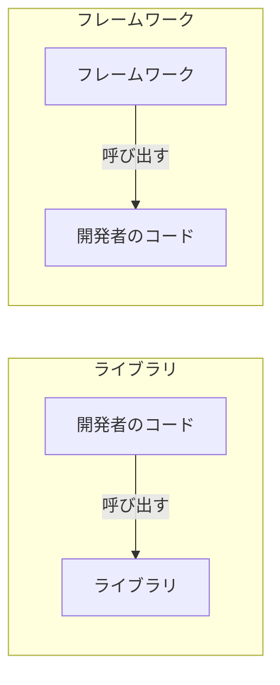

「ライブラリ」と「フレームワーク」はどちらもソフトウェア開発で頻繁に使われる用語ですが、その違いを正確に説明できる人は意外と少ないかもしれません。この記事では、両者の本質的な違いを **制御の反転（Inversion of Control, IoC）** という概念から解説します。

## ライブラリとは

ライブラリは、**特定の機能を提供するコードの集合体** です。開発者が自分のコードからライブラリの関数やクラスを呼び出して使います。

重要なのは、**制御の主導権は開発者のコードにある** という点です。いつ・どのように・どの順番でライブラリの機能を使うかは、すべて開発者が決めます。

```python
# ライブラリの例: requests
import requests

# 開発者が制御の主導権を握っている
response = requests.get("https://api.example.com/users")
data = response.json()

for user in data:
    print(user["name"])
```

この例では、`requests` ライブラリを**いつ呼び出すか**、**結果をどう処理するか** はすべて開発者が決定しています。

**代表的なライブラリ:**

| 言語 | ライブラリ | 用途 |
|---|---|---|
| Python | Requests | HTTP クライアント |
| JavaScript | Lodash | ユーティリティ関数 |
| Java | Guava | コレクション・キャッシュ |
| Go | zap | 構造化ロギング |
| C | libcurl | HTTP/ネットワーク通信 |

## フレームワークとは

フレームワークは、**アプリケーション全体の骨格を提供するソフトウェア基盤** です。フレームワークがアプリケーションの構造と実行フローを決定し、開発者はフレームワークが定めた拡張ポイントに自分のコードを差し込みます。

重要なのは、**制御の主導権はフレームワーク側にある** という点です。

```python
# フレームワークの例: Flask
from flask import Flask

app = Flask(__name__)

# フレームワークが「いつ」この関数を呼ぶかを決める
@app.route("/users")
def get_users():
    return [{"name": "Alice"}, {"name": "Bob"}]

# フレームワークにアプリケーションの実行を委ねる
if __name__ == "__main__":
    app.run()
```

この例では、`get_users` 関数を**いつ呼び出すか**はフレームワーク（Flask）が決めています。HTTP リクエストが `/users` に到達したとき、Flask が適切なタイミングで開発者のコードを呼び出します。

**代表的なフレームワーク:**

| 言語 | フレームワーク | 用途 |
|---|---|---|
| Python | Django, Flask | Web アプリケーション |
| JavaScript | Next.js | フルスタック Web |
| Java | Spring | エンタープライズアプリ |
| Ruby | Ruby on Rails | Web アプリケーション |
| Go | Gin | Web API |

## 制御の反転（Inversion of Control）

ライブラリとフレームワークの本質的な違いは、**制御の反転（Inversion of Control, IoC）** として知られるソフトウェア設計の原則で説明できます。



- **ライブラリ**: 開発者のコード → ライブラリを呼ぶ（**開発者がコールする**）
- **フレームワーク**: フレームワーク → 開発者のコードを呼ぶ（**フレームワークがコールバックする**）

この関係性の逆転が「制御の反転」です。この原則は **"Hollywood Principle: Don't call us, we'll call you"**（ハリウッドの原則: 私たちに電話しないで、私たちから電話します）とも呼ばれます。Martin Fowler は自身の [IoC に関する記事](https://martinfowler.com/bliki/InversionOfControl.html) で、この原則をフレームワークとライブラリを区別する核心的な特徴として説明しています。

### コードで比較する

同じ「HTTP サーバー」を実装する場合でも、ライブラリ的アプローチとフレームワーク的アプローチでは構造が大きく異なります。

**ライブラリ的アプローチ（Go の `net/http` を直接使う場合）:**

```go
package main

import (
    "encoding/json"
    "log"
    "net/http"
)

func main() {
    // 開発者がサーバーの構築と起動を完全に制御する
    mux := http.NewServeMux()

    mux.HandleFunc("/users", func(w http.ResponseWriter, r *http.Request) {
        users := []map[string]string{
            {"name": "Alice"},
            {"name": "Bob"},
        }
        w.Header().Set("Content-Type", "application/json")
        json.NewEncoder(w).Encode(users)
    })

    log.Fatal(http.ListenAndServe(":8080", mux))
}
```

**フレームワーク的アプローチ（Next.js の App Router）:**

```typescript
// app/users/page.tsx
// フレームワークがルーティング、レンダリング、配信を制御する

export default async function UsersPage() {
  const users = [
    { name: "Alice" },
    { name: "Bob" },
  ];

  return (
    <ul>
      {users.map((user) => (
        <li key={user.name}>{user.name}</li>
      ))}
    </ul>
  );
}
```

Next.js の例では、ファイルの配置場所がルートを決定し、コンポーネントのレンダリングタイミングはフレームワークが管理します。開発者は「何を表示するか」だけに集中できます。

## よくある誤解

### 「React はライブラリ？フレームワーク？」

React は公式に **"A JavaScript library for building user interfaces"（ユーザーインターフェースを構築するための JavaScript ライブラリ）** と名乗っています。実際、React 単体はコンポーネントのレンダリングに特化しており、ルーティングや状態管理は別のライブラリに委ねています。

ただし、React はコンポーネントのライフサイクルや再レンダリングのタイミングを制御するため、フレームワーク的な側面も持ちます。一方で Next.js は React の上にルーティング、データフェッチ、ビルドシステムなどの機能を追加した**フレームワーク**です。

厳密な分類よりも、**制御がどちら側にあるか** を意識することが実用上は重要です。

### 「サイズが大きいとフレームワーク？」

コードの規模は本質的な違いではありません。小さなフレームワークも、大きなライブラリも存在します。例えば：

- **Express.js** — 非常に軽量ですがフレームワーク（リクエストハンドリングの制御フローを管理する）
- **TensorFlow** — 巨大ですがライブラリ（開発者がトレーニングループを制御する）

## ライブラリとフレームワークの選び方

| 観点 | ライブラリ | フレームワーク |
|---|---|---|
| **制御** | 開発者が制御 | フレームワークが制御 |
| **柔軟性** | 高い（自由な組み合わせ） | 低い（規約に従う） |
| **学習コスト** | 低い（必要な API だけ学ぶ） | 高い（全体の規約を理解する必要がある） |
| **一貫性** | チームに依存 | フレームワークが強制 |
| **開発速度** | 初期は速い、規模拡大で低下しやすい | 初期は遅い、規模拡大で安定しやすい |
| **適したケース** | 特定機能の追加 | アプリケーション全体の構築 |

実際の開発では、フレームワークの中でライブラリを活用する場面が多いです。例えば、Next.js（フレームワーク）の中で date-fns（ライブラリ）を使って日付をフォーマットする、といった組み合わせは一般的です。

## まとめ

- **ライブラリ** は開発者が呼び出すツール。制御の主導権は開発者にある。
- **フレームワーク** は開発者のコードを呼び出す基盤。制御の主導権はフレームワークにある。
- 両者の本質的な違いは **制御の反転（IoC）** — 「誰が誰を呼ぶか」にある。
- 厳密な二項対立ではなくスペクトラムとして捉え、**制御がどちら側にあるか** を意識してツール選定をすることが重要。
