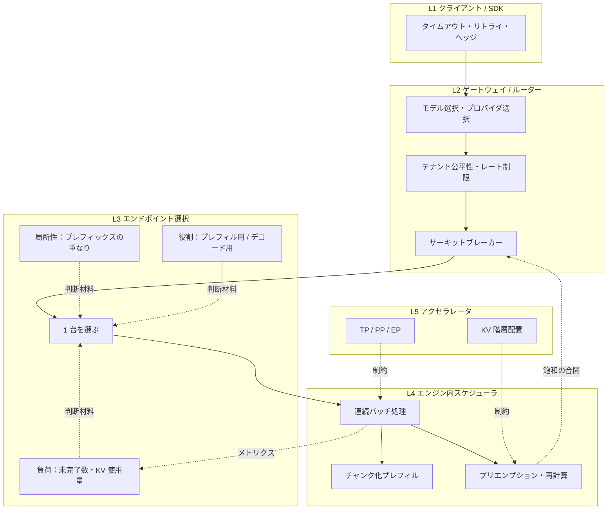

ステートレスな HTTP API なら、ラウンドロビンはたいてい正しい第一手です。1 リクエストあたりの仕事量がほぼ揃っているので、件数を揃えれば資源も揃うからです。

LLM ではこの前提が 4 つとも崩れます。1 件の仕事量は 2 桁変わり、その量は投入時点では分からず、サーバーは前のリクエストの状態（KV キャッシュ）を持ち、応答は数秒から数分にわたって流れ続けます。さらにエージェントになると、スケジューリングの単位が「1 リクエスト」ではなく「数十〜数百回の呼び出しからなる 1 セッション」に変わります。

本記事の主張は一つです。<strong>このスタックのどの層でも、行なわれているのは同じ 1 つの取引だ</strong>ということです。局所性（すでに計算済みのもののそばへ送る）と均衡（空いているところへ送る）のどちらを取るかを、<strong>すでに古い信号</strong>の上で、<strong>最初のトークンが出た瞬間に閉じる窓</strong>の中で決める。層によって変わるのは信号の名前と時定数だけで、取引の形は変わりません。

この主張を、<strong>どの層で、どの信号を見て、何を最適化するのか</strong>という軸で確かめていきます。数式とシミュレーターで振る舞いを見ながら、vLLM・SGLang・NVIDIA Dynamo・Kubernetes Gateway API Inference Extension・LiteLLM・Azure API Management といった実装が実際に何を計算しているかを、上流のソースにあたって確認していきます。

CPU スケジューリングや公平キューイングの系譜そのものについては、[タスクスケジューリングの系譜](/ja/blog/task-scheduling-algorithms)で扱いました。本記事はその続きとして、「複数のサーバーへどう配るか」に焦点を当てます。

## 1. なぜ LLM のトラフィックは違うのか、それを数える 2 つの式

### 1.1 古典的な HTTP 負荷分散との差分

| 前提 | ステートレス HTTP | LLM 推論 |
|---|---|---|
| 1 件の仕事量 | ほぼ均一（CV は小さい） | プロンプト長 × 出力長で 2 桁変動 |
| 仕事量の既知性 | ほぼ既知（リクエストサイズで推定可） | 出力長は生成が終わるまで不明 |
| サーバーの状態 | 原則ステートレス | プレフィックスキャッシュが局所性を生む |
| 応答時間 | ミリ秒 | 秒〜分、ストリーミングで継続 |
| 主資源 | CPU 時間 | GPU 演算・HBM 帯域・KV キャッシュ容量の 3 次元 |
| 同時実行 | スレッド／コネクション | 連続バッチ処理の同居スロット |
| 障害の形 | 5xx が返る | 429 と `Retry-After`、あるいは静かな遅延 |

### 1.2 ばらつきが待ち時間に効く仕組み

待ち行列理論は、この差がどれだけ効くかを定量的に教えてくれます。到着がポアソン過程で、サービス時間の分布が任意（M/G/1）のとき、平均待ち時間は Pollaczek–Khinchine の公式で与えられます。

$$
W_q=\frac{\lambda E[S^2]}{2(1-\rho)}
=\frac{\rho}{1-\rho}\cdot\frac{E[S]\left(1+C_s^2\right)}{2}
$$

ここで $\rho=\lambda E[S]$ は稼働率、$C_s = \sigma_S / E[S]$ はサービス時間の変動係数です。読み取るべき点は 2 つあります。

1. $1/(1-\rho)$ の項により、稼働率が 1 に近づくと待ち時間は発散します
2. $(1+C_s^2)/2$ の項により、<strong>同じ稼働率でもばらつきが大きいほど待ち時間は比例して伸びます</strong>

決定的なサービス時間なら $C_s^2=0$、指数分布なら $C_s^2=1$ です。LLM のリクエストはプロンプト長と出力長の両方が広く分布するため、ここでは長い裾の例として $C_s^2=4$ を仮定します――以下の数値はすべてこの値に比例するので、実運用では自分で測ってください。$C_s^2=4$ なら $(1+C_s^2)/2=2.5$ で、<strong>同じ稼働率でも指数分布の場合の 2.5 倍、決定的な場合の 5 倍の待ち時間になる</strong>ということです。

<QueueingKneeCurve />

このグラフは縦ではなく<strong>横に読む</strong>のがコツです。許容できる待ち時間を一つ決めて――たとえばサービス時間の 3 倍――そこを横にたどると、到達する稼働率は決定的な場合で 0.86、指数分布で 0.75、$C_s^2=4$ で 0.55 です。ばらつきの代償は「待ち時間がちょっと悪くなる」ことではなく、<strong>使ってはいけない稼働率が 30 ポイント分増えること</strong>です。

この式は「LLM のプールを高稼働率で回すべきではない」ことの理論的な根拠であり、同時に「ばらつきを減らす打ち手（チャンク化プレフィル、出力長の上限、モデルの分離）は稼働率を上げる打ち手と同じくらい価値がある」ことも示しています。

### 1.3 リトルの法則で容量を見積もる

もう 1 つ、あらゆる層で使える道具がリトルの法則です。

$$
L=\lambda W
$$

系の中に平均して滞在する件数 $L$ は、到着率 $\lambda$ と平均滞在時間 $W$ の積です。分布を仮定しないため、どんなスケジューラにも成り立ちます。

推論エンジンの中だけを系として取ると、$L$ は「同居しているシーケンス数」、つまりバッチサイズで、$W$ はエンジン内の滞在時間（プレフィル + デコード）になります。バッチサイズには KV キャッシュ容量という上限 $L_{\max}$ があるので、

$$
\lambda_{\max}=\frac{L_{\max}}{W}
$$

が 1 レプリカのスループット上限になります。$W$ 自体も同居数に応じて伸びるため、この式は「その動作点で測った $W$ のもとでの上限」として読む必要があります。その上で、$W$ は出力長にほぼ比例するので、<strong>「出力が長いワークロードでは、同じ GPU で捌けるリクエスト数が減る」</strong>という当たり前の事実が、そのまま容量計画の式になります。逆に、プレフィックスキャッシュで $W$ の中のプレフィル成分を削れば $\lambda_{\max}$ が上がります。

## 2. 何を測るか

負荷分散の議論が噛み合わなくなる最大の原因は、指標の取り違えです。「レイテンシが悪化した」と言うとき、TTFT なのか ITL なのか E2E なのかで、原因も打ち手もまったく違います。

<LBMetricMap />

3 つの補足があります。

<strong>スループットとグッドプットは別物です。</strong> バッチサイズを上げれば秒あたりの総トークン数は増えますが、1 本あたりのトークン間遅延は伸びます。SLO を満たした完了だけを数えるグッドプットで見ると、多くの構成でスループット最大点とグッドプット最大点はずれます。DistServe（Zhong ら, OSDI 2024）がプレフィルとデコードの分離を正当化した際の主指標もこれでした。

<strong>ストリーミングは指標を歪めます。</strong> クライアントから見た「レスポンス完了」はコネクションが閉じたときですが、その時点ではサーバー側の資源はとうに解放されています。ロードバランサが「アクティブ接続数」で負荷を測っていると、実態とずれた信号を見ることになります。

<strong>正規化レイテンシは比較のために要ります。</strong> E2E を出力トークン数で割った値は、出力長の違いを取り除いて負荷水準を比較できます。ベンチマーク結果を読むときは、出力長を固定しているか（`--ignore-eos` を使っているか）を必ず確認してください。

この 6 行のうち 1 行だけは重みが違うので、先に理由を書いておきます。<strong>TTFT はユーザー体験の指標であると同時に、やり直しが効く時間の長さでもあります。</strong> 最初の 1 トークンをクライアントへ書いた瞬間に、再試行もヘッジもフェイルオーバーも別プロバイダへの回避も、不可能になるかユーザーに見えてしまうかのどちらかになります。9 章と 12 章で扱う仕組みはすべて「最初のトークンより前」の仕組みであり、その有効時間は定義上ちょうど TTFT です。9.4 節で、道具が出そろったところでこの話に戻ります。

## 3. 決定が起きる 5 つの層

「LLM の負荷分散」と一括りにされるものは、実際には粒度も権限も異なる 5 段の判断の重なりです。ただし、リクエストごとに<em>振り分け</em>が起きるのは上の 4 層で、L5（TP = テンソル並列、PP = パイプライン並列、EP = エキスパート並列）は静的な配置の選択として他の 4 層を<strong>制約する</strong>側に回ります。本記事も L5 はその役割の範囲でしか扱いません。

<LBLayerMap />



実線はリクエストが進む向き、破線は情報の流れです。「メトリクス」と「飽和の合図」の 2 本は<strong>逆方向の情報の流れ</strong>で、L4 が公開するメトリクスが L3 の次の決定を左右します。このフィードバックには必ず遅れがあり、5.6 節で扱う振動の原因になります。「制約」の 2 本は L5 の静的な配置が L4 の実行時判断に与える制約です。

この層構造を意識すると、よくある失敗の所在がはっきりします。

- L3 で最善のレプリカを選んでも、L4 のバッチが飽和していれば TTFT は改善しない
- L4 をいくら調整しても、L1 が無制限にリトライしていれば実効負荷は減らない
- L2 のレート制限を件数で切っていると、L4 の実資源（トークン）とずれる

## 4. 選択規則の棚卸し

### 4.1 古典的な規則と、それが壊れる条件

<LBPolicyComparison />

いくつか補足します。

<strong>ラウンドロビンが揃えるのは件数であって仕事量ではありません。</strong> 1 件の仕事量が $E[S]$、変動係数が $C_s$ のとき、$n$ 件を $k$ 台へラウンドロビンで配ると、各台の総仕事量の標準偏差は $\sigma_S\sqrt{n/k}$ です。平均 $n E[S]/k$ に対する相対的なばらつきは $C_s/\sqrt{n/k}$ で、$n$ が大きければ収束します。問題は<strong>短期の偏り</strong>で、瞬間的に 1 台へ長いリクエストが 2 本連続で入れば、その台の TTFT はすぐに悪化します。

<strong>2 択のべき乗（Power of Two Choices）は極めて費用対効果が高い規則です。</strong> $n$ 個のボールを $n$ 個の箱へランダムに投げると最大負荷は $\Theta(\log n/\log\log n)$ ですが、毎回ランダムに 2 箱を選んで軽い方へ入れると $\ln\ln n/\ln 2+\Theta(1)$ に落ちます（Azar・Broder・Karlin・Upfal, 1994）。指数的な改善が、たった 1 回の追加観測で得られます。Mitzenmacher（1996）はこれを待ち行列モデルへ拡張し、動的な負荷分散でも同じ効果が出ることを示しました。

$d$ を 3 以上に増やしても、主項は $1/\ln d$ でしか縮みません。「1 から 2 への飛躍が大きく、それ以降は緩やか」というのが本質です。分散したルーターが多数ある環境では、全台走査より 2 択の方が<strong>群れ現象（herding）を避けられる</strong>という実用上の利点もあります。全ルーターが同時に「今いちばん空いている台」へ殺到する事故が起きにくいからです。

<strong>一貫性ハッシュは局所性の道具であって、負荷分散の道具ではありません。</strong>キー分布が偏ればホットスポットになります。Mirrokni・Thorup・Zadimoghaddam（2016）の有界負荷付き一貫性ハッシュは、$m$ 個のボールを $n$ 台へ入れるとき各ノードの容量を $\lceil c\,m/n\rceil$（$c>1$）に制限し、溢れたキーをリング上の次のノードへ送ることで最悪負荷を押さえます。後述するプレフィックス考慮ルーティングの「親和性と均衡の切り替え」も、動機は同じです。

### 4.2 同じ到着列で測ると順位はこうなる

同じ到着列に対して選択規則だけを差し替えると、何がどう変わるかを見てみます。

<LLMLoadBalancerLab />

既定の設定（4 レプリカ、$\lambda=0.20$、長文比率 20%）での実測値は次のとおりです。TTFT はティック単位、SLO は 80 ティックです。

| 選択規則 | TTFT P95 | SLO 達成率 | キャッシュ充足率 | 割当件数の差 | 出力スループット |
|---|---|---|---|---|---|
| ランダム | 324.2 | 88% | 38% | 10 | 14.4 |
| ラウンドロビン | 84.3 | 94% | 46% | 0 | 15.1 |
| 最小未完了数 | <strong>52.1</strong> | <strong>98%</strong> | 39% | 10 | 16.6 |
| 2 択のべき乗 | 90.1 | 94% | 37% | 8 | 16.6 |
| 最小 KV 使用量 | 559.0 | 81% | 45% | 50 | 12.5 |
| プレフィックス考慮 | 151.3 | 91% | <strong>67%</strong> | 11 | <strong>17.2</strong> |

この表から読み取れることを挙げます。

- <strong>ラウンドロビンは割当件数の差が 0 なのに、最小未完了数に裾で負けている</strong>。件数の均等と資源の均等は別物である、という主張の実演です
- <strong>ランダムは、負荷を見ない規則の中で裾が最も悪い</strong>。件数の偏りは小さいのに、重いリクエストの偶発的な集中が TTFT P95 を押し上げます
- <strong>2 択のべき乗は、ラウンドロビンと同等の SLO 達成率を $O(1)$ の観測コストで得ている</strong>。全台を走査する最小未完了数には裾で届かないものの、スループットは同等です
- <strong>最小 KV 使用量は全項目で最下位</strong>。この実装は「実行中およびプレフィル中のシーケンスが占有するブロック数」を主な信号としますが、<strong>待機中のリクエストは受付されるまで KV ブロックを 1 つも占有しません</strong>。つまり現在の占有量を読むゲージには、待機中の仕事が原理的に見えません。割り当て済みで未受付の仕事は同点時の副次的な判定材料にしかならず、結果として空いたレプリカへ次々と大きなプロンプトを積み上げ、割当件数の差が 50 まで開きます
- <strong>プレフィックス考慮はキャッシュ充足率とスループットで最良だが、裾は最良ではない</strong>。親和性のために負荷の偏りをある程度許容するためです

4 番目は特に重要な教訓です。<strong>負荷信号は「受け付けたがまだ完了していない仕事」を漏れなく数えなければならない</strong>という原則で、Envoy の least-request が単なる接続数ではなく実行中リクエスト数を使うのも、Dynamo のコスト式が「待機中リクエストのプレフィル負荷」を含むのも、同じ理由です。

この順位はスライダーを動かすと変わります。到着率を下げていくと、<strong>負荷を見て選ぶ規則同士</strong>の差は消えます。これは「負荷分散の工夫は、混雑していないときには何の役にも立たない」という、待ち行列の式からの当然の帰結です。ただしプレフィックス考慮だけは例外で、他が TTFT P95 = 7、8 に並ぶところで 2 のままです。これは混雑を分散させているのではなく再計算を避けているからで、再計算は低負荷でも消えません。

### 4.3 レプリカが均質でない場合

ここまでの規則はすべて、レプリカが交換可能であることを前提にしていました。実際のプールはしばしばそうではありません。GPU 世代が混在する、テンソル並列度が違う、量子化の有無が違う、あるいはスケールアウト直後でキャッシュの温度が違う、といった状態は普通に起きます。

このとき、素直な最小未完了数は明らかに間違っています。2 倍速いレプリカは 2 倍の未完了リクエストを抱えているべきなのに、件数を揃えてしまうからです。Envoy の重み付き最小リクエストは、重みが不均一なときに次の式で実効重みを計算します（[Supported load balancers](https://www.envoyproxy.io/docs/envoy/latest/intro/arch_overview/upstream/load_balancing/load_balancers)）。

$$
\text{weight}=\frac{\text{load\_balancing\_weight}}{\left(\text{active\_requests}+1\right)^{\text{active\_request\_bias}}}
$$

`active_request_bias` の既定値は 1.0 です。この 1 つのツマミが、規則の家系全体を連続的にまたいでいることに注目してください。

- $0$ なら未完了数を無視し、単なる重み付きラウンドロビンになる
- 大きくするほど未完了数が実効重みを強く下げ、厳密な最小未完了数へ近づく

Envoy のドキュメントは、この方式が定常状態では良好だが急な偏りへの追従は遅く、また P2C と違ってホストが完全にドレインされることはないと明記しています。

一方、<strong>LLM の場合は「重み」を静的に決められない</strong>という問題が残ります。レプリカの実効容量はプロンプト長と出力長の混合比で変わるからです。GIE のロードマップも「遅延（レイテンシ）とリクエストコストを考慮した不均質アクセラレータ向け負荷分散」を未完了項目として挙げており、これは現在進行形の未解決問題です。

## 5. LLM 固有の信号

古典的な規則の限界がわかったところで、推論エンジンが実際に公開している信号と、それを使う側の実装を見ます。

### 5.1 推論エンジンが出す数字

vLLM は Prometheus 互換の `/metrics` に、ルーティングへ直接使える指標を出しています（[`vllm/v1/metrics/loggers.py`](https://github.com/vllm-project/vllm/blob/main/vllm/v1/metrics/loggers.py)）。

| 指標 | 型 | 意味 |
|---|---|---|
| `vllm:num_requests_running` | Gauge | 実行バッチに入っているリクエスト数 |
| `vllm:num_requests_waiting` | Gauge | スケジュール待ちのリクエスト数 |
| `vllm:num_requests_waiting_by_reason` | Gauge | 待ち理由別（`capacity` / `deferred`）の内訳 |
| `vllm:kv_cache_usage_perc` | Gauge | KV キャッシュ使用率（1 が 100%） |
| `vllm:prefix_cache_queries` / `vllm:prefix_cache_hits` | Counter | プレフィックスキャッシュの問い合わせ・ヒット（トークン数） |
| `vllm:num_preemptions` | Counter | プリエンプションの累計回数 |
| `vllm:time_to_first_token_seconds` | Histogram | TTFT |
| `vllm:inter_token_latency_seconds` | Histogram | トークン間遅延 |
| `vllm:request_queue_time_seconds` | Histogram | キュー待ち時間 |
| `vllm:request_prefill_time_seconds` / `vllm:request_decode_time_seconds` | Histogram | フェーズ別の所要時間 |
| `vllm:kv_block_reuse_gap_seconds` | Histogram | KV ブロックの再利用間隔（サンプリング） |
| `vllm:kv_block_idle_before_evict_seconds` | Histogram | 追い出されるまでのアイドル時間（サンプリング） |
| `vllm:kv_block_lifetime_seconds` | Histogram | KV ブロックの生存時間（サンプリング） |

（表はソースで登録されている名前です。Prometheus クライアントは収集時に Counter へ `_total` を付与するため、`/metrics` やアラート式では `vllm:num_preemptions_total` と書きます。末尾の 3 つは既定では出力されません。有効化のスイッチは `--kv-cache-metrics`（真偽値・既定 `False`）で、`--kv-cache-metrics-sample`（既定 `0.01`）はそのサンプリング率だけを決めます。加えてログ統計が有効である必要があるため、`--disable-log-stats` を付けていると出ません。）

ルーティングにとって重要なのは、<strong>キューの深さと KV 使用率の 2 つが独立した飽和軸である</strong>点です。KV に余裕があってもバッチスロットが埋まっていれば待たされますし、逆にスロットが空いていても KV が足りなければ受け付けられません。

`vllm:num_preemptions`（収集時は `_total`）が増えているときは、KV 不足で実行中のシーケンスが追い出されて再計算されています。この状態はトークン間遅延を大きく乱すため、ルーター側で受付を絞る（あるいは容量を足す）べき明確な信号です。

### 5.2 標準化の動き：Gateway API Inference Extension

Kubernetes の [Gateway API Inference Extension](https://gateway-api-inference-extension.sigs.k8s.io/)（GIE）は、この「エンジンの内部状態を見てエンドポイントを選ぶ」層を標準化する公式プロジェクトです。仕組みは次のとおりです。

1. Gateway が HTTPRoute に従って `InferencePool`（同じモデルを提供するエンドポイント群）を選ぶ
2. Gateway が Envoy の [External Processing](https://www.envoyproxy.io/docs/envoy/latest/configuration/http/http_filters/ext_proc_filter) を通じて、そのプールの Endpoint Picker（EPP）へリクエスト情報を渡す
3. EPP がエンドポイントのメトリクスを取得し、設定された目的に最も合う 1 台を選ぶ
4. Gateway がその 1 台へ転送する

重要なのは、EPP が<strong>差し替え可能な拡張点</strong>として定義されている点です。この拡張性は 2026 年にリポジトリ分割という形で制度化されました。現在の README によれば、フル機能の EPP、`InferenceObjective` と `InferenceModelRewrite` API は [llm-d/llm-d-router](https://github.com/llm-d/llm-d-router) へ、Body Based Router は [llm-d/llm-d-inference-payload-processor](https://github.com/llm-d/llm-d-inference-payload-processor) へ移管され、元のリポジトリ内のパッケージは近いうちアーカイブされます。GIE リポジトリ自体は、適合性テスト用の<strong>軽量 EPP（LWEPP）</strong>と `InferencePool` API、そして適合性テストの開発に範囲を絞っています。

つまり、<strong>プールの API と適合性は上流で標準化し、ルーティングアルゴリズムの実装は別リポジトリで競わせる</strong>という分業体制です。この移行はまだ途中で、プロジェクトの FAQ によれば `InferencePool` と `InferencePoolImport` の API 自体と適合性テストも Gateway API リポジトリへ移される予定です。EPP が参照できる信号にはプレフィックスキャッシュの状態や LoRA アダプタの搭載状況が含まれます。`InferencePoolImport` はクラスタをまたぐための API 型ですが、まだ `v1alpha1` で破壊的変更がありうると明記されています。

ロードマップを見ると、この分野で何が未解決なのかがそのまま分かります。リモートキャッシュへのインターフェースを含むプレフィックス考慮負荷分散、LoRA アダプタの推奨ロールアウト手順、同一重要度帯内での公平性と優先度、ロードバランサー由来の集約メトリクスによる HPA 対応、大きなマルチモーダル入出力、拡散モデルなど補完以外の生成モデル、不均質アクセラレータ、独立スケール可能な分離プール——これらの多くは、本記事で後述する論点と一致します。マルチモーダルと補完以外の生成モデルの 2 つは、本記事では扱いません。

エンジン側との接続は素朴です。vLLM は ORCA 形式のエンドポイント負荷レポートに `vllm:kv_cache_usage_perc` と `vllm:num_requests_waiting` をマッピングして返します（[`vllm/entrypoints/serve/utils/orca_metrics.py`](https://github.com/vllm-project/vllm/blob/main/vllm/entrypoints/serve/utils/orca_metrics.py)）。「どの数字をルーターに渡すか」がプロトコルとして固定されつつある、ということです。

### 5.3 プレフィックスの重なりが信号になる理由

ここまでの信号は、古典的な負荷指標を LLM 用に置き換えたものでした。次に見る信号は、古典的な負荷分散には対応物がありません。<strong>このリクエストの先頭を、すでに計算し終えているレプリカがあるか</strong>という信号です。

具体例から入ります。エージェントの会話では、システムプロンプト、ツール定義、これまでの全ターンが、次の呼び出しでもそのまま先頭に並びます。10 ステップ目の呼び出しでは、プロンプトの 95% が前ステップと共通、ということも普通に起こります。このとき、同じ会話を同じレプリカへ送るかどうかで<strong>プレフィル計算量が一桁変わります</strong>。

なぜそうなるのかを短く見ておきます。自己回帰生成では、プロンプト全体を一度処理してから（プレフィル）、1 トークンずつ生成します（デコード）。プレフィルは全トークンを並列に処理できるため演算律速で、デコードは 1 トークンずつしか進まないためメモリ帯域律速です。長さ $n$ のプロンプトのうち先頭 $m$ トークンぶんの KV がすでに計算済みなら、残り $n-m$ トークンぶんだけ計算すればよくなります。

削減率は層の種類で違います。QKV 射影や MLP などトークン数に線形な層はちょうど $m/n$ を削減します。一方 Attention は、未キャッシュの $n-m$ トークンがキャッシュ済みのプレフィックス全体にも Attention をかけなければならないため、削減率は

$$
1-\frac{n^2-m^2}{n^2}=\left(\frac{m}{n}\right)^2
$$

となり、$m/n$ より小さくなります。したがって全体の削減率は $(m/n)^2$ と $m/n$ の間に収まり、Attention の二次項がそれを $m/n$ より下に引っ張る、というのが正確な絵です。

実用上は、この二次項は長文脈でなければほとんど効きません。モデルの隠れ層幅を $d$、1 ブロックのパラメータ数を $P \approx c\,d^2$ と書くと、定数倍を無視したプレフィルの演算量はトークン数に線形な部分がおよそ $2n\cdot P$、因果マスク付きの Attention 項がおよそ $2n^2 d$ です。すなわち Attention が占める割合は $n/(n+c\,d)$ 程度で、$c$ は典型的に 11 から 19（古典的な MHA ＋ 4d GELU なら $4d^2+8d^2$ でちょうど 12）です。$d=4096$ なら、$n$ が 5 万トークンに近づくまで Attention は全体の半分にもなりません。つまり<strong>普通の長さのプロンプトでは、削減率は実質的に $m/n$ に近い</strong>と考えて問題ありません。二次項が利いてくるのは、長文脈のエージェントや文書全文を投げる用途の領域です。

この「削れるプレフィル量」をルーティングの入力にするとどうなるかを、次の 2 節で 2 つの実装から見ます。

### 5.4 コスト関数として定式化する：NVIDIA Dynamo

NVIDIA Dynamo の KV ルーターは、エンドポイント選択を明示的なコスト最小化として書いています（[`router-design.md`](https://github.com/ai-dynamo/dynamo/blob/main/docs/fern/pages/developer-guide/knowledge-base/modular-components/router/router-design.md)）。

```text
overlap_credit_blocks = device_overlap_blocks * effective_device_credit
                      + host_overlap_blocks   * host_cache_hit_weight   // 既定 0.75
                      + disk_overlap_blocks   * disk_cache_hit_weight   // 既定 0.25
                      + shared_beyond_blocks  * shared_cache_multiplier  // 共有キャッシュ未設定なら無効

adjusted_prefill_blocks = max(prefill_blocks - overlap_credit_blocks, 0)

cost = prefill_load_scale * adjusted_prefill_blocks       // 既定 1.0
     + potential_decode_blocks
     + decode_active_request_weight * active_requests     // 既定 0（任意）
```

この式は 3 つの設計判断を凝縮しています。

<strong>単位をブロックに統一している。</strong> プレフィル負荷もデコード負荷もキャッシュヒットも、すべて KV ブロック数という共通の単位で表されるため、そのまま足し引きできます。

<strong>キャッシュの階層に応じて割引率を変えている。</strong> GPU 上（device）にあるブロックは満額、CPU ピン留めメモリなら 0.75、ディスクなら 0.25 の重みで「プレフィルしなくてよい分」として控除されます。転送コストの差が重みとして表現されています。`shared_beyond_blocks` は、クラスタ共有キャッシュのヒットのうち、そのワーカーの device プレフィックスを超えた分だけを数えたものです。この乗数の既定値は上流でも表記が割れていますが（Python バインディングは 0.0、フロントエンド CLI リファレンスは 0.5）、共有キャッシュを設定しない限りどちらにせよ無効です。

<strong>過度な親和性を減衰させる仕組みがある――ただし有効化すれば。</strong> 実効的な device 重みは

$$
\text{effective\_device\_credit}=\frac{\text{overlap\_score\_credit}}{1+\text{decay}\times\text{normalized\_excess\_prefill}}
$$

で計算され、キャッシュを持っているワーカーのプレフィル負荷が最も軽いワーカーより大きいほど、親和性の効きが弱まります。ただし既定値には注意が必要で、`--router-kv-overlap-score-credit-decay` は<strong>既定 0、つまり減衰は無効</strong>です。素の状態の Dynamo のコスト関数には親和性のブレーキがなく、明示的に入れる必要があります。`router_temperature` を 0 以外にすると、正規化したコストに対する softmax サンプリングになり、決定的な集中を避けられます。

ドキュメントの計算例（`overlap_score_credit = 1.0`、`decode_active_request_weight = 0`）はこうです。

| ワーカー | 生プレフィル | device 重なり | デコード | コスト |
|---|---|---|---|---|
| 1 | 10 | 2 | 10 | $(10-2)+10=18$ |
| 2 | 10 | 5 | 5 | $(10-5)+5=10$ ← 選択 |
| 3 | 10 | 8 | 9 | $(10-8)+9=11$ |

ワーカー 3 は最もキャッシュを持っていますが、デコード負荷が重いため選ばれません。<strong>キャッシュヒットは TTFT を、デコード負荷はトークン間遅延を支配する</strong>ので、この式は両者のバランスを 1 つのスカラーで取っていることになります。ドキュメントも「重なりの重みを上げると TTFT が改善し、下げると負荷が均等になり ITL が改善する」と明記しています。

### 5.5 閾値で切り替える：SGLang

SGLang のゲートウェイは、同じ問題をコスト関数ではなく<strong>2 つのモードの切り替え</strong>として解いています（[`policies/cache_aware.rs`](https://github.com/sgl-project/sglang/blob/main/sgl-model-gateway/src/policies/cache_aware.rs)）。

```text
imbalanced = (max_load - min_load) > balance_abs_threshold
             AND max_load > min_load * balance_rel_threshold

if imbalanced:
    最小負荷のワーカーを選ぶ（同点はランダム）
else:
    近似基数木でプレフィックス一致率を求める
    match_rate = matched_chars / input_chars
    if match_rate > cache_threshold:
        一致したワーカーを選ぶ
    else:
        最小負荷のワーカーを選ぶ（同点はランダム）
選んだワーカーを基数木へ挿入する
```

木はトークン ID ではなく生の文字列を格納します。ルーター側でトークナイズしなくて済むためで、そのぶん一致率は近似になります。木は `(プール, モデル)` ごとに 1 本保持され、各ワーカーはその木の中の<strong>テナント</strong>として表現されます（一致検索は「このプレフィックスをもっとも長く保持しているテナントはどれか」を返します）。プールごとに分けるのは、プレフィル用プールとデコード用プールが互いのエントリを追い出さないようにするためです。

既定値は入口によって異なるので注意が必要です。Rust のゲートウェイバイナリ（[`main.rs`](https://github.com/sgl-project/sglang/blob/main/sgl-model-gateway/src/main.rs)）は `cache_threshold = 0.3`、`balance_abs_threshold = 64`、`balance_rel_threshold = 1.5`、`eviction_interval = 120` 秒、`max_tree_size = 67108864` を採り、Python ランチャー（[`router_args.py`](https://github.com/sgl-project/sglang/blob/main/sgl-model-gateway/bindings/python/src/sglang_router/router_args.py)）はエビクション間隔だけ 60 秒です。一方、`CacheAwareConfig::default()`（[`policies/mod.rs`](https://github.com/sgl-project/sglang/blob/main/sgl-model-gateway/src/policies/mod.rs)）は `0.5 / 32 / 1.1 / 30 / 10000` です。

Dynamo の連続的なコスト関数と SGLang の離散的な閾値切り替えは、<strong>同じトレードオフに対する 2 つの表現</strong>です。前者は重みの調整で滑らかに動かせ、後者は「いつ親和性を捨てるか」が設定ファイルから直接読めます。

### 5.6 信号の鮮度 — 古い値を全員で信じると何が起きるか

ここまでの議論には、暗黙の前提が 1 つ混ざっていました。「ルーターはレプリカの現在の負荷を知っている」という前提です。実際には、ルーターは<strong>ミリ秒単位で判断し、数秒周期でしか観測しません</strong>。この時間差が、古典的な分散系の失敗モードをそのまま持ち込みます。

機構は単純で、そして<strong>ルーターの位相が揃っていること</strong>に依存しています。

1. $N$ 台のルーターが同じスナップショットを見る
2. 全員が同じ「今いちばん空いているレプリカ」を選ぶ
3. そのレプリカが次の取得までの間、全トラフィックを受ける
4. 次の取得でそのレプリカが最悪に見え、全員が一斉に逃げる
5. 1 へ戻る

収束せずに<strong>振動が持続する</strong>のがこの失敗の本質です。振幅を決めるのは<strong>1 枚の古いスナップショットの上で何件を投入するか</strong>、つまりおよそ $\min(\lambda \times T_{\text{scrape}},\ L)$――取得間隔の間に到着する件数と、同時に滞留している総量 $L = \lambda W$ の小さい方です。この $L$ は、1.3 節でリトルの法則に代入した滞留数をプール全体へ拡げたものです。取得間隔を伸ばすほど、この天井まで大きくなります。ルーター台数は振幅そのものには効きません。全ルーターが同じスナップショットを見ている以上、投入の総数は台数によらないからです（下のラボで取得タイミングをずらさずにルーター台数だけを動かすと、最上段の方式では数値がまったく変わらないことが確認できます）。ルーター台数が効いてくるのは、後述する対策のうち 1 番目――自分の投入分を数える補正――のほうです。

<SignalStalenessLab />

既定設定（5 レプリカ、4 ルーター、取得間隔 10 ティック）での結果は次のとおりです。

| 選択規則 | 偏りの最大値 | 偏りの平均 | 1 台へ集中したティック |
|---|---|---|---|
| 最小未完了数（古い値をそのまま） | 21 | 12.0 | 64% |
| 最小未完了数＋自分が投げた分 | 20 | 9.1 | 48% |
| ランダムに 2 台だけ比較（補正なし） | <strong>9</strong> | 5.2 | <strong>21%</strong> |
| 両方 | 10 | <strong>4.4</strong> | 23% |

（下 3 行は最上行への<strong>置き換え</strong>であって、積み上げではありません。とくに「ランダムに 2 台だけ比較」は自分の投入分の加算を<strong>含みません</strong>。「両方」だけが 2 つを組み合わせたものです。また集中率はこの設定内での比較にしか使えません。取得間隔を 1 ティック（完全に新鮮な値）にすると集中率は 87% まで上がりますが、これは全ルーターが<strong>正しい</strong>値を見て同じ結論に至っているだけで、偏りの最大値は 21 から 2 へ落ちます。）

対策は 4 つあります。

<strong>0. そもそも位相を揃えない。</strong> いちばん安いのは、ルーターごとに取得タイミングをずらすことです。上のラボの「取得タイミングをずらす」を入れると、選択規則を一切変えないまま最上段の偏りが落ちます。ただしこれが使えるのは取得を中央で調停できる場合に限られ、それぞれ独立に起動するサイドカー群には使えません。以下の 3 つは、位相を揃えられない前提での対策です。

<strong>1. ルーター側で自分の投入を数える。</strong> 取得したスナップショットに、前回の取得以降に自分が投げた件数を足してから選びます。この対策の効きは<strong>ルーター台数に直接依存します</strong>。ルーターが 1 台なら補正は正確で、偏りの最大値は 3、平均は 1.44、集中率は 6% まで下がります（P2C より良い）。しかし 4 台になると各ルーターは全体の 1/4 しか見えないため、平均の偏りは 9.1 まで戻ります。上の表では、平均の偏りの改善幅は達成可能幅のおよそ 4 割、一方で<strong>最大値は 21 から 20 へとほとんど改善していません</strong>。

<strong>2. ランダム化する。</strong> P2C は「全員が同じ最小値へ殺到する」経路そのものを断ちます。Envoy のドキュメントは、重みが等しいときの `LEAST_REQUEST` がまさに P2C（`choice_count` の既定値は 2）であることを明記し、「P2C は群れ現象への耐性のためにロードバランサー実装にとくに有用だ」と述べています。Dynamo の `router_temperature` による softmax サンプリングも、同じ目的の別実装です。

<strong>3. 古い値を信じない・新しいノードを信じない。</strong> Envoy の `ClientSideWeightedRoundRobin` は、ORCA レポートから重みを

$$
\text{weight}=\frac{\text{qps}}{\text{utilization}+\dfrac{\text{eps}}{\text{qps}}\times\text{error\_utilization\_penalty}}
$$

として導きます。重要なのは周辺の規則です。レポートが無効であるとき、初期の `blackout_period` 中であるとき、あるいは `weight_expiration_period` を過ぎたとき、そのエンドポイントには<strong>有効な重みを持つエンドポイントの中央値</strong>が割り当てられます（すべて無効なら 1）。このブラックアウトと失効の仕組みは `ClientSideWeightedRoundRobin` 固有ですが、<strong>スロースタート</strong>（新規・復帰したエンドポイントへ徐々にトラフィックを入れる）はラウンドロビンや最小リクエストでも使えます。

この 3 番目は、LLM ではとくに重要です。起動直後のレプリカは未完了数 0 で、しかもキャッシュが冷えています――この「冷たい新品」の問題は 11.3 節で扱います。ただし Envoy のドキュメントは、スロースタートは「新規エンドポイントが少数のときに最も効果的で、Kubernetes の新規デプロイのように全エンドポイントが新しい場合はあまり効かない」と警告しています。スケールアウトで 1 台ずつ増やす場面には効きますが、プール全体を入れ替えるデプロイには別の手が要ります。

## 6. 親和性と均衡をどこで折り合うか

前節までで、プレフィックスの重なりをコストに換算する方法は見ました。残る問題は、そのコストを<strong>どこまで優先させるか</strong>です。

### 6.1 局所性と均衡のトレードオフ

<PrefixCacheRoutingVisualizer />

キャッシュ枠を 1 系列ぶんに絞り、1 つのプレフィックス（P1）が全 12 件のうち 8 件を占める偏った系列を流しています。この設定で両者を並べると、次の 3 つが同時に読み取れます。

<strong>親和性は効く。</strong> 負荷だけを見るルーターのヒット率は 12 件中 4 件、プレフィックス考慮ルーターは 6 件です。累積プレフィルトークン数は 29,180 対 21,180 で、<strong>27.4% の削減</strong>になります。負荷だけのルーターが「毎回ミスする」わけではない点に注意してください。3 台を順に埋めていく過程で、たまたま同じレプリカに戻ってきたときにはヒットします。プレフィックス考慮が勝つのは、それが<strong>偶然ではなくなる</strong>からです。

<strong>それでも逃げ道は必要。</strong> P1 が集中するため、親和性だけに従うとレプリカ 1 が積み上がります。負荷差が閾値（この実装では 2）を超えた時点で親和性を放棄し、最小負荷のレプリカへ逃がします。12 件のうち 2 件がこの経路を通ります。

<strong>逃げ道にはコストがある。</strong> 逃がした 2 件はどちらもミスになります。つまりヒット率 6/12 という数字は、閾値を無限大にすれば上がります――そのかわり最終的な負荷は 8, 2, 2 のように歪みます。ここにあるのは「キャッシュ親和性と負荷均衡のどちらが正しいか」ではなく、<strong>どこで折り合うか</strong>というつまみです。プレイヤーを 1 ステップずつ進めると、各判断の理由（初出・親和性・負荷差による放棄）が表示されます。

ただし親和性を無条件に優先すると、人気のあるプレフィックスを持つレプリカに負荷が集中します。前節までで見た 2 つの実装は、まさにこの<strong>逃げ道</strong>を違う形で用意していました――SGLang は閾値で、Dynamo は減衰項です。ただし既定で逃げ道が開いているのは SGLang だけです。設計としてはこう整理できます。

| 設計軸 | 選択肢 |
|---|---|
| キャッシュ状態の追跡方法 | ルーター側の近似木 / KV イベント購読 / 外部インデクサへの問い合わせ |
| 一致の粒度 | 文字 / トークン / KV ブロック |
| 親和性を捨てる条件 | 負荷差の絶対値と相対値 / 連続的な減衰項 / softmax の温度 |
| キャッシュの階層 | GPU HBM のみ / ホストメモリ / ディスク / クラスタ共有ストア |

最後の行には一言必要です。これは判断そのものの形を変えるからです。KV ブロックをクラスタ共有ストアから取得できるなら、レプリカ B での「ミス」はもはやプレフィル全額ではなく、転送コストで済みます。親和性は二値ではなくなり、帯域と演算の比較に変わります。これは Dynamo の 0.75 と 0.25 の階層重みがすでに値付けしていたものを、1 台の内側からマシン間へ拡げたものです。vLLM は `vllm/distributed/kv_transfer/` 下にこのためのコネクタを持ち、LMCache・Mooncake・NIXL、そして単純な CPU / ディスク退避をカバーしています。これが GIE ロードマップの「リモートキャッシュへのインターフェース」であり、その項目が未解決のままである理由でもあります――転送が十分に安くなれば、ルーターのコスト関数には演算だけでなくネットワークの項が必要になります。

### 6.2 軽量な代替：プレフィックスハッシュ

基数木の維持が重いと感じる場合、SGLang には `prefix_hash` という軽量版もあります（[`policies/prefix_hash.rs`](https://github.com/sgl-project/sglang/blob/main/sgl-model-gateway/src/policies/prefix_hash.rs)）。

1. リクエストの先頭 $k$ トークンを取り出す（`prefix_token_count`）
2. xxhash でハッシュする
3. 一貫性ハッシュリングで担当ワーカーを引く
4. そのワーカーの負荷が平均 × `load_factor` を超えていたら、最小負荷のワーカーへ回す

発想は 4.1 節で触れた「有界負荷付き一貫性ハッシュ」と同じです（この実装は、溢れたときにリングを順に歩くのではなく大域で最小負荷のワーカーを選ぶ点が理論モデルとは異なります）。木の維持が不要で、リング参照は $O(\log n)$、ノードを $n$ 台から $n+1$ 台へ増やしたときに移動するキーは全体の $1/(n+1)$ 程度で済みます。エージェントの会話の先頭をキーにするなら、実用上はこれで十分なことが多いはずです。

### 6.3 同じ構造の別問題：LoRA アダプタ

プレフィックスキャッシュとまったく同じ構造を持つ問題が、複数 LoRA アダプタのルーティングです。レプリカは有限個のアダプタしか同時に搭載できず、未搭載のアダプタを入れ替えるには実時間がかかります。したがってルーターは、「アダプタ X をすでに持っているレプリカ」と「空いているレプリカ」を天秤にかけることになります。

違いは、親和性の値が<strong>離散で小さい</strong>ことです。プレフィックス一致率は 0 から 1 の連続値ですが、アダプタは「ある」か「ない」のどちらかで、しかも枚数は数枚です。親和性項がガタガタになるため、人気のあるアダプタへの集中はプレフィックスの場合より深刻になります。

vLLM はこの判断のために `vllm:lora_requests_info` を公開しています。値は発行時刻で、ラベルに `running_lora_adapters`、`waiting_lora_adapters`、`max_lora`（バッチに同居できるアダプタ数の上限）を持ちます。ただし前 2 つの中身には注意が必要です。vLLM のメトリクス設計ドキュメントは「アダプタ別の件数をカンマ区切り文字列にしたもの」と説明していますが、[`loggers.py`](https://github.com/vllm-project/vllm/blob/main/vllm/v1/metrics/loggers.py) が実際に結合しているのは辞書の<strong>キーだけ</strong>で、件数は落ちています。つまり配線を流れているのは「いま走っている／待っているアダプタ名の一覧」です。同ドキュメントはこのカンマ区切りエンコード自体を「かなり見当違い（quite misguided）」と評し、ラベルで分けるべきだと記しています。信号はあるが、まだ整っていない、というのが現状です。GIE のロードマップも「LoRA アダプタの推奨ロールアウト手順」を未完了項目として挙げています。

## 7. エンジン内スケジューリング

ルーターがどれだけ賢くても、レプリカ内部のスケジューラが仕事を寝かせていれば意味がありません。ここは負荷分散の議論で最も見落とされる層です。

### 7.1 静的バッチから連続バッチへ

初期の推論サーバーは、リクエストをバッチにまとめて一括処理していました。この方式では、バッチ内で最も長い生成が終わるまで全スロットが解放されません。10 トークンで終わるリクエストが 1000 トークン生成するリクエストを待つことになります。

Orca（Yu ら, OSDI 2022）が導入した<strong>イテレーション単位スケジューリング</strong>は、これを反復ごとの判断へ置き換えました。1 反復ごとに完了したシーケンスを外し、待機列から新しいシーケンスを入れます。今日「連続バッチ処理（continuous batching）」と呼ばれているものの原型です。

vLLM の PagedAttention（Kwon ら, SOSP 2023）は、これを KV キャッシュ側から支えます。KV を固定サイズのブロックに分割して仮想メモリのように管理することで、断片化を抑えつつシーケンスの出入りを安価にしました。

### 7.2 プレフィルがデコードを止める問題

連続バッチ処理には、まだ 1 つ穴があります。新しいシーケンスのプレフィルは 1 反復を丸ごと占有するため、その間、実行中の全シーケンスのデコードが止まります。長いプロンプトが 1 本入るたびに、他の全ユーザーのトークン間遅延が跳ねます。

Sarathi-Serve（Agrawal ら, OSDI 2024）の<strong>チャンク化プレフィル</strong>は、プレフィルを計算予算に収まるチャンクへ分割し、同じ反復でデコードと同居させます。これにより「デコードが止まる反復」がなくなります。

<ContinuousBatchingVisualizer />

3 つの方式を切り替えると、二つの効果が<strong>別々の基準に対して</strong>現れることが見えます。スロット充填率は静的バッチの 57% から連続バッチで 91%、チャンク化プレフィルで 93% へと上がります――これは連続バッチが稼いだ分です。一方で出力 0 の反復数は、静的バッチ 6、連続バッチ 8、チャンク化プレフィル 1 です。連続バッチにおけるこの 8 は本当に「デコードが止まった反復」であり、ここでは<strong>悪化しています</strong>。スロットを常に埋めようとする分だけ、新規プレフィルの割り込みが増えるからです（静的バッチの 6 は大半が初回のプレフィルで、そもそも止まるデコードが存在しません）。チャンク化プレフィルはその悪化を打ち消し、さらに静的バッチより下げます。なおこの模式図では、最初の反復だけはまだ 1 本もプレフィルを終えていないため出力トークンが 0 になります。

チャンク化プレフィルは無料ではありません。1 反復あたりのトークン予算をプレフィルとデコードで分け合うため、予算配分がそのままスループットとトークン間遅延のトレードオフになります。プレフィル寄りに振ればスループットが上がり、デコード寄りに振れば ITL が安定します。

### 7.3 プレフィルとデコードを別のマシンへ

もう一歩進めて、プレフィルとデコードを<strong>別のワーカーへ分ける</strong>のが Splitwise（Patel ら, ISCA 2024）と DistServe（Zhong ら, OSDI 2024）です。動機は明快で、2 つのフェーズは資源の使い方が違うからです。

| | プレフィル | デコード |
|---|---|---|
| 律速要因 | 演算（FLOPS） | メモリ帯域 |
| 並列度 | プロンプト内の全トークン | シーケンス数のみ |
| バッチ効果 | 小さい（単体で飽和する） | 大きい |
| 主な調整ノブ | 並列化の形態 | より大きなバッチ |

分離すると、フェーズごとに異なる並列度・異なる GPU 世代・異なるバッチ方針を選べます。なお DistServe は、プレフィル側でどの並列化が有利かは到着率に依存すると報告しており、「プレフィルは常にテンソル並列」といった単純な規則にはなりません。代償は、プレフィル後の KV キャッシュをデコードワーカーへ転送する必要があることです。転送コストが利得を上回る短いプロンプトでは分離しない方がよく、Dynamo はこれを<strong>条件付き分離</strong>として実装しています。切り替え規則は `isl_bounding`（実効入力長）、`prefill_load`（プレフィル側の混雑度）、`isl_or_load`（いずれか）の 3 つから選べます。

ルーティングの観点では、分離構成は決定を 2 つに増やします。プレフィルワーカーの選択はプレフィックス親和性が支配し、デコードワーカーの選択は KV 容量と現在のバッチが支配します。Dynamo の実装では、通常の分離時にデコード側ルーターへ `overlap_score_credit = 0` を強制して純粋な負荷分散にし、条件付き分離のときはこの上書きを行わず基底のクレジットをそのまま使います（[`prefill_router/mod.rs`](https://github.com/ai-dynamo/dynamo/blob/main/lib/llm/src/kv_router/prefill_router/mod.rs) の `build_decode_router_override`）。

### 7.4 投機的デコードと、それが壊すメトリクス

エンジン側で最後に挙げておく価値のあるレバーは、デコード 1 反復<em>とは何か</em>を変えてしまいます。投機的デコードは、小さなモデル・n-gram 参照モデル・EAGLE や MTP のような追加ヘッドを使って複数トークンを安く下書きし、本命モデルの 1 パスでまとめて検証して、受理された最長の接頭辞を残します（[Leviathan, Kalman, Matias, ICML 2023](https://arxiv.org/abs/2211.17192)）。受理されたトークンはほぼタダで、棄却されたぶんは捨てた計算です。

負荷分散から見ると帰結が 2 つあります。

<strong>リクエストあたりのコストは、予測しやすくなるどころか、しにくくなる。</strong> 1.2 節の議論はすべてサービス時間のばらつきについてのものでした。投機はそこへ 2 つめの源を足します。受理率が内容に依存するからです。構造的で低エントロピーな出力は長く受理され、自由記述はそうなりません。つまり同じプロンプト長でも、同じレプリカ上で消費する GPU 時間がはっきり変わりうる。しかもその変動はランダムではなく<em>ワークロードの構成と相関</em>します。固定的な容量モデルがいちばん外れる形です。

<strong>トークン間レイテンシは、2 節で述べた意味を失う。</strong> 投機を使うと、ストリームの 1 チャンクが複数トークンを運びます。vLLM のベンチマークドキュメントは、ITL がストリーム出力<em>どうし</em>の間隔だけを記録し、同じ出力にまとめられたトークンに対して長さゼロの間隔を足さない一方で、TPOT はデコード時間を全出力トークンで按分すると明記しています（[Benchmark CLI](https://docs.vllm.ai/en/latest/benchmarking/cli/)）。両者は乖離します。SLO を ITL で書いたまま投機を有効にすれば、体験の改善以上に数字だけが良くなります。逆に投機ありと投機なしを ITL で比較しているなら、同じ量を比べていません。SLO は TPOT か、正規化した E2E レイテンシに紐づけてください。

## 8. 公平性 — 誰に対する公平か

### 8.1 リクエスト数もトークン数も、そのままでは公平ではない

マルチテナントの LLM ゲートウェイでよく使われるレート制限は RPM（分あたりリクエスト数）と TPM（分あたりトークン数）です。どちらも単独では公平性を保証しません。

<strong>RPM は仕事量を見ていません。</strong> 200 トークンのプロンプトと 100,000 トークンのプロンプトが同じ 1 件と数えられます。

<strong>TPM は入力と出力を区別しません。</strong> 入力トークンはプレフィルで並列に処理されますが、出力トークンは 1 つずつ生成され、その間ずっと KV キャッシュのスロットを占有します。GPU 秒に対する寄与はまったく違います。

<strong>そして両者ともキャッシュヒットを反映しません。</strong> 95% がキャッシュ済みのプロンプトと、まったく新規のプロンプトが同じコストとして数えられます。

これは[タスクスケジューリングの記事](/ja/blog/task-scheduling-algorithms)で扱った「公平性の主体と単位をどう定義するか」という問題そのものです。

### 8.2 VTC：トークン処理量で公平性を定義する

Sheng ら（OSDI 2024）の VTC（Virtual Token Counter）は、この問題に正面から答えます。各クライアントに「これまで受けたトークン処理量」を重み付きで累積するカウンターを持たせ、カウンターが最小のクライアントから次のリクエストを投入します。入力トークンと出力トークンに別々の重みを与えられるため、プレフィルとデコードのコスト差を表現できます。

構造としては、Linux の CFS / EEVDF における `vruntime`、ネットワークの SFQ における開始タグと同じ家系です。「累積した正規化処理量が最小の主体を選ぶ」という骨格が、資源の単位をトークンに置き換えて再登場します。

実用上の注意が 2 つあります。第 1 に、投入時点では出力長が分からないため、課金は生成が進むにつれて増分的に行う必要があります。第 2 に、厳密なトークン公平性を守るとプレフィックス局所性が壊れます。同じテナントのリクエストを連続で投入した方がキャッシュは効くからです。ここでも局所性と公平性のトレードオフが現れます。

### 8.3 優先度とプリエンプション

公平性とは別に、<strong>優先度</strong>が要る場面があります。対話型のチャットと夜間のバッチ要約が同じプールを共有するなら、前者を優先したいはずです。GIE はモデルごとの提供優先度を宣言できるようにしており、低優先度のトラフィックは混雑時に待たされるか落とされます。

エンジン側にもプリエンプションがあります。KV が不足すると、vLLM は実行中のシーケンスを追い出して後で再計算します。これは容量を守るための機構ですが、追い出されたリクエストのトークン間遅延は大きく乱れます。`vllm:num_preemptions_total` が増え続けているなら、それはルーター側で受付を絞るべき信号です。

## 9. 過負荷制御 — 失敗の伝播を止める

### 9.1 リトライの多層増幅

エージェントのスタックは層が深く、各層が善意でリトライを実装しています。ここで間違えやすいのは、各層の試行回数が<strong>足される</strong>と思ってしまうことです。4 層がそれぞれ 3・4・4・3 回試行するとき、上流に到達しうる呼び出しは 3+4+4+3 = 14 件ではなく、$3 \times 4 \times 4 \times 3 = 144$ 件です。

<RetryAmplificationDiagram />

対策は 4 つです。

1. <strong>リトライは 1 層に集約する。</strong> LiteLLM のルーターはリトライを<strong>自分で担い</strong>、プロバイダ SDK の `max_retries` を 0 に固定します。これは「デプロイの `num_retries: N` が二重適用されて 1 リクエストが $(1+N)^2$ 回の上流呼び出しになる」のを防ぐための意図的な設計です（[Router ドキュメント](https://docs.litellm.ai/docs/routing)）
2. <strong>リトライ予算を持つ。</strong> 「成功件数の 10% まで」のような比率上限を設けると、平常時は十分にリトライでき、障害時に増幅しません
3. <strong>`Retry-After` を尊重する。</strong> Azure OpenAI が 429 を返すとき、`Retry-After` の値は 1 日といった大きな値になることがあります。Azure API Management のサーキットブレーカーには、このヘッダーを受け入れる `acceptRetryAfter` オプションがあります（[Backends ドキュメント](https://learn.microsoft.com/azure/api-management/backends)）
4. <strong>指数バックオフにジッターを入れる。</strong> ジッターがないと、リトライが同期して周期的な負荷の山を作ります

### 9.2 ヘッジ：テールを削る代わりに何を払うか

Dean と Barroso の "The Tail at Scale"（CACM, 2013）が示したヘッジ要求は、P95 を超えた時点で別のレプリカへ複製を送り、先に返った方を採用する手法です。第 95 パーセンタイルでヘッジすれば定義上複製されるのは全体の 5% であり、論文も「追加負荷をおおよそ 5% に押さえる」と報告しています。

<HedgingTimeline />

LLM では代償が大きい点に注意が必要です。破棄した側もプレフィルとデコードを実行済みで、課金対象になり、KV キャッシュも消費します。ストリーミング中はどちらの流れを採用するかを最初のトークンまでに決める必要があります。そしてツールを呼ぶエージェントでは、副作用の二重実行を避けるために冪等性が前提になります。

現実的な使いどころは、<strong>プレフィル完了までのヘッジ</strong>です。TTFT が閾値を超えたら別レプリカへ投げ、先に最初のトークンを返した方を採用し、もう一方は即座に中断する。デコードまで二重に走らせるより、はるかに安く済みます。

### 9.3 受付制御とバックプレッシャー

キューは無限ではありません。無限のように振る舞わせると、待ち時間だけが伸びてグッドプットは上がらないという最悪の状態になります。

- <strong>キュー長の上限</strong>を設け、超えたら即座に 429 を返す（待たせてから失敗させるより良い）
- <strong>デッドラインを持たせる</strong>。すでに SLO を超過したリクエストは、実行しても価値がないので落とす
- <strong>キュー時間の上限</strong>を、平均サービス時間の定数倍で決める
- <strong>サーキットブレーカー</strong>で、繰り返し失敗するバックエンドを一定時間切り離す

Azure API Management のサーキットブレーカーは、失敗回数・観測窓・対象ステータスコード範囲・トリップ継続時間をルールとして持ちます。ただし制約を把握しておく必要があります。<strong>1 バックエンドにつき設定できるルールは 1 つ</strong>で、Consumption ティアでは利用できず、ゲートウェイインスタンス間で状態が同期されないため判定は近似です。

### 9.4 コミットメント点 — 最初のトークンを返した瞬間に選択肢は消える

ここまでの信頼性機構には、共通の上限があります。<strong>最初のトークンをクライアントへ流した時点で、リトライもヘッジも再ルーティングもフェイルオーバーもできなくなる</strong>ということです。どの層であっても同じです。やり直せば、ユーザーには文章が途中で消えて書き直される様子が見えてしまいます。

この 1 点から、いくつかの帰結が一度に出てきます。

- だからこそ 2 章で TTFT を他の 5 行と区別した。9 章と 12 章のあらゆる機構は<strong>最初のトークンより前でしか働かない</strong>のであり、その有効時間は設計上ちょうど TTFT である
- 長寿命の SSE 接続は、リクエストの寿命ぶんだけゲートウェイの 1 インスタンスに固定される。ゲートウェイインスタンス間で状態が同期されないという制約と組み合わさると、この固定は重くなる
- どうしても途中から復旧したいなら、アプリ側でトークンをバッファし、失敗時に生成済みの接頭辞をプロンプトへ入れて続きを書かせる、といった独自の再開機構が要る。プロトコルは助けてくれない

### 9.5 推論モデルはコミット点を動かす — そしてルーターに手がかりを渡す

9.4 節では、信頼性の仕組みをすべて TTFT に紐づけました。推論モデルはこの天井を曲げます。どちらへ曲がるのかは、はっきりさせておく価値があります。

<strong>窓は短くなるのではなく、長くなる。</strong> 答える前に考えるモデルは、最初の数秒を、ユーザーには見せない推論トークンの生成に使うか、あるいは何も出さずに過ごします。表示されるものはその後に来ます。つまり、リトライやフェイルオーバーがまだユーザーに見えない時間の長さは、エンジンが報告する TTFT ではなく、<em>ユーザーに見える</em>最初のトークンまでの時間になります。9.2 節で「破棄した側もデコードを実行済みだから高い」と述べたヘッジは、相対的には安くなります。どちらの試行もユーザーが見得たものを出す前に片方を打ち切れるからです。もちろん、その代わり両方が考え込んでいます。

<strong>コストの一部が投入時点で分かる。</strong> 本記事の冒頭では、リクエストあたりの仕事量は投入時点では分からないと書きました。推論モデルはここに穴を開けます。`reasoning.effort`（OpenAI）や `thinking.budget_tokens`（Anthropic）はリクエストのフィールドであり、仕事量のうち最も大きくばらつく成分に上限を与えます。本記事に出てくる負荷信号のなかで、あとから取得するのではなく<em>リクエストと一緒に届く</em>のはこれだけです。だから L2 で取り出す価値があります――レート制限の重みとして、優先度クラスとして、あるいは高 effort のトラフィックを別プールへ送り、対話ターンと同じバッチに同居させないための根拠として。

<strong>effort はキャッシュ対象プレフィックスの一部である。</strong> どちらのプロバイダも推論の設定をプロンプトへ埋め込むため、これを変えるとメッセージ側のキャッシュが無効になり、モデルによってはシステムとツールのキャッシュも巻き込まれます（[Anthropic, what invalidates the cache](https://platform.claude.com/docs/en/build-with-claude/prompt-caching)）。1 つの会話のなかでリクエストごとに effort を変えるのは、システムプロンプトを変えるのと同じ害があります。5 節と 6 節の親和性が、誰もキーの一部だと思っていなかったフィールドによって破られるわけです。

## 10. 支出を減らす — 吸収する・格下げする・先送りする

1.2 節の式は、$\rho$ が 1 に近いところでは<strong>ルーティング規則を変えるより到着率 $\lambda$ を下げるほうが効く</strong>ことを示しています。ここまでの章はプールへ届いたリクエストをどう配るかの話でしたが、この章では届く前に減らします。

### 10.1 ゲートウェイでの意味的キャッシュ

プレフィックスキャッシュはプレフィルの計算を減らしますが、リクエストそのものは残ります。ゲートウェイで応答を返してしまえば、そのリクエストはプールに届きません。リクエストを拒否するのではなく安く答えてしまうので、厳密には負荷を「落とす」のではなく、<strong>プールの手前で需要を吸収するティア</strong>を作っていることになります。

Azure API Management は、これを 2 つのポリシーで提供しています。受信側の `llm-semantic-cache-lookup` と、送信側の `llm-semantic-cache-store` です。前者の属性を押さえておくと挙動が読めます。

- `score-threshold`（必須、0.0〜1.0）：類似度の許容幅。<strong>小さいほど厳しく</strong>、ドキュメントは 0.05 から始めることを勧め、0.2 を超えると誤ヒットが増えると警告しています
- `embeddings-backend-id`（必須）と `embeddings-backend-auth`（必須、`system-assigned`）
- `ignore-system-messages`（既定 `false`、`true` 推奨）
- `max-message-count` と、キャッシュを区切る `<vary-by>` 要素。ドキュメントはこれを、ある利用者の応答が別の利用者へ漏れないようにする手段として位置づけています

ドキュメントには、負荷分散の観点で重要な注意が 2 つ書かれています。第 1 に、<strong>キャッシュ参照ポリシーの直後に `rate-limit` ポリシーを置くことを推奨</strong>しています。理由は「キャッシュが利用できないときにバックエンドが過負荷にならないようにするため」です。キャッシュが吸収する前提で容量を設計していると、キャッシュが落ちた瞬間に吸収していた分がすべて戻ってきます。準安定障害（metastable failure）の教科書的な形です。第 2 に、類似度ベースのキャッシュは「不正確・古い・安全でない応答を返す可能性がある」と明記されています。

もう 1 つ、13.2 節と対になる点があります。`ignore-system-messages="true"` は類似度の比較からシステムプロンプトを除外しますが、13.2 節で推奨するのは共有プレフィックスを<strong>ルーティングのハッシュキー</strong>にすることです。KV キャッシュは共通の頭を求め、意味的キャッシュは異なる尻尾を求める。目的が違うので見る場所も違う、ということです。

### 10.2 モデルカスケード — 到着過程そのものが変わる

3 章の層モデルは L2 を「モデル選択・プロバイダ選択」と定義しました。プロバイダ選択は 12 章で扱いますが、モデル選択のほうが多くの場合レバレッジは大きいです。

<strong>カスケード</strong>は、まず小さいモデルへ投げ、検証器や自己申告の確信度が閾値を下回ったときだけ大きいモデルへ昇格させる方式です。平均コストは大きく下がります。ただし負荷分散の観点では、見落とされがちな副作用があります。

<strong>昇格したリクエストは「難しいほうへ選別されている」ため、大きいモデルのプールが見る仕事は生のトラフィックとは別物です。</strong>ただし、その効きかたは直感と逆になる部分があります。サービス時間分布の左側を切り落とす操作なので、<strong>サービス時間の変動係数 $C_s^2$ はむしろ下がります</strong>。指数分布のサービス時間で上位 10% だけを昇格させると、大きいプールが見る $C_s^2$ は 1.00 から 0.09 へ落ち、代わりに平均サービス時間は 3.3 倍になります。1.2 節の式の $(1+C_s^2)/2$ の項だけを見れば、条件は良くなっているように見えます。

実際に効くのは別の 3 つです。

<strong>第 1 に、平均サービス時間が跳ね上がります。</strong>大きいプールの容量をリクエスト件数から見積もることはできません。生のトラフィックから引いた RPM/TPM の見積もりは、そのままでは大きく外れます。

<strong>第 2 に、到着過程が壊れます。</strong>昇格の判断は小さいモデルの出来と問い合わせの中身に依存する<strong>状態依存の間引き</strong>なので、ポアソン過程ではありません。プロンプトを変えた、モデルを差し替えた、入力分布が変わった、といった事象で昇格率が不連続に跳ね、昇格リクエストは相関して到着します。Kingman の近似

$$
W_q\approx\frac{\rho}{1-\rho}\cdot\frac{C_a^2+C_s^2}{2}\cdot E[S]
$$

で言えば、上がるのは $C_s^2$ ではなく<strong>到着過程の変動係数 $C_a^2$</strong> のほうです。

<strong>第 3 に、10.1 節と同じ準安定障害の形をしています。</strong>安いティアが劣化したとき、それが吸収していた分が一斉に高いティアへ移ります。意味的キャッシュが落ちたときの挙動とまったく同じ構造です。

もう 1 つの代償は往復です。昇格したリクエストは小さいモデルの生成を最後まで（あるいは判定に必要なところまで）待ってから大きいモデルへ行くので、<strong>p50 のコストと p95 のレイテンシを交換している</strong>ことになります。ユーザーが待っている対話では、この交換が割に合わないことがしばしばあります。

### 10.3 コスト考慮ルーティングと予算

料金がモデルごとに違う以上、ルーティングはコスト最適化でもあります。LiteLLM の `cost-based-routing` はトークン単価が最小のデプロイを選びますが、これは 1 リクエストの局所最適でしかありません。

エージェントで実際に効くのは<strong>予算</strong>のほうです。テナント単位・セッション単位・タスク単位で消費トークンに上限を設け、超えたら止める。これは 9.3 節の受付制御と同じ構造をしていますが、<strong>実施点がエージェントループそのものになり得る</strong>点が違います。「もう 1 ステップ回すか」の判断に予算を組み込めるのは、従来の負荷分散にはなかった選択肢です。

その延長として、<strong>バッチ API を降格先として使う</strong>手があります。対話的でない仕事（夜間の要約、インデックス再構築、評価実行）を、レイテンシ保証のない安価なティアへ回します。9.3 節が「落とす」だったのに対し、これは「後回しにする」であり、SLO を割らずに $\lambda$ を下げられます。

## 11. 弾力性 — オートスケーリングとの結合

ここまで、レプリカ数は固定として扱ってきました。実際には 2 つ目の制御ループが同時に回っています。そして<strong>この 2 つのループは互いに干渉します</strong>。

### 11.1 うまく分散するほどスケール判断が難しくなる

スケール指標の取り方には、向きの違う失敗モードが 2 つあります。

<strong>レプリカ別の指標を見る場合。</strong>完璧に負荷分散されたプールでは、全レプリカの値が揃います。飽和が見えなくなるわけではありませんが、失われるものがあります。<strong>早期警報</strong>です。以前は一番熱いレプリカが先に膝を越えて知らせてくれましたが、うまく分散すると全台が同時に膝を越えます。健全から飽和への遷移が刃のように鋭くなり、対処の余裕が減ります。

<strong>プール全体の平均だけを見る場合。</strong>今度は逆に、1 台だけが詰まっている状況が平均に埋もれます。

ではどこを見るのか。GIE のロードマップが「ロードバランサー由来の集約メトリクスによる HPA 対応」を挙げているのは、ロードバランサーが<strong>エンドポイントを選ぶ前の待ち時間を観測できる唯一の位置</strong>にいるからです。レプリカ内のキューは「すでに送られてきた仕事」しか含みませんが、ルーターは「どこへも送れなかった仕事」も見ています。

### 11.2 GPU 使用率はスケール指標として使えない

デコード中の GPU 使用率は、<strong>何か 1 つでもデコードしていれば、演算器の実効利用率にかかわらず高い値に張り付きます</strong>。`utilization.gpu` はサンプル区間のうちカーネルが実行されていた割合であって、演算能力のどれだけを使ったかではないからです。デコードはメモリ帯域律速なので、演算器が遊んでいても「使用中」に見えます。使うべき指標は、5.1 節でルーティング用に導入したものとまったく同じです。

- キューの深さ（`vllm:num_requests_waiting`）
- KV キャッシュ使用率（`vllm:kv_cache_usage_perc`）
- TTFT の分位点

vLLM のメトリクス設計ドキュメントも、オートスケーリングの未解決問題を「モデルサーバーの飽和点、すなわち到着率を上げてもスループットが伸びず遅延だけが増え始める変曲点はどこか」と定義しています。これは 1.2 節で描いた膝そのものです。<strong>ルーティングとスケーリングは、同じ曲線の別の場所を見ています。</strong>

### 11.3 立ち上がりが遅く、しかも冷たい

LLM レプリカのコールドスタートは秒ではなく分の単位です。イメージの取得、重みのロード、CUDA グラフのキャプチャや JIT コンパイルが積み上がります。したがって、

- <strong>ゼロスケールは大きいモデルでは現実的でない</strong>。レプリカが 0 台のときは吸収する先がなく、リクエストはコールドスタートをそのまま待つしかありません
- 温まったプールからのスケールアウトなら、制御ループの死時間をロードバランサーが吸収することになる。だからこそ判断は<strong>予測的</strong>でなければ間に合わない。反応的なしきい値では、Pod が Ready になるころには波が過ぎている

そして 5.6 節で触れた問題がここで再登場します。<strong>新しく Ready になったレプリカは未完了数 0 で、かつキャッシュが冷たい。</strong> 最小未完了数はここへ全トラフィックを注ぎ込んで TTFT を再び跳ねさせ、プレフィックス考慮ルーターは逆に永久に選ばない。正解は Envoy が実装しているブラックアウト期間とスロースタート、つまり「しばらくは中央値扱いにして、徐々に入れる」です。

## 12. マルチプロバイダとマルチリージョン

自前ホストではなくマネージドサービスを使う場合、負荷分散の主目的は「GPU を使い切る」ことから「クォータとリージョンをまたいで容量を確保する」ことへ移ります。

### 12.1 予約容量から従量課金へ溢れさせる

Azure OpenAI のスピルオーバーは、プロビジョニング済み（PTU）デプロイが捌けないリクエストを、同一リソース内の標準デプロイへ自動的に回す機能です（[ドキュメント](https://learn.microsoft.com/azure/ai-foundry/openai/how-to/spillover-traffic-management)）。

- 有効化はデプロイのプロパティ `spilloverDeploymentName`、またはリクエストヘッダー `x-ms-spillover-deployment` で行う（両方指定された場合はデプロイのプロパティが優先）
- 発動条件は PTU 枯渇による 429、PTU の文脈長上限を超えたことによる 400、およびサーバー側エラーの 500 / 503
- スピルオーバーしたリクエストの応答には `x-ms-spillover-from-deployment` と `x-ms-spillover-error` ヘッダーが付き、後者には元の非 200 応答コードが入る
- 実際に応答を返したデプロイ名は `x-ms-deployment-name` ヘッダーで分かるので、スピルオーバー率の監視はこの 2 つを組み合わせて行う
- 課金は PTU 側が時間課金のみ、標準デプロイ側がトークン課金

これは<strong>優先度付きバックエンドプールを、プラットフォーム側が実装したもの</strong>と読めます。安価で予測可能な予約容量を優先し、溢れたぶんだけ従量課金へ逃がす、という形です。

### 12.2 ゲートウェイでのプールとブレーカー

Azure API Management のバックエンドプールは、より一般的な道具立てを提供します。

| 方式 | 挙動 |
|---|---|
| ラウンドロビン | プール内へ均等に配る |
| 重み付き | 相対重みに応じて配る。ブルーグリーン展開などに使う |
| 優先度ベース | 高優先度グループから使う。<strong>下位グループは、上位グループの全バックエンドがサーキットブレーカーでトリップして初めて使われる</strong> |

セッションアフィニティ（session affinity）を有効にすると、Cookie でセッション ID を保持して同じバックエンドへ送れます。会話型のエージェントで意味を持つのはこの機能です。制約としては、1 プールあたり最大 30 バックエンド、そして負荷分散もサーキットブレーカーもゲートウェイインスタンス間で同期しないため近似的である点を覚えておく必要があります。

### 12.3 SDK レベルのルーター

[LiteLLM](https://docs.litellm.ai/docs/routing) のルーターは、複数プロバイダを 1 つの論理モデル名の裏に束ねます。用意されている方針は次のとおりです。

| 方針 | 選択規則 |
|---|---|
| `simple-shuffle`（既定） | 設定した RPM / TPM / `weight` に比例する重み付きランダム |
| `usage-based-routing-v2` | レート制限の残余を見て選ぶ |
| `latency-based-routing` | 観測レイテンシの移動平均が小さいものを選ぶ |
| `least-busy` | 実行中リクエスト数が最小のものを選ぶ |
| `cost-based-routing` | トークン単価が最小のものを選ぶ |

信頼性側の道具も揃っています。`order` によるデプロイ優先度、クールダウン（429 は即時、直近 1 分の失敗率 50% 超、401 / 404 / 408 のいずれでも発動し、既定の切り離し時間はいずれも 5 秒）、`max_parallel_requests` によるデプロイごとの同時実行上限、そして事前チェック（文脈長超過の除外、EU リージョン限定）です。

<strong>自前ホストのプールとマネージドプロバイダでは、見える信号がまったく違う</strong>ことに注意してください。前者は KV 使用率もキュー深さも観測できますが、後者で分かるのは実測レイテンシ、429、そして自分が数えたトークンだけです。信号が乏しい環境では、レイテンシ加重と重み付きランダムに落ち着くのは妥当な設計です。

### 12.4 プロバイダ側も同じキャッシュを持っている — そしてつまみは 1 つだけ渡される

5 節と 6 節では、プレフィックス親和性を自分で実装するものとして扱いました。マネージドプロバイダを使えば実装はしなくて済みますが、この取引から降りられるわけではありません。<strong>プロバイダ側が同じルーターを動かしていて、そこに 1 つだけ制御が生えている</strong>のです。

OpenAI は仕組みをそのまま書いています。キャッシュされた KV は個々のマシン上にあり、およそ毎分 15 リクエストを超えると別マシンへ溢れる場合があり、溢れたリクエストはミスします。組織と処理リージョンの内側でのルーティングは、そのときのマシン負荷、先頭トークン列のハッシュ、そして任意の `prompt_cache_key` によって決まります。このキーはルーティングに影響しますが、特定マシンへ固定するものでもヒットを保証するものでもありません（[Prompt caching](https://platform.openai.com/docs/guides/prompt-caching)）。これは 4.1 節の「有界負荷付き一貫性ハッシュ」そのもので、負荷の項がプロバイダ側にあり、キーだけがこちらの手にある形です。キーが過熱したときの対処法として書かれているものも見慣れています。あるグループへのトラフィックが多くキャッシュ読みヒットが落ちるなら、安定かつ決定的な対応付けで複数のキーへ分散させよ――親和性の単位を分割する、つまり 6.1 節の逃げ道が呼び出し側へ移されています。

Anthropic は同じ取引を隠さず値段にしています。キャッシュ書き込みは基本入力単価の 1.25 倍、読み出しは 0.1 倍なので、親和性には明示的な損益分岐点があります。既定のエントリ寿命は 5 分で、使うたびに更新されます（[Prompt caching](https://platform.claude.com/docs/en/build-with-claude/prompt-caching)）。文書化されている細部のうち 2 つは、前の節に直接刺さります。1 つめ。寿命はエントリに触れたリクエストの<em>開始</em>時点から計られ、応答の終了時点からではありません。つまり生成にかかった時間が TTL から差し引かれ、4 分間ストリームすれば戻れる猛予は 1 分ほどしか残りません。13.1 節の長時間エージェントが、止められないキャッシュの時計に出会う場面です。2 つめ。キャッシュエントリが利用可能になるのは最初の応答が始まってからなので、並列リクエストでキャッシュヒットが欲しければ最初の応答を待ってから後続を送る必要があります。したがって 13.1 節のファンアウトのバーストは、1 つのプレフィックスへ負荷を集めるだけではありません。<strong>マネージドプロバイダ上では、子リクエストが全部まとめてミスします</strong>。対処は最初の 1 本を直列化することです。

14 節の設定例に効いてくる帰結が 2 つあります。

- <strong>レイテンシだけでなく、プロバイダ側のヒット率を測る。</strong> `usage.prompt_tokens_details.cached_tokens`（OpenAI）と `cache_read_input_tokens`（Anthropic）があれば、「ルーティングは効いたのか」が数字になります。12.3 節の「マネージドプロバイダで見える信号は乏しい」という指摘は<em>負荷</em>については正しく、<em>局所性</em>については正しくありません。
- <strong>会話をリージョンにまたいで散らすとキャッシュは消える。</strong> 2 つのリージョンにある 2 つのデプロイは 2 つの別々のサービング群なので、プレフィックスキャッシュを共有できません。14.3 節の重み付きフェイルオーバーは 2 つのリージョンを等しい重みで 1 つのモデル名の裏に置くので、リクエスト単位でルーティングされるマルチターン会話はおよそ半分の確率で別リージョンに落ち、ゼロから再プレフィルされます。リージョンはフェイルオーバー用に重み付けし、セッションは 1 つに固定してください。

## 13. エージェンティックアプリの負荷分散

ここまでは「1 リクエストをどのサーバーへ送るか」の話でした。エージェントでは、この単位そのものが変わります。

<AgentTrafficShape />

読むべきは「呼び出し数」の列です。チャットの 1 ターンは 1 リクエスト、ツールを使うエージェントは 12、並列サブエージェントはほぼ同時に到着する 40、長時間走るエージェントは数時間に散らばった 300 です。1 行目以外の各行が、それぞれ別の前提を壊しています。
モデル呼び出し数」の列です。チャットの 1 ターンは 1 リクエスト、RAG の回答は 2、ツールを使うエージェントは 12、並列サブエージェントはファンアウトの山として 40、長時間走るエージェントは数時間に散らばった 300 です。1 行目より下
### 13.1 5 つの構造的な違い

<strong>スケジューリングの単位がセッションになる。</strong> ユーザーから見た 1 つの作業は、数十から数百回のモデル呼び出しです。$k$ ステップの直列チェーンなら、セッションの完了時間は各ステップのレイテンシの<strong>和</strong>です。だから 1 ステップあたり 200 ms の改善は、10 ステップで 2 秒になります。個々の呼び出しの P95 を最適化しても、セッション全体の完了時間が改善するとは限りません。なお、素直な読みは「和を取ればばらつきは平均化される（変動係数は $C_s/\sqrt{k}$ へ下がる）」ですが、これは成り立ちません。エージェントのステップは独立でもなければ直列とも限らないからです。

<strong>粘着性が性能要件になる。</strong> 従来のセッションアフィニティは、サーバーがセッション状態を持つから必要でした。エージェントの場合、状態は会話履歴としてリクエストに全部入っているので、正しさのためのアフィニティは不要です。それでも同じレプリカへ送りたいのは、<strong>プレフィックスキャッシュがそこにあるから</strong>です。つまりこれは正しさの制約ではなく性能の最適化であり、負荷が偏ったら躊躇なく捨ててよい、という重要な性質を持ちます。

<strong>ファンアウトが突発負荷を作る。</strong> サブエージェントを並列に走らせる設計では、1 つの親呼び出しが 10 本の子呼び出しを同時に生みます。到着過程はポアソンではなくバッチ到着になり、同じ平均到着率でも待ち行列は深くなります。しかも子呼び出しは<strong>同じプレフィックスを共有する</strong>ことが多く、キャッシュ親和性で全部を 1 台へ送ると、その 1 台が潰れます。ここが親和性と均衡の綱引きが最も激しい場所です。

<strong>寿命が長い。</strong> 数時間走るエージェントは、その間のデプロイ、スケールイン、ノード退避をまたぎます。「セッションを最後まで同じレプリカで」は現実的でないため、チェックポイントと再開が前提になります。会話履歴を外部に持ち、任意のレプリカで再開できる設計にしておけば、負荷分散の自由度が保たれます。

<strong>ボトルネックが LLM とは限らない。</strong> ツール呼び出しは外部 API、データベース、コード実行を含みます。エージェントのステップ時間の内訳を測ると、LLM 呼び出しが半分以下ということも珍しくありません。LLM プールだけを最適化しても、全体のスループットが変わらない場合があります。

### 13.2 設計指針

以上を踏まえた具体的な指針です。

<strong>キャッシュキーは会話 ID ではなくプレフィックスにする。</strong> 会話 ID でハッシュすると、システムプロンプトを共有する別会話の間でキャッシュが再利用されません。プレフィックス（システムプロンプト + ツール定義 + 会話の先頭）でハッシュすれば、テナント内の全会話でキャッシュを共有できます。

<strong>その上で、共有する範囲を決める。共有には代償があるからです。</strong> 直前の助言は性能上の判断ですが、セキュリティ上の帰結を伴います。キャッシュヒットは TTFT が短いという形で外から観測できるからです。Song らは KV キャッシュとセマンティックキャッシュの両方に対してこれを実証しており、時間計測と分類器でヒットを判別し、トークン単位の探索で共有プレフィックス（システムプロンプトや他ユーザーが書いたプレフィックスを含む）を復元し、実在のオンラインサービスへのブラックボックス試験で確認しています（[arXiv:2409.20002](https://arxiv.org/abs/2409.20002)、IEEE TIFS 採録）。プロバイダ側の答えは分離です。OpenAI は組織をまたいでもリージョン処理境界をまたいでもキャッシュを共有しません。自前ホストで同じことをするなら、それは意識的な設計判断になります――テナント識別子をルーティングキーとキャッシュキーの一部にし、ヒット率の低下を受け入れる。共有範囲の中の全主体が、互いの送った内容を知ってよい間柄でないかぎりは。

<strong>ファンアウトには専用の同時実行上限を設ける。</strong> サブエージェントの並列度を無制限にすると、1 ユーザーの 1 操作がプール全体を占有します。セッションあたりの同時実行数に上限を設け、超過分はキューへ入れます。

<strong>対話的なステップとバックグラウンドのステップを分ける。</strong> ユーザーが待っている呼び出しと、非同期に進むバッチ処理は、SLO も優先度も違います。同じプールを共有するなら優先度を、共有しないなら別プールを与えます。

<strong>ツールは冪等に設計する。</strong> リトライとヘッジは、冪等でないツール呼び出しの前で止まります。冪等キーを持たせておくと、負荷分散の選択肢が広がります。

<strong>公平性の主体をセッションにする。</strong> リクエスト単位の公平性は、多数のステップを走らせるエージェントに有利に働きます。テナント単位あるいはセッション単位で累積トークン処理量を数える方が、意図に合います。

## 14. 設定例

### 14.1 Kubernetes：InferencePool と EPP

GIE の構成要素は、HTTPRoute が `InferencePool` を参照し、そのプールに EPP が紐づくという形です。

```yaml
apiVersion: gateway.networking.k8s.io/v1
kind: HTTPRoute
metadata:
  name: llm-route
spec:
  parentRefs:
    - name: inference-gateway
  rules:
    - backendRefs:
        - group: inference.networking.k8s.io
          kind: InferencePool
          name: vllm-llama-pool
```

エンドポイント選択のロジックは EPP 側にあります。リポジトリ同梱の EPP は適合性テスト用の参照実装なので、本番では独自実装か既存実装を使ってください。エンジン側は `/metrics` を公開し、必要なら ORCA 形式の負荷レポートを返します。

### 14.2 SGLang ゲートウェイ

```bash
python -m sglang_router.launch_router \
    --worker-urls http://worker1:8000 http://worker2:8000 \
    --policy cache_aware \
    --cache-threshold 0.5 \
    --balance-abs-threshold 32 \
    --balance-rel-threshold 1.5 \
    --eviction-interval-secs 120 \
    --max-tree-size 67108864
```

この例の値はいずれも<strong>明示的な上書き</strong>です（5.5 節の既定値とは異なります）。`--cache-threshold` を上げるほど親和性は保守的になり、`--balance-abs-threshold` を下げるほど負荷均衡へ早く切り替わります。なおフラグ名は入口で異なり、Python ランチャーは `--eviction-interval-secs`、Rust のゲートウェイバイナリは `--eviction-interval` です。
すべて明示的に書いていますが、Python ランチャーの既定値と違うのは 3 つだけです――`--cache-threshold`（0.3）、`--balance-abs-threshold`（64）、`--eviction-interval-secs`（60 秒）。`--balance-rel-threshold` と `--max-tree-size` は既定値をそのまま書き直しているだけです（既定値の一覧は 5.5 節
### 14.3 LiteLLM：複数リージョンの重み付きフェイルオーバー

```yaml
model_list:
  - model_name: gpt-4.1-mini
    litellm_params:
      model: azure/gpt-4.1-mini
      api_base: https://eastus2.example.azure.com
      api_key: os.environ/AZURE_EASTUS2_KEY
      weight: 1
  - model_name: gpt-4.1-mini
    litellm_params:
      model: azure/gpt-4.1-mini
      api_base: https://swedencentral.example.azure.com
      api_key: os.environ/AZURE_SWEDEN_KEY
      weight: 1

router_settings:
  routing_strategy: simple-shuffle
  enable_weighted_failover: true
  num_retries: 2
```

`enable_weighted_failover` を有効にすると、失敗したデプロイを除外したうえで同じモデルグループ内で選び直し、全ピアを使い切ってから初めて `fallbacks` の別グループへ escalate します。同一モデルのリージョン冗長を組むときの正しい形です。ただし制約が 3 つあります。`routing_strategy` が `simple-shuffle`（既定値。上の例もこれ）のときにしか動かず、非同期エントリポイント専用で（同期の `router.completion()` は通常の `fallbacks` に落ちます）、フェイルオーバーの段数は `max_fallbacks`（既定 5）で上限がかかります。

### 14.4 Azure API Management：優先度プールとブレーカー

```bicep
resource pool 'Microsoft.ApiManagement/service/backends@2023-09-01-preview' = {
  name: 'myAPIM/aoai-pool'
  properties: {
    description: 'PTU first, PAYG as overflow'
    type: 'Pool'
    pool: {
      services: [
        { id: ptuBackendId, priority: 1, weight: 1 }
        { id: paygBackendId, priority: 2, weight: 1 }
      ]
    }
  }
}
```

優先度 2 のバックエンドは、優先度 1 のバックエンドがすべてサーキットブレーカーでトリップして初めて使われます。したがって<strong>ブレーカーの設定がフェイルオーバーの発火条件そのもの</strong>になります。429 と `Retry-After` を扱うルールを必ず入れてください。

## 15. 評価のしかた

負荷分散の変更は、測り方を間違えると効果が見えません。

<strong>開ループで測る。</strong> 固定同時実行数（閉ループ）のベンチマークは、サーバーが遅くなると到着率も自動的に下がるため、過負荷を再現できません。ポアソン到着で到着率を固定した開ループで測ってください。

<strong>グッドプットの曲線を描く。</strong> 到着率を掃引し、SLO（例：TTFT P95 < 2 秒、ITL P95 < 50 ms）を満たしたまま出せる最大の到着率を求めます。これが実効容量です。単一点のスループットは、どのくらい SLO を割っているかを隠します。

<strong>プレフィックス再利用率を実データに合わせる。</strong> 合成ベンチマークのランダムなプロンプトは、プレフィックスキャッシュを完全に無力化します。エージェントの実トラフィックは 80% 以上が再利用ということもあり、キャッシュ考慮ルーティングの評価はこの比率に決定的に依存します。
キャッシュ考慮ルーティングの評価はこの比率に決定的に依存するので、自分のワークロードの再利用率を先に測ってください（`vllm:prefix_cache_queries` と `vllm:prefix_cache_hits` の比がそのまま使えます）
<strong>裾の分布を出す。</strong> P50 と P95 だけでなく、P99 と最悪値も見ます。ヘッジや受付制御の効果は裾にしか現れません。

<strong>キャッシュを暖めてから測る。</strong> 冷えたキャッシュでの計測は、プレフィックス考慮ルーティングを過小評価します。逆に、暖めすぎた状態は実運用のエビクションを無視することになります。

<strong>ルーティングの変更は単純なカナリアでは測れない。</strong> キャッシュ局所性は新方式が扱うトラフィックの<strong>割合</strong>に依存するためです。リクエスト単位で 5% を割り当てるカナリアなら、同じ会話の連続 2 ターンがともにカナリアへ入る確率は 0.25% しかなく、損失は二乗で効いてきます。セッション単位の割り当てならずっとマシです。さらに、カナリアと対照が同じレプリカプールを共有していると、対照側のトラフィックがカナリアのプレフィックスを追い出し、カナリア側の書き込みが対照側のヒットを温めるので、<strong>2 つの腕はそもそも独立していません</strong>。シャドートラフィック（LiteLLM の Traffic Mirroring など、本番応答に影響を与えずに複製を流す仕組み）で全量を流すか、プールごと分けて A/B するのが現実的です。

<strong>層ごとのスパンを取る。</strong> 本番で退化を見つけたときに 5 つの層のどこが原因かを切り分けるには、クライアント・ゲートウェイ・ルーター・エンジンをまたぐトレースが要ります。待ち時間・プレフィル・デコードを別のスパンとして分けられない限り、「TTFT が悪化した」から先へ進めません。

<strong>道具の名前を挙げないと、何も起きない。</strong> ここまでは全部「何を」でした。以下が「何で」です。出典は [vLLM benchmark CLI ドキュメント](https://docs.vllm.ai/en/latest/benchmarking/cli/) です。

| やりたいこと | フラグ |
|---|---|
| 開ループのポアソン到着 | `--request-rate <rps>` と `--burstiness 1.0`。後者はガンマ分布の形状母数で、CV は $1/\sqrt{\text{burstiness}}$ になるため 1.0 がポアソン、0.1 は激しいバーストです。既定の `inf` のままだと閉ループになり、上で述べた失敗をそのまま踏みます |
| プレフィックス再利用率を制御する | `--dataset-name prefix_repetition` と `--prefix-repetition-prefix-len` / `--prefix-repetition-num-prefixes` / `--prefix-repetition-suffix-len` |
| 膝を探す | `--ramp-up-strategy linear` と `--ramp-up-start-rps` / `--ramp-up-end-rps` |
| 出力長を固定する | 2 節で触れた `--ignore-eos` |

<strong>スパンにも名前を。</strong>「層ごとのスパンを取る」は、スパンの名前が揃うまで実行できません。[OpenTelemetry GenAI セマンティック規約](https://opentelemetry.io/docs/specs/semconv/gen-ai/)がこれを定義しており、その分け方は本記事の層とよく一致します。サーバー側の time-to-first-token と time-per-output-token が 2 節の TTFT と ITL、クライアント側の指標はトークンではなくストリームの<em>チャンク</em>単位（7.4 節で見たとおり、1 チャンクが 1 トークンとは限らないからです）、そしてエージェント単位の所要時間と呼び出し回数の指標が 13 節のセッション完了時間に対応します。両側を計装すれば、クライアント側とサーバー側のヒストグラムの差が、そのまま自分のルーティング層になります――ルーターの費用を知るいちばん安い方法がこれです。

## 16. まとめ — 同じ取引を 3 つの制約の下で

層も道具もベンダーも多いですが、行なわれていることはどこでも同じでした。<strong>局所性と均衡のどちらを取るかを、古い信号の上で、閉じつつある窓の中で決める</strong>。本文ではこれを 3 回、違う顔で見ました。

<strong>局所性対均衡は、どちらかを選ぶ問題ではない。</strong> 6.1 節のプレイヤーで見たとおり、親和性を優先するとヒット率は上がるが負荷は歪み、逃げ道を使えば負荷は揃うがそのリクエストは必ずミスする。SGLang の閾値も Dynamo の減衰項も、同じつまみを違う目盛りで切っているだけです。
キャッシュを失う。SGLang の閾値も Dynamo の減衰項も同じつまみです――ただし前者は既定で回されており、後者は既定で切られていま
<strong>信号は必ず古い。</strong> 5.6 節で見たとおり、全員が同じ古い値を信じると振動が止まらなくなります。振幅を決めるのはルーター台数ではなく、取得間隔と同時に滞留している件数です。だから対策は、位相を崩す・選択をランダム化する・自分の投入分を補正するのいずれかになります（取得間隔を縮めるのも確実に効きますが、これは自分では動かせないことが多い変数です）。

<strong>窓は最初のトークンで閉じる。</strong> 9.4 節で見たとおり、TTFT は体験の指標であると同時に、リトライ・ヘッジ・フェイルオーバー・スピルオーバーが使える時間の長さでもあります。選択規則を議論する前に、自分のシステムのコミット点がどこにあるのかを確かめてください。

新しいルーティング手法やベンダー機能に出会ったときは、この 3 つを聞いてください。何と何を天秤にかけているのか、見ている値はどれだけ古いのか、そしてその判断は最初のトークンの前に行なわれているのか。

## 17. チェックリスト

まとめとして、レビュー時に確認すべき点を層ごとに並べます。

<strong>L1 クライアント</strong>
- プレフィックスキャッシュを共有する範囲はどこまでか。その範囲の全主体は、互いの送った内容を知ってよい間柄か
- 推論モデルなら、`reasoning.effort`（や相当するフィールド）を無視せず重みとして使っているか

- リトライを持つ層は 1 つだけか
- 指数バックオフにジッターが入っているか
- `Retry-After` を尊重しているか
- タイムアウトが出力長の分布に対して現実的か

<strong>L2 ゲートウェイ</strong>

- レート制限の単位はトークンか、リクエスト数か。それは意図した公平性と一致しているか
- ルーター自体の費用を把握しているか（クライアント側とサーバー側のレイテンシヒストグラムの差）
- サーキットブレーカーの閾値は、正常時の失敗率より十分高いか
- フェイルオーバー先の容量は、元の負荷を吸収できるか
- 優先度グループの発火条件（＝ブレーカーの設定）を理解しているか
- キャッシュで吸収している分を、キャッシュ障害時にプールが吸収できるか

<strong>L3 エンドポイント選択</strong>

- 負荷信号は「受け付けたがまだ完了していない仕事」を漏れなく数えているか
- 全台走査か 2 択か。ルーターが複数ある場合、群れ現象は起きないか
- プレフィックス親和性に逃げ道（閾値または減衰）があるか
- 信号の鮮度はどれくらいか。取得間隔と判断間隔の差を把握しているか
- 新しく加わったレプリカにブラックアウトとスロースタートがあるか
- レプリカが均質でない場合、容量差を重みとして表現しているか

<strong>L4 エンジン</strong>

- 連続バッチ処理が有効か
- チャンク化プレフィルが有効か。予算配分は ITL の目標に合っているか
- プリエンプションが常時発生していないか
- KV 使用率とキュー深さのどちらが先に飽和しているか
- 並列化の形態（L5）は、プレフィルとデコードそれぞれの律速要因に合っているか

<strong>弾力性</strong>

- スケール判断の指標に GPU 使用率を使っていないか
- コールドスタートの長さをロードバランサーが吸収できるか
- スケールアウトの判断は反応的か、予測的か

<strong>全体</strong>
- スパンの名前が標準に揃っていて、クライアント側とサーバー側のヒストグラムを引き算できるか

- グッドプットを開ループで測っているか
- プレフィックス再利用率が実トラフィックに近いか
- セッション単位の完了時間を見ているか（リクエスト単位だけになっていないか）
- 層ごとのスパンがあり、退化を 1 つの層へ帰属させられるか

- Y. Leviathan, M. Kalman, Y. Matias, "Fast Inference from Transformers via Speculative Decoding", ICML 2023, [arXiv:2211.17192](https://arxiv.org/abs/2211.17192)
- L. Song et al., "The Early Bird Catches the Leak: Unveiling Timing Side Channels in LLM Serving Systems", IEEE TIFS, [arXiv:2409.20002](https://arxiv.org/abs/2409.20002)
## 参考文献

- Y. Azar, A. Z. Broder, A. R. Karlin, E. Upfal, "Balanced Allocations", STOC 1994
- M. Mitzenmacher, "The Power of Two Choices in Randomized Load Balancing", Ph.D. thesis, UC Berkeley, 1996
- V. Mirrokni, M. Thorup, M. Zadimoghaddam, "Consistent Hashing with Bounded Loads", 2016, [arXiv:1608.01350](https://arxiv.org/abs/1608.01350)
- J. Dean, L. A. Barroso, "The Tail at Scale", Communications of the ACM, 56(2), 2013
- G.-I. Yu ら, "Orca: A Distributed Serving System for Transformer-Based Generative Models", OSDI 2022
- W. Kwon ら, "Efficient Memory Management for Large Language Model Serving with PagedAttention", SOSP 2023, [arXiv:2309.06180](https://arxiv.org/abs/2309.06180)
- A. Agrawal ら, "Taming Throughput-Latency Tradeoff in LLM Inference with Sarathi-Serve", USENIX OSDI 2024, [arXiv:2403.02310](https://arxiv.org/abs/2403.02310)
- P. Patel ら, "Splitwise: Efficient Generative LLM Inference Using Phase Splitting", ISCA 2024（2024 年 6 月）, [arXiv:2311.18677](https://arxiv.org/abs/2311.18677)
- Y. Zhong ら, "DistServe: Disaggregating Prefill and Decoding for Goodput-optimized Large Language Model Serving", OSDI 2024, [arXiv:2401.09670](https://arxiv.org/abs/2401.09670)
- Y. Sheng ら, "Fairness in Serving Large Language Models", OSDI 2024, [arXiv:2401.00588](https://arxiv.org/abs/2401.00588)
- [Kubernetes Gateway API Inference Extension](https://gateway-api-inference-extension.sigs.k8s.io/)
- [Envoy のロードバランサー一覧](https://www.envoyproxy.io/docs/envoy/latest/intro/arch_overview/upstream/load_balancing/load_balancers)
- [NVIDIA Dynamo KV ルーターの設計](https://github.com/ai-dynamo/dynamo/blob/main/docs/fern/pages/developer-guide/knowledge-base/modular-components/router/router-design.md)
- [SGLang のキャッシュ考慮ポリシー実装](https://github.com/sgl-project/sglang/blob/main/sgl-model-gateway/src/policies/cache_aware.rs)
- [vLLM のメトリクス設計](https://github.com/vllm-project/vllm/blob/main/docs/design/metrics.md)
- [LiteLLM Router ドキュメント](https://docs.litellm.ai/docs/routing)
- [Azure API Management のバックエンド](https://learn.microsoft.com/azure/api-management/backends)
- [Azure API Management の `llm-semantic-cache-lookup` ポリシー](https://learn.microsoft.com/azure/api-management/llm-semantic-cache-lookup-policy)
- [Azure OpenAI のスピルオーバー](https://learn.microsoft.com/azure/ai-foundry/openai/how-to/spillover-traffic-management)
