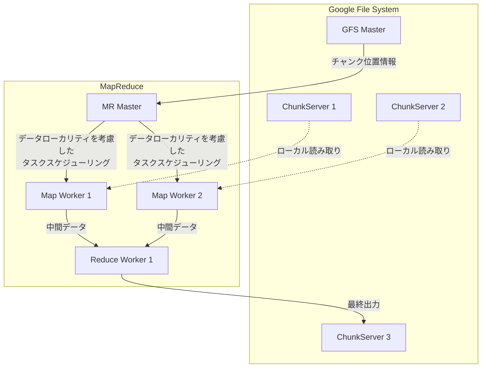

## はじめに — なぜ MapReduce は「革命」と呼ばれるのか

2004 年、Google のジェフ・ディーン (Jeff Dean) とサンジェイ・ゲマワット (Sanjay Ghemawat) は OSDI'04 で "[MapReduce: Simplified Data Processing on Large Clusters](https://research.google/pubs/mapreduce-simplified-data-processing-on-large-clusters/)" を発表しました。この論文は、それまで **一部のエリートエンジニアだけが扱えた大規模分散処理** を、**2つの関数を書くだけで誰でも使える** ものに変えました。

当時の Google は、ウェブクローラが収集した数十ペタバイトのデータを日常的に処理していました。インデックス構築、ページランク計算、アクセスログ分析 — これらはすべて数千台のマシンに処理を分散させる必要がありましたが、その度にエンジニアは以下のような問題に向き合っていました:

- **データの分割と分配**: どうやってデータを均等にマシンに配るか？
- **並列実行の制御**: 数千のプロセスをどう協調させるか？
- **障害復旧**: マシンが壊れたら (そして毎日壊れる) どうするか？
- **ネットワーク帯域の最適化**: テラバイト単位のデータをどう効率的に移動するか？

これらのコードは **計算のロジックそのものとは無関係** なのに、全体のコードの大部分を占めていました。MapReduce の天才的な洞察は、「この"配管工事"をフレームワークに押し込めて、プログラマには本質的な計算だけを書かせよう」というものでした。

<MapReduceTimeline />

## MapReduce 以前の世界

MapReduce の革新性を理解するには、それ以前の分散処理がどれほど大変だったかを知る必要があります。

### MPI (Message Passing Interface) の時代

2000 年代初頭、大規模計算には MPI (Message Passing Interface) が使われていました。MPI は強力ですが、プログラマに **すべて** を要求します:

```c
// MPI による Word Count (疑似コード) — 地獄のような複雑さ
MPI_Init(&argc, &argv);
MPI_Comm_rank(MPI_COMM_WORLD, &rank);
MPI_Comm_size(MPI_COMM_WORLD, &size);

// 手動でデータを分割
if (rank == 0) {
    // マスターがファイルを読み、各ワーカーにチャンクを送信
    for (int i = 1; i < size; i++) {
        MPI_Send(chunk[i], chunk_size, MPI_CHAR, i, 0, MPI_COMM_WORLD);
    }
}

// 各ワーカーがローカルで処理
MPI_Recv(my_chunk, chunk_size, MPI_CHAR, 0, 0, MPI_COMM_WORLD, &status);
local_count = count_words(my_chunk);

// 結果をマスターに集約 — 一体何通りのエラーが起こりうる？
MPI_Reduce(&local_count, &global_count, 1, MPI_INT, MPI_SUM, 0, MPI_COMM_WORLD);

// ワーカーが死んだら？ → プログラマが全部書く
// ネットワークが遅延したら？ → プログラマが全部書く
// データが偏ったら？ → プログラマが全部書く
MPI_Finalize();
```

このコードは動きますが、**障害対応のコードが一切ない**ことに注目してください。1000 台のクラスタで 1 台でも落ちたら最初からやり直し。Google 規模では「マシンが落ちない」前提は通用しません。

### Google 社内の苦悩

MapReduce 論文の Introduction には、Google 社内の状況について次のように記述されています:

> 当初、計算の概念は単純だが、入力データが膨大で、合理的な時間内に計算を終えるためには数百〜数千台のマシンに分散させる必要があった。並列化・データ分散・障害処理の複雑さにより、本来単純であるはずの計算が大量の複雑なコードで覆い隠されていた。
>
> (意訳: 論文 Section 1 より)

この **「インフラと計算の分離」** こそが MapReduce が解決した根本的な問題です。

<MapReduceComparison />

## プログラミングモデル — 美しいほどシンプル

MapReduce のプログラミングモデルは、関数型プログラミングの `map` と `fold` (reduce) から着想を得ています。全ての計算は 2 つの関数で表現されます:

```text
map    (k1, v1)       → list(k2, v2)
reduce (k2, list(v2)) → list(k3, v3)
```

### map 関数

**入力**: キーと値のペア `(k1, v1)`（例: ファイル名と内容）

**出力**: 中間キーと値のペアのリスト `list(k2, v2)`

**責務**: 入力データから必要な情報を抽出し、中間キーでラベル付けする

### reduce 関数

**入力**: 中間キーと、そのキーに対応する全ての値のリスト `(k2, list(v2))`

**出力**: 最終的な結果 `list(k3, v3)`

**責務**: 同じキーに紐づく値を集約して最終結果を生成する

### Word Count — "Hello, World!" of MapReduce

最も有名な MapReduce プログラムは Word Count です。Google の論文でも最初の例として登場します:

```python
# map 関数
def map(filename: str, contents: str):
    for word in contents.split():
        emit(word, 1)

# reduce 関数
def reduce(word: str, counts: list[int]):
    emit(word, sum(counts))
```

たった **6 行** です。この 6 行で、ペタバイト規模のデータを数千台のマシンで並列処理できます。分散処理・障害復旧・データ転送は全てフレームワークが担当します。

<MapReduceVisualizer />

### 他の応用例

MapReduce は Word Count だけではありません。この単純なモデルで驚くほど多様な計算が表現できます:

#### 分散 grep

```python
def map(filename, contents):
    for line in contents.split('\n'):
        if pattern.match(line):
            emit(filename, line)

def reduce(filename, lines):
    for line in lines:
        emit(filename, line)
```

#### URL アクセス頻度の集計

```python
def map(logfile, log_entry):
    url = parse_url(log_entry)
    emit(url, 1)

def reduce(url, counts):
    emit(url, sum(counts))
```

#### 逆リンクグラフの構築 (ウェブ検索の基礎)

```python
def map(url, page_content):
    for target_url in extract_links(page_content):
        emit(target_url, url)  # target ← source の関係

def reduce(target_url, source_urls):
    emit(target_url, list(source_urls))
```

#### 転置インデックスの構築 (検索エンジンの心臓部)

```python
def map(doc_id, contents):
    for word in tokenize(contents):
        emit(word, doc_id)

def reduce(word, doc_ids):
    emit(word, sorted(set(doc_ids)))
```

このように、map と reduce の 2 つの関数の「中身」を変えるだけで、全く異なる計算ができます。**フレームワーク側のコードは一切変更する必要がありません**。

## 実行モデルの内部実装

論文の図 1 に相当する、MapReduce の実行フローを詳しく見ていきましょう。

### 全体の流れ

```mermaid
flowchart LR
    subgraph Input["入力 (GFS)"]
        I1[Split 0]
        I2[Split 1]
        I3[Split 2]
        I4[Split ...]
    end

    subgraph MapPhase["Map Phase"]
        M1[Worker 1<br/>map&#40;&#41;]
        M2[Worker 2<br/>map&#40;&#41;]
        M3[Worker 3<br/>map&#40;&#41;]
    end

    subgraph Shuffle["Shuffle"]
        S1[Partition &<br/>Sort by Key]
    end

    subgraph ReducePhase["Reduce Phase"]
        R1[Worker A<br/>reduce&#40;&#41;]
        R2[Worker B<br/>reduce&#40;&#41;]
    end

    subgraph Output["出力 (GFS)"]
        O1[Output 0]
        O2[Output 1]
    end

    I1 --> M1
    I2 --> M2
    I3 --> M3
    I4 --> M3

    M1 --> S1
    M2 --> S1
    M3 --> S1

    S1 --> R1
    S1 --> R2

    R1 --> O1
    R2 --> O2
```



### Step 1: 入力の分割 (Splitting)

ユーザープログラムは入力データを M 個の **スプリット** (通常 16〜64 MB) に分割します。これは GFS のブロックサイズに合わせています。

**なぜ 64 MB なのか？** GFS (Google File System) はデータを 64 MB のチャンクに分割して保存します。スプリットサイズを GFS のチャンクサイズに合わせることで、**データローカリティ** — つまりデータが保存されているマシンで処理を実行する — を最大化します。ネットワーク越しにデータを転送するよりも、ローカルディスクから読む方が遥かに高速です。

### Step 2: Master の起動

フレームワークは複数のプログラムのコピーをクラスタ上に起動します。その 1 つが **Master** になり、残りは **Worker** です。Master は Map タスク M 個と Reduce タスク R 個があり、これらを idle な Worker に割り当てます。

```go
// Master のタスク管理（概念的なコード）
type Master struct {
    mapTasks    []Task    // M 個の Map タスク
    reduceTasks []Task    // R 個の Reduce タスク
    workers     []Worker  // 利用可能な Worker
}

type Task struct {
    State    TaskState  // idle | in-progress | completed
    WorkerID int        // 割り当てられた Worker
    Input    string     // 入力ファイルの場所
}

func (m *Master) schedule() {
    for _, task := range m.mapTasks {
        if task.State == Idle {
            worker := m.findIdleWorker()
            // データローカリティを考慮: データがローカルにある Worker を優先
            task.assign(worker)
        }
    }
}
```

### Step 3: Map フェーズ

Map Worker は入力スプリットを読み込み、ユーザー定義の map 関数を各レコードに適用し、中間キー/値ペアをメモリにバッファリングします。

バッファリングされたペアは定期的にローカルディスクに書き出され、**パーティション関数** (デフォルトは `hash(key) mod R`) によって R 個の領域に分割されます。ローカルディスク上の中間ファイルの位置が Master に報告されます。

```text
Map Worker のディスク上のファイル:
  /tmp/mr-0-0  (Partition 0 の中間データ)
  /tmp/mr-0-1  (Partition 1 の中間データ)
  ...
  /tmp/mr-0-(R-1)  (Partition R-1 の中間データ)
```

**重要なポイント**: Map の出力は GFS ではなく **ローカルディスク** に書かれます。なぜなら中間データは一時的なものであり、Shuffle フェーズで Reducer に転送された後は不要になるからです。ただし、これは Worker 障害時に Map タスクの再実行が必要になるトレードオフでもあります。

### Step 4: Shuffle & Sort — 隠れた心臓部

Shuffle フェーズは MapReduce の中で **最もコストが高く、最も重要** な部分です。

Reduce Worker は、Master から通知された場所情報を使って、全ての Map Worker のローカルディスクから自分に該当するパーティションのデータを RPC で読み取ります。

全てのデータを読み終えたら、中間キーでソートします。これにより同じキーを持つレコードがグループ化されます。ソートが必要なのは、通常は多くの異なるキーが同じ Reduce タスクにマッピングされるからです。

```text
Shuffle のネットワーク転送量:
  M 個の Map * R 個の Reduce のパーティション = 最大 M×R 回のネットワーク転送

  例: M=10,000, R=5,000 の場合
      → 最大 50,000,000 回のネットワーク呼び出し
      → これが MapReduce のボトルネック
```

**Combiner による最適化**: ネットワーク転送量を削減するため、Map 側で **Combiner** 関数を実行できます。Combiner は Reduce と同じロジックですが、ローカルの Map 出力に対して実行されます。例えば Word Count なら、ネットワークに `(hello, 1), (hello, 1), (hello, 1)` と 3 つ送る代わりに、Combiner で `(hello, 3)` に集約してから送ります。

### Step 5: Reduce フェーズ

Reduce Worker はソート済みの中間データを走査し、ユニークな中間キーごとにキーと対応する値のセットをユーザーの reduce 関数に渡します。reduce 関数の出力は最終出力ファイルに追記されます。

### Step 6: 完了

全ての Map タスクと Reduce タスクが完了したら、Master はユーザープログラムを起動します。この時点で MapReduce の出力は R 個の出力ファイル (各 Reduce タスクに 1 つ) に格納されています。

## アーキテクチャ

<MapReduceArchitecture />

## 「フレームワークに複雑さを押し込む」の実態 — Hadoop のソースコードで見る

「プログラマは map と reduce を書くだけ」という話を聞くと、「じゃあフレームワーク側の実装はどうなっているの？」と疑問に思うのは自然なことです。 Google のオリジナル実装は非公開ですが、Apache Hadoop がフレームワーク側も含めて完全にオープンソースとして公開しています。実際のコードを見ると、この「抽象化」の威力がよくわかります。

### ユーザーが触る API: Mapper.java — ~150 行

ユーザーが継承する [`Mapper.java`](https://github.com/apache/hadoop/blob/trunk/hadoop-mapreduce-project/hadoop-mapreduce-client/hadoop-mapreduce-client-core/src/main/java/org/apache/hadoop/mapreduce/Mapper.java) の本体は驚くほどシンプルです:

```java
// Mapper.java (Apache Hadoop) — 全体で約 150 行 (ライセンスヘッダーと Javadoc 含む)
// https://github.com/apache/hadoop/blob/trunk/.../mapreduce/Mapper.java
public class Mapper<KEYIN, VALUEIN, KEYOUT, VALUEOUT> {

  protected void setup(Context context) throws IOException, InterruptedException {
    // NOTHING
  }

  protected void map(KEYIN key, VALUEIN value, Context context)
      throws IOException, InterruptedException {
    context.write((KEYOUT) key, (VALUEOUT) value);  // デフォルトは恒等関数
  }

  protected void cleanup(Context context) throws IOException, InterruptedException {
    // NOTHING
  }

  public void run(Context context) throws IOException, InterruptedException {
    setup(context);
    try {
      while (context.nextKeyValue()) {
        map(context.getCurrentKey(), context.getCurrentValue(), context);
      }
    } finally {
      cleanup(context);
    }
  }
}
```

Word Count を書く場合、ユーザーが実際にオーバーライドするのは `map()` メソッド **1 つだけ**です。

### フレームワークが隠している実装: MapTask.java — 2,100 行超

一方、このシンプルな `map()` の「裏側」で実際に動いているのが [`MapTask.java`](https://github.com/apache/hadoop/blob/trunk/hadoop-mapreduce-project/hadoop-mapreduce-client/hadoop-mapreduce-client-core/src/main/java/org/apache/hadoop/mapred/MapTask.java) です。このファイルは **2,100 行以上** あり、以下のような処理を含んでいます:

**`MapOutputBuffer` — 循環バッファによるソート・スピル機構** (約 800 行)

```java
// MapTask.java 内の MapOutputBuffer (抜粋)
// https://github.com/apache/hadoop/blob/trunk/.../mapred/MapTask.java
public static class MapOutputBuffer<K, V> implements MapOutputCollector<K, V>, IndexedSortable {
    private IntBuffer kvmeta;    // メタデータ用の循環バッファ
    byte[] kvbuffer;             // シリアライズデータ用のメインバッファ
    int kvstart, kvend, kvindex; // メタデータの境界管理
    int equator;                 // メタ領域とデータ領域の境界点
    int bufstart, bufend, bufmark, bufindex, bufvoid; // バッファポインタ群

    final ReentrantLock spillLock = new ReentrantLock();
    final Condition spillDone = spillLock.newCondition();
    final Condition spillReady = spillLock.newCondition();
    // ...

    // ユーザーの map() から emit された KV ペアを受け取る
    public synchronized void collect(K key, V value, final int partition)
        throws IOException {
      // バッファ残量チェック → 足りなければスピルを開始
      bufferRemaining -= METASIZE;
      if (bufferRemaining <= 0) {
        spillLock.lock();
        try {
          // スピルスレッドとの協調ロジック (数十行のバッファ管理)
          // ...
        } finally {
          spillLock.unlock();
        }
      }
      // キーとバリューをバッファにシリアライズ
      keySerializer.serialize(key);
      valSerializer.serialize(value);
      // メタデータ (パーティション, オフセット) を記録
      kvmeta.put(kvindex + PARTITION, partition);
      kvmeta.put(kvindex + KEYSTART, keystart);
      // ...
    }

    // ソートしてディスクにスピル
    private void sortAndSpill() throws IOException {
      // QuickSort でパーティション→キー順にソート
      sorter.sort(MapOutputBuffer.this, mstart, mend, reporter);
      // 各パーティションの中間データを IFile 形式で書き出し
      for (int i = 0; i < partitions; ++i) {
        Writer<K, V> writer = new Writer<>(job, partitionOut, keyClass, valClass, codec, ...);
        if (combinerRunner == null) {
          // Combiner なし: 直接書き出し
        } else {
          // Combiner あり: ローカル集約してから書き出し
          combinerRunner.combine(kvIter, combineCollector);
        }
      }
    }

    // 複数のスピルファイルをマージ
    private void mergeParts() throws IOException {
      // N 個のスピルファイルを k-way マージ
      for (int parts = 0; parts < partitions; parts++) {
        RawKeyValueIterator kvIter = Merger.merge(job, rfs, keyClass, valClass, ...);
        // マージ結果を最終出力ファイルに書き出し
      }
    }
}
```

さらに `MapTask.java` には以下も含まれています:

- **`SpillThread`** — バックグラウンドでバッファ→ディスクのスピルを行うスレッド (ReentrantLock + Condition で同期)
- **`TrackedRecordReader`** — 入力バイト数・レコード数のカウンター管理
- **`SkippingRecordReader`** — 不正レコードのスキップと記録
- **`NewOutputCollector`** — パーティション関数の適用とバッファへの振り分け
- **`BlockingBuffer`** — スピル中の書き込みブロッキング制御

**つまり**: ユーザーが `context.write(word, 1)` と 1 行書くだけで、裏では循環バッファへのシリアライズ → バッファ満杯の検知 → バックグラウンドスレッドによるソート → パーティション別のディスク書き出し → Combiner の適用 → 最終的な k-way マージ、という一連の処理が動いています。これがまさに「フレームワークに複雑さを押し込んだ」の実態です。

### 行数の比較

```text
ユーザーが書くコード:
  Mapper.java     ~150 行   (うち map() は 3 行、残りは Javadoc)
  Reducer.java    ~180 行   (うち reduce() も 3 行)

フレームワーク側 (Map フェーズだけ):
  MapTask.java    ~2,100 行  (バッファ管理, ソート, スピル, マージ)
  ReduceTask.java ~650 行   (Shuffle, ソート, マージ)
  Merger.java     ~870 行   (k-way マージソート)
  IFile.java      ~500 行   (中間ファイルフォーマット)
  合計            ~4,100 行+
```

ユーザーコードの **12 倍以上** のフレームワークコードが、分散処理の複雑さを隠蔽しています。しかもこれは Map フェーズの中核ファイルだけの数字であり、ジョブスケジューリングや Shuffle のネットワーク転送層を含めるとさらに桁違いに膨れ上がります。

## 耐障害性 — なぜ数千台で動くのか

MapReduce が真に革新的だったのは、プログラミングモデルの美しさだけではありません。**数千台のコモディティハードウェア上で信頼性を確保する仕組み** です。

### Google の現実

Google の 2003 年の環境では:

- クラスタあたり **1,800 台** のマシン
- 各マシンに 2 GHz Intel Xeon プロセッサ × 2 基 (Hyper-Threading 対応)、4 GB メモリ、160 GB IDE ディスク × 2 本
- ネットワークはギガビットイーサネット (1 Gbps)
- 障害は日常的に発生（ディスク、メモリ、ネットワーク等）

つまり、1,800 台のクラスタでは **毎日のように何かが壊れます**。1 台が壊れるたびにジョブを最初からやり直していては、大規模ジョブは永遠に完了しません。

<FaultToleranceDiagram />

### Worker 障害の詳細

Master は定期的に全 Worker に ping を送ります。一定時間応答がなければ、その Worker は障害と判断されます。

**Map Worker が壊れた場合:**

1. その Worker が **実行中** の Map タスクを `idle` に戻し、再スケジュール
2. その Worker が **完了済み** の Map タスクも `idle` に戻し、再実行を予約
3. なぜ完了済みの Map まで再実行？ → Map の出力はローカルディスクにあるため、Worker が壊れるとアクセスできなくなるから
4. Map タスクが Worker A から Worker B に再スケジュールされたら、まだそのデータを読んでいない全 Reduce Worker に通知

**Reduce Worker が壊れた場合:**

1. その Worker が **実行中** の Reduce タスクだけを `idle` に戻し、再スケジュール
2. **完了済み** の Reduce タスクは再実行不要 → 出力は GFS (グローバルなファイルシステム) に保存されているため

### 決定性と原子的コミット

MapReduce は完了した Map と Reduce タスクに対して **原子的コミット** を保証します。

- Map タスク: Worker は一時ファイルに出力を書き、完了時に Master にファイル名を報告。Master は既に完了を受け取っていたら無視 (冪等性)
- Reduce タスク: Worker は一時ファイルに出力を書き、完了時に一時ファイルを最終出力ファイルにアトミックにリネーム。GFS のリネームがアトミックであることを利用

map と reduce 関数が **決定的** (同じ入力に対して常に同じ出力) であれば、分散実行の結果は逐次実行と同じになります。非決定的な場合でも、個々の Reduce タスクの出力は何らかの逐次実行の結果と等しくなります。

### Straggler 対策: 投機的実行

MapReduce ジョブの実行時間を大幅に増加させる原因の 1 つが **Straggler** — 最後の数個のタスクが異常に遅いことです。原因は様々です:

- **ディスクの劣化**: 読み書き速度が通常の 1/10 以下に
- **CPU の過負荷**: 同じマシンで他のタスクが実行中
- **ネットワーク輻輳**: 特定のラック間の帯域が飽和
- **クラッシュした訳ではない** ので障害検知されない

Google の解決策は **バックアップタスク** (投機的実行) です。ジョブの終盤 (残タスクが少なくなった時点) で、まだ実行中の全タスクのバックアップコピーを別のマシンで起動します。元のタスクかバックアップか、先に完了した方の結果を採用します。

論文によれば、バックアップタスクを無効化すると、ジョブ完了時間が **44% 増加** しました。

## パフォーマンス特性

MapReduce の効率を決定する主要な要因を理解しておくことは重要です。

### データローカリティ

ネットワーク帯域が希少資源であるため、MapReduce は入力データが保存されているマシン (またはそのラック) で Map タスクを実行しようとします。GFS は各チャンクを (通常 3 ヵ所に) レプリケートしており、Master はそのレプリカ情報を活用してスケジューリングします。

Google の大規模な MapReduce ジョブでは、入力データの大部分がローカルに読まれており、ネットワーク帯域をほとんど消費しません。

### Combiner と帯域幅の最適化

先述の Combiner は、Shuffle フェーズのネットワーク転送量を劇的に削減します。Word Count の例では:

```text
Combiner なし: 各 Mapper が (the, 1) を何千回も送信
Combiner あり: 各 Mapper が (the, 4832) のように事前集約して送信

転送データ量: 数桁のオーダーで削減可能
```

Combiner は reduce 関数が **交換法則** と **結合法則** を満たす場合に使えます。sum, max, min などは使えますが、平均は直接は使えません (分子と分母を別々に Combine する必要がある)。

### パーティション関数のカスタマイズ

デフォルトのパーティション関数は `hash(key) mod R` ですが、ユースケースによってはカスタマイズが必要です。例えば、出力キーが URL で、同じホストの URL を同じ出力ファイルにまとめたい場合:

```python
def partition(key: str, num_reducers: int) -> int:
    hostname = urlparse(key).hostname
    return hash(hostname) % num_reducers
```

## 論文の実験結果

論文では 2 つのベンチマークが報告されています:

### Grep

$10^{10}$ 個の 100 バイトレコード (約 1 TB) から特定の 3 文字パターンを検索:

- **1,764 台** の Worker マシン
- 入力を 64 MB のスプリット 15,000 個に分割 ($M = 15000$)
- 起動オーバーヘッド (プログラムの配信、GFS のオープン、ローカリティ情報の取得) に約 60 秒
- 全体で **約 150 秒** で完了

### Sort

$10^{10}$ 個の 100 バイトレコード (約 1 TB) をソート:

- **1,764 台** の Worker マシン
- $M = 15000$, $R = 4000$
- 全体で **約 891 秒** (約 15 分) で完了
- Straggler の影響で長くなっているが、バックアップタスクにより大幅に改善

## GFS との共生関係

MapReduce は単体では成立しません。Google File System (GFS) との **共生関係** が不可欠です。



### GFS が提供するもの

1. **大容量ストレージ**: コモディティサーバーの組み合わせでペタバイト規模
2. **レプリケーション**: 各チャンクを 3 ヵ所に複製し、可用性を確保
3. **チャンク位置情報**: Map タスクのスケジューリングに使うデータローカリティ情報
4. **アトミックなリネーム**: Reduce 出力の原子的コミットに利用

### MapReduce が GFS に求める特性

- **高スループットの逐次読み書き** (ランダムアクセスは不要)
- **Append 操作の効率性** (中間データの書き出し)
- **大きなファイル** に最適化 (小さなファイルは苦手)

この設計哲学は後に **HDFS** (Hadoop Distributed File System) として Yahoo! によってオープンソース実装されます。

## MapReduce が生んだエコシステム

MapReduce が生んだのは 1 つのフレームワークだけではありません。**ビッグデータ処理の全エコシステム** を生み出しました。

### 直系の子孫: Hadoop

2006 年に Doug Cutting と Mike Cafarella が Apache Hadoop として MapReduce + GFS をオープンソース化しました (Yahoo! がサポート)。HDFS + Hadoop MapReduce の組み合わせは、Google 以外の企業でもペタバイト規模のデータ処理を可能にしました。

Hadoop エコシステムは急速に拡大し:

- **Hive**: MapReduce 上の SQL インターフェース (Facebook 開発)
- **Pig**: MapReduce 上のデータフロー言語 (Yahoo! 開発)
- **HBase**: Bigtable のオープンソース実装 (HDFS 上で動作)
- **ZooKeeper**: 分散協調サービス

### MapReduce の限界

しかし、時間とともに MapReduce の限界も明らかになりました:

**1. 反復処理の非効率性**

機械学習のアルゴリズム (k-means, PageRank, 勾配降下法) は本質的に反復的です。MapReduce では各反復が 1 つのジョブになり、中間結果は毎回ディスクに書き出されます:

```text
反復 1: 読み込み → Map → Shuffle → Reduce → ディスクに書き出し
反復 2: ディスクから読み込み → Map → Shuffle → Reduce → ディスクに書き出し
反復 3: ディスクから読み込み → Map → Shuffle → Reduce → ディスクに書き出し
...
```

各反復でディスク I/O が発生し、非常に遅くなります。

**2. インタラクティブクエリへの不適合**

MapReduce ジョブの起動オーバーヘッドは数十秒。アドホッククエリには向きません。

**3. 表現力の制約**

全ての計算を map → shuffle → reduce のパイプラインに落とし込む必要がある。複雑な DAG (有向非巡回グラフ) は複数の MapReduce ジョブのチェインで表現するしかなく、非効率。

**4. Shuffle の固定的なパターン**

全ての Map 出力が必ず Shuffle を経由する。不要な場合でもオーバーヘッドが発生。

### 後継技術

#### Apache Spark (2010〜)

UC Berkeley の AMPLab で開発された Spark は、**RDD (Resilient Distributed Dataset)** という概念を導入し、中間データをメモリに保持できるようにしました:

```python
# Spark による Word Count — データがメモリに残る
text = sc.textFile("hdfs://input")
counts = text.flatMap(lambda line: line.split()) \
             .map(lambda word: (word, 1)) \
             .reduceByKey(lambda a, b: a + b)
counts.saveAsTextFile("hdfs://output")
```

- 反復処理で **10〜100 倍** の高速化
- DAG ベースの実行エンジン (map → reduce の固定パイプラインではない)
- インタラクティブシェル (Spark Shell) でアドホッククエリ

#### Apache Flink (2014〜)

ストリーム処理をネイティブサポート。バッチ処理をストリーム処理の特殊ケースとして扱う。

#### Google Cloud Dataflow / Apache Beam (2014–2016〜)

Google 自身が MapReduce の後継として開発 (Dataflow SDK 2014年、Apache Beam 初期リリース 2016年)。バッチとストリーミングを統一したモデル。

```python
# Apache Beam — バッチもストリームも同じコード
import apache_beam as beam

with beam.Pipeline() as p:
    (p
     | beam.io.ReadFromText('input.txt')
     | beam.FlatMap(lambda line: line.split())
     | beam.combiners.Count.PerElement()
     | beam.io.WriteToText('output'))
```

## MapReduce の思想的遺産

MapReduce は技術的にはもはやレガシーですが、その **思想** は現代のデータ処理基盤に深く根付いています:

### 1. 抽象化による民主化

「分散処理の複雑さをフレームワークに押し込め、ユーザーにはシンプルなインターフェースだけを見せる」

この思想は Spark、Flink、Beam、さらには Kubernetes のような汎用オーケストレータにまで引き継がれています。

### 2. データローカリティの原則

「データを計算に持っていくのではなく、計算をデータに持っていく」

クラウドの時代では計算とストレージが分離されがちですが、この原則は依然としてパフォーマンスチューニングの基本です。

### 3. 障害は例外ではなく常態

「大規模システムでは障害は必ず起きる。設計段階で障害を前提とすべきである」

この考え方は後に Google の SRE (Site Reliability Engineering) の哲学となり、Netflix の Chaos Monkey のような手法に発展しました。

### 4. シンプルなモデルのスケーラビリティ

「制約のあるシンプルなモデルの方が、何でもできる複雑なモデルよりもスケールしやすい」

MapReduce は MPI のように「任意の通信パターン」を許さない代わりに、フレームワークが最適化できる余地を大きく確保しています。

## まとめ

MapReduce は 2004 年に Google から発表され、**コモディティハードウェア上の大規模データ処理を民主化** しました。

- **プログラミングモデル**: `map()` と `reduce()` の 2 関数だけで分散計算を表現
- **実装**: Master-Worker アーキテクチャ、GFS との統合、自動分割・スケジューリング
- **耐障害性**: Worker 障害時の自動再実行、Straggler への投機的実行
- **歴史的意義**: Hadoop エコシステムの誕生からビッグデータ時代を切り拓いた

現在では Spark や Flink に取って代わられましたが、MapReduce が確立した **「計算とインフラの分離」「障害を前提とした設計」「シンプルな抽象化による大規模化」** という原則は、2026 年の現在も分散システム設計の基礎となっています。

## 参考文献

- Dean, J., & Ghemawat, S. (2004). [MapReduce: Simplified Data Processing on Large Clusters](https://research.google/pubs/mapreduce-simplified-data-processing-on-large-clusters/). OSDI'04.
- Ghemawat, S., Gobioff, H., & Leung, S.-T. (2003). [The Google File System](https://research.google/pubs/the-google-file-system/). SOSP'03.
- Zaharia, M., et al. (2010). [Spark: Cluster Computing with Working Sets](https://www.usenix.org/legacy/event/hotcloud10/tech/full_papers/Zaharia.pdf). HotCloud'10.
- White, T. (2015). *Hadoop: The Definitive Guide*. O'Reilly Media.
