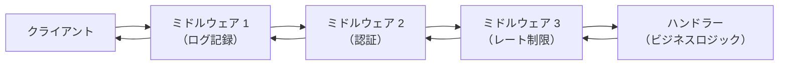
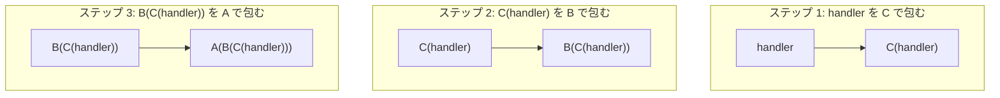
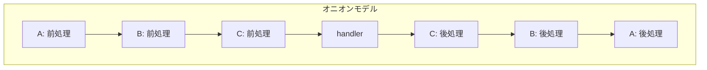
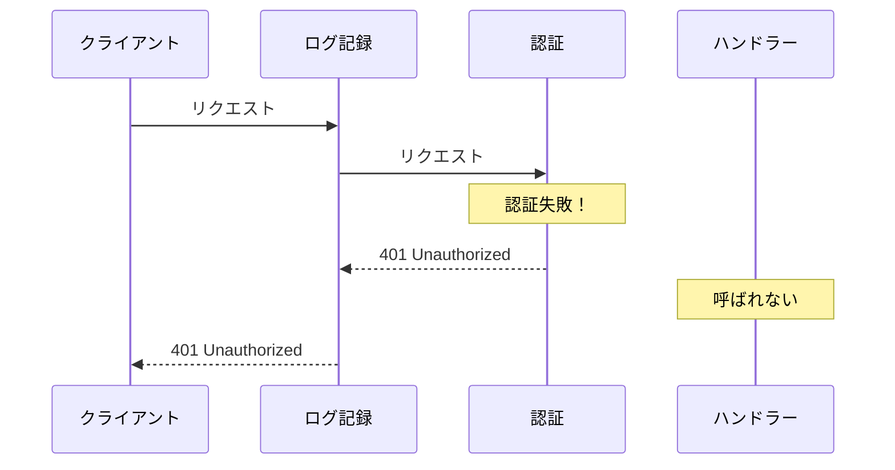
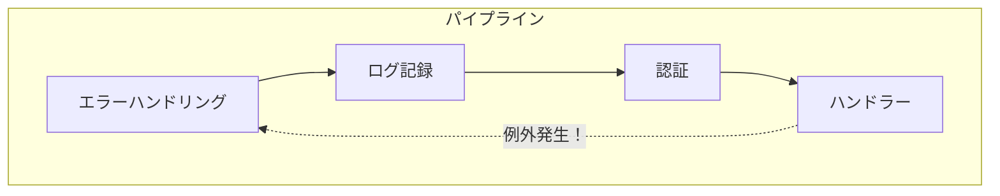

## はじめに

Express.js の `next()`、Django の `get_response`、ASP.NET Core の `Use()` / `Run()`、Go の `http.Handler` ラッパー——Web フレームワークの世界では、あらゆるフレームワークが「ミドルウェアチェーン」と呼ばれるアーキテクチャパターンを採用しています。

ミドルウェアチェーンとは、HTTP リクエストとレスポンスの処理パイプラインに、複数の処理（認証・ログ記録・エラーハンドリングなど）を**着脱自在に差し込める**仕組みです。フレームワークのユーザーとして使うだけなら表面的な API を知っていれば十分ですが、「なぜ `next()` を呼ぶ必要があるのか」「なぜミドルウェアの登録順序が重要なのか」を本質的に理解するには、**自分で実装してみる**のが最善の方法です。

この記事では、ミドルウェアチェーンを **Python でゼロから実装** し、その設計原理を徹底的に理解します。実装後に Express.js・Django・ASP.NET Core・Go の実際のミドルウェア API を見て、「この `next()` は自分が実装したあの仕組みだ」と理解できるようになることを目標とします。

### この記事で学ぶこと

1. ミドルウェアチェーンの核心——関数合成と `next` の正体
2. GoF デザインパターンとの関係（Chain of Responsibility、Decorator）
3. Python でのゼロからの実装
4. オニオンモデル（玉ねぎモデル）——リクエストとレスポンスの対称性
5. ショートサーキット（短絡）——パイプラインの早期終了
6. エラーハンドリングミドルウェア
7. ミドルウェアの合成と実行順序
8. 実フレームワークの実装比較（Express.js / Django / ASP.NET Core / Go）
9. テスト戦略

### 対象読者

- Web フレームワークのミドルウェアを使ったことはあるが、内部の仕組みを深く理解したい人
- デザインパターンを実践的に学びたい人
- Python の基本文法（関数、クラス、デコレータ）を理解している人

### ミドルウェアがない世界——動機となる問題

ミドルウェアチェーンの価値を理解するために、まず「ミドルウェアがない世界」を想像してみましょう。

```python
def handle_users(request):
    # ログ記録（コピペ 1/3）
    print(f"{request.method} {request.path}")
    # 認証チェック（コピペ 1/3）
    if "Authorization" not in request.headers:
        return Response(status=401, body="Unauthorized")
    # エラーハンドリング（コピペ 1/3）
    try:
        return Response(status=200, body="User list")
    except Exception:
        return Response(status=500, body="Internal Server Error")


def handle_orders(request):
    # ログ記録（コピペ 2/3）
    print(f"{request.method} {request.path}")
    # 認証チェック（コピペ 2/3）
    if "Authorization" not in request.headers:
        return Response(status=401, body="Unauthorized")
    # エラーハンドリング（コピペ 2/3）
    try:
        return Response(status=200, body="Order list")
    except Exception:
        return Response(status=500, body="Internal Server Error")


def handle_products(request):
    # ログ記録（コピペ 3/3）
    print(f"{request.method} {request.path}")
    # 認証チェック（コピペ 3/3）
    if "Authorization" not in request.headers:
        return Response(status=401, body="Unauthorized")
    # エラーハンドリング（コピペ 3/3）
    try:
        return Response(status=200, body="Product list")
    except Exception:
        return Response(status=500, body="Internal Server Error")
```

この例では、ログ記録・認証チェック・エラーハンドリングという<strong>横断的関心事</strong>（cross-cutting concerns）が、すべてのハンドラーにコピペされています。ハンドラーが3つならまだ許容できますが、50、100と増えるとどうなるでしょうか？

- ログ出力フォーマットを変更するには、全ハンドラーを grep して修正する必要がある
- 認証ロジックにバグがあれば、全ハンドラーに同じ修正を適用しなければならない
- 新しいハンドラーを追加するたびに、これらの「定型処理」をコピペする（し忘れるリスクも）

ミドルウェアチェーンは、この<strong>横断的関心事をハンドラーから分離</strong>し、パイプラインとして一箇所にまとめることで、この問題を根本的に解決します。最終的に各ハンドラーは、自分のビジネスロジックだけに集中できるようになります：

```python
# ミドルウェアチェーンがあれば、ハンドラーはビジネスロジックだけ
def handle_users(request):
    return Response(status=200, body="User list")

def handle_orders(request):
    return Response(status=200, body="Order list")

def handle_products(request):
    return Response(status=200, body="Product list")

# 横断的関心事はミドルウェアとして1箇所で定義
app = compose(router, [error_handling, logging, auth])
```

この「関心の分離」がなぜ、どのように実現されるのか——これからゼロから実装しながら明らかにしていきます。

## 第1章：ミドルウェアとは何か

### 基本的な定義

ミドルウェアとは、リクエストとレスポンスの間に挟まる**処理レイヤー**です。

- リクエストを受け取り
- 何らかの処理を行い（ログ記録、認証チェック、ヘッダー追加など）
- 次のミドルウェアに処理を委譲するか、自分でレスポンスを生成して返す

Express.js の公式ドキュメントには、ミドルウェアの能力として以下の4つが挙げられています：

1. 任意のコードを実行する
2. リクエストオブジェクトとレスポンスオブジェクトを変更する
3. リクエスト・レスポンスサイクルを終了する
4. スタック内の次のミドルウェア関数を呼び出す

### なぜ「チェーン」なのか

複数のミドルウェアは**一列に連結**され、リクエストは先頭から順に通過します。各ミドルウェアは「次のミドルウェアを呼ぶ（`next()`）」か「自分で応答を返す（ショートサーキット）」かを選択できます。



矢印が**往復**していることに注目してください。リクエストは左から右に流れ、レスポンスは右から左に戻ります。これがミドルウェアチェーンの本質であり、**オニオンモデル**（玉ねぎモデル）と呼ばれる所以です。

## 第2章：デザインパターンのルーツ

### GoF の Chain of Responsibility パターン

ミドルウェアチェーンは、GoF（Gang of Four）の <strong>Chain of Responsibility パターン</strong>に根ざしています。このパターンの定義は以下の通りです：

> 「リクエストの送信者と受信者の結合を避け、複数のオブジェクトにリクエストを処理する機会を与える。リクエストはチェーン上の各オブジェクトを渡り歩き、いずれかのオブジェクトが処理するまで転送される。」— Gang of Four, Design Patterns (1994)


ただし、GoF の定義と Web ミドルウェアには重要な違いがあります。

| 特性 | GoF Chain of Responsibility | Web ミドルウェアチェーン |
|------|---------------------------|----------------------|
| 処理するハンドラーの数 | チェーン内の1つだけ | 全員が処理に関与できる |
| 処理の方向 | 単方向（リクエストのみ） | 双方向（リクエスト＋レスポンス） |
| 委譲の意味 | 「自分では処理できない」 | 「次の処理に進む」 |

### Decorator パターンとの類似性

Wikipedia の記述にもある通り、Chain of Responsibility は構造的に <strong>Decorator パターン</strong>とほぼ同一です。Decorator パターンでは、各デコレータがラップ対象に追加の振る舞いを付加し、処理を委譲します。Web ミドルウェアはまさにこの Decorator 的な振る舞い——「前処理 → 委譲 → 後処理」——を行います。

つまり、Web ミドルウェアチェーンは <strong>Chain of Responsibility と Decorator のハイブリッド</strong>です。

## 第3章：核心の抽象——`next` の正体

### `next` とは関数合成である

ミドルウェアチェーンの核心を一言で表すと、**関数合成**です。

各ミドルウェアは「次の処理」を表す関数を受け取り、それを呼ぶか呼ばないかを選択します。「次の処理」は「その先のミドルウェア + 最終ハンドラー」を1つの関数にまとめたものです。

Python で最もシンプルに表現すると、こうなります：

```python
from __future__ import annotations

from dataclasses import dataclass, field
from collections.abc import Callable


# ──────────────────────────────────────────────
# リクエストとレスポンスの型定義
# ──────────────────────────────────────────────

@dataclass
class Request:
    """HTTP リクエストを模倣するシンプルなデータクラス。"""
    method: str = "GET"
    path: str = "/"
    headers: dict[str, str] = field(default_factory=dict)
    body: str = ""


@dataclass
class Response:
    """HTTP レスポンスを模倣するシンプルなデータクラス。"""
    status: int = 200
    headers: dict[str, str] = field(default_factory=dict)
    body: str = ""


# ──────────────────────────────────────────────
# 型エイリアス
# ──────────────────────────────────────────────

# Handler: リクエストを受け取りレスポンスを返す関数
Handler = Callable[[Request], Response]

# Middleware: 次のハンドラーを受け取り、新しいハンドラーを返す関数
Middleware = Callable[[Handler], Handler]
```

ここが最も重要なポイントです：

- `Handler` は「リクエスト → レスポンス」の関数
- `Middleware` は「ハンドラーを受け取って、新しいハンドラーを返す」**高階関数**

`Middleware` のシグネチャ `Callable[[Handler], Handler]` が何を意味するか、具体例で見てみましょう。

### 最初のミドルウェアを書く

ログ記録ミドルウェアを実装します：

```python
def logging_middleware(next_handler: Handler) -> Handler:
    """リクエストとレスポンスをログ出力するミドルウェア。"""
    def handler(request: Request) -> Response:
        # ── 前処理（リクエストがハンドラーに届く前） ──
        print(f"--> {request.method} {request.path}")

        # ── next を呼ぶ ──
        response = next_handler(request)

        # ── 後処理（レスポンスがクライアントに返る前） ──
        print(f"<-- {response.status}")

        return response

    return handler
```

この関数の構造を理解することが、ミドルウェアチェーン全体を理解する鍵です：

1. `next_handler` を引数として受け取る（= 「次の処理」への参照）
2. 新しい `handler` 関数を定義して返す
3. その `handler` の中で：
   - `next_handler` を呼ぶ**前**に前処理を行う
   - `next_handler(request)` を呼んで処理を委譲する
   - `next_handler` が返した**後**に後処理を行う

`next_handler` は「自分の次にあるミドルウェア + その先の全ミドルウェア + 最終ハンドラー」が1つにまとまったものです。これが `next` の正体です。

### なぜ `next_handler` が保持されるのか——クロージャの仕組み

`logging_middleware(some_handler)` が呼ばれると、内部の `handler` 関数が返されます。しかし、`handler` は引数として `some_handler` を受け取っていません。それなのに、後から `handler(request)` が呼ばれたとき、なぜ `next_handler` にアクセスできるのでしょうか？

答えは<strong>クロージャ</strong>（closure）です。Python では、内側の関数が外側の関数のローカル変数を参照すると、その変数は内側の関数に「閉じ込められ」ます。

```python
def logging_middleware(next_handler: Handler) -> Handler:
    #           ↑ next_handler はここでローカルスコープに入る

    def handler(request: Request) -> Response:
        #     ↑ handler は next_handler を「キャプチャ」している
        print(f"--> {request.method} {request.path}")
        response = next_handler(request)  # ← クロージャ経由でアクセス
        print(f"<-- {response.status}")
        return response

    return handler
    # ← logging_middleware のスタックフレームが終了しても、
    #    handler が next_handler への参照を保持し続ける
```

この仕組みがミドルウェアチェーン全体を支えています。`compose` が各ミドルウェアをネストして合成するとき、各レイヤーの `next_handler` はクロージャとして次のレイヤーへの参照を保持します。こうして、すべてのミドルウェアが鎖のようにつながるのです。

> <strong>言語を問わない原理</strong>：クロージャは Python 特有のものではなく、JavaScript、Go、Ruby、Rust など主要な言語のほぼすべてに存在します。Express.js の `next()` が「次のミドルウェア」を知っているのも、Go の `func(http.Handler) http.Handler` がチェーンを構成できるのも、すべてクロージャの力です。

## 第4章：ミドルウェアチェーンの組み立て

### `compose` 関数——チェーンを構築する

複数のミドルウェアを組み立てるには、**逆順に畳み込み**（reduce）を行います。なぜ逆順かというと、最後に登録したミドルウェアが最も内側（ハンドラーに近い側）にラップされるからです。

```python
def compose(handler: Handler, middlewares: list[Middleware]) -> Handler:
    """ミドルウェアのリストを合成して1つのハンドラーにする。

    middlewares = [A, B, C] の場合、実行順序は A -> B -> C -> handler となる。
    内部的には handler を C で包み、それを B で包み、さらに A で包む。
    """
    composed = handler
    for middleware in reversed(middlewares):
        composed = middleware(composed)
    return composed
```

ここで何が起きているかを図で追いましょう：



最終的に得られる `A(B(C(handler)))` は、リクエストを受け取ると：

1. A の前処理 → B の前処理 → C の前処理 → handler （リクエスト方向）
2. handler → C の後処理 → B の後処理 → A の後処理 （レスポンス方向）

という順序で実行されます。これが**オニオンモデル**です。

### オニオンモデルの視覚化



### コールスタックを追いかける

抽象的な説明だけでは実感が湧きにくいので、`compose(handler, [logging, timing, auth])` で組み立てたパイプラインに 1 つのリクエストが流れるときの<strong>コールスタック</strong>を、具体的に追いかけてみましょう。

```text
compose 実行時（起動前の配線フェーズ）:
  composed = handler
  composed = auth(handler)           → auth_handler   (handler をクロージャで保持)
  composed = timing(auth_handler)    → timing_handler  (auth_handler をクロージャで保持)
  composed = logging(timing_handler) → logging_handler (timing_handler をクロージャで保持)

app = logging_handler  ← これが最終的なエントリーポイント
```

```text
app(Request("GET /")) 呼び出し時（実行フェーズ）:

  logging_handler(request)
  │  print("--> GET /")                      # logging 前処理
  │
  ├──▶ timing_handler(request)               # next_handler 呼び出し
  │    │  start = time.perf_counter()        # timing 前処理
  │    │
  │    ├──▶ auth_handler(request)            # next_handler 呼び出し
  │    │    │  Authorization ヘッダー確認     # auth 前処理
  │    │    │
  │    │    ├──▶ handler(request)            # next_handler 呼び出し
  │    │    │    │  return Response(200)     # ビジネスロジック実行
  │    │    │    ▼
  │    │    │  response = Response(200)
  │    │    │  return response               # auth 後処理なし → そのまま返す
  │    │    ▼
  │    │  elapsed_ms = ...                   # timing 後処理
  │    │  response.headers["X-Response-Time"] = "1.23ms"
  │    │  return response
  │    ▼
  │  print("<-- 200")                        # logging 後処理
  │  return response
  ▼
```

注目ポイント：

- <strong>配線フェーズ</strong>（`compose` 実行時）と<strong>実行フェーズ</strong>（`app(request)` 呼び出し時）は完全に分離されています。配線は一度だけ行われ、何千ものリクエストがその同じパイプラインを通過します。
- コールスタックは <strong>ネスト構造</strong> になっています。各ミドルウェアの前処理は呼び出し時に実行され、後処理は<strong>戻り時</strong>に実行されます。これがオニオンモデルの「往復」の正体です。
- スタックの最深部にあるのが `handler`（ビジネスロジック）です。ミドルウェアが増えても、ハンドラーは一切変更する必要がありません。

Django の公式ドキュメントはこの構造を「玉ねぎ」に例えています：

> 「各ミドルウェアクラスは、玉ねぎの1つの『層』であり、ビューが玉ねぎの芯にあると考えてください。リクエストが玉ねぎの全ての層を通過し（各層が `get_response` を呼んで次の層にリクエストを渡す）、芯のビューまで到達すると、レスポンスは逆順に全ての層を通って戻ってきます。」— Django ドキュメント

### 動作確認

認証ミドルウェアをもう1つ追加してテストしてみましょう：

```python
def auth_middleware(next_handler: Handler) -> Handler:
    """認証チェックを行うミドルウェア。

    Authorization ヘッダーが無ければ 401 を返す（ショートサーキット）。
    """
    def handler(request: Request) -> Response:
        if "Authorization" not in request.headers:
            # next_handler を呼ばずにレスポンスを返す → ショートサーキット
            return Response(status=401, body="Unauthorized")

        return next_handler(request)

    return handler


def timing_middleware(next_handler: Handler) -> Handler:
    """処理時間を計測するミドルウェア。"""
    import time

    def handler(request: Request) -> Response:
        start = time.perf_counter()
        response = next_handler(request)
        elapsed_ms = (time.perf_counter() - start) * 1000
        response.headers["X-Response-Time"] = f"{elapsed_ms:.2f}ms"
        return response

    return handler


# ── 最終ハンドラー ──
def my_handler(request: Request) -> Response:
    return Response(status=200, body="Hello, World!")


# ── チェーンの組み立てと実行 ──
app = compose(my_handler, [logging_middleware, timing_middleware, auth_middleware])

# 認証ヘッダーありのリクエスト
print("=== With Auth ===")
resp = app(Request(method="GET", path="/", headers={"Authorization": "Bearer token123"}))
print(f"Body: {resp.body}\n")

# 認証ヘッダーなしのリクエスト（ショートサーキットされる）
print("=== Without Auth ===")
resp = app(Request(method="GET", path="/"))
print(f"Status: {resp.status}, Body: {resp.body}")
```

実行結果：

```text
=== With Auth ===
--> GET /
<-- 200
Body: Hello, World!

=== Without Auth ===
--> GET /
<-- 401
Status: 401, Body: Unauthorized
```

認証ヘッダーがない場合、`auth_middleware` が `next_handler` を呼ばずに直接 401 を返しています。しかし `logging_middleware` と `timing_middleware` の後処理は実行される——これがオニオンモデルの動作です。`auth_middleware` より外側のミドルウェアは、リクエストもレスポンスも必ず通過します。

## 第5章：ショートサーキット——パイプラインの早期終了

### ショートサーキットとは

ショートサーキット（短絡）とは、ミドルウェアが `next` を呼ばずにレスポンスを返し、**パイプラインの残りをスキップする**ことです。

前章の `auth_middleware` がまさにこの例です。認証に失敗した場合、ビジネスロジック（ハンドラー）を実行する意味がないので、そこでパイプラインを打ち切ります。



ショートサーキットは**不要な処理を避ける**ために不可欠です。ASP.NET Core のドキュメントでも、その重要性が強調されています：

> 「リクエストパイプラインのショートサーキットは、不要な処理を回避するためにしばしば望ましいことです。たとえば、Static File Middleware は静的ファイルへのリクエストを処理してパイプラインの残りをショートサーキットするターミナルミドルウェアとして機能できます。」— ASP.NET Core ドキュメント

### ショートサーキットの設計上の注意点

ショートサーキットを使う際の重要な設計上の注意点があります：

- <strong>外側のミドルウェアには影響しない</strong>——ショートサーキットしたミドルウェアの外側にあるミドルウェアの後処理は必ず実行されます。前章の例で `logging_middleware` のログが出力されたのはこのためです。
- <strong>登録順序が重要</strong>——認証ミドルウェアをログ記録ミドルウェアの前に置くと、認証失敗時にログが残りません。通常、ログ記録は最も外側に配置します。
- <strong>レスポンス送信後に `next` を呼ばない</strong>——ASP.NET Core のドキュメントでは、レスポンスがクライアントに送信された後に `next` を呼ぶと例外が発生する、と明確に警告しています。

### 実践例：キャッシュミドルウェア

ショートサーキットが特に効果を発揮するもう1つの例が、<strong>キャッシュミドルウェア</strong>です。

```python
class CacheMiddleware:
    """レスポンスをキャッシュし、同じリクエストにはキャッシュから応答する。

    キャッシュヒット時はパイプラインの残りを完全にスキップする。
    これにより DB アクセスや外部 API 呼び出しを回避し、
    レスポンス時間を大幅に短縮できる。
    """

    def __init__(self) -> None:
        self._cache: dict[str, Response] = {}

    def __call__(self, next_handler: Handler) -> Handler:
        def handler(request: Request) -> Response:
            cache_key = f"{request.method}:{request.path}"

            # キャッシュヒット → ショートサーキット
            if cache_key in self._cache:
                cached = self._cache[cache_key]
                cached.headers["X-Cache"] = "HIT"
                return cached  # next_handler を呼ばない！

            # キャッシュミス → パイプラインを続行
            response = next_handler(request)

            # 成功レスポンスのみキャッシュ
            if response.status == 200:
                response.headers["X-Cache"] = "MISS"
                self._cache[cache_key] = response

            return response

        return handler
```

このパターンは ASP.NET Core の Static File Middleware と同じ考え方です。静的ファイルや計算済みのレスポンスが見つかれば、認証・認可・ビジネスロジックなどの重い処理を一切実行せずに応答を返せます。ミドルウェア登録順序の設計で「静的ファイルを認証の前に置く」のは、まさにこのショートサーキットの恩恵を最大化するためです。

## 第6章：エラーハンドリングミドルウェア

### 例外をミドルウェアで捕捉する

エラーハンドリングはミドルウェアチェーンの大きな強みの1つです。パイプラインの最外層にエラーハンドリングミドルウェアを配置すれば、内側のどこで例外が発生しても一括で捕捉できます。

```python
def error_handling_middleware(next_handler: Handler) -> Handler:
    """例外を捕捉して 500 レスポンスに変換するミドルウェア。"""

    def handler(request: Request) -> Response:
        try:
            return next_handler(request)
        except Exception as exc:
            print(f"[ERROR] {type(exc).__name__}: {exc}")
            return Response(status=500, body="Internal Server Error")

    return handler
```

この単純な実装でありながら、非常に強力です。`next_handler(request)` の呼び出しを `try/except` で囲むだけで、パイプライン内のどのミドルウェアやハンドラーが例外を投げても、確実にキャッチできます。

### なぜ最外層に置くのか



エラーハンドリングミドルウェアを最外層に置く理由は明確です：

1. <strong>捕捉範囲の最大化</strong>——最外層にあれば、内側の全ミドルウェアとハンドラーからの例外を捕捉できます。
2. <strong>クライアントへの一貫したエラーレスポンス</strong>——例外が未捕捉のままクライアントに到達すると、フレームワーク固有のエラーページやスタックトレースが露出します。
3. <strong>ログ記録との連携</strong>——ログ記録ミドルウェアがエラーハンドリングの内側にあれば、500 レスポンスもログに記録されます。

ASP.NET Core のミドルウェア順序ガイドラインでも、例外ハンドリングミドルウェアはパイプラインの最も早い位置に登録するよう指示されています。

### Express.js のエラーハンドリングミドルウェア

Express.js は、エラーハンドリングミドルウェアを通常のミドルウェアと区別するユニークな仕組みを持っています。引数が4つ（`err, req, res, next`）の関数がエラーハンドリングミドルウェアとして認識されます：

```javascript
// Express.js のエラーハンドリングミドルウェア
// 引数が4つ（err を含む）であることが識別子
app.use((err, req, res, next) => {
  console.error(err.stack)
  res.status(500).send('Something broke!')
})
```

## 第7章：ミドルウェアの合成と実行順序

### 登録順序がすべてを決める

ミドルウェアの登録順序は、そのアプリケーションの**セキュリティ、パフォーマンス、正確性**を左右します。

ASP.NET Core のドキュメントに基づく典型的な順序は以下の通りです（簡略化）：

1. 例外ハンドリング
2. HTTPS リダイレクト
3. 静的ファイル配信
4. ルーティング
5. CORS
6. 認証（Authentication）
7. 認可（Authorization）
8. カスタムミドルウェア
9. エンドポイント

この順序には明確な理由があります：

- <strong>例外ハンドリングが最初</strong>——後続の全ミドルウェアの例外を捕捉するため。
- <strong>静的ファイルが早期</strong>——CSS や画像の配信に認証・認可は不要なので、パイプラインを早期にショートサーキットしてパフォーマンスを向上させる。
- <strong>認証の後に認可</strong>——ユーザーが「誰であるか」を確認してから「何ができるか」を判定する。論理的依存関係がある。

### 順序を間違えるとどうなるか

「順序が重要」と言われても、実際にどういうバグが起きるのかを見なければ実感が湧きません。2つの典型的な失敗パターンを示します。

<strong>失敗パターン 1：エラーハンドリングが認証の内側にある</strong>

```python
# 危険な順序：認証がエラーハンドリングの外側
bad_pipeline = compose(my_handler, [
    auth_middleware,              # ← 最外層
    error_handling_middleware,    # ← 内側
    timing_middleware,
])
```

この順序では、`auth_middleware` 自体が例外を投げた場合（例：ヘッダーのパースで予期しない値）、`error_handling_middleware` は auth の内側にあるため<strong>例外を捕捉できません</strong>。未処理の例外がクライアントにスタックトレースとして露出し、セキュリティリスクになります。

```python
# 正しい順序：エラーハンドリングが最外層
good_pipeline = compose(my_handler, [
    error_handling_middleware,    # ← 最外層：全例外を捕捉
    auth_middleware,
    timing_middleware,
])
```

<strong>失敗パターン 2：ログ記録が認証の内側にある</strong>

```python
# 問題のある順序
bad_pipeline = compose(my_handler, [
    auth_middleware,
    logging_middleware,   # ← 認証の内側
])
```

認証に失敗したリクエストは `auth_middleware` でショートサーキットされるため、`logging_middleware` には到達しません。つまり、<strong>不正アクセスの試行がログに一切残りません</strong>。セキュリティ監査の観点で致命的です。

```python
# 正しい順序
good_pipeline = compose(my_handler, [
    logging_middleware,   # ← 最外層：全リクエストを記録
    auth_middleware,
])
```

このように、ミドルウェアの登録順序は単なる設定ではなく、アプリケーションの<strong>セキュリティの境界</strong>を定義しています。

### 合成関数のテスト——実行順序の確認

実際にコードで、登録順序が実行順序にどう反映されるかを確認しましょう：

```python
def make_trace_middleware(name: str) -> Middleware:
    """実行順序を確認するためのトレースミドルウェアを生成する。"""

    def middleware(next_handler: Handler) -> Handler:
        def handler(request: Request) -> Response:
            print(f"  [{name}] 前処理")
            response = next_handler(request)
            print(f"  [{name}] 後処理")
            return response
        return handler

    return middleware


def trace_handler(request: Request) -> Response:
    print(f"  [handler] 実行")
    return Response(status=200, body="OK")


# ── A -> B -> C -> handler の順序で合成 ──
pipeline = compose(trace_handler, [
    make_trace_middleware("A"),
    make_trace_middleware("B"),
    make_trace_middleware("C"),
])

print("実行順序:")
pipeline(Request())
```

出力：

```text
実行順序:
  [A] 前処理
  [B] 前処理
  [C] 前処理
  [handler] 実行
  [C] 後処理
  [B] 後処理
  [A] 後処理
```

前処理は A → B → C（登録順）、後処理は C → B → A（逆順）——オニオンモデルの完璧な実証です。

## 第8章：実フレームワークの実装比較

これまで自分で実装した仕組みが、実際のフレームワークでどう表現されているかを見ましょう。驚くほど同じ構造であることがわかります。

### Express.js（Node.js）

Express.js では、ミドルウェアは `(req, res, next)` を受け取る関数です。`next()` を呼ぶと次のミドルウェアに進みます。

```javascript
const express = require('express')
const app = express()

// ミドルウェア 1: ログ記録
app.use((req, res, next) => {
  console.log(`${req.method} ${req.url}`)
  next()  // 次のミドルウェアへ
})

// ミドルウェア 2: 認証
app.use((req, res, next) => {
  if (!req.headers.authorization) {
    return res.status(401).send('Unauthorized') // ショートサーキット
  }
  next()
})

// ハンドラー
app.get('/', (req, res) => {
  res.send('Hello!')
})
```

私たちの実装との対応：
- `next()` = 私たちの `next_handler(request)`
- `res.send()` で `next()` を呼ばない = ショートサーキット
- `app.use()` の呼び出し順 = ミドルウェアの実行順序

### Django（Python）

Django のミドルウェアは、`get_response` を受け取りコーラブルを返すファクトリです。これは私たちの `Middleware = Callable[[Handler], Handler]` とほぼ同一です。

```python
# Django のミドルウェア（関数スタイル）
def simple_middleware(get_response):
    # 1回だけ実行される初期化

    def middleware(request):
        # 前処理
        response = get_response(request)
        # 後処理
        return response

    return middleware


# Django のミドルウェア（クラススタイル）
class SimpleMiddleware:
    def __init__(self, get_response):
        self.get_response = get_response

    def __call__(self, request):
        # 前処理
        response = self.get_response(request)
        # 後処理
        return response
```

Django のドキュメントから：

> 「Django が提供する `get_response` は、実際のビュー（これが最後のミドルウェアの場合）かチェーン内の次のミドルウェアかもしれません。現在のミドルウェアは、それが正確に何であるかを知る必要も気にする必要もありません——ただそれが次に来るものを表しているということだけです。」

これは私たちの `next_handler` がまさに同じものです——「先のすべてを1つにまとめた関数」。

### ASP.NET Core（C#）

ASP.NET Core は `Use()` と `Run()` で明示的にパイプラインを構築します。

```csharp
var app = builder.Build();

// Use(): 次のミドルウェアを呼ぶことができる
app.Use(async (context, next) =>
{
    Console.WriteLine("Middleware 1: before");
    await next.Invoke(context);
    Console.WriteLine("Middleware 1: after");
});

app.Use(async (context, next) =>
{
    Console.WriteLine("Middleware 2: before");
    await next.Invoke(context);
    Console.WriteLine("Middleware 2: after");
});

// Run(): ターミナルミドルウェア（next を受け取らない）
app.Run(async context =>
{
    await context.Response.WriteAsync("Hello!");
});
```

このコードの出力は以下の通りです：

```text
Middleware 1: before
Middleware 2: before
Middleware 2: after
Middleware 1: after
```

前処理は 1 → 2、後処理は 2 → 1——私たちのオニオンモデルと完全に一致します。

### Go（net/http）

Go では、ミドルウェアは `http.Handler` を受け取り `http.Handler` を返す関数として表現されます。これは最も直接的な関数合成です。

```go
func loggingMiddleware(next http.Handler) http.Handler {
    return http.HandlerFunc(func(w http.ResponseWriter, r *http.Request) {
        log.Printf("%s %s", r.Method, r.URL.Path)
        next.ServeHTTP(w, r)  // 次のハンドラーへ
    })
}

func authMiddleware(next http.Handler) http.Handler {
    return http.HandlerFunc(func(w http.ResponseWriter, r *http.Request) {
        if r.Header.Get("Authorization") == "" {
            http.Error(w, "Unauthorized", http.StatusUnauthorized)
            return // ショートサーキット
        }
        next.ServeHTTP(w, r)
    })
}

// チェーンの組み立て
handler := loggingMiddleware(authMiddleware(myHandler))
```

Go の `func(http.Handler) http.Handler` は、私たちの `Callable[[Handler], Handler]` と**型レベルで同一**です。

### フレームワーク比較表

| 特性 | 私たちの実装 | Express.js | Django | ASP.NET Core | Go net/http |
|------|------------|------------|--------|-------------|-------------|
| ミドルウェアの型 | `Handler -> Handler` | `(req, res, next) -> void` | `get_response -> callable` | `RequestDelegate -> RequestDelegate` | `Handler -> Handler` |
| 次への委譲 | `next_handler(request)` | `next()` | `get_response(request)` | `next.Invoke(context)` | `next.ServeHTTP(w, r)` |
| ショートサーキット | `next` を呼ばない | `res.send()` して `next()` を呼ばない | `get_response` を呼ばずにレスポンスを返す | `next` を呼ばない, または `Run()` を使う | `return` して `next` を呼ばない |
| 合成方法 | `compose()` (逆順畳み込み) | `app.use()` (登録順) | `MIDDLEWARE` リスト (設定順) | `app.Use()` / `app.Run()` (登録順) | 関数のネスト |
| エラーハンドリング | `try/except` で囲む | 4引数 `(err,req,res,next)` | 例外が自動的に HTTP レスポンスに変換される | `UseExceptionHandler()` | `recover()` で `panic` を捕捉 |

## 第9章：テスト戦略

### ミドルウェアのテストが容易な理由

ミドルウェアが「ハンドラーを受け取ってハンドラーを返す関数」として設計されているため、テストが非常に簡単です。テスト対象のミドルウェアに**モックハンドラー**を渡すだけで、単体テストが書けます。

```python
def test_auth_middleware_rejects_unauthenticated() -> None:
    """認証ヘッダーがないリクエストは 401 になることをテスト。"""
    # ── モックハンドラー（呼ばれないはず） ──
    called = False

    def mock_handler(request: Request) -> Response:
        nonlocal called
        called = True
        return Response(status=200, body="OK")

    # ── テスト対象のミドルウェアを適用 ──
    protected = auth_middleware(mock_handler)

    # ── 認証なしリクエストでテスト ──
    response = protected(Request(method="GET", path="/secret"))

    assert response.status == 401
    assert response.body == "Unauthorized"
    assert not called, "ハンドラーは呼ばれないはず"


def test_auth_middleware_passes_authenticated() -> None:
    """認証ヘッダーがあるリクエストはハンドラーまで到達することをテスト。"""
    def mock_handler(request: Request) -> Response:
        return Response(status=200, body="Secret Content")

    protected = auth_middleware(mock_handler)

    response = protected(Request(
        method="GET",
        path="/secret",
        headers={"Authorization": "Bearer token123"},
    ))

    assert response.status == 200
    assert response.body == "Secret Content"


def test_compose_order() -> None:
    """compose が登録順で前処理、逆順で後処理を実行することをテスト。"""
    order: list[str] = []

    def make_tracker(name: str) -> Middleware:
        def middleware(next_handler: Handler) -> Handler:
            def handler(request: Request) -> Response:
                order.append(f"{name}:pre")
                response = next_handler(request)
                order.append(f"{name}:post")
                return response
            return handler
        return middleware

    def final_handler(request: Request) -> Response:
        order.append("handler")
        return Response(status=200)

    pipeline = compose(final_handler, [make_tracker("A"), make_tracker("B")])
    pipeline(Request())

    assert order == ["A:pre", "B:pre", "handler", "B:post", "A:post"]
```

注目すべきは、HTTP サーバーを起動することなく、純粋な関数呼び出しだけでミドルウェアの振る舞いをテストできることです。これは「ミドルウェア = 高階関数」という設計がもたらす大きな利点です。

## 第10章：クラスベースのミドルウェア

### 関数からクラスへ

これまで関数スタイルでミドルウェアを実装してきましたが、ミドルウェアが内部状態（設定値やカウンターなど）を持つ場合は、クラスベースの実装がより適しています。Django がクラスベースのミドルウェアをサポートしているのもこの理由です。

```python
class RateLimitMiddleware:
    """一定時間内のリクエスト数を制限するミドルウェア。

    クラスベースにすることで、リクエスト数のカウンターを
    インスタンス変数として保持できる。
    """

    def __init__(self, max_requests: int = 100, window_seconds: float = 60.0) -> None:
        self.max_requests = max_requests
        self.window_seconds = window_seconds
        self._request_counts: dict[str, list[float]] = {}

    def __call__(self, next_handler: Handler) -> Handler:
        import time

        def handler(request: Request) -> Response:
            client_ip = request.headers.get("X-Forwarded-For", "unknown")
            now = time.time()

            # ウィンドウ外の古い記録を除去
            timestamps = self._request_counts.get(client_ip, [])
            timestamps = [t for t in timestamps if now - t < self.window_seconds]

            if len(timestamps) >= self.max_requests:
                return Response(status=429, body="Too Many Requests")

            timestamps.append(now)
            self._request_counts[client_ip] = timestamps

            return next_handler(request)

        return handler


# クラスベースミドルウェアの使用例
rate_limiter = RateLimitMiddleware(max_requests=10, window_seconds=60.0)
app = compose(my_handler, [logging_middleware, rate_limiter, auth_middleware])
```

`__call__` メソッドを実装することで、クラスのインスタンスが関数として呼び出せる（= コーラブルになる）ため、関数スタイルのミドルウェアと同じ `Callable[[Handler], Handler]` の型に適合します。

## まとめ

この記事では、ミドルウェアチェーンを Python でゼロから実装し、以下の設計原理を学びました：

1. <strong>ミドルウェア = 高階関数</strong>——「ハンドラーを受け取り、新しいハンドラーを返す関数」。`next` の正体は、チェーンの残りを1つにまとめた関数。
2. <strong>オニオンモデル</strong>——前処理は登録順、後処理は逆順。リクエストとレスポンスが対称的にミドルウェアを通過する。
3. <strong>ショートサーキット</strong>——`next` を呼ばずにレスポンスを返すことで、不要な処理をスキップする。外側のミドルウェアの後処理は必ず実行される。
4. <strong>関数合成</strong>——`compose` 関数による逆順畳み込みで、複数のミドルウェアを1つのハンドラーに合成する。
5. <strong>登録順序の重要性</strong>——セキュリティ（認証→認可）、パフォーマンス（静的ファイルの早期配信）、正確性（例外ハンドリングの最外層配置）のすべてが順序に依存する。
6. <strong>テスト容易性</strong>——高階関数であるため、モックハンドラーを渡すだけで単体テストが書ける。HTTP サーバーを起動する必要がない。

Express.js の `next()`、Django の `get_response`、ASP.NET Core の `next.Invoke()`、Go の `next.ServeHTTP()` ——名前と文法は異なりますが、その背後にある**設計原理は完全に同一**です。自分で実装した今、どのフレームワークのミドルウェアドキュメントを読んでも、「あの仕組みだ」と即座に理解できるはずです。

## 参考資料

- [Express.js — Using middleware](https://expressjs.com/en/guide/using-middleware.html)
- [Django — Middleware](https://docs.djangoproject.com/en/5.1/topics/http/middleware/)
- [ASP.NET Core — Middleware](https://learn.microsoft.com/en-us/aspnet/core/fundamentals/middleware/?view=aspnetcore-9.0)
- [Go — Writing Web Applications (net/http)](https://go.dev/doc/articles/wiki/)
- [Gang of Four — Design Patterns: Elements of Reusable Object-Oriented Software (1994)](https://en.wikipedia.org/wiki/Design_Patterns)
- [Chain-of-responsibility pattern — Wikipedia](https://en.wikipedia.org/wiki/Chain-of-responsibility_pattern)
