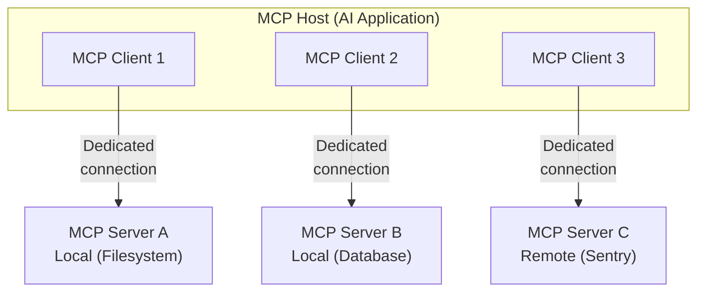
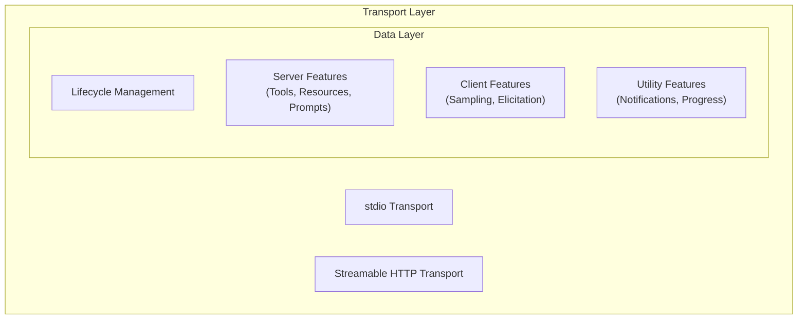
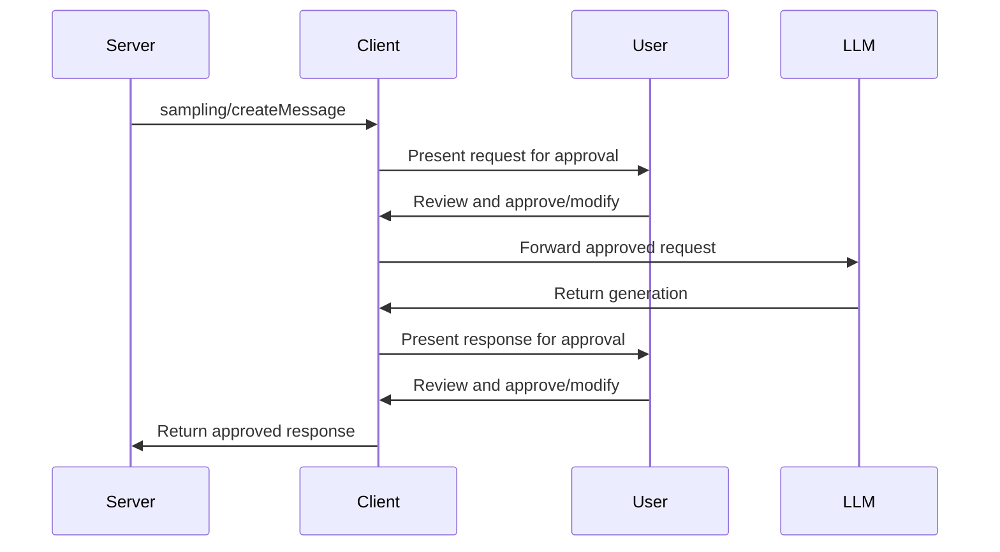
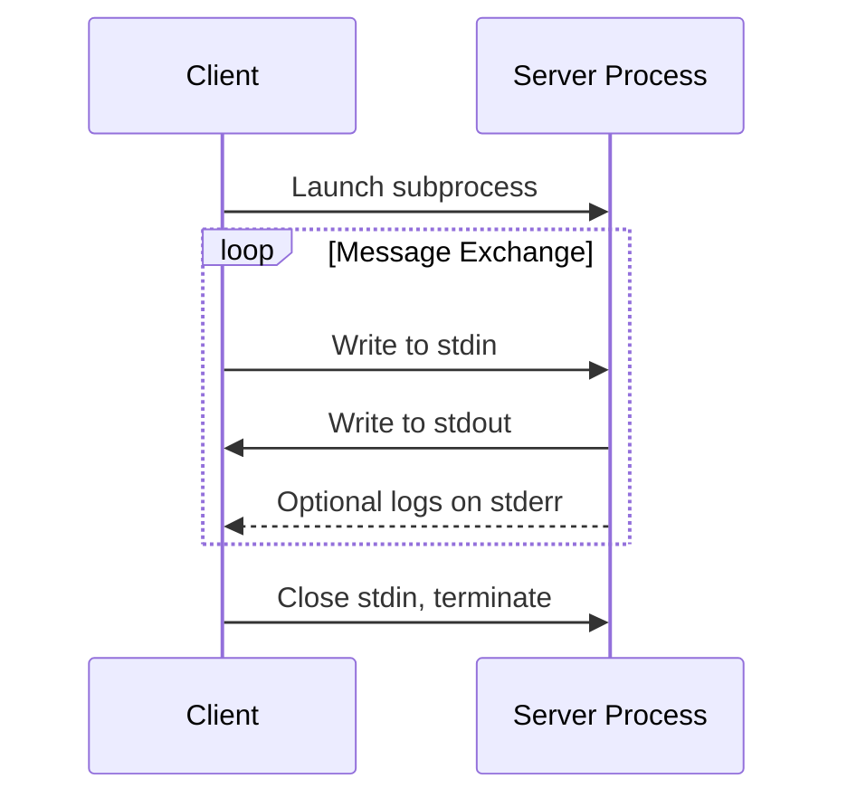
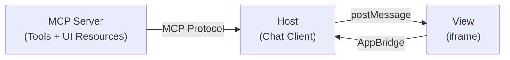
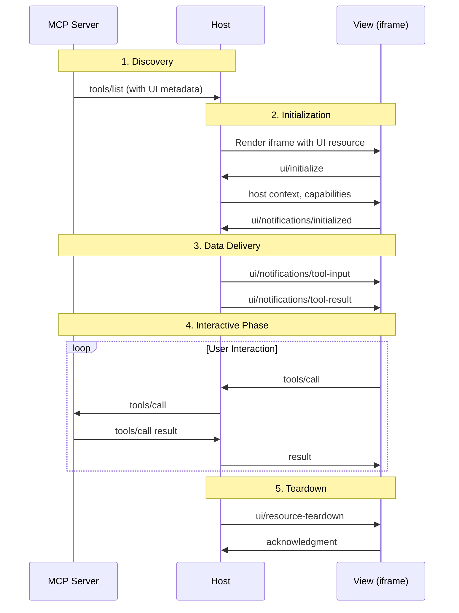

## はじめに ─ MCP とは何か

**Model Context Protocol（MCP）** は、AI アプリケーションと外部システムを接続するためのオープンソースの標準プロトコルです。MCP を使うことで、Claude や ChatGPT のような AI アプリケーションが、データソース（ローカルファイル、データベース）、ツール（検索エンジン、計算機）、ワークフロー（専用プロンプト）に接続し、重要な情報へのアクセスやタスクの実行が可能になります。

MCP はよく「AI アプリケーション版の USB-C ポート」に例えられます。USB-C が電子機器の接続方法を標準化したように、MCP は AI アプリケーションと外部システムの接続方法を標準化します。

### MCP がない世界とある世界

具体例で考えてみましょう。あなたは開発者で、AI アシスタントに「本番環境でエラーが急増している。Sentry の最新エラーを確認して、関連するソースコードを修正して GitHub に PR を出して」と頼みたいとします。

**MCP がない場合**: AI アシスタントは Sentry のデータにアクセスできず、「すみません、外部システムにはアクセスできません」と答えるか、ユーザーが手動で Sentry の画面を開き、エラー情報をコピー&ペーストし、コードを自分で修正し、GitHub の UI で PR を作成する必要があります。

**MCP がある場合**: AI アシスタントが Sentry MCP Server 経由でエラーを取得し、Filesystem MCP Server でソースコードを読み書きし、GitHub MCP Server で PR を作成します。これらすべてが MCP という共通プロトコルで統一的に機能し、ユーザーは 1 つのプロンプトだけで一連の作業を完了できます。

MCP は以下のプロジェクトで構成されます。

- [MCP Specification](https://modelcontextprotocol.io/specification/latest) — プロトコルの仕様
- [MCP SDK](https://modelcontextprotocol.io/docs/sdk) — 各言語向けの SDK
- [MCP Inspector](https://github.com/modelcontextprotocol/inspector) — 開発ツール
- [MCP Reference Servers](https://github.com/modelcontextprotocol/servers) — リファレンス実装

Claude、ChatGPT、Visual Studio Code（GitHub Copilot）、Cursor など多くのクライアントが MCP をサポートしており、一度構築すればあらゆるところに統合できるエコシステムが形成されています。

この記事では、MCP の仕様 `2025-06-18` を基準に、プロトコルのアーキテクチャからその拡張である MCP Apps、さらに Microsoft の実装サンプルまでを網羅的かつ深くまで掘り下げて解説します。

---

## アーキテクチャ概観

### 参加者（Participants）

MCP は **クライアント - サーバーアーキテクチャ** に従います。全体像を理解するために、3 つの主要な参加者を整理します。

| 参加者 | 役割 | 例 |
|---|---|---|
| **MCP Host** | AI アプリケーション本体。1 つ以上の MCP Client を作成・管理する | Claude Desktop, VS Code, ChatGPT |
| **MCP Client** | MCP Server との接続を維持し、コンテキストを取得するコンポーネント | Host の内部に生成されるオブジェクト |
| **MCP Server** | MCP Client にコンテキストと機能を提供するプログラム | Filesystem Server, Sentry MCP Server |

重要なのは、**Host が各 MCP Server に対して 1 つの MCP Client インスタンスを生成する** という点です。

具体的に、VS Code（Host）が `.vscode/mcp.json` で 3 つの MCP Server を設定しているシナリオを考えます。

```json
// .vscode/mcp.json の設定例
{
  "servers": {
    "filesystem": {
      "command": "npx",
      "args": ["-y", "@modelcontextprotocol/server-filesystem", "/workspace"]
    },
    "github": {
      "command": "npx",
      "args": ["-y", "@modelcontextprotocol/server-github"],
      "env": { "GITHUB_TOKEN": "${env:GITHUB_TOKEN}" }
    },
    "sentry": {
      "type": "http",
      "url": "https://mcp.sentry.dev/sse"
    }
  }
}
```

VS Code はこの設定を読み取り、`filesystem` 用、`github` 用、`sentry` 用にそれぞれ独立した MCP Client オブジェクトを生成します。前 2 つは stdio トランスポートでローカルプロセスとして起動され、`sentry` は Streamable HTTP でリモート接続されます。



MCP Server は「サーバー」と名付けられていますが、必ずしもリモートで実行される必要はありません。**stdio トランスポート** を使用する場合はローカルマシン上のサブプロセスとして実行され、**Streamable HTTP トランスポート** を使用する場合はリモートサーバーとして動作します。

### 2 つのレイヤー

MCP は概念的に 2 つのレイヤーで構成されます。



**データレイヤー（内側）** は JSON-RPC 2.0 ベースの交換プロトコルを実装し、メッセージ構造とセマンティクスを定義します。ライフサイクル管理、サーバー機能（Tools, Resources, Prompts）、クライアント機能（Sampling, Elicitation）、ユーティリティ機能（通知、進捗追跡）を含みます。

**トランスポートレイヤー（外側）** はクライアントとサーバー間の通信チャネルと認証を管理します。接続の確立、メッセージフレーミング、セキュアな通信を処理します。

---

## データレイヤー ─ JSON-RPC 2.0 プロトコル

MCP は [JSON-RPC 2.0](https://www.jsonrpc.org/) を基盤の RPC プロトコルとして使用します。クライアントとサーバーは互いにリクエストを送信し、応答します。レスポンスが不要な場合は通知（Notification）を使用します。

### ライフサイクル管理

MCP は **ステートフルなプロトコル** であり、ライフサイクル管理が必要です。ライフサイクル管理の目的は、クライアントとサーバーの双方がサポートする **capability（能力）を交渉** することです。

以下のインタラクティブなビジュアライゼーションで、MCP の初期化からツール発見・実行・通知までのフローをステップごとに追跡できます。

<MCPProtocolVisualizer />

#### 初期化シーケンスの詳細

初期化プロセスでは 3 つの重要な目的を果たします。

**1. プロトコルバージョンのネゴシエーション**

`protocolVersion` フィールド（例: `"2025-06-18"`）により、クライアントとサーバーが互換性のあるプロトコルバージョンを使用していることを確認します。互換バージョンが合意できない場合、接続は終了されるべきです。

**2. Capability Discovery（能力発見）**

`capabilities` オブジェクトにより、各参加者がサポートする機能を宣言します。

```json
// Client capabilities の例
{
  "capabilities": {
    "elicitation": {},
    "sampling": {}
  }
}
```

```json
// Server capabilities の例
{
  "capabilities": {
    "tools": { "listChanged": true },
    "resources": { "subscribe": true },
    "prompts": { "listChanged": true }
  }
}
```

**3. アイデンティティ交換**

`clientInfo` と `serverInfo` オブジェクトにより、デバッグと互換性目的のための識別・バージョン情報を提供します。

初期化完了後、クライアントは `notifications/initialized` を送信して準備完了を通知します。これは JSON-RPC 2.0 の通知メッセージであり、`id` フィールドを持たず、レスポンスは期待されません。

---

## サーバープリミティブ ─ Tools, Resources, Prompts

MCP はサーバーが公開できる **3 つのコアプリミティブ** を定義しています。これらは AI アプリケーションがどのような種類のコンテキスト情報を共有でき、どのようなアクションを実行できるかを規定します。

| プリミティブ | 制御主体 | 説明 | 典型的な用途 |
|---|---|---|---|
| **Tools** | Model（LLM） | LLM が呼び出し可能な実行関数 | API 呼び出し、DB クエリ、ファイル操作 |
| **Resources** | Application | コンテキスト情報を提供するデータソース | ファイル内容、DB スキーマ、API レスポンス |
| **Prompts** | User | LLM との対話を構造化する再利用可能テンプレート | システムプロンプト、Few-shot 例 |

各プリミティブは発見（`*/list`）、取得（`*/get` or `*/read`）、そして場合によっては実行（`tools/call`）のための関連メソッドを持ちます。

### Tools ─ LLM が操る手足

Tools は LLM が呼び出し可能な関数であり、MCP で最も重要なプリミティブです。各 Tool は一意の名前で識別され、スキーマを含むメタデータを持ちます。

具体例を考えましょう。ユーザーが「今日の東京の天気を教えて」と入力したとき、内部では以下の流れが起きます。

1. Host が LLM に「利用可能な Tool 一覧」とユーザーのメッセージを渡す
2. LLM が `get_weather` Tool を呼び出すべきだと判断し、`{"location": "Tokyo"}` という引数を生成
3. Host が MCP Client 経由で `tools/call` を送信
4. MCP Server が天気 API に問い合わせて結果を返却
5. Host が結果を LLM に渡し、LLM が自然言語でユーザーに応答

このとき、LLM は `get_weather` の `inputSchema` を見て「`location` が必須の文字列パラメータ」と理解し、適切な引数を自動生成します。

#### Tools の能力宣言

```json
{
  "capabilities": {
    "tools": {
      "listChanged": true
    }
  }
}
```

`listChanged` は、サーバーが利用可能なツールリストの変更時に通知を発行するかどうかを示します。

#### Tool の定義

各 Tool オブジェクトは以下のフィールドを含みます。

- `name` — サーバー名前空間内の一意識別子
- `title` — ユーザーに表示する人間可読な名前（オプション）
- `description` — ツールの機能と用途の詳細な説明
- `inputSchema` — 期待する入力パラメータを定義する JSON Schema
- `outputSchema` — 期待する出力構造を定義する JSON Schema（オプション）
- `annotations` — ツールの動作を記述するオプションのプロパティ

```json
{
  "name": "get_weather",
  "title": "Weather Information Provider",
  "description": "Get current weather information for a location",
  "inputSchema": {
    "type": "object",
    "properties": {
      "location": {
        "type": "string",
        "description": "City name or zip code"
      }
    },
    "required": ["location"]
  }
}
```

#### Tool 結果のコンテンツタイプ

Tool の実行結果は `content` 配列で返され、複数のコンテンツタイプに対応しています。

| コンテンツタイプ | 説明 |
|---|---|
| `text` | プレーンテキスト |
| `image` | Base64 エンコードされた画像データ |
| `audio` | Base64 エンコードされた音声データ |
| `resource_link` | リソースへの URI リンク |
| `resource` | 埋め込みリソース |

さらに、`structuredContent` フィールドにより構造化 JSON での出力も可能です。`outputSchema` が定義されている場合、サーバーはそのスキーマに準拠した構造化結果を提供しなければなりません（MUST）。

#### エラーハンドリング

Tools は 2 種類のエラー報告メカニズムを使用します。

1. **プロトコルエラー** — 不明なツール、無効な引数などの JSON-RPC エラー
2. **ツール実行エラー** — `isError: true` でツール結果に報告される業務エラー

```json
{
  "content": [
    {
      "type": "text",
      "text": "Failed to fetch weather data: API rate limit exceeded"
    }
  ],
  "isError": true
}
```

#### セキュリティ上の考慮事項

- サーバーはすべてのツール入力を検証しなければならない（MUST）
- サーバーは適切なアクセス制御を実装しなければならない（MUST）
- サーバーはツール呼び出しにレート制限を実装しなければならない（MUST）
- サーバーはツール出力をサニタイズしなければならない（MUST）
- クライアントは機密操作についてユーザーの確認を促すべきである（SHOULD）
- クライアントはサーバーに送信する前にツール入力をユーザーに表示すべきである（SHOULD）— 悪意のある、または偶発的なデータ流出を防止
- クライアントはツール結果を LLM に渡す前に検証すべきである（SHOULD）
- クライアントはツール呼び出しにタイムアウトを実装すべきである（SHOULD）
- クライアントは監査目的でツール使用状況をログに記録すべきである（SHOULD）

### Resources ─ コンテキストデータの提供

Resources はサーバーがクライアントにデータを公開するための標準的な方法です。ファイル、データベーススキーマ、アプリケーション固有の情報など、言語モデルのコンテキストとなるデータを提供します。各リソースは **URI** により一意に識別されます。

Tools との違いを具体例で理解しましょう。データベース MCP Server があるとき、**Resource** は「テーブル一覧やスキーマ情報」といった読み取り専用のコンテキストを提供し、**Tool** は「SQL クエリの実行」といったアクションを提供します。

- `db://schema/users` → Resource（users テーブルのカラム定義を返す）
- `run_query({"sql": "SELECT * FROM users LIMIT 10"})` → Tool（クエリを実行して結果を返す）

LLM は Resource でスキーマを把握したうえで Tool でクエリを実行する、という連携が自然に生まれます。

#### Resources の能力宣言

```json
{
  "capabilities": {
    "resources": {
      "subscribe": true,
      "listChanged": true
    }
  }
}
```

- `subscribe` — クライアントが個別リソースの変更通知を購読できるか
- `listChanged` — サーバーが利用可能なリソースリストの変更時に通知を発行するか

#### リソースの一覧取得と読み取り

```json
// resources/list レスポンス
{
  "resources": [
    {
      "uri": "file:///project/src/main.rs",
      "name": "main.rs",
      "title": "Rust Software Application Main File",
      "description": "Primary application entry point",
      "mimeType": "text/x-rust"
    }
  ]
}
```

```json
// resources/read レスポンス
{
  "contents": [
    {
      "uri": "file:///project/src/main.rs",
      "mimeType": "text/x-rust",
      "text": "fn main() {\n    println!(\"Hello world!\");\n}"
    }
  ]
}
```

#### リソーステンプレート

リソーステンプレートにより、サーバーは [URI テンプレート（RFC 6570）](https://datatracker.ietf.org/doc/html/rfc6570) を使ってパラメータ化されたリソースも公開できます。

```json
{
  "uriTemplate": "weather://forecast/{city}/{date}",
  "name": "weather-forecast",
  "title": "Weather Forecast",
  "description": "Get weather forecast for any city and date",
  "mimeType": "application/json"
}
```

#### サブスクリプション

クライアントは特定のリソースの変更を購読し、変更時に通知を受け取ることができます。

```json
// resources/subscribe リクエスト
{ "uri": "file:///project/src/main.rs" }
```

```json
// 変更時の通知
{
  "jsonrpc": "2.0",
  "method": "notifications/resources/updated",
  "params": { "uri": "file:///project/src/main.rs" }
}
```

#### 一般的な URI スキーム

| スキーム | 用途 |
|---|---|
| `https://` | Web 上のリソース（クライアントが直接フェッチ可能な場合） |
| `file://` | ファイルシステム的に振る舞うリソース |
| `git://` | Git バージョン管理との統合 |
| カスタム | RFC 3986 に準拠した任意のスキーム |

#### アノテーション

リソースとコンテンツブロックはオプションのアノテーションをサポートしています。

- `audience` — 対象者を示す配列（`"user"` や `"assistant"`）
- `priority` — 重要度を示す 0.0 〜 1.0 の数値
- `lastModified` — 最終変更の ISO 8601 タイムスタンプ

### Prompts ─ 対話のテンプレート化

Prompts はサーバーが構造化されたプロンプトテンプレートをクライアントに公開するための仕組みです。言語モデルとの対話で使用する構造化されたメッセージと指示を提供します。

Prompts は **ユーザー制御** で設計されており、自動トリガーではなく明示的な呼び出しが必要です。典型的にはスラッシュコマンドやコマンドパレットなどの UI を通じて公開されます。

たとえば、GitHub MCP Server が `/code-review` という Prompt を提供しているとします。ユーザーがチャットで `/code-review` と入力すると、クライアントが「コードを入力してください」という引数入力 UI を表示し、入力されたコードを含む構造化されたメッセージが LLM に渡されます。つまり Prompt は「LLM が勝手に呼ぶ」のではなく、「ユーザーが明示的に選ぶ」点が Tool との決定的な違いです。

```json
{
  "name": "code_review",
  "title": "Request Code Review",
  "description": "Asks the LLM to analyze code quality and suggest improvements",
  "arguments": [
    {
      "name": "code",
      "description": "The code to review",
      "required": true
    }
  ]
}
```

`prompts/get` の結果には、LLM へ渡すメッセージのリストが含まれます。各メッセージは `role`（`"user"` or `"assistant"`）と、テキスト・画像・音声・埋め込みリソースなどの `content` を持ちます。

---

## クライアント機能 ─ Sampling, Elicitation, Roots

MCP はサーバーだけでなく、クライアントも機能を公開できます。これにより MCP サーバー開発者はよりリッチなインタラクションを構築できます。

### Sampling ─ サーバーからの LLM 呼び出し

Sampling は、MCP サーバーが **クライアント側の LLM にアクセスする** ための仕組みです。サーバー開発者が LLM を利用したいが、モデル非依存でいたい場合に、`sampling/createMessage` メソッドを通じてクライアントの AI アプリケーションに言語モデルの補完をリクエストできます。

具体例を考えましょう。航空券検索の MCP Server に `findBestFlight` という Tool があるとします。ユーザーが「来月バルセロナ行きの最適なフライトを予約して」と依頼すると、Tool は航空会社 API に問い合わせて 47 件のフライトオプションを取得します。しかし、「安い深夜便と便利な午前便のどちらが最適か」という判断には AI の分析が必要です。

このときサーバーは、47 件のフライトデータを含む Sampling リクエストをクライアントに送ります。クライアントの LLM が分析を行い、トップ 3 件の推薦を返します。サーバー自身は LLM の SDK や API キーを持つ必要がなく、クライアント側のモデルを「借りる」形で利用できるのが Sampling の核心的な価値です。



この設計のポイントは、**Human-in-the-loop** を複数箇所に組み込んでいることです。ユーザーは初期リクエストと生成されたレスポンスの両方をレビューし、修正できます。

#### Model Preferences（モデル選択の抽象化）

サーバーとクライアントは異なる AI プロバイダーを使用する可能性があるため、サーバーが特定のモデル名を直接リクエストすることはできません。MCP は **抽象的な能力優先度** とオプションの **モデルヒント** を組み合わせたプリファレンスシステムを実装しています。

```json
{
  "hints": [
    { "name": "claude-sonnet-4-20250514" },
    { "name": "claude" }
  ],
  "costPriority": 0.3,
  "speedPriority": 0.2,
  "intelligencePriority": 0.9
}
```

- `costPriority` — コスト最小化の重要度（0〜1）
- `speedPriority` — 低レイテンシの重要度（0〜1）
- `intelligencePriority` — 高度な能力の重要度（0〜1）

ヒントはサブストリングとして柔軟にモデル名にマッチし、クライアントは別プロバイダーの同等モデルにマッピングすることもできます（MAY）。

### Elicitation ─ ユーザーへの情報リクエスト

Elicitation（仕様 `2025-06-18` で新規導入）は、サーバーがインタラクション中にユーザーから追加情報を要求するための構造化された方法です。すべての情報を事前に要求したり、データが不足しているときに失敗したりする代わりに、サーバーは操作を一時中断して特定の入力をユーザーに要求できます。

```json
// elicitation/create リクエストの例
{
  "jsonrpc": "2.0",
  "id": 1,
  "method": "elicitation/create",
  "params": {
    "message": "Please confirm your Barcelona vacation booking details:",
    "requestedSchema": {
      "type": "object",
      "properties": {
        "confirmBooking": {
          "type": "boolean",
          "description": "Confirm the booking (Flights + Hotel = $3,000)"
        },
        "seatPreference": {
          "type": "string",
          "enum": ["window", "aisle", "no preference"],
          "description": "Preferred seat type for flights"
        }
      },
      "required": ["confirmBooking"]
    }
  }
}
```

Elicitation のレスポンスは 3 つのアクションモデルを使用します。

| アクション | 意味 |
|---|---|
| `accept` | ユーザーがデータを承認・送信 |
| `decline` | ユーザーが明示的に拒否 |
| `cancel` | ユーザーが明示的な選択なしに閉じた |

`requestedSchema` は実装を簡素化するため、**フラットなオブジェクトとプリミティブプロパティのみ** に制限されています。サポートされるスキーマタイプは `string`、`number`（`integer`）、`boolean` の 3 種類です。`string` 型に `enum` / `enumNames` プロパティを追加することで列挙型の入力にも対応できます。

#### セキュリティ上の制約

- サーバーは Elicitation を通じて機密情報を要求してはならない（MUST NOT）
- クライアントはどのサーバーが情報を要求しているかを明確に表示すべき（SHOULD）
- クライアントはレート制限を実装すべき（SHOULD）

### Roots ─ ファイルシステム境界の伝達

Roots はクライアントがサーバーにファイルシステムアクセスの境界を伝達するための仕組みです。`file://` URI スキームのファイル URI で構成され、サーバーが操作できるディレクトリを示します。

```json
{
  "uri": "file:///Users/agent/travel-planning",
  "name": "Travel Planning Workspace"
}
```

Roots は **協調メカニズム** であり、セキュリティ境界ではありません。仕様では「サーバーはルート境界を尊重すべき（SHOULD）」であり、「強制しなければならない（MUST）」ではありません。実際のセキュリティは OS レベルのファイルパーミッションやサンドボックスで実施する必要があります。

---

## トランスポートレイヤー

MCP は JSON-RPC メッセージをエンコードに使用します。メッセージは UTF-8 でエンコードされなければなりません（MUST）。現在、2 つの標準トランスポート機構が定義されています。

### stdio トランスポート

**stdio トランスポート** では、クライアントが MCP サーバーをサブプロセスとして起動します。典型例は、VS Code が `npx @modelcontextprotocol/server-filesystem /workspace` を子プロセスとして起動し、そのプロセスの stdin/stdout 経由で JSON-RPC メッセージをやり取りするケースです。ネットワーク設定も認証も不要で、ローカル開発に最適です。

- サーバーは `stdin` から JSON-RPC メッセージを読み取り、`stdout` にメッセージを送信
- メッセージは改行で区切られ、埋め込み改行を含んではならない（MUST NOT）
- サーバーは `stderr` にログ目的の UTF-8 文字列を書き込むことができる（MAY）
- ネットワークオーバーヘッドがなく、ローカルプロセス間通信に最適



### Streamable HTTP トランスポート

**Streamable HTTP トランスポート** では、サーバーは複数のクライアント接続を処理できる独立したプロセスとして動作します。典型例は Sentry や Stripe などの SaaS が提供するリモート MCP Server で、クラウド上で稼働し複数のクライアントが同時に接続します。サーバーは単一の HTTP エンドポイントパス（例: `https://mcp.sentry.dev/sse`）を POST と GET の両方に対応させます。

#### クライアント → サーバー：HTTP POST

クライアントからサーバーへのすべての JSON-RPC メッセージは、MCP エンドポイントへの新しい HTTP POST リクエストです。

- `Accept` ヘッダーに `application/json` と `text/event-stream` の両方を含める必要がある
- POST ボディは単一の JSON-RPC リクエスト、通知、またはレスポンス
- サーバーは `Content-Type: text/event-stream`（SSE ストリーム）または `Content-Type: application/json`（単一 JSON オブジェクト）のいずれかを返す

#### サーバー → クライアント：SSE ストリーム

クライアントは HTTP GET を MCP エンドポイントに発行して SSE ストリームを開くことができます。サーバーはこのストリームで JSON-RPC リクエストと通知を送信できます。

#### セッション管理

Streamable HTTP を使用するサーバーは、初期化時に `Mcp-Session-Id` ヘッダーでセッション ID を割り当てることができます。

- セッション ID はグローバルに一意かつ暗号学的に安全でなければならない（SHOULD）
- クライアントは以降のすべての HTTP リクエストに `Mcp-Session-Id` ヘッダーを含めなければならない（MUST）
- セッション終了は HTTP DELETE で通知

#### プロトコルバージョンヘッダー

HTTP を使用する場合、クライアントはすべての後続リクエストに `MCP-Protocol-Version: 2025-06-18` ヘッダーを含めなければなりません（MUST）。これによりサーバーは MCP プロトコルバージョンに基づいて応答できます。

#### 再開性と再配信

接続断を復旧するために、サーバーは SSE イベントに `id` フィールドを付与できます。クライアントは HTTP GET の `Last-Event-ID` ヘッダーを使って再開位置を示します。

#### セキュリティ警告

- サーバーはすべての受信接続で `Origin` ヘッダーを検証しなければならない（MUST）— DNS リバインディング攻撃対策
- ローカル実行時はサーバーを `127.0.0.1` にのみバインドすべき（SHOULD）
- すべての接続に適切な認証を実装すべき（SHOULD）

### カスタムトランスポート

クライアントとサーバーは独自のカスタムトランスポート機構を実装することもできます（MAY）。プロトコルはトランスポート非依存であり、双方向メッセージ交換をサポートするあらゆる通信チャネル上で実装可能です。

---

## 通知（Notifications）

MCP は **リアルタイム通知** をサポートしており、サーバーとクライアント間の動的な更新を可能にします。通知は `id` フィールドを持たない JSON-RPC 2.0 通知メッセージとして送信されます（レスポンスを期待しない）。

通知が重要な理由は以下の通りです。

1. **動的環境** — サーバーの状態、外部依存関係、ユーザー権限に基づいて Tool が増減し得る
2. **効率性** — クライアントは変更をポーリングする必要がなく、更新が発生したときに通知される
3. **一貫性** — クライアントが利用可能なサーバー機能について常に正確な情報を持てる
4. **リアルタイムコラボレーション** — 変化するコンテキストに適応できるレスポンシブな AI アプリケーションを実現

通知パターンは Tools に限らず、Resources や Prompts を含むすべての MCP プリミティブに拡張されます。

---

## Tasks（Experimental）

Tasks は MCP のアーキテクチャ概要で言及されている実験的な機能で、**遅延結果取得とステータス追跡のための永続的な実行ラッパー** です。高コストな計算、ワークフロー自動化、バッチ処理、マルチステップ操作などのシナリオで、リクエストの実行状況を追跡できるようにします。なお、Tasks は `2025-06-18` 仕様の時点では実験的ステータスであり、今後のバージョンで設計が変更される可能性があります。

---

## MCP Apps ─ インタラクティブ UI の拡張

### MCP Apps とは

**MCP Apps** は Model Context Protocol の拡張であり、MCP サーバーがホストに **インタラクティブなユーザーインターフェース** を配信できるようにするものです。サーバーが UI リソースを宣言し、ホストがそれをサンドボックス化された iframe 内でセキュアにレンダリングし、両者が通信する方法を定義しています。

### なぜ MCP Apps が必要なのか

標準の MCP では、サーバーのレスポンスはテキストと構造化データに限定されます。しかし多くのユースケースではそれ以上が必要です。

- **データ可視化** — チャート、グラフ、ダッシュボード
- **リッチメディア** — ビデオプレーヤー、音声波形、3D モデル
- **インタラクティブフォーム** — マルチステップウィザード、設定パネル、承認ワークフロー
- **リアルタイム表示** — ライブログ、進捗インジケーター、ストリーミングコンテンツ

MCP Apps 以前は、各ホストが独自に UI サポートを実装していました。MCP Apps はこれを標準化し、サーバーが UI を一度宣言すれば、あらゆる準拠ホストがそれをレンダリングできるようにします。

### Progressive Enhancement（漸進的拡張）

MCP Apps は **graceful degradation** のために設計されています。ホストは接続時に UI サポートを広告し、サーバーは UI 対応ツールを登録する前にこの能力を確認します。**ホストが MCP Apps をサポートしていない場合でも、ツールは動作します** — テキストで結果を返すだけです。

これは基本原則です。**UI はプログレッシブエンハンスメントであり、要件ではありません。**

### MCP Apps のアーキテクチャ

MCP Apps では 3 つのエンティティが連携します。



- **Server** — 標準の MCP サーバーでツールと UI リソースを宣言
- **Host** — チャットクライアント（例: Claude Desktop, M365 Copilot）がサーバーに接続し、View を iframe に埋め込み、両者間の通信をプロキシ
- **View** — サンドボックス化された iframe 内で実行される UI。ホストからツールデータを受信し、サーバーツールを呼び出したりチャットにメッセージを送信したりできる

View は MCP クライアントとして機能し、Host はプロキシとして機能し、Server は標準の MCP サーバーです。

### MCP Apps のライフサイクル



1. **Discovery** — ホストがサーバーに接続する際にツールとそのUI リソースを把握
2. **Initialization** — UI ツールが呼び出されたとき、ホストが iframe をレンダリング。View は `ui/initialize` を送信してホストコンテキスト（テーマ、機能、コンテナ寸法）を受信。このハンドシェイクにより View がデータを受け取る前に準備完了を確認
3. **Data Delivery** — ホストがツール引数と結果を View に送信。結果には `content`（モデルのコンテキスト用テキスト）とオプションの `structuredContent`（UI レンダリング用データ）が含まれる
4. **Interactive Phase** — ユーザーが View と対話。View はツールを呼び出したり、メッセージを送ったり、コンテキストを更新したりできる
5. **Teardown** — アンマウント前にホストが View に通知し、状態保存やリソース解放を可能にする

### UI リソース

UI リソースはサーバーが `ui://` URI スキームで宣言する HTML テンプレートです。MIME タイプは `text/html;profile=mcp-app` が必須です。ツールの `_meta.ui.resourceUri` フィールドで事前にリンクします。

```json
"_meta": {
  "ui": { "resourceUri": "ui://weather/forecast" }
}
```

ホストがツールを実行する際、この `ui://` URI を使って `resources/read` でテンプレートを取得し、iframe 内にレンダリングします。

```json
// resources/read レスポンスの例
{
  "contents": [{
    "uri": "ui://weather/forecast",
    "mimeType": "text/html;profile=mcp-app",
    "text": "<!DOCTYPE html><html>...</html>"
  }]
}
```

この設計により以下が可能になります。

- **プリフェッチ** — ホストがツール実行前にテンプレートをキャッシュ可能
- **関心の分離** — テンプレート（プレゼンテーション）とツール結果（データ）が分離
- **レビュー** — ホストが接続セットアップ時に UI テンプレートを検査可能

### Tool Visibility（ツールの可視性）

ツールはモデル、アプリ、またはその両方に対して可視にできます。デフォルトでは両方に可視（`visibility: ["model", "app"]`）です。

**アプリ専用ツール**（`visibility: ["app"]`）は、エージェントのコンテキストを汚すべきでない UI インタラクション — リフレッシュボタン、ページネーションコントロール、フォーム送信など — に役立ちます。モデルはこれらのツールを認識しません。

### 双方向通信

View は JSON-RPC over `postMessage` でホストと通信します。View から以下が可能です。

**サーバーとのインタラクション：**
- サーバーツールの呼び出し（`tools/call`）
- サーバーリソースの読み取り（`resources/read`）

**チャットとのインタラクション：**
- 会話へのメッセージ送信（`ui/message`）
- モデルコンテキストの更新（`ui/update-model-context`）

**ホストアクションの要求：**
- 外部リンクの開放（`ui/open-link`）

### Display Modes（表示モード）

| モード | 説明 | 用途 |
|---|---|---|
| `inline` | チャットフローに埋め込み | チャート、プレビュー、フォーム |
| `fullscreen` | ウィンドウ全体を使用 | エディタ、ゲーム、複雑なダッシュボード |
| `pip` | ピクチャー・イン・ピクチャー | 音楽プレーヤー、タイマーなどの持続ウィジェット |

View はサポートするモードを宣言し、ホストは提供可能なモードを宣言します。View はモード変更を要求できますが、ホストが最終決定権を持ちます。

### Host Context（ホストコンテキスト）

View の初期化時にホストが提供するコンテキスト情報。

- **Theme** — ライト / ダークモードの設定
- **Locale / Timezone** — 日付、数値、テキストのフォーマット
- **Display Mode** — inline, fullscreen, pip
- **Container Dimensions** — 利用可能なスペース
- **Platform** — Web, Desktop, Mobile

ホストはコンテキスト変更時（例: ダークモードトグル）に View へ通知し、リロードなしでの動的更新を可能にします。

### テーマ対応

ホストは CSS カスタムプロパティ（カラー、タイポグラフィ、ボーダー）を提供します。View はフォールバック付きの CSS 変数を使用してホストの視覚スタイルに合わせます。

```css
.container {
  background: var(--color-background-primary, #ffffff);
  color: var(--color-text-primary, #000000);
}
```

### セキュリティモデル

- すべての View はサンドボックス化された iframe 内で実行 — ホストの DOM、Cookie、ストレージにアクセス不可
- 通信は `postMessage` のみで行われ、監査可能
- サーバーは CSP メタデータで UI が必要とするネットワークドメインを宣言
- ホストがこれらの宣言を適用 — ドメインが宣言されていなければ外部接続は許可されない
- **デフォルトで制限的** — 未宣言のサーバーへのデータ流出を防止

### Adaptive Cards との違い

M365 Copilot のエコシステムでは、従来 **Adaptive Cards** がリッチな応答 UI の標準でした。MCP Apps はそれとは根本的にアーキテクチャが異なります。

| 観点 | Adaptive Cards | MCP Apps |
|---|---|---|
| **UI の記述方式** | JSON スキーマ（宣言的） | HTML / CSS / JS（命令的） |
| **レンダリング** | ホストが JSON を解釈しネイティブに描画 | サンドボックス化された **iframe** 内で実行 |
| **表現力** | 定義済み要素のみ（TextBlock, Image, Input 等） | 制限なし（React, チャート, 地図, 動画, 3D モデル等） |
| **カスタムコード実行** | 不可（スキーマで表現できる範囲のみ） | 可（任意の JS が iframe 内で動作） |
| **双方向通信** | `Action.Submit` でホストにデータを返す程度 | `tools/call`, `ui/message`, `ui/update-model-context` 等のリッチな JSON-RPC 通信 |
| **プロトコル** | Adaptive Card スキーマ（独自） | MCP 拡張（JSON-RPC over `postMessage`） |
| **セキュリティモデル** | ホストが JSON を解釈して描画するため外部コード実行なし | iframe サンドボックス + CSP でネットワーク・DOM アクセスを制限 |

要約すると、**Adaptive Cards** は「構造化されたカードを宣言するとホストがネイティブに描画する」仕組みで、安全性が高い反面、表現力に限界があります。**MCP Apps** は「フル機能の Web アプリを iframe でホスト内に埋め込む」仕組みで、表現力は無制限ですが、セキュリティをサンドボックスと CSP で担保する設計です。

M365 Copilot の文脈では、従来の Declarative Agent が Adaptive Cards で応答を返していたのに対し、MCP サーバーベースのアクションでは MCP Apps を使ってよりリッチなインタラクティブ UI を返せるようになった、という位置づけです。

---

## microsoft/mcp-interactiveUI-samples ─ 実装例

Microsoft は MCP Apps の具体的な実装例として [mcp-interactiveUI-samples](https://github.com/microsoft/mcp-interactiveUI-samples) リポジトリを公開しています。このリポジトリには、Microsoft 365 Copilot 内でリッチなインタラクティブ UI ウィジェットをレンダリングする MCP サーバーのサンプルが含まれています。

### リポジトリ構成

```text
mcp-apps/                        # MCP Apps SDK サンプル
  employee-training/node/        # 学習コース推薦
  fieldops/node/                 # フィールドサービスディスパッチ
  trey-research/node/            # HR コンサルタント管理
  zava-insurance/node/           # 保険クレーム管理

oai-apps-sdk/                    # OpenAI Apps SDK サンプル
  fieldops/node/                 # フィールドサービスディスパッチ
  trey-research/node/            # HR コンサルタント管理
  zava-insurance/node/           # 保険クレーム管理
```

Field Service Dispatch、Trey Research、Zava Insurance の 3 つのサンプルは **MCP Apps バージョン** と **OpenAI Apps SDK バージョン** の 2 つの実装を提供しており、同じユースケースを異なるアプローチで実現する方法を示しています。Employee Training は MCP Apps バージョンのみ提供されています。

- **MCP Apps** — MCP 標準の `ui://` リソーススキームを使用し、任意の MCP 準拠ホストで動作
- **OpenAI Apps SDK** — ChatGPT アプリ向けのビルドツールで MCP Apps 標準に基づきつつ ChatGPT 固有の追加機能を提供

### サンプル 1: Trey Research — HR コンサルタント管理

Fluent UI React ウィジェットを使った HR コンサルタント、プロジェクト、割り当ての管理サーバーです。

#### ウィジェットツール

| ツール名 | ウィジェット | 機能 |
|---|---|---|
| `show-hr-dashboard` | Dashboard | KPI、コンサルタントカード、プロジェクトリスト |
| `show-consultant-profile` | Profile | 連絡先、スキル、認定資格、役割、割り当ての詳細プロフィール |
| `show-project-details` | Dashboard | 割り当てコンサルタントと予測工数のプロジェクト詳細 |
| `search-consultants` | Bulk Editor | スキルまたは名前でコンサルタントを検索 |
| `show-bulk-editor` | Bulk Editor | コンサルタントレコードの表示・編集 |

#### データツール

| ツール名 | 機能 |
|---|---|
| `update-consultant` | 名前、メール、電話、スキル、役割の単一更新 |
| `bulk-update-consultants` | 複数コンサルタントレコードの一括更新 |
| `assign-consultant-to-project` | コンサルタントをプロジェクトに割り当て |
| `bulk-assign-consultants` | 複数コンサルタントの一括プロジェクト割り当て |
| `remove-assignment` | コンサルタントのプロジェクト割り当て解除 |

#### アーキテクチャの特徴

1. MCP サーバーは Streamable HTTP トランスポートで `http://localhost:3001/mcp` にエンドポイントを公開
2. React + Fluent UI のウィジェットは単一ファイル HTML アセットとしてビルドされ、`assets/` フォルダに出力
3. Azurite（ローカル Azure Table Storage エミュレーター）をデータストアとして使用
4. Dev Tunnel を使用してローカル MCP サーバーを公開し、M365 Copilot の Declarative Agent から接続

#### セットアップ手順

```bash
# 依存関係のインストール
npm run install:all

# Azurite の起動（別ターミナル）
npm run start:azurite

# データベースのシード
npm run seed

# Dev Tunnel の作成
devtunnel host -p 3001 --allow-anonymous

# ウィジェットのビルド
npm run build:widgets

# MCP サーバーの起動
npm run start:server

# MCP Inspector でテスト
npm run inspector
```

#### 使用例

自然言語で以下のような複雑なタスクを実行できます。

> 「Copilot プロジェクトの Consolidated Messenger に React 開発者が必要です。React スキルを持つ人を見つけ、プロフィールを表示し、Developer として割り当ててください。」

この 1 つのプロンプトで、サーバーはスキルベースのコンサルタント検索、プロフィールカードの表示、プロジェクトへの割り当てという 3 つの操作をチェーンします。

### サンプル 2: Field Service Dispatch

フィールドサービスのディスパッチワークフローを管理するサーバーで、割り当て受付、地図可視化、ディスパッチ計画、確認フローを含みます。Mapbox トークンを使って地図ウィジェットをレンダリングします。

| プロンプト | 動作 |
|---|---|
| 「直近 24 時間の新しい割り当てを見せて」 | リストウィジェットに受付アイテムを表示 |
| 「これらの割り当てを地図上に表示して」 | インタラクティブな地図上に割り当てをレンダリング |
| 「これらの割り当てに対するディスパッチ計画を作成して」 | 技術者割り当てのディスパッチ計画 UI を表示 |

### サンプル 3: Zava Insurance — 保険クレーム管理

保険クレームのダッシュボード、地図付きクレーム詳細、契約者リストウィジェットを備えた保険クレーム管理サーバーです。

複数のツール呼び出しをチェーンする高度なワークフローが可能です。

> 「クレーム 1 の詳細を表示して。保留中の発注書を承認し、検査を完了として修理が満足できる旨のメモを追加して。」

この 1 つのプロンプトで、クレーム詳細表示、発注書承認、検査更新の 3 つのステップを連鎖させ、複数の手作業を 1 回の会話で置き換えます。

### サンプル 4: Employee Training

学習コース推薦サーバーで、埋め込みビデオプレビュー、インラインエンティティカード、フルスクリーンコースビューを含みます。

| プロンプト | 動作 |
|---|---|
| 「AI エージェントについてのトレーニングコースを推薦して」 | 埋め込みビデオ付きのコースカードを表示 |
| 「Semantic Kernel のコースを見せて」 | ビデオプレーヤー付きのコースウィジェットをレンダリング |

---

## MCP サーバーの具体的な実装パターン

microsoft/mcp-interactiveUI-samples の Trey Research サンプルを基に、MCP Apps 対応サーバーの実装パターンを見てみましょう。

### ツール定義における UI リンク

```typescript
// MCP Apps 対応ツールの定義例
{
  name: "show-hr-dashboard",
  description: "Show HR consultant dashboard with KPIs and cards",
  inputSchema: {
    type: "object",
    properties: {
      consultantName: { type: "string", description: "Filter by name" },
      skill: { type: "string", description: "Filter by skill" },
      billable: { type: "boolean", description: "Filter billable only" }
    }
  },
  _meta: {
    ui: {
      resourceUri: "ui://trey-research/hr-dashboard"
    }
  }
}
```

`_meta.ui.resourceUri` がこのツールに関連付けられた UI テンプレートを指します。ホストはツール呼び出し時にこの UI リソースをフェッチし、iframe 内にレンダリングします。

### ウィジェット（View）側の実装

ウィジェットは React + Fluent UI で構築され、単一ファイル HTML にバンドルされます。ウィジェット内からは `AppBridge` を通じて以下が可能です。

```typescript
// View から MCP サーバーのツールを呼び出す例
const result = await app.callTool("update-consultant", {
  consultantId: "123",
  skills: ["React", "TypeScript"]
});

// チャットにメッセージを送信する例
await app.sendMessage("Consultant profile updated successfully.");

// モデルコンテキストを更新する例
await app.updateModelContext({
  type: "text",
  text: "The consultant's skills have been updated."
});
```

---

## その他の仕様機能

この記事ではカバーしきれませんでしたが、MCP 仕様 `2025-06-18` には以下の追加機能が定義されています。

- **Authorization（認可）** — HTTP ベースのトランスポート向けの OAuth 2.1 ベースの認可フロー。Protected Resource Metadata（[RFC 9728](https://datatracker.ietf.org/doc/html/rfc9728)）、Authorization Server Metadata（[RFC 8414](https://datatracker.ietf.org/doc/html/rfc8414)）、Dynamic Client Registration（[RFC 7591](https://datatracker.ietf.org/doc/html/rfc7591)）を組み合わせて実装
- **Pagination（ページネーション）** — `tools/list`、`resources/list`、`prompts/list` 等のリスト操作はカーソルベースのページネーションをサポート。レスポンスに `nextCursor` が含まれる場合、クライアントはそれを次のリクエストの `cursor` パラメータに渡す
- **Completion** — `completion/complete` で引数のオートコンプリート候補を提供。IDE の補完機能に似た UX を実現
- **Logging** — サーバーが `notifications/message` で構造化ログメッセージを送信。syslog 準拠の重大度レベル（debug 〜 emergency）をサポート
- **Progress** — リクエストの `_meta.progressToken` と `notifications/progress` で長時間操作の進捗状況を通知
- **Cancellation** — `notifications/cancelled` で実行中のリクエストをキャンセル

詳細は [MCP Specification](https://modelcontextprotocol.io/specification/2025-06-18) を参照してください。

---

## 全体のまとめ

Model Context Protocol は AI アプリケーションと外部システムの接続を標準化するオープンプロトコルです。この記事で解説した内容を整理します。

### アーキテクチャ

- **Host / Client / Server** の 3 層構造で、Host が各 Server に対して 1 つの Client を生成
- **データレイヤー**（JSON-RPC 2.0）と**トランスポートレイヤー**（stdio / Streamable HTTP）の 2 層構成

### サーバープリミティブ

- **Tools** — LLM が呼び出す実行関数。`tools/list` → `tools/call` のフロー
- **Resources** — アプリケーション主導のコンテキストデータ。URI で一意に識別
- **Prompts** — ユーザー制御の対話テンプレート

### クライアント機能

- **Sampling** — サーバーがクライアント経由で LLM 補完を要求。Human-in-the-loop 設計
- **Elicitation** — サーバーがユーザーから構造化情報を動的に収集
- **Roots** — ファイルシステム境界の伝達（協調メカニズム）

### トランスポート

- **stdio** — ローカルサブプロセス通信。ネットワークオーバーヘッドなし
- **Streamable HTTP** — リモート通信。SSE によるストリーミング、セッション管理、再開性をサポート

### MCP Apps 拡張

- MCP にインタラクティブ UI を追加する拡張仕様
- サンドボックス化された iframe + `postMessage` で安全な双方向通信
- Progressive Enhancement — UI 非対応ホストでもテキスト結果で動作

### microsoft/mcp-interactiveUI-samples

- HR 管理、フィールドサービス、保険クレーム、研修コースの 4 つのサンプル
- 3 サンプルが MCP Apps SDK と OpenAI Apps SDK の両バージョンを提供（Employee Training は MCP Apps のみ）
- Fluent UI React ウィジェットによるリッチな UI を M365 Copilot 内に表示

MCP は AI アプリケーションのエコシステムにおいて、コンテキストの共有とアクション実行の共通語を提供し、「一度構築すればどこでも統合できる」世界を実現する重要な技術基盤です。

---

## 参考リンク

- [MCP Specification](https://modelcontextprotocol.io/specification/latest)
- [MCP Architecture](https://modelcontextprotocol.io/docs/learn/architecture)
- [MCP Server Concepts](https://modelcontextprotocol.io/docs/learn/server-concepts)
- [MCP Client Concepts](https://modelcontextprotocol.io/docs/learn/client-concepts)
- [MCP Apps Overview](https://apps.extensions.modelcontextprotocol.io/api/documents/Overview.html)
- [MCP Apps Specification](https://github.com/modelcontextprotocol/ext-apps/blob/main/specification/2026-01-26/apps.mdx)
- [microsoft/mcp-interactiveUI-samples](https://github.com/microsoft/mcp-interactiveUI-samples)
