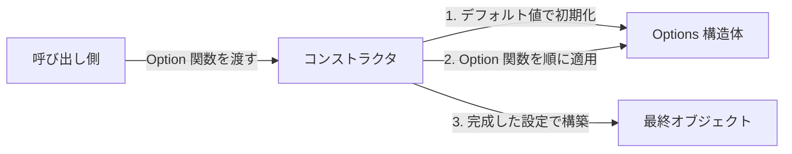
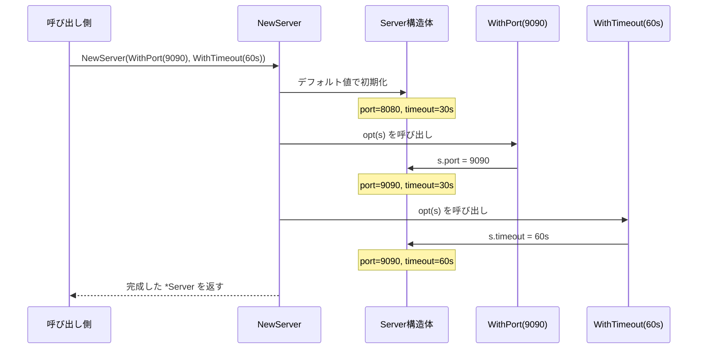
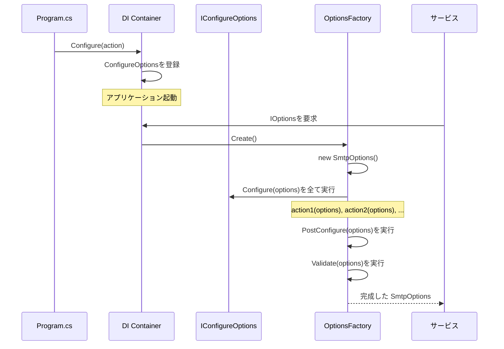
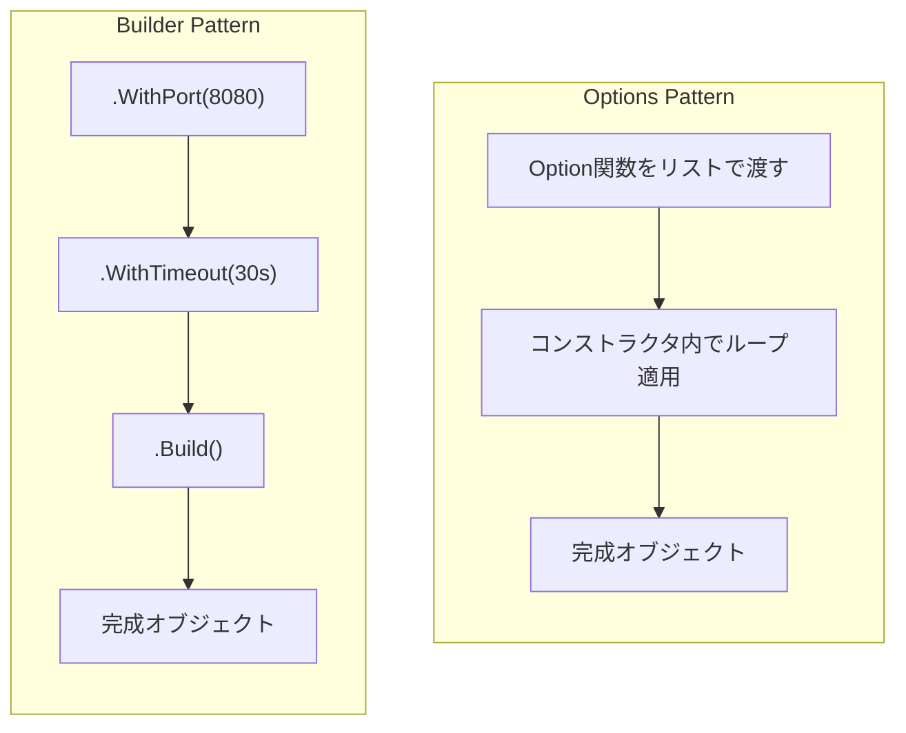
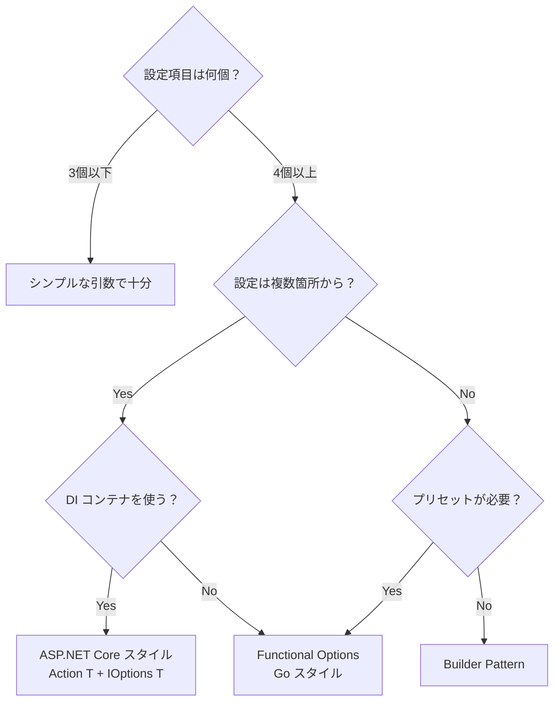

## はじめに

ライブラリやフレームワークのコードを読んでいると、「コンストラクタに無名関数を渡して設定する」というパターンに繰り返し出会う。言語は違えど、その発想は同じだ。ASP.NET Core のコードを読んでいると、こんな書き方に頻繁に出会う。

```csharp
builder.Services.AddAuthentication(options =>
{
    options.DefaultScheme = "Bearer";
    options.DefaultChallengeScheme = "Bearer";
});
```

あるいは Go のコードではこう。

```go
server := NewServer(
    WithPort(8080),
    WithTimeout(30 * time.Second),
    WithLogger(myLogger),
)
```

これらはどちらも **Options Pattern**（オプションパターン）と呼ばれるデザインパターンの実装だ。「無名関数（ラムダ / クロージャ）を使ってオブジェクトの設定を組み立てる」という共通の考え方に基づいている。

この記事では Options Pattern を以下の観点で徹底解説する。

1. **どんな問題を解決するか** — Telescoping Constructor の地獄
2. **パターンの本質** — 関数を設定単位として渡す
3. **C# / ASP.NET Core での実装** — `IOptions<T>` と DI の裏側
4. **Go での実装** — Functional Options パターン
5. **TypeScript での実装** — Builder との融合
6. **他パターンとの比較** — Builder・Fluent API・Configuration Object
7. **いつ使うべきか** — 適用の判断基準

## 問題: Telescoping Constructor

Options Pattern がなぜ必要なのかを理解するには、このパターンが解決しようとする問題を先に見る必要がある。

### コンストラクタ引数の爆発

HTTP サーバーを作るケースを考えよう。最初は引数が少ない。

```go
func NewServer(port int) *Server {
    return &Server{port: port}
}
```

しかし機能が増えるにつれて、引数が増殖する。

```go
func NewServer(
    port int,
    host string,
    timeout time.Duration,
    maxConnections int,
    logger Logger,
    tlsConfig *tls.Config,
    middleware []Middleware,
    readTimeout time.Duration,
    writeTimeout time.Duration,
    idleTimeout time.Duration,
) *Server {
    // ...
}
```

これが **Telescoping Constructor**（望遠鏡コンストラクタ）問題だ。引数が 10 個を超えると、呼び出し側は引数の順番を間違えやすくなり、ほとんどの引数にはデフォルト値を使いたいのに省略できない。

### 「全部入り Config 構造体」の限界

よくある対策は「Config 構造体を 1 つ渡す」方法だ。

```go
type ServerConfig struct {
    Port           int
    Host           string
    Timeout        time.Duration
    MaxConnections int
    Logger         Logger
    // ...
}

func NewServer(cfg ServerConfig) *Server { ... }
```

これは見た目はきれいだが問題がある。

- **デフォルト値の表現が難しい**: `Port: 0` は「ポート 0 を使いたい」のか「デフォルトを使いたい」のか区別できない（ゼロ値問題）
- **必須と任意が区別できない**: すべてのフィールドが同じレベルに見える
- **拡張時の破壊的変更**: 新しいフィールドを追加すると、既存のコンストラクタ呼び出しに影響する可能性がある
- **組み合わせの制御が難しい**: 「A を設定したなら B の設定は不要」といった制約を表現しにくい

## Options Pattern の本質

Options Pattern の核心は驚くほどシンプルだ。

> **設定を「値」ではなく「関数」として渡す。**

つまり、「Port は 8080」という**値**を渡すのではなく、「Port を 8080 に設定する**操作**」を渡す。



このアプローチにはいくつかの重要な利点がある。

| 利点 | 説明 |
|-----|------|
| **デフォルト値が安全** | Option 関数が呼ばれなければデフォルト値がそのまま使われる |
| **順序非依存** | Option 関数はどの順番で渡しても良い（後勝ちで上書き可能） |
| **拡張に開放** | 新しい Option 関数を追加しても既存コードに影響しない（Open-Closed Principle） |
| **型安全** | 各 Option 関数が正しい型のフィールドだけを操作する |
| **組み合わせ可能** | Option 関数をスライスにまとめて「プリセット」を作れる |

## Go での実装 — Functional Options

ここからは各言語での具体的な実装を見ていく。まず Go から始めるのは、Go コミュニティでこのパターンが最も体系的に提唱され、広く普及したからだ。Go コミュニティでは、[Rob Pike](https://commandcenter.blogspot.com/2014/01/self-referential-functions-and-design.html) と [Dave Cheney](https://dave.cheney.net/2014/10/17/functional-options-for-friendly-apis) が提唱したこのパターンが **Functional Options** として広く知られている。Go にはコンストラクタのオーバーロードもデフォルト引数もないため、Functional Options が事実上の標準的な設定パターンになった。

### 基本実装

まずはパターンの全体像を見てみよう。以下のコードには 3 つの構成要素がある。**(1)** 設定を保持する `Server` 構造体、**(2)** 設定を変更する関数型 `Option`、**(3)** デフォルト値で初期化してから Option を順に適用するコンストラクタ `NewServer`。この 3 つが Functional Options のすべてだ。

```go
package server

import (
    "log"
    "time"
)

// Server は HTTP サーバーの本体
type Server struct {
    port         int
    host         string
    timeout      time.Duration
    maxConns     int
    logger       *log.Logger
}

// Option は Server の設定を変更する関数型
type Option func(*Server)

// WithPort はポート番号を設定する Option
func WithPort(port int) Option {
    return func(s *Server) {
        s.port = port
    }
}

// WithHost はホスト名を設定する Option
func WithHost(host string) Option {
    return func(s *Server) {
        s.host = host
    }
}

// WithTimeout はタイムアウトを設定する Option
func WithTimeout(d time.Duration) Option {
    return func(s *Server) {
        s.timeout = d
    }
}

// WithMaxConnections は最大接続数を設定する Option
func WithMaxConnections(n int) Option {
    return func(s *Server) {
        s.maxConns = n
    }
}

// WithLogger はロガーを設定する Option
func WithLogger(l *log.Logger) Option {
    return func(s *Server) {
        s.logger = l
    }
}

// NewServer は Option を適用して Server を生成する
func NewServer(opts ...Option) *Server {
    // 1. デフォルト値で初期化
    s := &Server{
        port:     8080,
        host:     "localhost",
        timeout:  30 * time.Second,
        maxConns: 100,
        logger:   log.Default(),
    }

    // 2. Option 関数を順に適用
    for _, opt := range opts {
        opt(s)
    }

    return s
}
```

### 使い方

上の実装を使ってみよう。引数を一切渡さなければデフォルト値で動き、必要なものだけ指定すればその部分だけが上書きされる。さらに Option をスライスにまとめれば「本番環境用プリセット」のような再利用可能な設定セットも作れる。

```go
// デフォルト設定
s1 := server.NewServer()

// カスタム設定
s2 := server.NewServer(
    server.WithPort(9090),
    server.WithTimeout(60 * time.Second),
    server.WithLogger(customLogger),
)

// プリセット: 本番環境向け設定をまとめておく
var ProductionDefaults = []server.Option{
    server.WithPort(443),
    server.WithTimeout(10 * time.Second),
    server.WithMaxConnections(10000),
}

s3 := server.NewServer(ProductionDefaults...)
```

### 内部で何が起きているか

`NewServer` の実行を 1 ステップずつ追ってみよう。



ポイントは **クロージャ**（closure）だ。`WithPort(9090)` が返すのは「引数 9090 を**キャプチャ**した関数」であり、その関数が後から `Server` に対して適用される。これが Options Pattern の技術的な核心だ。

### バリデーション付きの実装

実際のプロダクションコードでは、バリデーションを加えたい。ポート番号が範囲外とか、タイムアウトが負の値とか、そういった無効な設定を早期に検出したい。Go では `Option` がエラーを返すバージョンが推奨される。エラーが返された時点で `NewServer` が即座に失敗するので、不正な設定でサーバーが起動してしまう事態を防げる。

```go
// Option はエラーを返せるバージョン
type Option func(*Server) error

func WithPort(port int) Option {
    return func(s *Server) error {
        if port < 0 || port > 65535 {
            return fmt.Errorf("invalid port: %d", port)
        }
        s.port = port
        return nil
    }
}

func NewServer(opts ...Option) (*Server, error) {
    s := &Server{
        port:     8080,
        host:     "localhost",
        timeout:  30 * time.Second,
        maxConns: 100,
    }

    for _, opt := range opts {
        if err := opt(s); err != nil {
            return nil, fmt.Errorf("applying option: %w", err)
        }
    }

    return s, nil
}
```

### 実世界での使用例

Functional Options は Go エコシステムで非常に広く使われている。

| ライブラリ | 使用箇所 |
|-----------|---------|
| [gRPC-Go](https://github.com/grpc/grpc-go) | `grpc.NewServer(opts...)` |
| [Zap](https://github.com/uber-go/zap) | `zap.New(core, opts...)` |
| [Fx](https://github.com/uber-go/fx) | `fx.New(opts...)` |
| [client-go](https://github.com/kubernetes/client-go) | 一部の API でオプション関数を使用 |
| [kafka-go](https://github.com/segmentio/kafka-go) | Kafka クライアント設定 |

## C# / ASP.NET Core での実装

ASP.NET Core の Options Pattern は、Go の Functional Options と**同じ原理**を DI（Dependency Injection）コンテナの上に構築したものだ。Go ではコンストラクタの引数として Option を渡すが、ASP.NET Core では DI コンテナに登録した「設定関数」をコンテナが内部で適用する。つまり、Option の適用タイミングが「コンストラクタ呼び出し時」から「依存性解決時」に遅延されている。この遅延が「複数箇所からの段階的な設定」を可能にする鍵だ。

### 基本パターン: `Action<TOptions>`

```csharp
// Options クラスの定義
public class SmtpOptions
{
    public string Host { get; set; } = "localhost";
    public int Port { get; set; } = 25;
    public bool UseSsl { get; set; } = false;
    public string? Username { get; set; }
    public string? Password { get; set; }
}

// サービス登録時に Action<T> で設定
builder.Services.Configure<SmtpOptions>(options =>
{
    options.Host = "smtp.example.com";
    options.Port = 587;
    options.UseSsl = true;
});
```

Go の `func(*Server)` と C# の `Action<SmtpOptions>` は**まったく同じもの**だ。どちらも「Options オブジェクトを受け取り、そのフィールドを変更する関数」である。

### `IOptions<T>` インターフェース群

ASP.NET Core が 3 つの Options インターフェースを提供しているのには理由がある。起動時に一度だけ読み込む設定、リクエストごとに最新値を取得したい設定、`appsettings.json` の変更をリアルタイムに反映したい設定 — それぞれユースケースが異なる。

| インターフェース | ライフタイム | リロード | 用途 |
|---------------|-----------|---------|------|
| `IOptions<T>` | Singleton | 不可 | 起動時に決まる静的な設定 |
| `IOptionsSnapshot<T>` | Scoped | リクエストごと | リクエスト単位で最新設定を取得 |
| `IOptionsMonitor<T>` | Singleton | リアルタイム | ホットリロード対応 |

### DI 内部での動作

`Configure<T>()` を呼ぶと、内部では何が起きているのか。



重要なポイントは、`Configure()` を **複数回呼べる** ことだ。

```csharp
// 基本設定
builder.Services.Configure<SmtpOptions>(options =>
{
    options.Host = "smtp.example.com";
    options.Port = 587;
});

// 追加設定（上書き可能）
builder.Services.Configure<SmtpOptions>(options =>
{
    options.UseSsl = true;
});

// appsettings.json からもバインド可能
builder.Services.Configure<SmtpOptions>(
    builder.Configuration.GetSection("Smtp"));
```

これらは**すべて順番に実行される**。最後に書いたものが勝つ。これは Go の `for _, opt := range opts { opt(s) }` とまったく同じメカニズムだ。

### 拡張メソッドパターン

ASP.NET Core でよく見る `AddXxx(options => ...)` パターンの内部実装を見てみよう。このパターンはライブラリ作者が提供する「セットアップの窓口」だ。利用者は内部の登録詳細（Options インフラ、バリデーション、サービス登録）を知らなくても、`Action<SmtpOptions>` を渡すだけで正しく設定できる。

```csharp
// AddSmtp 拡張メソッドの実装
public static class SmtpServiceCollectionExtensions
{
    public static IServiceCollection AddSmtp(
        this IServiceCollection services,
        Action<SmtpOptions> configure)
    {
        // 1. Options インフラを登録
        services.AddOptions<SmtpOptions>()
            .Configure(configure)        // ユーザーの設定を適用
            .ValidateDataAnnotations()   // バリデーション
            .ValidateOnStart();          // 起動時検証

        // 2. サービス本体を登録
        services.AddSingleton<ISmtpClient, SmtpClient>();

        return services;
    }
}

// 使用側
builder.Services.AddSmtp(options =>
{
    options.Host = "smtp.example.com";
    options.Port = 587;
    options.UseSsl = true;
});
```

この `AddSmtp` メソッドの中で何が起きているかを分解すると、以下の 3 つの関心事が分離されている。

1. **デフォルト値** → `SmtpOptions` クラスのプロパティ初期化子
2. **ユーザー設定** → `Action<SmtpOptions>` で受け取った無名関数
3. **バリデーション** → `ValidateDataAnnotations()` で宣言的に定義

### PostConfigure と Validate

ASP.NET Core は設定のライフサイクルを 3 段階に分けている。なぜ 3 段階なのか？それは、「値の設定」「値の調整」「値の検証」を分離することで、各段階の責務が明確になるからだ。`Configure` で基本値を設定し、`PostConfigure` で「他の値との整合性調整」（例: SSL が有効なのにポートがデフォルトなら自動で 465 に変更）を行い、最後に `Validate` で最終的な値が正しいか検証する。

```csharp
builder.Services.AddOptions<SmtpOptions>()
    // Stage 1: Configure — 設定値を注入
    .Configure(o => o.Host = "smtp.example.com")

    // Stage 2: PostConfigure — すべての Configure 後に実行される
    .PostConfigure(o =>
    {
        // SSL が有効なのにポートがデフォルトなら 465 に変更
        if (o.UseSsl && o.Port == 25)
            o.Port = 465;
    })

    // Stage 3: Validate — 最終的なバリデーション
    .Validate(o => !string.IsNullOrEmpty(o.Host),
              "SMTP host must not be empty")
    .ValidateDataAnnotations()
    .ValidateOnStart();
```


### Named Options

同じ型の設定を複数のインスタンスで使い分けたい場合がある。

```csharp
// "Primary" と "Backup" の 2 つの SMTP 設定
builder.Services.Configure<SmtpOptions>("Primary", options =>
{
    options.Host = "smtp-primary.example.com";
    options.Port = 587;
});

builder.Services.Configure<SmtpOptions>("Backup", options =>
{
    options.Host = "smtp-backup.example.com";
    options.Port = 2525;
});

// 使用側
public class EmailService
{
    private readonly SmtpOptions _primary;
    private readonly SmtpOptions _backup;

    public EmailService(IOptionsSnapshot<SmtpOptions> optionsSnapshot)
    {
        _primary = optionsSnapshot.Get("Primary");
        _backup = optionsSnapshot.Get("Backup");
    }
}
```

### `OptionsFactory<T>` の内部実装

ASP.NET Core の Options 解決は [`OptionsFactory<TOptions>`](https://github.com/dotnet/runtime/blob/main/src/libraries/Microsoft.Extensions.Options/src/OptionsFactory.cs) が行う。簡略化すると以下の流れだ。

```csharp
// OptionsFactory<TOptions>.Create() の内部実装（簡略化）
public TOptions Create(string name)
{
    // 1. 新しいインスタンスを生成（デフォルト値）
    TOptions options = new TOptions();

    // 2. すべての IConfigureOptions<T> を実行
    foreach (var setup in _setups)
    {
        if (setup is IConfigureNamedOptions<TOptions> namedSetup)
            namedSetup.Configure(name, options);
        else if (name == Options.DefaultName)
            setup.Configure(options);
    }

    // 3. すべての IPostConfigureOptions<T> を実行
    foreach (var post in _postConfigures)
        post.PostConfigure(name, options);

    // 4. すべての IValidateOptions<T> を実行（エラーは集約）
    var failures = new List<string>();
    foreach (var validate in _validations)
    {
        var result = validate.Validate(name, options);
        if (result.Failed)
            failures.AddRange(result.Failures);
    }
    if (failures.Count > 0)
        throw new OptionsValidationException(name, typeof(TOptions), failures);

    return options;
}
```

これは Go の `NewServer` における `for _, opt := range opts { opt(s) }` ループの**精巧版**だ。Configure → PostConfigure → Validate の 3 フェーズに分離されているのが ASP.NET Core ならではの工夫である。

## TypeScript での実装

TypeScript では Options Pattern を複数の方法で実装できる。言語の型システムが豊富なため、Go スタイルの Functional Options も、ASP.NET Core スタイルのコールバックも、そして TypeScript 特有の `Partial<T>` マージも自然に書ける。それぞれのトレードオフを見ていこう。

### 基本: `Partial<T>` パターン

最もシンプルな方法は `Partial<T>` を使うことだ。

```typescript
interface ServerOptions {
  port: number;
  host: string;
  timeout: number;
  maxConnections: number;
}

const defaults: ServerOptions = {
  port: 8080,
  host: "localhost",
  timeout: 30_000,
  maxConnections: 100,
};

function createServer(overrides?: Partial<ServerOptions>): Server {
  const options = { ...defaults, ...overrides };
  return new Server(options);
}

// 使用
const server = createServer({ port: 9090, timeout: 60_000 });
```

しかしこれは Options Pattern とは言えない。設定が**値のマージ**であって**関数の適用**ではないからだ。`Partial<T>` マージはシンプルで直感的だが、バリデーションや「設定値同士の依存関係」（例: SSL 有効ならポートも変える）を表現するのが難しい。そこで、Go スタイルの Functional Options の出番だ。

### Functional Options

Go スタイルの Functional Options を TypeScript で書くとこうなる。

```typescript
interface ServerConfig {
  port: number;
  host: string;
  timeout: number;
  maxConnections: number;
  logger: Logger;
}

type ServerOption = (config: ServerConfig) => void;

function withPort(port: number): ServerOption {
  return (config) => {
    if (port < 0 || port > 65535) throw new RangeError(`Invalid port: ${port}`);
    config.port = port;
  };
}

function withHost(host: string): ServerOption {
  return (config) => { config.host = host; };
}

function withTimeout(ms: number): ServerOption {
  return (config) => { config.timeout = ms; };
}

function withMaxConnections(n: number): ServerOption {
  return (config) => { config.maxConnections = n; };
}

function createServer(...opts: ServerOption[]): Server {
  const config: ServerConfig = {
    port: 8080,
    host: "localhost",
    timeout: 30_000,
    maxConnections: 100,
    logger: console,
  };

  for (const opt of opts) {
    opt(config);
  }

  return new Server(config);
}

// 使用
const server = createServer(
  withPort(9090),
  withTimeout(60_000),
  withMaxConnections(5000),
);

// プリセット
const productionDefaults: ServerOption[] = [
  withPort(443),
  withTimeout(10_000),
  withMaxConnections(10000),
];

const prodServer = createServer(...productionDefaults);
```

### Callback パターン（ASP.NET Core スタイル）

ASP.NET Core のように「無名関数 1 つで全部設定する」パターンも可能だ。

```typescript
function createServer(configure: (options: ServerConfig) => void): Server {
  const config: ServerConfig = {
    port: 8080,
    host: "localhost",
    timeout: 30_000,
    maxConnections: 100,
    logger: console,
  };

  configure(config);

  return new Server(config);
}

// 使用
const server = createServer((options) => {
  options.port = 9090;
  options.timeout = 60_000;
  options.maxConnections = 5000;
});
```

Go の Functional Options と C# の `Action<T>` の**ハイブリッド**も面白い。

```typescript
function createServer(
  configure?: (options: ServerConfig) => void,
  ...opts: ServerOption[]
): Server {
  const config: ServerConfig = {
    port: 3000, host: "localhost",
    timeout: 30_000, maxConnections: 100, logger: console.log,
  };
  configure?.(config);
  for (const opt of opts) opt(config);
  return new Server(config);
}
```

## Rust での実装

Rust では所有権とライフタイムの制約があるため、Options Pattern の実装が少し異なる。Go では `func(*Server)` を簡単にスライスにまとめられるが、Rust ではクロージャを `Box<dyn FnOnce>` でヒープアロケーションする必要がある。これはパフォーマンスコストが発生するが、「設定のプリセットを `Vec` でまとめる」というユースケースでは有用だ。

### Builder Pattern との融合

Rust コミュニティでは Builder Pattern が主流だが、Functional Options のエッセンスを取り入れることもできる。

```rust
pub struct ServerOptions {
    pub port: u16,
    pub host: String,
    pub timeout: std::time::Duration,
    pub max_connections: usize,
}

impl Default for ServerOptions {
    fn default() -> Self {
        Self {
            port: 8080,
            host: "localhost".into(),
            timeout: std::time::Duration::from_secs(30),
            max_connections: 100,
        }
    }
}

// Option は FnOnce で表現する
type ServerOption = Box<dyn FnOnce(&mut ServerOptions)>;

pub fn with_port(port: u16) -> ServerOption {
    Box::new(move |opts| { opts.port = port; })
}

pub fn with_host(host: impl Into<String>) -> ServerOption {
    let host = host.into();
    Box::new(move |opts| { opts.host = host; })
}

pub fn with_timeout(duration: std::time::Duration) -> ServerOption {
    Box::new(move |opts| { opts.timeout = duration; })
}

pub struct Server { /* ... */ }

impl Server {
    pub fn new(opts: impl IntoIterator<Item = ServerOption>) -> Self {
        let mut options = ServerOptions::default();
        for opt in opts {
            opt(&mut options);
        }
        Server::from_options(options)
    }

    fn from_options(_options: ServerOptions) -> Self {
        Server { /* ... */ }
    }
}

// 使い方
let server = Server::new([
    with_port(9090),
    with_timeout(std::time::Duration::from_secs(60)),
]);
```

Rust では `Box<dyn FnOnce>` のアロケーションコストがあるため、大規模に使う場合は従来の Builder Pattern のほうが好まれることが多い。しかし、設定の「プリセット」を `Vec<ServerOption>` としてまとめておきたい場合には有用だ。Rust での実用上のガイドラインとしては、「オプションが少数で静的に決まる場合は Builder、ランタイムでオプションの組み合わせが変わる場合は Functional Options」と言える。

## Python での実装

Python では可変長キーワード引数 (`**kwargs`) が標準的だが、Options Pattern を明示的に実装することもできる。Python はクロージャをネイティブにサポートしており、ヒープアロケーションなしで関数をファーストクラスオブジェクトとして扱えるため、Go や Rust よりも簡潔に書ける。`@dataclass` と組み合わせれば、デフォルト値の定義も自然だ。

```python
from dataclasses import dataclass
from typing import Callable

@dataclass
class ServerOptions:
    port: int = 8080
    host: str = "localhost"
    timeout: float = 30.0
    max_connections: int = 100

# Option 型
Option = Callable[[ServerOptions], None]

def with_port(port: int) -> Option:
    def apply(opts: ServerOptions) -> None:
        if not 0 <= port <= 65535:
            raise ValueError(f"Invalid port: {port}")
        opts.port = port
    return apply

def with_host(host: str) -> Option:
    def apply(opts: ServerOptions) -> None:
        opts.host = host
    return apply

def with_timeout(seconds: float) -> Option:
    def apply(opts: ServerOptions) -> None:
        opts.timeout = seconds
    return apply

class Server:
    def __init__(self, *opts: Option):
        self.options = ServerOptions()
        for opt in opts:
            opt(self.options)

# 使い方
server = Server(
    with_port(9090),
    with_timeout(60.0),
)

# プリセット
production_defaults: list[Option] = [
    with_port(443),
    with_timeout(10.0),
]

prod_server = Server(*production_defaults)
```

## パターン比較

### Options Pattern vs Builder Pattern



| 観点 | Options Pattern | Builder Pattern |
|------|----------------|-----------------|
| **構文** | 関数をリストで渡す | メソッドチェーン |
| **状態管理** | コンストラクタが一元管理 | Builder オブジェクトが中間状態を持つ |
| **組み合わせ** | 関数のスライス/配列で簡単にプリセット化 | Builder の途中状態を流用するのは難しい |
| **段階的な設定** | DI コンテナとの相性が良い（複数箇所から Configure 可能） | 通常 1 箇所で完結 |
| **型安全性** | 個別の Option 関数で保証 | メソッドの返却型で保証 |
| **学習コスト** | クロージャの理解が必要 | 直感的 |

### Options Pattern vs Configuration Object

| 観点 | Options Pattern | Configuration Object |
|------|----------------|---------------------|
| **デフォルト値** | コンストラクタ内で安全に設定 | ゼロ値問題がある |
| **バリデーション** | 各 Option 関数内で実行可能 | 別途バリデーション層が必要 |
| **拡張性** | 新しい Option 関数を追加するだけ | 構造体にフィールド追加 |
| **組み合わせ** | 関数の合成で自由自在 | 構造体のマージが必要 |

### 使い分けの指針



## 高度なテクニック

### Option 関数の合成

複数の Option を 1 つにまとめる「合成」ができる。

```go
// 複数の Option を 1 つにまとめる
func ComposeOptions(opts ...Option) Option {
    return func(s *Server) {
        for _, opt := range opts {
            opt(s)
        }
    }
}

// プリセットの定義
var HighPerformance = ComposeOptions(
    WithMaxConnections(50000),
    WithTimeout(5 * time.Second),
)

var SecureDefaults = ComposeOptions(
    WithPort(443),
    WithTimeout(10 * time.Second),
)

// プリセットの合成
s := NewServer(
    HighPerformance,
    SecureDefaults,
    WithHost("api.example.com"), // 個別の上書き
)
```

これは関数合成（function composition）そのものであり、Options Pattern が**関数型プログラミングの原則**に基づいていることの証左だ。

### 条件付き Option

```go
// 条件付きで Option を適用する
func WithPortIf(port int, condition bool) Option {
    return func(s *Server) {
        if condition {
            s.port = port
        }
    }
}

// 環境変数に基づく設定
func WithEnvConfig() Option {
    return func(s *Server) {
        if port := os.Getenv("PORT"); port != "" {
            s.port, _ = strconv.Atoi(port)
        }
        if host := os.Getenv("HOST"); host != "" {
            s.host = host
        }
    }
}
```

### Self-Referential Functions（元の値を返す）

Rob Pike の原論文では、Option 関数が「以前の値を返す」ことで**ロールバック**を可能にする手法が紹介されている。

```go
type Option func(*Server) Option

func WithPort(port int) Option {
    return func(s *Server) Option {
        prev := s.port   // 以前の値を保存
        s.port = port     // 新しい値を設定
        return WithPort(prev) // 以前の値に戻す Option を返す
    }
}

// ロールバックの例
func temporarilyChangePort(s *Server, port int) {
    restore := WithPort(port)(s)  // ポートを変更
    defer restore(s)               // 関数終了時に元に戻す
    // ... 一時的に変更されたポートで処理 ...
}
```

これは実際のプロダクションコードではあまり見かけないが、Options Pattern の**理論的基盤**として興味深い。

## まとめ

Options Pattern は「設定を値ではなく関数として渡す」というシンプルな原則に基づくデザインパターンだ。

| 言語 | 呼称 | シグネチャ |
|------|------|----------|
| Go | Functional Options | `func(*T)` / `func(*T) error` |
| C# | Options Pattern / `Action<T>` | `Action<TOptions>` |
| TypeScript | Callback Configuration | `(options: T) => void` |
| Rust | Functional Options | `Box<dyn FnOnce(&mut T)>` |
| Python | Option Callbacks | `Callable[[T], None]` |

言語が違ってもパターンの本質は同じだ。

1. **デフォルト値で初期化する**
2. **Option 関数を順に適用する**
3. **完成したオブジェクトを使う**

Telescoping Constructor 問題を解決し、Open-Closed Principle に従い、DI コンテナとの相性も良い。特に「設定が複数箇所から段階的に行われる」ケースでは、Builder Pattern よりも Options Pattern のほうが適している。

Options Pattern を理解すると、ASP.NET Core の `AddXxx(options => ...)` やGoエコシステムのAPI設計の「なぜそうなっているか」が見えてくる。ぜひ自分のコードでも活用してみてほしい。

## 参考リンク

- [Rob Pike — Self-referential functions and the design of options (2014)](https://commandcenter.blogspot.com/2014/01/self-referential-functions-and-design.html)
- [Dave Cheney — Functional options for friendly APIs (2014)](https://dave.cheney.net/2014/10/17/functional-options-for-friendly-apis)
- [Microsoft — Options pattern in ASP.NET Core](https://learn.microsoft.com/en-us/aspnet/core/fundamentals/configuration/options)
- [.NET Runtime — OptionsFactory source code](https://github.com/dotnet/runtime/blob/main/src/libraries/Microsoft.Extensions.Options/src/OptionsFactory.cs)
