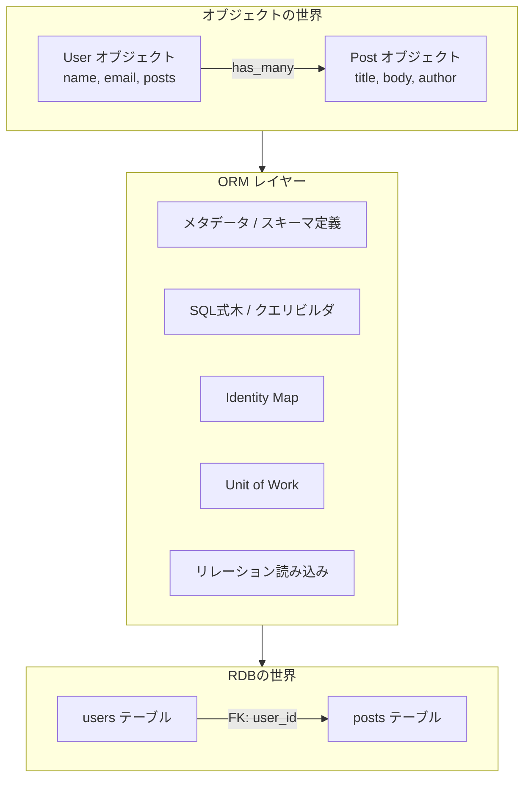
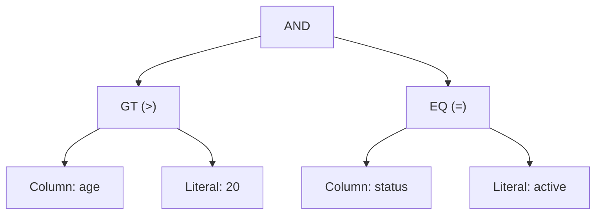
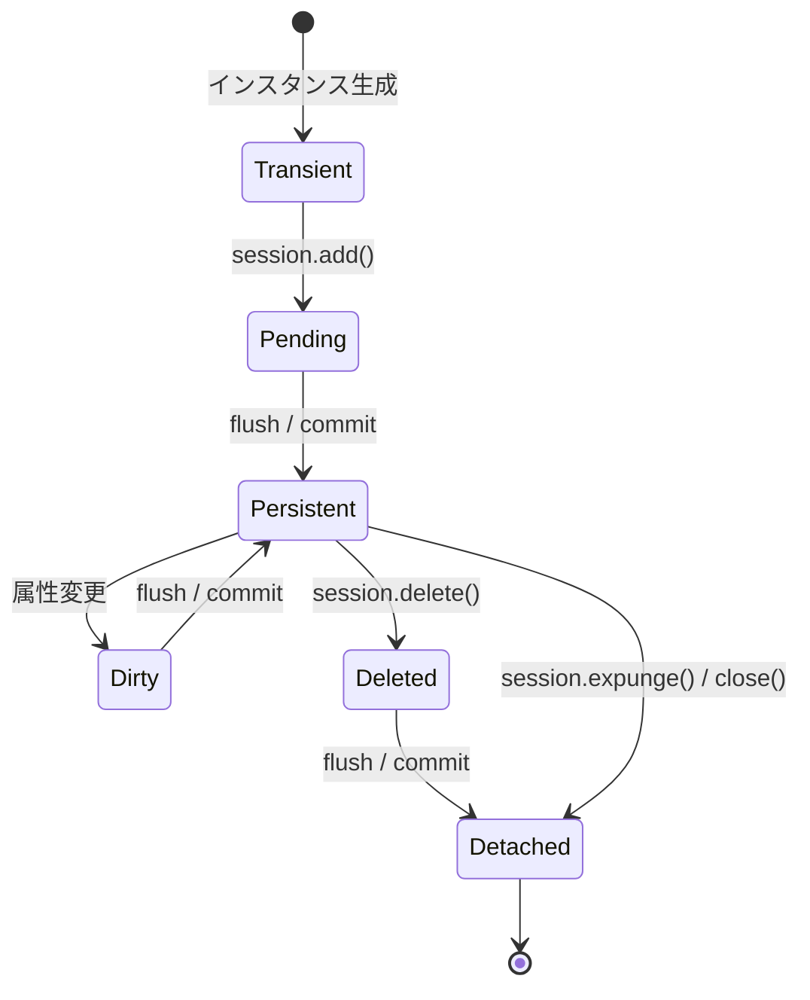
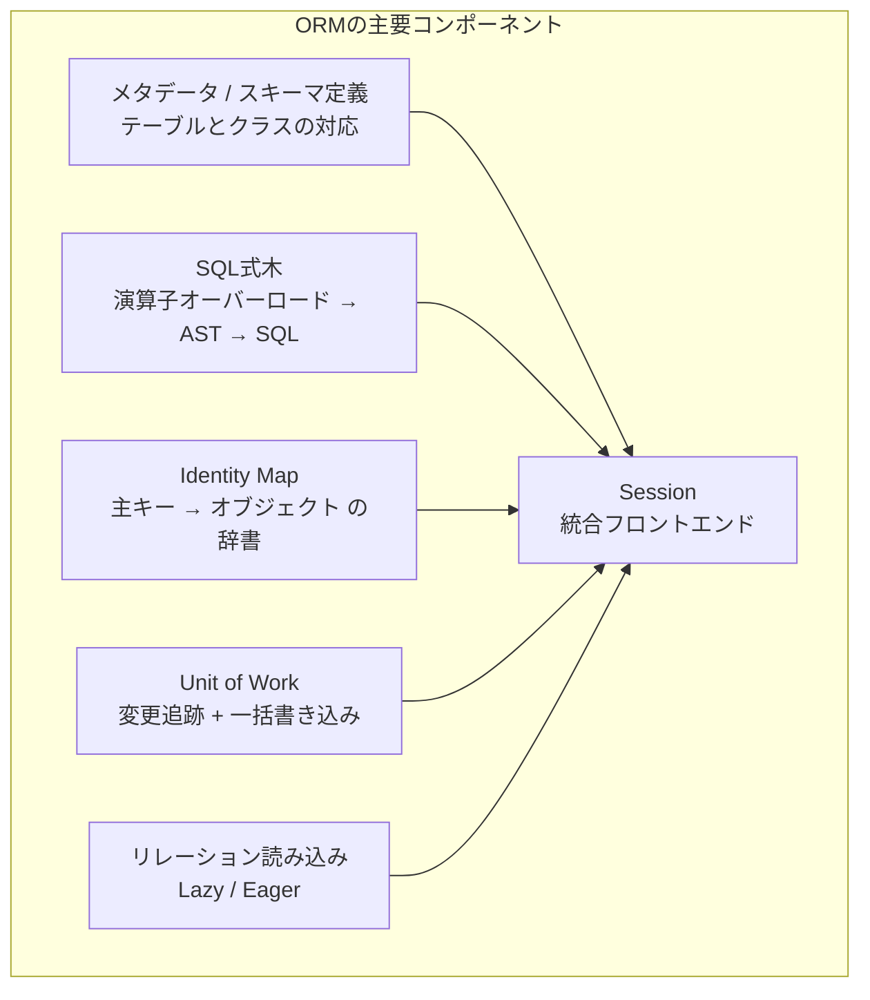

`session.query(User).filter(User.age > 20).all()` と書くだけで、SQLが生成され、データベースから取得した行がPythonオブジェクトに変換される——ORMは「魔法」のように見えますが、その裏側には明確な設計原理があります。

この記事では、ORM（Object-Relational Mapping）の内部構造をゼロからPythonで実装しながら解き明かします。Martin Fowlerの<strong>Patterns of Enterprise Application Architecture（PoEAA）</strong>で体系化されたパターンを軸に、SQLAlchemyやDjango ORMなど現実のORMの設計判断を理解できるようになることを目指します。

## ORMの全体像

ORMは「オブジェクト指向のドメインモデル」と「リレーショナルデータベースのテーブル」という、本質的に異なる2つの世界を橋渡しするソフトウェアです。この不一致は<strong>インピーダンスミスマッチ</strong>（object-relational impedance mismatch）と呼ばれ、ORMが解決する根本的な問題です。



ORMの内部は、以下の主要コンポーネントから構成されています：

| コンポーネント | 責務 | 対応するPoEAAパターン |
|---|---|---|
| メタデータ / スキーマ定義 | テーブルとクラスの対応関係を記述 | Metadata Mapping |
| SQL式木 / クエリビルダ | Pythonの式からSQL文を組み立てる | Query Object |
| Identity Map | 同一行を同一オブジェクトにマッピング | Identity Map |
| Unit of Work | 変更を追跡し一括でDBに書き込む | Unit of Work |
| リレーション読み込み | 関連オブジェクトの遅延/先行読み込み | Lazy Load / Eager Load |

## 第1章　Active Recordパターン vs Data Mapperパターン

ORMの設計は大きく2つのアーキテクチャパターンに分類できます。まずこの2つの違いを理解しましょう。

### Active Record

<strong>Active Record</strong>は、データベースの1行をオブジェクトとして表現し、そのオブジェクト自身がCRUD操作のメソッドを持つパターンです。

```python
class User:
    """Active Recordパターン: オブジェクト自身がDB操作を知っている"""

    def __init__(self, name: str, email: str, id: int | None = None):
        self.id = id
        self.name = name
        self.email = email

    def save(self):
        """自身の状態をDBに保存する"""
        if self.id is None:
            cursor.execute(
                "INSERT INTO users (name, email) VALUES (?, ?)",
                (self.name, self.email),
            )
            self.id = cursor.lastrowid
        else:
            cursor.execute(
                "UPDATE users SET name = ?, email = ? WHERE id = ?",
                (self.name, self.email, self.id),
            )

    def delete(self):
        """自身をDBから削除する"""
        cursor.execute("DELETE FROM users WHERE id = ?", (self.id,))

    @classmethod
    def find(cls, id: int) -> "User":
        """主キーでDBから検索してオブジェクトを返す"""
        row = cursor.execute(
            "SELECT id, name, email FROM users WHERE id = ?", (id,)
        ).fetchone()
        return cls(name=row[1], email=row[2], id=row[0])
```

```python
# 使い方：オブジェクトがDB操作を直接実行する
user = User(name="Alice", email="alice@example.com")
user.save()        # INSERT文が実行される
user.name = "Bob"
user.save()        # UPDATE文が実行される
```

Active Recordの特徴は<strong>シンプルさ</strong>です。テーブルとクラスが1対1に対応し、オブジェクトがデータアクセスロジックを直接持つため、学習コストが低く少ないコードで動作します。Ruby on Rails, Django ORM, Laravel Eloquent がこのパターンを採用しています。

しかし、ドメインモデルがデータベース構造に強く依存する（テーブルの列がそのままオブジェクトの属性になる）ため、複雑なビジネスロジックを持つ大規模アプリケーションでは設計上の制約になることがあります。

### Data Mapper

<strong>Data Mapper</strong>は、ドメインオブジェクトとデータベースの間に独立したマッパー層を置くパターンです。ドメインオブジェクトはデータベースの存在を一切知りません。

```python
class User:
    """Data Mapperパターン: オブジェクトはDB操作を知らない"""

    def __init__(self, name: str, email: str, id: int | None = None):
        self.id = id
        self.name = name
        self.email = email


class UserMapper:
    """User オブジェクトとDBの仲介役"""

    def __init__(self, connection):
        self.conn = connection

    def find(self, id: int) -> User:
        row = self.conn.execute(
            "SELECT id, name, email FROM users WHERE id = ?", (id,)
        ).fetchone()
        return User(name=row[1], email=row[2], id=row[0])

    def insert(self, user: User):
        cursor = self.conn.execute(
            "INSERT INTO users (name, email) VALUES (?, ?)",
            (user.name, user.email),
        )
        user.id = cursor.lastrowid

    def update(self, user: User):
        self.conn.execute(
            "UPDATE users SET name = ?, email = ? WHERE id = ?",
            (user.name, user.email, user.id),
        )
```

```python
# 使い方：マッパーがDB操作を仲介する
mapper = UserMapper(connection)
user = User(name="Alice", email="alice@example.com")
mapper.insert(user)   # マッパーがINSERTを実行
user.name = "Bob"
mapper.update(user)   # マッパーがUPDATEを実行
```

Data Mapperの特徴は<strong>関心の分離</strong>です。ドメインモデルがデータベーススキーマから独立しており、テーブル構造とオブジェクト構造を自由に変えられます。SQLAlchemy（Classicalマッピング）、Hibernate、Entity Framework Coreがこのパターンを基盤としています。

### 2つのパターンの比較

| 観点 | Active Record | Data Mapper |
|---|---|---|
| ドメインオブジェクトの責務 | データ + DB操作 | データのみ |
| テーブルとクラスの関係 | 1対1 | 自由にマッピング可能 |
| 学習コスト | 低い | 高い |
| テスト容易性 | DB依存が混入しやすい | ドメインロジックを単体テストしやすい |
| 代表的なORM | Django ORM, Rails AR, Eloquent | SQLAlchemy, Hibernate, EF Core |

この記事ではこれ以降、より多くのORMの内部構造を学べるData Mapperパターンをベースに、各コンポーネントを実装していきます。

## 第2章　メタデータとスキーマ定義

ORMの出発点は「Pythonのクラスがどのテーブル・どのカラムに対応するか」を記述する<strong>メタデータ</strong>です。

### 2.1 カラムとテーブルの定義

まず、カラムとテーブルを表現するクラスを実装します。

```python
from dataclasses import dataclass, field


@dataclass
class Column:
    """テーブルのカラムを表す"""

    name: str
    column_type: str  # "INTEGER", "TEXT", "REAL" など
    primary_key: bool = False
    nullable: bool = True
    default: object = None

    def __set_name__(self, owner, name):
        """ディスクリプタプロトコル: クラスに定義されたときに属性名を記録"""
        if not self.name:
            self.name = name


@dataclass
class Table:
    """テーブルのメタデータを表す"""

    name: str
    columns: list[Column] = field(default_factory=list)
    _column_map: dict[str, Column] = field(default_factory=dict, repr=False)

    def add_column(self, column: Column):
        self.columns.append(column)
        self._column_map[column.name] = column

    @property
    def primary_key(self) -> Column | None:
        for col in self.columns:
            if col.primary_key:
                return col
        return None

    def create_table_sql(self) -> str:
        """CREATE TABLE文を生成する"""
        col_defs = []
        for col in self.columns:
            parts = [col.name, col.column_type]
            if col.primary_key:
                parts.append("PRIMARY KEY")
            if not col.nullable and not col.primary_key:
                parts.append("NOT NULL")
            col_defs.append(" ".join(parts))
        return f"CREATE TABLE IF NOT EXISTS {self.name} ({', '.join(col_defs)})"
```

### 2.2 マッピングレジストリ

次に、Pythonのクラスとテーブルメタデータの対応関係を管理するレジストリを作ります。SQLAlchemyでいう `registry` や `MetaData` に相当するコンポーネントです。

```python
class Registry:
    """クラスとテーブルのマッピングを管理する"""

    def __init__(self):
        self._mappings: dict[type, Table] = {}

    def map_class(self, cls: type, table: Table):
        """クラスとテーブルを紐づける"""
        self._mappings[cls] = table

    def get_table(self, cls: type) -> Table:
        """クラスに対応するテーブルを取得する"""
        return self._mappings[cls]

    def __contains__(self, cls: type) -> bool:
        return cls in self._mappings
```

```python
# 使い方: クラスとテーブルのマッピングを登録
registry = Registry()

users_table = Table(name="users")
users_table.add_column(Column("id", "INTEGER", primary_key=True))
users_table.add_column(Column("name", "TEXT", nullable=False))
users_table.add_column(Column("email", "TEXT", nullable=False))

class User:
    def __init__(self, name: str, email: str, id: int | None = None):
        self.id = id
        self.name = name
        self.email = email

registry.map_class(User, users_table)
```

これがSQLAlchemyの「Classicalマッピング」に近い形です。SQLAlchemy 2.0以降では宣言的マッピング（Declarative Mapping）が主流ですが、内部的には同様のレジストリを構築しています。

### 2.3 宣言的マッピング（メタクラスによる自動登録）

手動での `map_class` は面倒なので、Pythonのメタクラスを使って宣言的に記述できるようにします。

```python
_global_registry = Registry()


class ModelMeta(type):
    """モデルクラスのメタクラス: クラス定義時にテーブルマッピングを自動登録"""

    def __new__(mcs, name, bases, namespace):
        cls = super().__new__(mcs, name, bases, namespace)

        # 基底クラス（Model自身）はスキップ
        if name == "Model":
            return cls

        # __tablename__ からテーブル名を決定
        table_name = namespace.get("__tablename__", name.lower() + "s")
        table = Table(name=table_name)

        # Column インスタンスを収集
        for attr_name, attr_value in namespace.items():
            if isinstance(attr_value, Column):
                if not attr_value.name:
                    attr_value.name = attr_name
                table.add_column(attr_value)

        _global_registry.map_class(cls, table)
        return cls


class Model(metaclass=ModelMeta):
    """全モデルの基底クラス"""
    pass
```

```python
# 宣言的にモデルを定義
class User(Model):
    __tablename__ = "users"

    id = Column("id", "INTEGER", primary_key=True)
    name = Column("name", "TEXT", nullable=False)
    email = Column("email", "TEXT", nullable=False)

# メタクラスが自動的に users テーブルとのマッピングを登録する
table = _global_registry.get_table(User)
print(table.create_table_sql())
# => CREATE TABLE IF NOT EXISTS users (id INTEGER PRIMARY KEY, name TEXT NOT NULL, email TEXT NOT NULL)
```

この仕組みは、SQLAlchemyの `DeclarativeBase`、Django ORMの `models.Model` と本質的に同じです。メタクラス（またはPython 3.6以降の `__init_subclass__`）を使って、クラス定義時にメタデータを自動収集しています。

## 第3章　SQL式木とクエリビルダ

ORMの最も巧妙な部分の一つが、Pythonの式をSQL文に変換する仕組みです。`User.age > 20` と書くとPythonオブジェクトが返り、最終的に `WHERE age > 20` というSQL文字列が生成されます。

### 3.1 式ノードの定義（AST）

SQL文はツリー構造（抽象構文木 = AST）として表現できます。



この木を定義するクラス群を実装します。

```python
from abc import ABC, abstractmethod


class Expression(ABC):
    """SQL式の抽象基底クラス"""

    @abstractmethod
    def to_sql(self) -> tuple[str, list]:
        """SQL文字列とパラメータのタプルを返す"""
        ...

    def __and__(self, other: "Expression") -> "BinaryOp":
        return BinaryOp("AND", self, other)

    def __or__(self, other: "Expression") -> "BinaryOp":
        return BinaryOp("OR", self, other)

    def __invert__(self) -> "UnaryOp":
        return UnaryOp("NOT", self)


class ColumnExpr(Expression):
    """カラムへの参照を表す式"""

    def __init__(self, table_name: str, column_name: str):
        self.table_name = table_name
        self.column_name = column_name

    def to_sql(self) -> tuple[str, list]:
        return f"{self.table_name}.{self.column_name}", []

    # 比較演算子のオーバーロード
    def __eq__(self, other) -> "BinaryOp":  # type: ignore[override]
        return BinaryOp("=", self, _to_expr(other))

    def __ne__(self, other) -> "BinaryOp":  # type: ignore[override]
        return BinaryOp("!=", self, _to_expr(other))

    def __gt__(self, other) -> "BinaryOp":
        return BinaryOp(">", self, _to_expr(other))

    def __ge__(self, other) -> "BinaryOp":
        return BinaryOp(">=", self, _to_expr(other))

    def __lt__(self, other) -> "BinaryOp":
        return BinaryOp("<", self, _to_expr(other))

    def __le__(self, other) -> "BinaryOp":
        return BinaryOp("<=", self, _to_expr(other))

    def in_(self, values: list) -> "InOp":
        return InOp(self, values)

    def like(self, pattern: str) -> "BinaryOp":
        return BinaryOp("LIKE", self, Literal(pattern))


class Literal(Expression):
    """リテラル値を表す式"""

    def __init__(self, value):
        self.value = value

    def to_sql(self) -> tuple[str, list]:
        return "?", [self.value]


class BinaryOp(Expression):
    """二項演算を表す式"""

    def __init__(self, op: str, left: Expression, right: Expression):
        self.op = op
        self.left = left
        self.right = right

    def to_sql(self) -> tuple[str, list]:
        left_sql, left_params = self.left.to_sql()
        right_sql, right_params = self.right.to_sql()
        return f"({left_sql} {self.op} {right_sql})", left_params + right_params


class UnaryOp(Expression):
    """単項演算を表す式"""

    def __init__(self, op: str, operand: Expression):
        self.op = op
        self.operand = operand

    def to_sql(self) -> tuple[str, list]:
        sql, params = self.operand.to_sql()
        return f"({self.op} {sql})", params


class InOp(Expression):
    """IN演算を表す式"""

    def __init__(self, column: ColumnExpr, values: list):
        self.column = column
        self.values = values

    def to_sql(self) -> tuple[str, list]:
        col_sql, col_params = self.column.to_sql()
        placeholders = ", ".join("?" for _ in self.values)
        return f"{col_sql} IN ({placeholders})", col_params + list(self.values)


def _to_expr(value) -> Expression:
    """Pythonの値をExpression に変換するヘルパー"""
    if isinstance(value, Expression):
        return value
    return Literal(value)
```

### 3.2 演算子オーバーロードの仕組み

ここが核心です。Pythonの演算子オーバーロード（`__eq__`, `__gt__` など）を使い、<strong>比較式がSQL式ツリーのノードを返す</strong>ようにしています。

```python
# ColumnExpr を作成
age = ColumnExpr("users", "age")
status = ColumnExpr("users", "status")

# Python の比較演算子がSQL式ノードを返す
expr = (age > 20) & (status == "active")

# SQL に変換
sql, params = expr.to_sql()
print(sql)     # => ((users.age > ?) AND (users.status = ?))
print(params)  # => [20, 'active']
```

通常の `User.age > 20` はPythonでは `True` か `False` を返しますが、`age` が `ColumnExpr` のインスタンスの場合、`__gt__` が呼ばれて `BinaryOp(">", ColumnExpr("users", "age"), Literal(20))` という<strong>式ツリーのノード</strong>が返ります。この式ツリーを走査（traverse）してSQL文字列を組み立てるのです。

SQLAlchemyでは、この仕組みを `PropComparator` クラスと `InstrumentedAttribute` ディスクリプタで実現しています。モデルクラスの属性にアクセスすると、ディスクリプタが `ColumnExpr` 相当のオブジェクトを返し、演算子オーバーロードでSQL式ツリーが構築されます。

### 3.3 Queryクラスの実装

式ツリーを使って `SELECT` 文を組み立てるクエリビルダを実装します。

```python
class Query:
    """SELECTクエリを構築するビルダー"""

    def __init__(self, table: Table, model_class: type):
        self.table = table
        self.model_class = model_class
        self._where: Expression | None = None
        self._order_by: list[tuple[str, str]] = []
        self._limit: int | None = None
        self._offset: int | None = None

    def filter(self, *conditions: Expression) -> "Query":
        """WHERE条件を追加する（AND結合）"""
        for condition in conditions:
            if self._where is None:
                self._where = condition
            else:
                self._where = self._where & condition
        return self

    def order_by(self, column_name: str, direction: str = "ASC") -> "Query":
        """ORDER BY句を追加する"""
        self._order_by.append((column_name, direction))
        return self

    def limit(self, n: int) -> "Query":
        self._limit = n
        return self

    def offset(self, n: int) -> "Query":
        self._offset = n
        return self

    def build_sql(self) -> tuple[str, list]:
        """SQL文とパラメータを生成する"""
        columns = ", ".join(col.name for col in self.table.columns)
        sql = f"SELECT {columns} FROM {self.table.name}"
        params: list = []

        if self._where is not None:
            where_sql, where_params = self._where.to_sql()
            sql += f" WHERE {where_sql}"
            params.extend(where_params)

        if self._order_by:
            order_parts = [f"{col} {direction}" for col, direction in self._order_by]
            sql += f" ORDER BY {', '.join(order_parts)}"

        if self._limit is not None:
            sql += f" LIMIT {self._limit}"

        if self._offset is not None:
            sql += f" OFFSET {self._offset}"

        return sql, params
```

```python
# 使い方
age = ColumnExpr("users", "age")
status = ColumnExpr("users", "status")

query = (
    Query(users_table, User)
    .filter(age > 20, status == "active")
    .order_by("name")
    .limit(10)
)
sql, params = query.build_sql()
print(sql)
# => SELECT id, name, email FROM users WHERE ((users.age > ?) AND (users.status = ?)) ORDER BY name ASC LIMIT 10
print(params)
# => [20, 'active']
```

このメソッドチェーン方式のクエリビルダはSQLAlchemy, Django ORM (QuerySet), Entity Framework Core (LINQ) いずれでも採用されています。各メソッドは自身のコピーを返し（イミュータブルなクエリ構築）、最終的にSQLを生成・実行する時点まで遅延評価されます。

### 3.4 パラメータバインド（SQLインジェクション対策）

上の実装で重要なのは、<strong>ユーザー入力の値を直接SQL文字列に埋め込まず、パラメータプレースホルダ（`?`）を使っている</strong>点です。

```python
# ❌ 危険: SQLインジェクションの脆弱性
sql = f"SELECT * FROM users WHERE name = '{user_input}'"

# ✅ 安全: パラメータバインド
sql = "SELECT * FROM users WHERE name = ?"
params = [user_input]
cursor.execute(sql, params)
```

全てのORMはパラメータバインドを内部で使用しており、これがSQLインジェクション攻撃を防ぐ重要な防御線になっています。式ツリーを介することで、ユーザー入力値は常に `Literal` ノードとしてパラメータリストに分離されます。

## 第4章　Identity Map — 同一行は同一オブジェクト

Identity Mapは、Martin Fowlerが<strong>Patterns of Enterprise Application Architecture</strong>で定義したパターンで、「データベースから読み込んだオブジェクトを辞書に保持し、同じ主キーの行に対して常に同一のオブジェクトインスタンスを返す」仕組みです。

### 4.1 なぜ Identity Map が必要なのか

Identity Mapがない場合、以下のような問題が発生します。

```python
# Identity Map なし
user1 = mapper.find(1)  # SELECT ... WHERE id = 1 -> User(name="Alice")
user2 = mapper.find(1)  # SELECT ... WHERE id = 1 -> User(name="Alice")（別クエリ）

user1.name = "Bob"
print(user2.name)  # "Alice" — 別オブジェクトなので変更が反映されない！
print(user1 is user2)  # False — 同じ行なのに別オブジェクト
```

これは<strong>オブジェクトの同一性（identity）が壊れている</strong>状態です。同じデータベース行を表す2つのオブジェクトが独立に存在し、片方の変更がもう片方に反映されません。また、毎回新しいSELECTを発行するのは非効率です。

### 4.2 Identity Map の実装

```python
class IdentityMap:
    """主キーでオブジェクトを追跡するマップ"""

    def __init__(self):
        self._map: dict[tuple[type, object], object] = {}

    def get(self, cls: type, pk: object) -> object | None:
        """キャッシュからオブジェクトを取得する"""
        return self._map.get((cls, pk))

    def put(self, cls: type, pk: object, instance: object):
        """オブジェクトをキャッシュに登録する"""
        self._map[(cls, pk)] = instance

    def remove(self, cls: type, pk: object):
        """オブジェクトをキャッシュから削除する"""
        self._map.pop((cls, pk), None)

    def clear(self):
        """全キャッシュをクリアする"""
        self._map.clear()

    def __contains__(self, key: tuple[type, object]) -> bool:
        return key in self._map
```

### 4.3 Identity Map を使ったマッパー

```python
class UserMapper:
    """Identity Map を組み込んだ Data Mapper"""

    def __init__(self, connection, identity_map: IdentityMap):
        self.conn = connection
        self.identity_map = identity_map

    def find(self, id: int) -> User:
        # 1. まず Identity Map を確認
        cached = self.identity_map.get(User, id)
        if cached is not None:
            return cached

        # 2. キャッシュになければDBから取得
        row = self.conn.execute(
            "SELECT id, name, email FROM users WHERE id = ?", (id,)
        ).fetchone()
        if row is None:
            raise ValueError(f"User with id={id} not found")

        user = User(name=row[1], email=row[2], id=row[0])

        # 3. Identity Map に登録
        self.identity_map.put(User, id, user)
        return user
```

```python
# Identity Map あり
identity_map = IdentityMap()
mapper = UserMapper(connection, identity_map)

user1 = mapper.find(1)  # DBからSELECT（1回目）
user2 = mapper.find(1)  # Identity Map からヒット（SQLなし）

print(user1 is user2)  # True — 同一オブジェクト！
user1.name = "Bob"
print(user2.name)  # "Bob" — 同じオブジェクトなので自動的に反映
```

SQLAlchemyでは `Session` オブジェクトが内部に `IdentityMap` を持っています。`session.get(User, 1)` を呼ぶと、まずIdentity Mapを確認し、存在すればSQLを発行せずにオブジェクトを返します。セッションを閉じる（`session.close()`）か全オブジェクトを排出する（`session.expunge_all()`）と、Identity Mapがクリアされます。なお `session.expire_all()` は属性を「期限切れ」にマークするだけで、オブジェクト自体はIdentity Mapに残ります。

## 第5章　Unit of Work — 変更追跡と一括書き込み

Unit of Workは、Martin Fowlerが「ビジネストランザクション中に影響を受けたオブジェクトのリストを管理し、変更の書き込みと並行性問題の解決を調整する」パターンとして定義したものです。

### 5.1 なぜ Unit of Work が必要なのか

Identity Mapなしの素朴な実装では、オブジェクトを変更するたびにSQLを発行します。

```python
user.name = "Bob"       # UPDATE users SET name = 'Bob' WHERE id = 1
user.email = "b@x.com"  # UPDATE users SET email = 'b@x.com' WHERE id = 1
```

これは非効率的です。2つの変更を1つの `UPDATE` にまとめるべきです。また、複数のオブジェクトへの変更を一つのデータベーストランザクション内でまとめてコミットしたい場合もあります。

Unit of Workは、<strong>オブジェクトの変更をメモリ上で追跡し、明示的に「フラッシュ (flush)」するまでSQLを発行しない</strong>という戦略をとります。

### 5.2 オブジェクトの状態遷移

Unit of Workが管理するオブジェクトは、以下の状態を持ちます。



- <strong>Transient（一時的）</strong>: まだセッションに追加されていない新規オブジェクト
- <strong>Pending（保留中）</strong>: `add()` されたが、まだDBにINSERTされていない
- <strong>Persistent（永続化済み）</strong>: DBに存在し、セッションが追跡中
- <strong>Dirty（変更あり）</strong>: 属性が変更されたが、まだDBに反映されていない
- <strong>Deleted（削除予定）</strong>: 削除がマークされたが、まだDBからDELETEされていない
- <strong>Detached（分離済み）</strong>: かつてセッションに属していたが、現在は追跡対象外

これはSQLAlchemyの `InstanceState` がまさに管理する状態遷移そのものです。

### 5.3 Dirty Tracking（変更検知）の実装

属性の変更を検知する方法には、大きく2つのアプローチがあります。

<strong>アプローチ1: スナップショット比較</strong>

オブジェクトが読み込まれた時点の属性値を保存しておき、フラッシュ時に現在の値と比較します。

```python
class SnapshotTracker:
    """スナップショットベースの変更追跡"""

    def __init__(self):
        self._snapshots: dict[int, dict[str, object]] = {}

    def take_snapshot(self, obj: object, columns: list[str]):
        """現在の属性値のスナップショットを保存"""
        snapshot = {col: getattr(obj, col) for col in columns}
        self._snapshots[id(obj)] = snapshot

    def get_dirty_attributes(self, obj: object, columns: list[str]) -> dict[str, object]:
        """変更された属性を検出して返す"""
        snapshot = self._snapshots.get(id(obj), {})
        dirty = {}
        for col in columns:
            current = getattr(obj, col)
            if col not in snapshot or snapshot[col] != current:
                dirty[col] = current
        return dirty
```

<strong>アプローチ2: ディスクリプタによるインターセプト</strong>

Pythonのディスクリプタ（`__set__` / `__get__`）を使い、属性への代入を横取り（intercept）します。

```python
class TrackedAttribute:
    """属性への書き込みを検知するディスクリプタ"""

    def __init__(self, name: str):
        self.name = name
        self.attr_name = f"_tracked_{name}"

    def __get__(self, obj, objtype=None):
        if obj is None:
            return self  # クラスからアクセスされた場合はディスクリプタ自身を返す
        return getattr(obj, self.attr_name, None)

    def __set__(self, obj, value):
        old_value = getattr(obj, self.attr_name, _UNSET)
        setattr(obj, self.attr_name, value)
        # 値が変更されたことを Unit of Work に通知
        if old_value is not _UNSET and old_value != value:
            _notify_dirty(obj, self.name, old_value, value)


_UNSET = object()  # センチネル値


def _notify_dirty(obj, attr_name, old_value, new_value):
    """変更通知（後述の UnitOfWork に接続する）"""
    if hasattr(obj, "_unit_of_work") and obj._unit_of_work is not None:
        obj._unit_of_work.mark_dirty(obj)
```

SQLAlchemyは後者のアプローチを採用しており、`InstrumentedAttribute` というディスクリプタがクラスの各属性を置き換え（instrument）ます。属性への代入が発生すると、ディスクリプタが変更イベントを `InstanceState` （各オブジェクトに紐づく状態管理オブジェクト）に通知し、`Session` の dirty セットに登録します。

### 5.4 Unit of Work の実装

```python
class UnitOfWork:
    """変更を追跡し、一括でDBに書き込む"""

    def __init__(self, connection, registry: Registry):
        self.conn = connection
        self.registry = registry
        self.identity_map = IdentityMap()
        self._new: list[object] = []       # INSERT対象
        self._dirty: set[object] = set()   # UPDATE対象
        self._deleted: list[object] = []   # DELETE対象
        self._snapshot_tracker = SnapshotTracker()

    def register_new(self, obj: object):
        """新しいオブジェクト（INSERT対象）を登録する"""
        self._new.append(obj)

    def mark_dirty(self, obj: object):
        """変更されたオブジェクト（UPDATE対象）をマークする"""
        self._dirty.add(obj)

    def register_deleted(self, obj: object):
        """削除対象のオブジェクトを登録する"""
        self._deleted.append(obj)

    def commit(self):
        """追跡中の全変更をDBに書き込む"""
        try:
            self._do_inserts()
            self._do_updates()
            self._do_deletes()
            self.conn.commit()
            # コミット後にクリア
            self._new.clear()
            self._dirty.clear()
            self._deleted.clear()
        except Exception:
            self.conn.rollback()
            raise

    def _do_inserts(self):
        for obj in self._new:
            table = self.registry.get_table(type(obj))
            columns = [c for c in table.columns if not c.primary_key]
            col_names = ", ".join(c.name for c in columns)
            placeholders = ", ".join("?" for _ in columns)
            values = [getattr(obj, c.name) for c in columns]

            cursor = self.conn.execute(
                f"INSERT INTO {table.name} ({col_names}) VALUES ({placeholders})",
                values,
            )
            # 自動生成されたPKを設定
            pk_col = table.primary_key
            if pk_col:
                setattr(obj, pk_col.name, cursor.lastrowid)

            # Identity Map に登録
            self.identity_map.put(type(obj), cursor.lastrowid, obj)
            # スナップショットを保存
            col_names_list = [c.name for c in table.columns]
            self._snapshot_tracker.take_snapshot(obj, col_names_list)

    def _do_updates(self):
        for obj in self._dirty:
            table = self.registry.get_table(type(obj))
            col_names_list = [c.name for c in table.columns if not c.primary_key]
            dirty_attrs = self._snapshot_tracker.get_dirty_attributes(obj, col_names_list)

            if not dirty_attrs:
                continue

            set_clause = ", ".join(f"{col} = ?" for col in dirty_attrs)
            values = list(dirty_attrs.values())
            pk_col = table.primary_key
            pk_value = getattr(obj, pk_col.name)
            values.append(pk_value)

            self.conn.execute(
                f"UPDATE {table.name} SET {set_clause} WHERE {pk_col.name} = ?",
                values,
            )
            # スナップショットを更新
            self._snapshot_tracker.take_snapshot(obj, [c.name for c in table.columns])

    def _do_deletes(self):
        for obj in self._deleted:
            table = self.registry.get_table(type(obj))
            pk_col = table.primary_key
            pk_value = getattr(obj, pk_col.name)
            self.conn.execute(
                f"DELETE FROM {table.name} WHERE {pk_col.name} = ?",
                (pk_value,),
            )
            self.identity_map.remove(type(obj), pk_value)
```

### 5.5 使用例

```python
import sqlite3

conn = sqlite3.connect(":memory:")
conn.execute(users_table.create_table_sql())

uow = UnitOfWork(conn, _global_registry)

# INSERT: 新しいオブジェクトを登録
alice = User(name="Alice", email="alice@example.com")
bob = User(name="Bob", email="bob@example.com")
uow.register_new(alice)
uow.register_new(bob)

# この時点ではまだSQLは発行されていない
uow.commit()  # ここで2つのINSERT + COMMITが実行される

# UPDATE: 属性を変更してdirtyに
alice.name = "Alice Smith"
uow.mark_dirty(alice)
uow.commit()  # UPDATE users SET name = ? WHERE id = ? が実行される

# DELETE: 削除を登録
uow.register_deleted(bob)
uow.commit()  # DELETE FROM users WHERE id = ? が実行される
```

SQLAlchemy では `session.add(obj)` → `session.commit()` がこの `register_new` → `commit` に対応します。`commit()` 時に内部で `flush()` が呼ばれ、Unit of Work が `_new`, `_dirty`, `_deleted` を走査してSQL文を発行します。

### 5.6 トポロジカルソートによる書き込み順序の決定

実際のORMでは、外部キー制約のために書き込み順序が重要です。例えば、`users` テーブルの行を `posts` テーブルが参照している場合、INSERT は `users` → `posts` の順、DELETE は `posts` → `users` の順で実行する必要があります。

SQLAlchemy の Unit of Work は、テーブル間の外部キー依存関係を有向グラフとして構築し、<strong>トポロジカルソート</strong>でINSERT/DELETEの適切な実行順序を決定します。

```python
from collections import defaultdict


def topological_sort(dependencies: dict[str, list[str]]) -> list[str]:
    """依存関係グラフをトポロジカルソートする

    Args:
        dependencies: テーブル名 -> 依存先テーブル名のリスト
                      例: {"posts": ["users"]} は posts が users に依存

    Returns:
        依存関係を満たす実行順序のリスト
    """
    in_degree: dict[str, int] = defaultdict(int)
    graph: dict[str, list[str]] = defaultdict(list)
    all_nodes: set[str] = set()

    for node, deps in dependencies.items():
        all_nodes.add(node)
        for dep in deps:
            all_nodes.add(dep)
            graph[dep].append(node)
            in_degree[node] += 1

    # 入次数0のノードからスタート（カーンのアルゴリズム）
    queue = [n for n in all_nodes if in_degree[n] == 0]
    result = []

    while queue:
        node = queue.pop(0)
        result.append(node)
        for neighbor in graph[node]:
            in_degree[neighbor] -= 1
            if in_degree[neighbor] == 0:
                queue.append(neighbor)

    if len(result) != len(all_nodes):
        raise ValueError("循環依存が検出されました")

    return result
```

```python
# 例: users -> posts -> comments の依存関係
deps = {
    "posts": ["users"],        # posts は users に依存（FK: user_id）
    "comments": ["posts"],     # comments は posts に依存（FK: post_id）
    "users": [],               # users は独立
}
order = topological_sort(deps)
print(order)  # => ['users', 'posts', 'comments']
# INSERT はこの順序で、DELETE は逆順で実行する
```

## 第6章　リレーションシップの読み込み

ORMの力が最も発揮されるのが、テーブル間の関連（リレーションシップ）を自動的にオブジェクトグラフとして構築する機能です。しかし、ここにはパフォーマンス上の重要な落とし穴もあります。

### 6.1 リレーションシップの定義

```python
from enum import Enum


class LoadStrategy(Enum):
    LAZY = "lazy"      # アクセス時にSELECTを発行
    EAGER = "eager"    # 親と同時にJOIN/サブクエリで読み込み


@dataclass
class Relationship:
    """テーブル間のリレーションシップを定義する"""

    target_class: type
    foreign_key: str         # 子テーブル側のFK列名
    back_populates: str | None = None
    load_strategy: LoadStrategy = LoadStrategy.LAZY
    many: bool = True        # True: 1対多、False: 多対1
```

### 6.2 遅延読み込み（Lazy Loading）

遅延読み込みは、リレーション先のオブジェクトが<strong>実際にアクセスされるまでロードしない</strong>戦略です。Pythonのディスクリプタを使って実装できます。

```python
class LazyLoader:
    """遅延読み込みを実現するディスクリプタ"""

    def __init__(self, relationship: Relationship, mapper_factory):
        self.relationship = relationship
        self.mapper_factory = mapper_factory
        self.attr_name = f"_lazy_{id(self)}"

    def __get__(self, obj, objtype=None):
        if obj is None:
            return self

        # まだ読み込まれていない場合、DBからロード
        if not hasattr(obj, self.attr_name):
            loaded = self._load(obj)
            setattr(obj, self.attr_name, loaded)
        return getattr(obj, self.attr_name)

    def _load(self, obj):
        """リレーション先をDBからロードする"""
        mapper = self.mapper_factory()
        pk = getattr(obj, "id")
        fk = self.relationship.foreign_key

        if self.relationship.many:
            # 1対多: 子テーブルからFKで検索
            rows = mapper.conn.execute(
                f"SELECT * FROM {mapper.table.name} WHERE {fk} = ?",
                (pk,),
            ).fetchall()
            return [mapper._row_to_object(row) for row in rows]
        else:
            # 多対1: FKの値で親テーブルを検索
            fk_value = getattr(obj, fk)
            return mapper.find(fk_value)
```

```python
class User:
    def __init__(self, name: str, email: str, id: int | None = None):
        self.id = id
        self.name = name
        self.email = email
    # posts 属性は LazyLoader ディスクリプタで定義される
```

```python
user = mapper.find(1)
# この時点では posts はロードされていない（SQL未発行）

print(user.posts)
# ここで初めて SELECT * FROM posts WHERE user_id = 1 が実行される
```

### 6.3 N+1問題

遅延読み込みの最大の問題が<strong>N+1問題</strong>です。

```python
# 全ユーザーを取得: 1回のSELECT
users = session.query(User).all()  # SELECT * FROM users (1回)

# 各ユーザーの投稿にアクセス: ユーザー数分のSELECT
for user in users:
    print(user.posts)
    # SELECT * FROM posts WHERE user_id = 1  (1回)
    # SELECT * FROM posts WHERE user_id = 2  (1回)
    # SELECT * FROM posts WHERE user_id = 3  (1回)
    # ... N回
# 合計: 1 + N 回のクエリ
```

100ユーザーがいれば101回のSQLが発行されます。これは大きなパフォーマンスボトルネックです。

### 6.4 先行読み込み（Eager Loading）

N+1問題の解決策が先行読み込みです。主に2つの方法があります。

<strong>方法1: JOINベース</strong>

```python
def eager_load_join(connection, parent_table: str, child_table: str,
                     fk_column: str) -> list[tuple]:
    """JOINで親子を一括取得"""
    sql = f"""
        SELECT p.*, c.*
        FROM {parent_table} p
        LEFT JOIN {child_table} c ON p.id = c.{fk_column}
    """
    return connection.execute(sql).fetchall()
```

```sql
-- 1回のクエリで全データを取得
SELECT users.*, posts.*
FROM users
LEFT JOIN posts ON users.id = posts.user_id
```

<strong>方法2: サブクエリ（IN句）ベース</strong>

```python
def eager_load_subquery(connection, parent_ids: list[int],
                         child_table: str, fk_column: str) -> list[tuple]:
    """IN句で関連オブジェクトを一括取得"""
    placeholders = ", ".join("?" for _ in parent_ids)
    sql = f"SELECT * FROM {child_table} WHERE {fk_column} IN ({placeholders})"
    return connection.execute(sql, parent_ids).fetchall()
```

```sql
-- 2回のクエリで全データを取得
SELECT * FROM users;
SELECT * FROM posts WHERE user_id IN (1, 2, 3, ...);
```

各ORMでの先行読み込み指定方法：

```python
# SQLAlchemy
users = session.query(User).options(joinedload(User.posts)).all()
# または
users = session.query(User).options(selectinload(User.posts)).all()

# Django ORM
users = User.objects.prefetch_related("posts").all()
# または
users = User.objects.select_related("profile").all()  # ForeignKey/OneToOne用
```

### 6.5 読み込み戦略の使い分け

| 戦略 | クエリ数 | メモリ使用 | 適するケース |
|---|---|---|---|
| 遅延読み込み | 1 + N（最悪） | 最小 | リレーション先にアクセスしない場合 |
| JOIN先行読み込み | 1 | 大（重複行あり） | 1対1関連、小規模データ |
| サブクエリ先行読み込み | 2 | 中 | 1対多関連、大規模データ |

最適な戦略はユースケースによって異なり、安易な「常にeager load」も「常にlazy load」もベストプラクティスではありません。プロファイリングとクエリログの分析が重要です。

## 第7章　Session — すべてを統合する

ここまで実装してきたコンポーネントを統合する `Session` クラスを作ります。SQLAlchemy の `Session` に相当するものです。

```python
class Session:
    """ORMのフロントエンド: Identity Map + Unit of Work を統合"""

    def __init__(self, connection, registry: Registry):
        self.conn = connection
        self.registry = registry
        self.identity_map = IdentityMap()
        self._new: list[object] = []
        self._dirty: set[object] = set()
        self._deleted: list[object] = []
        self._snapshot_tracker = SnapshotTracker()

    def add(self, obj: object):
        """新しいオブジェクトをセッションに追加（INSERT対象）"""
        self._new.append(obj)

    def delete(self, obj: object):
        """オブジェクトを削除対象にマーク"""
        self._deleted.append(obj)

    def get(self, cls: type, pk: object) -> object | None:
        """主キーでオブジェクトを取得（Identity Map優先）"""
        cached = self.identity_map.get(cls, pk)
        if cached is not None:
            return cached

        table = self.registry.get_table(cls)
        pk_col = table.primary_key
        columns = ", ".join(c.name for c in table.columns)
        row = self.conn.execute(
            f"SELECT {columns} FROM {table.name} WHERE {pk_col.name} = ?",
            (pk,),
        ).fetchone()

        if row is None:
            return None

        instance = self._row_to_object(cls, table, row)
        self.identity_map.put(cls, pk, instance)
        col_names = [c.name for c in table.columns]
        self._snapshot_tracker.take_snapshot(instance, col_names)
        return instance

    def query(self, cls: type) -> Query:
        """クエリビルダを返す"""
        table = self.registry.get_table(cls)
        return Query(table, cls)

    def flush(self):
        """未反映の変更をSQLとして発行する（COMMITはしない）"""
        self._do_inserts()
        self._detect_dirty()
        self._do_updates()
        self._do_deletes()

    def commit(self):
        """全変更をDBにコミットする"""
        self.flush()
        self.conn.commit()
        self._new.clear()
        self._dirty.clear()
        self._deleted.clear()

    def rollback(self):
        """変更を破棄してロールバックする"""
        self.conn.rollback()
        self.identity_map.clear()
        self._new.clear()
        self._dirty.clear()
        self._deleted.clear()

    def close(self):
        """セッションをクリーンアップする"""
        self.identity_map.clear()

    # --- 内部メソッド ---

    def _row_to_object(self, cls: type, table: Table, row: tuple) -> object:
        """DBの行をオブジェクトに変換"""
        kwargs = {}
        for i, col in enumerate(table.columns):
            kwargs[col.name] = row[i]
        return cls(**kwargs)

    def _detect_dirty(self):
        """Identity Map内のオブジェクトの変更を検出"""
        for (cls, pk), obj in list(self.identity_map._map.items()):
            table = self.registry.get_table(cls)
            col_names = [c.name for c in table.columns if not c.primary_key]
            dirty = self._snapshot_tracker.get_dirty_attributes(obj, col_names)
            if dirty:
                self._dirty.add(obj)

    def _do_inserts(self):
        for obj in self._new:
            table = self.registry.get_table(type(obj))
            columns = [c for c in table.columns if not c.primary_key]
            col_names = ", ".join(c.name for c in columns)
            placeholders = ", ".join("?" for _ in columns)
            values = [getattr(obj, c.name) for c in columns]

            cursor = self.conn.execute(
                f"INSERT INTO {table.name} ({col_names}) VALUES ({placeholders})",
                values,
            )
            pk_col = table.primary_key
            if pk_col:
                setattr(obj, pk_col.name, cursor.lastrowid)
            self.identity_map.put(type(obj), cursor.lastrowid, obj)
            all_cols = [c.name for c in table.columns]
            self._snapshot_tracker.take_snapshot(obj, all_cols)

    def _do_updates(self):
        for obj in self._dirty:
            table = self.registry.get_table(type(obj))
            col_names = [c.name for c in table.columns if not c.primary_key]
            dirty = self._snapshot_tracker.get_dirty_attributes(obj, col_names)

            if not dirty:
                continue

            set_clause = ", ".join(f"{col} = ?" for col in dirty)
            values = list(dirty.values())
            pk_col = table.primary_key
            values.append(getattr(obj, pk_col.name))

            self.conn.execute(
                f"UPDATE {table.name} SET {set_clause} WHERE {pk_col.name} = ?",
                values,
            )
            self._snapshot_tracker.take_snapshot(obj, [c.name for c in table.columns])

    def _do_deletes(self):
        for obj in self._deleted:
            table = self.registry.get_table(type(obj))
            pk_col = table.primary_key
            pk_value = getattr(obj, pk_col.name)
            self.conn.execute(
                f"DELETE FROM {table.name} WHERE {pk_col.name} = ?",
                (pk_value,),
            )
            self.identity_map.remove(type(obj), pk_value)
```

### 使い方

```python
import sqlite3

conn = sqlite3.connect(":memory:")
conn.execute(users_table.create_table_sql())

session = Session(conn, _global_registry)

# Create
alice = User(name="Alice", email="alice@example.com", id=None)
session.add(alice)
session.commit()
print(alice.id)  # => 1（自動生成されたPK）

# Read（Identity Map 経由）
user = session.get(User, 1)
print(user is alice)  # => True

# Update（変更追跡）
alice.name = "Alice Smith"
session.commit()  # UPDATE文が1つだけ発行される

# Delete
session.delete(alice)
session.commit()  # DELETE文が発行される
```

## 第8章　現実のORMとの対応関係

ここまで実装したコンポーネントが、実際のORMでどのように実現されているかを見てみましょう。

### SQLAlchemy

SQLAlchemy は Python で最も広く使われている ORM で、Data Mapperパターンを基盤としています。

| 本記事の実装 | SQLAlchemy の対応物 |
|---|---|
| `Table`, `Column` | `Table`, `Column` (Core), `mapped_column` (ORM) |
| `Registry` | `registry`, `MetaData` |
| `ModelMeta` (メタクラス) | `DeclarativeBase`, `DeclarativeMeta` |
| `Expression`, `BinaryOp` | `ClauseElement`, `BinaryExpression` (Core) |
| `ColumnExpr` (演算子オーバーロード) | `PropComparator`, `InstrumentedAttribute` |
| `Query` | `Query` (Legacy) / `select()` (2.0 style) |
| `IdentityMap` | `Session.identity_map` (`IdentityMap` クラス) |
| `UnitOfWork` | `Session._flush()` 内の `UOWTransaction` |
| `SnapshotTracker` | `InstanceState._committed_state` |
| `TrackedAttribute` (ディスクリプタ) | `InstrumentedAttribute` + `AttributeEvents` |
| `Session` | `Session` |
| トポロジカルソート | `unitofwork.py` の依存関係ソート |

SQLAlchemy 2.0 では、クエリ構文が `session.query(User)` から `session.execute(select(User))` に変わりました。内部のSQL式ツリーは Core 層で共通化されており、ORM はその上に Identity Map と Unit of Work を重ねた構造になっています。

### Django ORM

Django ORM は Active Record パターンを採用していますが、内部にはData Mapper的な仕組みも存在します。

| 本記事の実装 | Django ORM の対応物 |
|---|---|
| `Table`, `Column` | `Options` (`_meta`), `Field` |
| `ModelMeta` | `ModelBase` (メタクラス) |
| `Expression`, `BinaryOp` | `Q` オブジェクト, `F` オブジェクト, `Lookup` |
| `Query` | `QuerySet` (遅延評価チェーン) |
| `IdentityMap` | なし（Django には組み込みの Identity Map がない） |
| `UnitOfWork` | なし（`save()` で即座にSQL発行） |
| 遅延読み込み | `ForeignKey` のデフォルト動作 |
| 先行読み込み | `select_related()`, `prefetch_related()` |

Django ORM の特徴的な点は、<strong>Identity Map と Unit of Work を持たない</strong>ことです。`Model.save()` を呼ぶと即座にSQL文が発行されます。これは Active Record パターンの設計上の選択であり、シンプルさと引き換えにSQLAlchemy のような一括フラッシュの最適化は行いません。

Django の `QuerySet` は<strong>遅延評価</strong>を採用しており、`.filter().exclude().order_by()` のチェーンではSQLを発行せず、実際にデータが必要になった時点（イテレーション、`len()`、スライスなど）で初めてSQLを実行します。

### Entity Framework Core

Entity Framework Core（EF Core）は .NET のORMで、Data Mapperパターンを基盤としています。

| 本記事の実装 | EF Core の対応物 |
|---|---|
| `Registry` | `ModelBuilder`, `IModel` |
| `Expression`, `BinaryOp` | `Expression Tree` (LINQ) |
| `Query` | `IQueryable<T>` (LINQ to Entities) |
| `IdentityMap` | `DbContext` の Change Tracker |
| `UnitOfWork` | `DbContext.SaveChanges()` |
| 変更追跡 | `ChangeTracker` (スナップショットベース) |

EF Core は C# のLINQ（Language Integrated Query）を使い、コンパイラが生成する<strong>式木（Expression Tree）</strong>をSQLに変換します。Pythonの演算子オーバーロードによるSQL式生成と同じ原理ですが、言語レベルでサポートされている点が異なります。

```csharp
// C# + EF Core: LINQがExpression Treeを生成し、EF CoreがSQLに変換
var users = context.Users
    .Where(u => u.Age > 20 && u.Status == "active")
    .OrderBy(u => u.Name)
    .ToList();
```

## 第9章　パフォーマンスと落とし穴

### 9.1 N+1問題の検出と対策

N+1問題はORMの最も有名なパフォーマンス問題です。検出方法と対策をまとめます。

<strong>検出方法:</strong>

```python
# SQLAlchemy: SQLログを有効化
import logging
logging.getLogger("sqlalchemy.engine").setLevel(logging.INFO)

# Django: django-debug-toolbar または django-silk
# EF Core: Microsoft.Extensions.Logging
```

<strong>対策:</strong>

1. <strong>先行読み込みを明示的に指定する</strong> — SQLAlchemy の `joinedload()` / `selectinload()`、Django の `select_related()` / `prefetch_related()`
2. <strong>必要なカラムだけを取得する</strong> — `session.query(User.name, User.email)` で不要なカラムを除外
3. <strong>生SQLにフォールバックする</strong> — 複雑なクエリはORMを通さず直接SQLを書く

### 9.2 Identity Mapとメモリリーク

長時間のセッションでは、Identity Mapにオブジェクトが蓄積し続けてメモリを圧迫します。

```python
# 対策1: セッションを適切なスコープで管理
with Session(conn, registry) as session:
    # リクエスト単位でセッションを使い、終了時に自動クリア
    ...

# 対策2: 大量データの場合はストリーム処理
for user in session.query(User).yield_per(1000):
    process(user)
    # yield_per は内部的に1000行単位でフェッチし、1オブジェクトずつ yield する
session.expunge_all()  # 処理後に Identity Map から全オブジェクトを排出
```

SQLAlchemy では、Webアプリケーションにおいて `scoped_session` でリクエストごとにセッションを管理し、リクエスト終了時に `session.close()` でIdentity Mapをクリアするのが一般的なパターンです。

### 9.3 Dirty Tracking のオーバーヘッド

ディスクリプタベースの変更追跡は、<strong>属性への全ての代入を横取りする</strong>ため、大量のオブジェクトを扱う場合にオーバーヘッドになり得ます。

```python
# 対策: ORMマッピングを経由せず Core レベルで直接クエリする
# SQLAlchemy Core — 返り値は Row オブジェクト（変更追跡なし）
from sqlalchemy import select as core_select
rows = connection.execute(core_select(users_table)).fetchall()
```

Core レベルの `connection.execute()` は `Row` オブジェクト（プレーンなタプルライクオブジェクト）を返すため、ORM の変更追跡やIdentity Map のオーバーヘッドが一切発生しません。バッチ更新や大量データの読み取りでは、このアプローチも検討すべきです。

## まとめ

この記事では、ORMの内部構造をPythonでゼロから実装しながら解説しました。



| コンポーネント | 核となるアイデア |
|---|---|
| メタデータ | メタクラスによる宣言的定義 + レジストリ |
| SQL式木 | 演算子オーバーロード → ASTノード → SQL文字列 |
| Identity Map | 主キーをキーとする辞書で同一性を保証 |
| Unit of Work | 変更をメモリに蓄積し flush でまとめて書き出す |
| リレーション | ディスクリプタで遅延読み込み / JOINかINで先行読み込み |
| Session | 上記すべてを統合するユーザー向けAPI |

ORMは「魔法」ではなく、デザインパターン（Identity Map, Unit of Work, Data Mapper, Active Record）の組み合わせです。これらのパターンの挙動と限界を理解していれば、ORMが生成するSQLの予測ができ、N+1問題やメモリリークといった落とし穴を避けられるようになります。ORMを最も効果的に使うための第一歩は、ORMが何をしているかを正確に知ることです。

## 参考資料

- Martin Fowler, *Patterns of Enterprise Application Architecture* (Addison-Wesley, 2002) — [Identity Map](https://martinfowler.com/eaaCatalog/identityMap.html), [Unit of Work](https://martinfowler.com/eaaCatalog/unitOfWork.html), [Data Mapper](https://martinfowler.com/eaaCatalog/dataMapper.html), [Active Record](https://martinfowler.com/eaaCatalog/activeRecord.html)
- [SQLAlchemy Documentation — Session Basics](https://docs.sqlalchemy.org/en/20/orm/session_basics.html)
- [SQLAlchemy Documentation — Relationship Loading Techniques](https://docs.sqlalchemy.org/en/20/orm/queryguide/relationships.html)
- [Django Documentation — Making queries](https://docs.djangoproject.com/en/5.2/topics/db/queries/)
- [Entity Framework Core Documentation — How EF Core Change Tracking Works](https://learn.microsoft.com/en-us/ef/core/change-tracking/)
