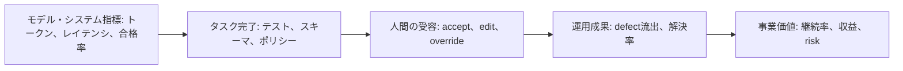
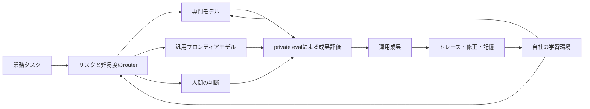
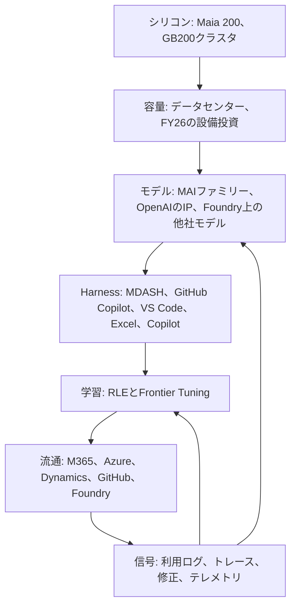

## はじめに

2026年7月29日、Microsoft AI の Mustafa Suleyman が [Optimizing the frontier performance curve](https://microsoft.ai/news/optimizing-the-frontier-performance-curve/) を公開した。分量は短い。だが、一研究部門のブログとして読むと要点を取り違える。

同じ日、Microsoftは [FY26 Q4決算](https://www.microsoft.com/en-us/investor/earnings/fy-2026-q4/press-release-webcast) を発表し、Satya Nadellaのコメントはこう始まっている。

> We are advancing the frontier on the cost-to-outcome curve, ensuring every customer can turn tokens into business results.

Suleymanの記事の結びも「we are hill-climbing to move the frontier on the cost-to-outcome curve」である。<strong>同じ語彙が、同じ日に、モデル開発部門の記事とCEOの決算コメントの両方に置かれている。</strong> これは技術的な観測であると同時に、投資家に向けた経営の枠組みでもある。両方として読まなければ、Microsoftがなぜ「自社の最上位モデルを使わない」という話を積極的に発信するのか、その理由が見えてこない。

記事の主張は、単に「小さいモデルも便利だ」ということではない。

1. すべてのタスクに最大の汎用モデルを使わず、難易度に応じてモデルを配分する
2. 評価対象をモデル単体のベンチマークから、実際の顧客成果とコストの比へ移す
3. モデル、Agent Harness、強化学習環境（RLE）を一体で最適化する
4. それでも、プロダクトの文脈・記憶・行動空間は特定モデルから切り離す
5. 小型化した専門モデルをA100やH100でも動かし、異世代の計算資源を使い分ける

この記事を Satya Nadella の [A frontier without an ecosystem is not stable](https://snscratchpad.com/posts/frontier-ecosystem/) と [The Reverse Information Paradox](https://snscratchpad.com/posts/reverse-information-paradox/) と並べて読むと、話は推論コストの削減にとどまらなくなる。企業が評価、トレース、修正、記憶を所有し、自分の学習ループを回せるかという、アーキテクチャと政治経済の問題になる。

本稿の結論を先に述べる。

> <strong>新しいフロンティアの単位はモデルではなく、タスクを分類し、モデルを選び、結果を検証し、その経験から学ぶシステム全体である。そしてその優位は、タスク難易度の「ばらつき」と検証の安さから生まれる。</strong>

ただし、「成果/ドル」「モデルを交換可能にする」「古いGPUを活用する」の3つは、放っておいて両立するものではない。モデルとHarnessを密に結合すれば個別の性能は上がるが、交換可能性は下がる。帳簿上の償却期間を延ばしても、電力とラックを含めた経済性が改善するとは限らない。そして「成果」を定義する評価の仕組みを誰が持つかによって、最適化の果実が顧客企業と提供者のどちらに積み上がるかが変わる。

## 1. 一次情報を「事実・自己申告・解釈」に分解する

この種の発表を読むとき、まずやるべきは、主張を検証可能性の段階で仕分けることだ。

| 主張 | 出所 | 検証可能性 |
|---|---|---|
| MDASH + MAI-Cyber-1-Flash がCyberGymで95.95%、Mythos比+12ポイント | [MAI-Cyber-1-Flash記事](https://microsoft.ai/news/introducing-mai-cyber-1-flash-inside-mdash/) | 公開ベンチだが、測定はMicrosoft実施。単体モデルではなくGPT-5.4を含むシステムの数値 |
| MDASHの現行最良構成（GPT-5.4 + 5.4 mini + 5.3 codex）比で50%のコスト削減 | 同上 | 比較対象は自社の現行構成。他社システムとの比較ではない |
| MAI-Cyber-1-Flashは最大90%のタスクを処理し、残る10%をGPT-5.4へ | 同上 | MDASH向けの設計目標であり、一般法則ではない |
| MAI-Code-1-Flashは5Bアクティブパラメータ、SWE Bench Proで51% | [Build 2026キーノート](https://microsoft.ai/news/microsoft-build-2026-mai-keynote-transcript/) | 自社ハーネスを用いた内部計測と明記されている。ハーネスの差はスコアに効く |
| VS CodeでGPT-5.4 MiniとClaude Haiku 4.5比、受諾率が約10%高く、中央値トークンが10%少ない | [GitHub Copilot/Excel記事](https://microsoft.ai/news/hill-climbing-mai-models-for-github-copilot-and-excel/) | 本番トラフィックの製品内指標。母集団・配分・区間は非公開 |
| Excel向けモデルは「最も一般的なタスク」でGPT-5.6と同等、A100/H100でも提供できる | 同上 | 範囲を限定した自己申告であり、長い裾を含めた同等性ではない |
| Frontier TuningでMcKinsey向けに最高win rate、コストは約1/10 | キーノートと [Frontier Tuning](https://microsoft.ai/models/microsoft-frontier-tuning/) | 比較対象はGPT-5.5。脚注の指標は「1ドルあたりの出力トークン数」で、公開価格と serving コストの差から推計した値（projection）だと明示されている |
| Maia 200上のMAIモデルで性能/ワット40%改善 | [7月29日の記事](https://microsoft.ai/news/optimizing-the-frontier-performance-curve/) | 「40%」はこの記事のみで、基準は書かれていない。6月の [7モデル発表](https://microsoft.ai/news/building-a-hillclimbing-machine-launching-seven-new-mai-models/) は「1.4倍の効率向上」、キーノートはGB200との直接比較で「さらに1.4倍の性能/ワット」と表現が異なる |

もう一つ、時系列に並べ直すと見え方が変わる。

| 日付 | 出来事 |
|---|---|
| 2026-06-02 | Build 2026。7つのMAIモデル（Thinking-1、Code-1-Flash、Image-2.5、Transcribe-1.5、Voice-2 ほか）とFrontier Tuningを発表 |
| 2026-07-23 | GitHub CopilotとExcelでの本番指標を公開 |
| 2026-07-27 | MDASHとMAI-Cyber-1-Flashを公開 |
| 2026-07-29 | 「cost-to-outcome曲線」記事とFY26 Q4決算 |

ここで一つ、注意したい点がある。Excel向けモデルは6月には「GPT-5.4と同等で最大10倍効率的」と説明され、7月には「最も一般的なタスクでGPT-5.6と同等」と書かれている。<strong>2か月で比較対象のモデル世代が変わっている。</strong> しかも測定の基準も違う。6月は公開・非公開のベンチマークによる比較であり、7月は本番トラフィックでのユーザーフィードバックに基づくもので、「10倍効率的」という表現も消えている。ベンダーが示す効率比較は、分子（品質）も分母（価格）も動く相手と比べたものであり、時点を固定しなければ意味をなさない。読む側は「いつの、どのバージョンとの、どうやって測った比較なのか」を毎回確かめる必要がある。

こうした仕分けを踏まえると、Microsoft AIが描く「performance curve」の横軸が、モデルサイズでも推論計算量でもない点が効いてくる。モデル、データ、Harness、RLE、配備先ハードウェアを組み合わせた<strong>システムの費用対効果</strong>が新しい曲線になる。

形式的に書けば、システム $S$（モデル集合、Harness、router、ハードウェア構成）に対して、単位時間あたりの合格成果 $O(S)$ と総費用 $C(S)$ を定義し、$(C, O)$ のパレート面を考えることになる。従来の「frontier model」議論は、この面の代理として単一モデルのベンチマーク点を見ていた。主張は、<strong>システムのパレート面は単一モデルのパレート面を支配しうる</strong>ということだ。

したがって、同じ品質を半分の費用で出す点も、同じ費用で品質を上げる点も、以前の曲線より外側にあれば新しいフロンティアである。最大モデルの最高スコアを競う「北東の一点」から、製品ごとに適切な点を選ぶポートフォリオ問題へと移る。

## 2. タスクを階層化するということ

「簡単な仕事は小さいモデル、難しい仕事は大きいモデルへ」という説明は分かりやすい。しかし実装上、難易度は入力に固定された属性ではない。同じ依頼でも、与えられた文脈、利用可能なツール、Harnessの分解能力、検証器の有無によって難しさが変わる。

たとえば、巨大なコードベースから脆弱性を探す仕事は、そのままでは難しい。だがHarnessがリポジトリを分割し、候補を絞り、テストを実行し、過去の修正トレースを検索できるなら、モデルが直接解く問題は小さくなる。<strong>優れたHarnessは、モデルを賢く見せるだけでなく、タスクそのものを簡単な形へ変換する。</strong>

実務上の階層は、少なくとも次の4段階になる。

| 層 | 主な処理 | 適した実行主体 | 必要なゲート |
|---|---|---|---|
| 決定的・定型 | スキーマ変換、検索、既知ルールの適用 | 通常コード、検索、ワークフロー | スキーマ・ルール検証 |
| 頻出・専門 | 製品固有の反復作業 | 小型の専門モデル | private eval、信頼度、サンプル監査 |
| 稀・複雑 | 長い推論、未知の組み合わせ、曖昧な要求 | 汎用フロンティアモデル、複数モデル | 強い検証、予算上限、再試行制御 |
| 高影響・不可逆 | 本番変更、法務・医療・財務判断 | 人間との共同判断 | 承認、職務分離、監査証跡 |

タスク $x$ に対してモデル $m$ とHarness構成 $h$ を選ぶ問題は、品質と費用を無理に同じ単位で引き算するより、合格率と重大損失を制約に置いて費用を最小化する形で書くほうが、ここでの狙いに近い。

$$
(m^*, h^*) = \arg\min_{m,h} C_{\mathrm{total}}(x,m,h)
\quad \text{s.t.} \quad
\Pr(\mathrm{pass} \mid x,m,h) \geq 1-\delta,\;
\Pr(L > L_{\max} \mid x,m,h) \leq \varepsilon
$$

ここで pass はタスクごとに定めた評価契約、$\delta$ は許容する不合格確率、$\varepsilon$ は重大損失の許容確率である。つまりrouterの仕事は「一番安いモデルを選ぶこと」ではない。<strong>許容できるリスクの範囲で、最も安く合格結果を返せる経路を選ぶこと</strong>である。難しいタスクを誤って簡単だと判定する false-easy は、逆方向の誤りよりはるかに高くつくことがある。難易度の分類器には、精度だけでなくエスカレーション漏れの損失を組み込まなければならない。

### カスケードはいつ得になるのか

「90%を小型モデルへ」という設計が本当に得かどうかは、簡単な式で確かめられる。小型経路をまず試し、検証してから必要なら大型へ回す構成を考える。

- $\alpha$: 小型経路だけで合格を出せるタスクの比率
- $c_s, c_l$: 小型経路・大型経路の費用
- $c_v$: 検証（テスト、再現、スキーマ検査、LLMによる判定）の費用
- $d$: 検証器が失敗を検出できる確率
- $L$: 検出されずに通過した失敗の損失

期待費用は次のようになる。

$$
\mathbb{E}[C_{\mathrm{cascade}}]
= c_s + c_v + (1-\alpha)\,d\,c_l + (1-\alpha)(1-d)\,L
$$

常に大型を使う構成（費用 $c_l$）と比べると、検出が完全（$d=1$）の場合の損益分岐は驚くほど単純だ。

$$
c_s + c_v < \alpha\, c_l
$$

ここから、実務的な帰結が3つ出てくる。

<strong>第一に、効くのは「モデルが安いこと」ではなく「検証が安いこと」である。</strong> $\alpha = 0.9$ なら、小型経路は大型の90%未満で済めばよい。かなり緩い条件に見える。しかし検証が大型費用の30%かかるなら、小型モデル自体は60%未満でなければならない。厳密には $c_s$ と $c_v$ は式の上で対称に入るが、実務では小型モデルの費用が $\alpha c_l$ を大きく下回ることが多く、束縛条件になるのは $c_v$ の側である。なお、比較対象とした「常に大型」の経路にも検証費用を計上するなら、条件は $c_s < \alpha c_l$ まで緩む。この意味で上の損益分岐は保守的である。

<strong>第二に、カスケードが効く領域は検証が安い領域に偏る。</strong> コードにはテストがあり、脆弱性にはクラッシュ再現があり、スキーマには検証器がある。MicrosoftがGitHub Copilot、Excel、そしてCyberGymという「オラクルのある領域」で成果を出しているのは偶然ではない。逆に、提案書の説得力や設計判断の妥当性のように検証が高価で曖昧な領域では、同じ90/10設計はそのまま移植できない。<strong>この構図は予測に使える。カスケード型の効率化は、検証技術が広がる速度でしか一般化しない。</strong>

<strong>第三に、利得の源泉は難易度の「ばらつき」である。</strong> $d=1$ のとき、常に大型を使う場合との差は

$$
\Delta = \alpha\, c_l - c_s - c_v
$$

となる。もしすべてのタスクが同じ難しさなら $\alpha$ は0か1に張り付き、経路を分ける意味は消える。$c_s \approx c_l$ でも同じである。ただし、この式自体に分散の項はない。$\Delta$ は $\alpha$ について単調増加であり、$\alpha=1$ なら小型モデルを常用すればよく $c_v$ は純粋な間接費になるし、$\alpha=0$ ならカスケードは常に損である。式が示すのは「難易度が一様なら経路を分ける構造そのものが無意味になる」ことであり、<strong>難易度の分散と推定精度の積に比例する</strong>という読みは、そこから導いた解釈であって式の帰結ではない（この式には難易度分類器が登場しない）。それでも、「モデルを強くする」努力とは質的に異なる方向を示している。

### Harnessは難易度の分布そのものを動かす

$\alpha$ は与えられた定数ではない。Harnessがリポジトリを分割し、過去の修正履歴を検索し、テストを実行できれば、以前は大型モデルが必要だったタスクが小型経路で通るようになる。<strong>Harnessへの投資とモデルの効率化は、限界的には代替関係にある。</strong> 同じ「成果/ドル」の改善を、より賢いモデルでも、より良い分解でも達成できる。

ここには組織にとって重要な含意がある。モデルは購入できるが、Harnessと検証器は自社の業務知識がなければ作れない。したがって<strong>模倣されにくい優位は、モデル側ではなく分解と検証の側に溜まりやすい。</strong>

### 「量の90%」は「価値の90%」ではない

もう一つ、見落とされやすい非対称がある。90%という数字はタスク件数の話であって、価値やリスクの分布ではない。

重大な意思決定、初見の攻撃、例外的な顧客対応は、件数では裾でも、事業価値では中心にあることが多い。すると次の非対称が生まれる。

- 頭部（頻出）で得られる節約は、$\alpha(c_l - c_s)$ で上限が決まる
- 裾（稀）で品質を落としたときの損失は、上限が決まらない

しかも誤配分は難易度境界付近で最も起きやすく、そこは価値の分かれ目でもある。したがって、コスト削減は件数加重で測ってよいが、<strong>品質ゲートは価値加重のスライスで監視しなければならない。</strong>

## 3. 「モデル性能」から「成果/ドル」へ

モデル単体のベンチマークは、比較可能で再現しやすい。一方、ユーザーが購入するのはベンチマーク点数ではなく、修正された脆弱性、受け入れられたコード、完成した表計算、解決した問い合わせである。

その意味で「real customer outcome per dollar」は正しい方向を向いている。ただし、分母をトークン料金だけにすると、再び測定を誤る。

$$
C_{\mathrm{total}} = C_{\mathrm{model}} + C_{\mathrm{harness}} + C_{\mathrm{tools}}
+ C_{\mathrm{retry}} + C_{\mathrm{review}} + C_{\mathrm{failure}} + C_{\mathrm{capacity}}
$$

ここで各項は、同じ評価母集団に帰属させた金額として揃える。事業者への支払いと自社保有設備の費用を二重に計上せず、推論時間や人間の作業時間も比べられる金額へ換算する。レイテンシは、機会損失として明示的に金額へ換算しない限り、費用とは別のサービス指標として扱う。

- $C_{\mathrm{model}}$: 入出力トークン、推論時間、モデル提供料金
- $C_{\mathrm{harness}}$: コンテキスト構築、メモリ、router、状態管理
- $C_{\mathrm{tools}}$: 検索、サンドボックス、外部API、テスト実行
- $C_{\mathrm{retry}}$: 再試行、フォールバック、重複実行
- $C_{\mathrm{review}}$: 人間の確認と承認
- $C_{\mathrm{failure}}$: 誤答、手戻り、事故、機会損失
- $C_{\mathrm{capacity}}$: アクセラレータ、電力、冷却、ネットワーク、遊休余力

すると、見るべき指標は「1,000トークン当たり価格」ではなく、たとえば次のようになる。

$$
\operatorname{CostPerAccepted}(\mathcal{B})
= \frac{\sum_{x \in \mathcal{B}} C_{\mathrm{total}}(x)}
{N_{\mathrm{accepted}}(\mathcal{B})}
$$

$\mathcal{B}$ は同じ期間・条件で集計したタスク群である。分子と分母の母集団を揃えなければ、成功しなかった高コスト実行を指標から落としてしまう。

ただし、何をもって「合格した成果」とするかの定義が最も難しい。コードの受諾は短期では測りやすいが、そのコードが障害を増やしたか、保守性を落としたかは後から分かる。セキュリティ修正も、ベンチマーク上の発見と本番での誤検知・修正成功は同じではない。音声モデルのGPU費用が下がっても、顧客満足や解決率が下がれば成果/ドルは悪化する。

したがって、評価は次の順序でつなぐ必要がある。

下流へ行くほど本物の成果に近いが、観測は遅く、外部要因も増える。だから単一の指標に置き換えるのではなく、先行指標と遅行指標を因果仮説で結び、モデル、router、Harnessの変更を段階的に検証していく。

Microsoft AIが示す受諾率、再訪率、保存率（save rate）、エラー率、GPU費用は、外部ベンチマークだけを見るより一歩進んでいる。一方で、比較母集団、トラフィックの配分、信頼区間、総保有コストは公開記事だけでは分からない。これらは有望な製品内の指標であって、独立した監査を経た普遍的な優位性とは切り分けて読むべきだ。

### 単価が下がっても総額は下がらない

「成果/ドル」を改善したとき、支出総額まで下がると考えるのは早計である。単位コストが下がると、これまで割に合わなかった使い方が採算に乗る。エージェントは1回の依頼に対して計画、検索、試行、検証、修正と何度もモデルを呼ぶため、<strong>単価低下はそのまま呼び出し回数の増加を招く。</strong> 石炭の効率改善が消費量を増やしたというJevonsの観察と同じ構造である。

Microsoft自身の記述もこれと整合する。Suleymanは「tokenmaxxingがここ数か月の物語だったが、次はtoken efficiencyだ」と書いている。効率化が語られる局面は、同時にトークン消費が急増した局面でもある。FY26 Q4で商用のremaining performance obligationが84%増の6,780億ドルに達したことも、単価低下と需要拡大が並走している状況を示唆する。ただしRPOは契約残高であり、この伸びには第6節で触れるOpenAIの2,500億ドルのAzure購入契約のような大口案件が含まれうる。広範なトークン需要の証拠としては弱い。

実務上の含意は明快だ。効率化の効果は「単位あたり費用」で測り、予算は「総支出」で管理する。この2つを混同すると、効率改善に成功しながら予算超過を起こす。

## 4. 3本の記事をつなぐ「企業の学習ループ」

[A frontier without an ecosystem is not stable](https://snscratchpad.com/posts/frontier-ecosystem/) でNadellaは、企業が持つ人間の知識・判断・関係性を human capital、AIシステムとして蓄積した能力を token capital と呼ぶ。そして重要なのは最良モデルを一度選ぶことではなく、両者が相互に学ぶループを企業自身が持つことだと主張する。

[The Reverse Information Paradox](https://snscratchpad.com/posts/reverse-information-paradox/) は、その所有問題をさらに鋭くする。企業はAIを有用にするため、自社固有のプロンプト、ツール利用、失敗、修正、評価をモデル提供者へ渡す。買い手は料金だけでなく、何が良い成果かを示す企業知まで支払うことになる。利用のたびに生まれる「intelligence exhaust」が提供者側だけで学習に使われるなら、価値は一方向へ集積する。

この2本とSuleymanの記事をつなぐと、次の構造が見える。

このループでは、モデルは交換可能な計算主体の1つにすぎない。企業固有の価値は、次の資産へ移る。

- 何を良い結果とするかを定義したprivate eval
- 成功と失敗の軌跡（trajectory）、ツールの実行結果、修正履歴
- 組織固有のコンテキスト、メモリ、権限、行動空間
- タスクの難易度とリスクを判断するrouter
- 結果を現場のフィードバックへ接続する強化学習環境

これは「成果/ドル」を最適化するためにも必要である。自社の成果を測れなければ、安いモデルへ移して品質を維持できたか判断できない。<strong>主権、レジリエンス、コスト効率はprivate evalによって結び付く別々の要件であり、それぞれ追加の統制も必要とする。</strong> 主権にはデータ権利と移植性、レジリエンスには代替経路と容量、コスト効率には総費用の計測が欠かせない。

### Microsoftはこのループを製品にした

興味深いのは、Nadellaがエッセイで論じた「学習ループを企業に分配する」という主張が、すでに製品名を持っていることだ。

[Microsoft Frontier Tuning](https://microsoft.ai/models/microsoft-frontier-tuning/) は、顧客のワークフローから作った強化学習環境（RLE）でMAIモデルを適応させる仕組みである。[7モデル発表記事](https://microsoft.ai/news/building-a-hillclimbing-machine-launching-seven-new-mai-models/) はこのRLEを「あなただけが使えるAIの training gym」と表現している。掲げる4条件は、Nadellaの議論をほぼそのまま製品要件に落としたものだ。

| Frontier Tuningの主張 | 対応するNadellaの論点 |
|---|---|
| データは自社環境から出ない | 信頼境界の確立 |
| コスト効率 | 支出あたり成果の改善 |
| 自社の文脈と用語を理解する | 「company veteran」能力の内製化 |
| モデルを自分で管理し、ロックインがない | 選択肢と統制 |

Buildキーノートでは、さらに踏み込んだ表現が使われている。「あなたは、誰からでも学習する共有モデルから知能を借りるのではない」「RLEとその中で作ったモデルがあなたの moat になる」。これは [The Reverse Information Paradox](https://snscratchpad.com/posts/reverse-information-paradox/) が提起した「使うほど買い手の知識が売り手に流れる」という問題への、商業的な回答として設計されている。

最も明確な事例はMayo Clinicとの提携である。両社は医療向けのフロンティアモデルを共同開発し、まずMayo Clinicの環境で運用する。そして [7モデル発表記事](https://microsoft.ai/news/building-a-hillclimbing-machine-launching-seven-new-mai-models/) は、<strong>完成するモデルをMayo Clinicが所有すると明記している。</strong> 「知識を提供した側がモデルを所有する」という条件は、逆情報パラドックスに対する具体的な処方箋になっている。ただし同じ記事は、検証後にこのモデルをMicrosoft Foundry経由で他組織にも提供すると述べている。所有権はMayo Clinicにありつつ、流通経路はMicrosoftが握る設計である。

ただし、ここには構造的な留保が残る。この主権は、Microsoftのテナント境界の内側で、Microsoftの学習基盤の上で与えられている。つまり<strong>主権はプラットフォームによって「付与」されているのであって、プラットフォームから独立しているわけではない。</strong> 本当の意味での所有かどうかを分けるのは宣言ではなく、次の運用的な問いである。

- 重みは持ち出せるのか。持ち出した重みを別の基盤で推論できるのか
- RLEの定義、報酬、採点器（grader）、評価セットは書き出せるのか
- トレースと修正履歴は、契約上どちらが学習に使えるのか
- 提携を終了したとき、何が残り、何が消えるのか

この4点に答えられるかどうかが、Frontier Tuningを含むあらゆる「あなたのモデル」提案を評価する実務的な基準になる。

## 5. モデル非依存は「APIを共通化すること」ではない

Microsoft AIの記事には、興味深い緊張がある。一方ではモデル、Harness、強化学習環境を共同最適化すべきだと言う。もう一方では、すべてのモデルを交換可能にすべきだと言う。前者は密結合を、後者は疎結合を求めるように見える。

この矛盾は、<strong>実装を共通化するのではなく、成果契約を安定させる</strong>ことで解くべきだ。

モデル非依存には少なくとも6つの層がある。

| 層 | 交換可能性を阻むもの | 必要な対策 |
|---|---|---|
| 接続 | API、認証、ストリーミング、tool call形式 | provider adapter、標準化した内部イベント |
| 振る舞い | 指示追従、ツール選択、長文脈、拒否傾向 | モデル別のプロンプトとツールアダプタ、回帰eval |
| 状態 | provider側のスレッド、キャッシュ、メモリ | 組織側で持つ正本の状態、持ち出せる履歴 |
| 評価 | 特定モデルに合わせた判定器や閾値 | 固定した検証器、人間による校正、モデル横断のholdout |
| 学習 | fine-tune、フィードバック、トレースの利用権 | データ権利、移植可能なデータセット、契約上の利用許諾 |
| 運用 | 割当量、地域、価格、専用ハードウェア | フォールバック、複数地域、容量と費用の観測 |

すべてのモデルに同じプロンプトを送り、同じ出力を求める「最低公分母」の抽象化は、専門化で得られる利益を消してしまう。代わりに、入力・出力・安全性・検証可能性という成果契約を固定し、その契約を満たすadapterはモデル別に最適化してよい。

交換可能性の本当のテストは、設定画面に複数モデルが並ぶことではない。

> 主要モデルを1つ削除した状態でprivate evalを再実行し、許容コストと時間内にサービスを復元できるか。

この「model removal drill」に合格して初めて、企業の veteran capability がモデルではなくシステム側に残っていると言える。

さらに厳しく見れば、モデルを交換できても、private eval、学習環境、メモリ、Harnessがクラウド提供者の閉じたサービスに固定されていれば、ロックインは上の層へ移っただけである。Microsoftの3本の主張が顧客企業にとって成立するには、モデルの選択肢だけでなく、<strong>学習ループの成果物を持ち出し、別の実行基盤で再生できる権利</strong>が必要になる。

なお、この点でMicrosoftには検証可能な材料もある。MAIモデルはFoundryだけでなくOpenRouter、Fireworks、Baseten経由でも提供され、キーノートは「開発者が自分で重みをチューニングできるのは今回が初めて」と述べている。少なくともモデル層については、宣言だけでなく確かめられる形の可搬性が用意されている。残る論点は、その上のRLE、評価、メモリの層がどこまで持ち出せるかである。

## 6. Microsoftの戦略として読む

ここまでは主張の妥当性を見てきた。次に、なぜMicrosoftがこの主張を、この時期に、この語彙で出すのかを考える。

### 6-1. 垂直統合のどこに制御点があるか

2026年のMicrosoftは、シリコンから流通までを一社で並べられる数少ない企業になっている。

各層の役割を整理すると、この記事群が何を売っているのかが見えてくる。

| 層 | 具体例 | 戦略的機能 |
|---|---|---|
| シリコン | Maia 200、GB200クラスタ | 性能/ワットの自社最適化、外部調達依存の緩和 |
| 容量 | データセンター、FY26の設備投資 1,159億ドル | 供給制約下での量の確保 |
| モデル | MAI 7モデル、OpenAIのIP、Foundry上の他社モデル | 用途別の在庫。単一系統への依存回避 |
| Harness | MDASH、GitHub Copilot、VS Code、Excel | 難易度を作り替え、検証を安くする層 |
| 学習 | RLE、Frontier Tuning | 顧客の業務知識を反復可能な資産へ変える層 |
| 流通 | M365、Azure、Dynamics、GitHub | モデルを使う理由をユーザーの手元に置く層 |
| 信号 | 利用ログ、修正、セキュリティテレメトリ | 次の学習の原材料 |

MDASHの記事は、この最後の層の厚みを強調している。1日あたり100兆を超えるセキュリティ信号と、160万顧客からの運用知見を挙げ、「この履歴は誰にも作れない」と述べている。<strong>モデルは複製できるが、稼働中の製品から流れる修正と結果は複製できない。</strong> 記事群の一貫した主張は、競争軸をモデルの賢さから、この非複製資産へ移すことにある。

### 6-2. OpenAIとの関係が二正面戦略を要求する

この文脈で決定的なのが、2025年10月28日に公表された [Microsoft–OpenAIの新契約](https://blogs.microsoft.com/blog/2025/10/28/the-next-chapter-of-the-microsoft-openai-partnership/) である。公表内容には次が含まれる。

- MicrosoftはOpenAI Group PBCに約1,350億ドル相当、希薄化後で約27%の持分を保有
- OpenAIは引き続きMicrosoftのフロンティアモデルのパートナーで、AGIまで独占的IP権とAzure API独占が継続
- AGI宣言はOpenAIが行い、独立した専門家パネルによる検証を受ける
- モデルと製品に関するMicrosoftのIP権は2032年まで延長され、適切な安全防御を伴ってAGI後のモデルも対象に含む
- 研究IPの権利はAGI検証か2030年のいずれか早い方まで
- <strong>MicrosoftはAGIを単独で、または第三者と追求できる</strong>
- ただしAGI宣言前にOpenAIのIPを用いてAGIを開発する場合、そのモデルは計算量の上限に服する（その水準は現在の最先端モデルの学習規模を大きく上回るとされる）
- OpenAIは追加で2,500億ドルのAzureサービス購入を契約。一方でMicrosoftの優先引受権（ROFR）は消滅

つまりMicrosoftは、当面はOpenAIのIPに広くアクセスできる一方で、自社の道も開いた。ここから、MAIの立ち位置がはっきりする。

<strong>「あらゆるモデルは交換可能であるべきだ」という主張は、顧客向けのアーキテクチャ論であると同時に、Microsoft自身の調達戦略でもある。</strong> Harness、コンテキスト、メモリ、行動空間をモデル非依存にしておけば、自社モデルへの置き換えも、他社モデルの併用も、契約条件の変化への対応も安く済む。実際、FY26 Q4にはAnthropicへの投資から32億ドルの利益が計上されている。単一のラボに賭けるのではなく、自社開発・出資・再販を同時に走らせるポートフォリオ運用になっている。

### 6-3. なぜ「効率」が経営指標になったのか

数字を並べると、効率の話が理念ではなく財務要請であることが分かる。FY26（2026年6月30日終了）の決算開示から、関連する数値を抜き出す。

| 指標 | FY26 | 前年 |
|---|---|---|
| 売上高 | 3,318億ドル | 2,817億ドル |
| 営業利益 | 1,552億ドル | 1,285億ドル |
| 有形固定資産の取得（設備投資） | 1,159億ドル | 646億ドル |
| 有形固定資産（純額、期末） | 3,131億ドル | 2,050億ドル |
| 減価償却・償却ほか | 385億ドル | 294億ドル |

売上が18%伸びる一方で、設備投資は約80%増えている。Azureは通年で初めて1,000億ドルを超え、Microsoft 365 Copilotは3,000万を超える有償シートに達した。需要は強い。しかし<strong>資本の投入速度が売上の伸びを上回るとき、1トークンあたり、1成果あたりのコストを下げることは、粗利を守るための必須条件になる。</strong>

ここに、MAIの小型モデル群、Maia 200の性能/ワット、A100を含む異世代の設備群の活用、タスク階層化という施策がすべて接続する。「cost-to-outcome曲線」はマーケティング用語である前に、資本集約度が上がった事業の管理指標である。

### 6-4. エコシステム論の二面性

Nadellaのエッセイは、少数のモデルに価値が集中する未来は政治経済的に持続しないと論じる。この主張自体は説得力がある。同時に、次の点は指摘しておくべきだ。

モデル層がコモディティ化すると、相対的に価値が上がるのは評価、RLE、メモリ、Harness、流通を握る層である。Microsoftはまさにその層を持っている。<strong>「モデルは交換可能であるべきだ」という主張は、自社が独占していない層の重要度を下げ、自社が強い層の重要度を上げる。</strong> これは矛盾でも欺瞞でもなく、プラットフォーム企業として一貫した戦略である。ただし顧客側は、この構造を理解したうえで交渉すべきだ。

実務的な問いは1つに集約できる。

> モデルを乗り換える自由と、学習ループを持ち出す自由は、契約上同じ強さで保証されているか。

前者だけが保証されているなら、ロックインは解消されたのではなく、1つ上の層へ移動しただけである。

## 7. H100は「6年前の世代」ではない

ここは年代を正確にしたい。

- NVIDIA A100 は [2020年5月14日に量産・出荷開始が発表された](https://nvidianews.nvidia.com/news/nvidias-new-ampere-data-center-gpu-in-full-production)。2026年7月時点で約6年前の世代である。
- NVIDIA H100 は [2022年3月22日に発表され、同年第3四半期から提供予定とされた](https://nvidianews.nvidia.com/news/nvidia-announces-hopper-architecture-the-next-generation-of-accelerated-computing)。2026年7月時点では約4年前の世代である。

したがって、「約6年前に登場したGPU世代でも最新の専門モデルを動かせる」という読みは、H100ではなくA100に対応する。[Excel向けMAIモデルの記事](https://microsoft.ai/news/hill-climbing-mai-models-for-github-copilot-and-excel/) は、同じ小型モデルをH100とA100の両方で提供でき、最新世代のアクセラレータだけを要求しないことを利点としている。また7月29日の記事も、MDASHとMAI-Cyber-1-Flashの組み合わせについて「しかもH100でも提供している」と述べている。ただし、Microsoftが実際に使った個体の取得時期は公開されていない。

これは単なる互換性の話ではない。タスクの90%を小型モデルへ寄せる論理は、そのまま計算資源の階層化につながる。

| ワークロード | モデル | ハードウェア配置の考え方 |
|---|---|---|
| 大量・定型・遅延制約が緩い | 量子化・専門化した小型モデル | A100など既存設備の高稼働率を狙う |
| 対話的・高スループット | 効率化した中型モデル | H100や自社シリコンを性能/電力で選ぶ |
| 稀・最難関 | 汎用フロンティアモデル、長い推論 | 最新世代を必要時だけ利用する |
| 学習・大規模更新 | 大規模な学習・RL | 高速インターコネクトを備えた最新クラスタへ集中する |

最新GPUと旧GPUのどちらが「良い」かではない。モデルとタスクを分解し、異機種混在の設備群の各層に、正しい仕事を置けるかどうかがシステムの競争力になる。

## 8. 減価償却をめぐる批判への回答なのか

クラウド企業によるサーバーの耐用年数変更との接続は、確かにある。

[Microsoftの2023年度Form 10-K](https://www.sec.gov/Archives/edgar/data/789019/000095017023035122/msft-20230630.htm) によれば、同社は2022年7月、サーバー・ネットワーク機器の見積耐用年数を4年から6年へ延長した。理由として、機器運用を効率化するソフトウェアへの投資と技術進歩を挙げている。この会計見積もり変更は2023年度の営業利益を37億ドル、純利益を30億ドル押し上げた。

[Alphabetの2023年度Form 10-K](https://www.sec.gov/Archives/edgar/data/1652044/000165204424000022/goog-20231231.htm) でも、2023年1月にサーバーを4年から6年、一部ネットワーク機器を5年から6年へ変更し、同年の減価償却費を39億ドル減らし、純利益を30億ドル増やしたと開示している。

しかし、ここでは4種類の「寿命」を分けなければならない。

| 寿命 | 問い |
|---|---|
| 物理的寿命 | 故障せず電源が入り、修理可能か |
| 技術的寿命 | ソフトウェアスタックが対応し、必要なモデルを実行できるか |
| 経済的寿命 | 電力、冷却、保守、ラック、機会費用を含めても使う価値があるか |
| 会計上の見積耐用年数 | 資産の経済的便益を何年にわたり消費すると見積もるか |

6年間動くことは、6年間経済的とは限らない。逆に、新モデルを直接動かせないGPUでも、モデル圧縮や専門化によって価値が戻ることがある。会計上の耐用年数は設備群全体に対する見積もりであり、個々のGPUが6年目まで同じ役割で稼働するという保証ではない。

では、A100で最新の専門モデルを動かせるという2026年の主張は、耐用年数延長への批判に対する回答なのか。

<strong>弱い意味では、回答になっている。</strong> Excel向けモデルをA100クラスのGPUで動かせることは、約6年前に登場したGPU世代がこのワークロードでは技術的に使えるという、Microsoftのソフトウェア効率化の説明と整合する後発の証拠である。ただし、実際に使われたA100の取得時期や、電力・ラック・保守・稼働率・機会費用を含む経済性は公開されていない。

<strong>強い意味では、まだ回答になっていない。</strong>

1. 耐用年数変更は2022年であり、今回の2026年の記事より先である。批判への同時的な反論というより、後から提示された整合的な運用例である。
2. 1つのExcelモデルがA100に対応することは、サーバー設備群全体の6年利用を証明しない。
3. 減価償却費が下がっても、現金の電力費、冷却費、故障率、予備部品、ラックの機会費用は消えない。
4. 新しいアクセラレータの性能/電力が十分高ければ、帳簿価額の低い旧GPUより新GPUのほうが1成果当たりでは安い場合がある。
5. Microsoftは7月の記事で、Maia 200上のMAIモデルについて「性能/ワットが40%良い」と述べるが、その記事は比較基準を書いていない。6月のBuildキーノートでは、MAI-Thinking-1をMaia 200で動かしGB200と比較したうえで「さらに1.4倍の性能/ワット」と述べ、しかもそれは「Satyaが述べた30%の改善に上乗せ」と説明されている。2つの数値の積み上げ方は公開情報だけでは確定できないため、この40%を単独の比較値として扱うべきではない。

そして、2026年の文脈ではもう1つ重要な変化がある。<strong>論点の金額規模が当時と違う。</strong>

| 時点 | 有形固定資産（純額） |
|---|---|
| 2023年6月30日 | 956億ドル |
| 2026年6月30日 | 3,131億ドル |

2022年に耐用年数を変更した当時、その効果はFY2023の営業利益を37億ドル押し上げるものだった。いま資産ベースは約3.3倍になり、FY26の設備投資は単年で1,159億ドルに達している。<strong>同じ1年分の見積もり誤差が持つ影響は、当時よりはるかに大きい。</strong> 加えて、減価償却は投資に遅れて計上されるため、設備投資が急増している局面の利益率は相対的に古く安価な世代の償却を反映している。6年という仮定の当否は、これから数年かけて損益計算書に現れる。

この規模感を踏まえると、Excel向けモデルがA100で動くという事実の証拠としての重みも見積もれる。それは1つの製品の1つのワークロードに関する技術的事実であり、数千億ドル規模の設備群全体の経済性を裏づけるには小さすぎる。

もう一点、電力制約下では判断基準が変わる。世代 $g$ の1成果あたり費用を

$$
c_g = \frac{D_g + E_g + M_g + O_g}{N_g}
$$

と置く。$D$ は減価償却、$E$ は電力・冷却、$M$ は保守、$O$ はラックと電力枠の機会費用、$N$ は単位時間あたりの合格成果である。償却が進めば $D_{\text{old}}$ は小さくなるが、$N_{\text{old}}$ も小さい。データセンターの制約が電力枠にあるとき、比べるべきはワットあたりの合格成果であり、1ワットの機会費用が $O$ に入る。その場合、<strong>帳簿価額がゼロでも旧世代が経済的でなくなることは十分ありうる。</strong> Microsoftが旧世代対応と自社シリコンの性能/ワットを同時に強調しているのは、この2つが矛盾しないどころか、同じ制約から導かれるためである。

したがって、より正確な表現はこうなる。

> A100対応は、6年償却が正しかったことの証明ではない。約6年前に登場したGPU世代が現在のワークロードにも技術的に使える、という運用仮説の実例である。個々の資産年齢と、電力枠を含む経済性は別途検証しなければならない。

その仮説を検証するには、GPU世代別に、合格成果数、消費電力、占有時間、故障・保守費、routerによる待ち時間、最新GPUを別用途へ回せた機会価値まで測る必要がある。なお、耐用年数の現行見積もりは各社の最新の年次報告に記載される。Microsoftの場合は [FY2026のForm 10-K（2026年7月29日提出）](https://www.sec.gov/Archives/edgar/data/789019/000119312526323660/0001193125-26-323660-index.html) の会計方針の注記が該当箇所であり、本稿では2022年の変更という確認済みの事実までを根拠として扱う。

## 9. この戦略の強みと危うさ

### 強み1: フロンティアモデルへの依存を減らせる

最大モデルの供給不足、価格変更、障害、利用規約変更があっても、通常タスクを専門モデルで処理できればサービス全体は止まりにくい。これは単なるコスト削減ではなく、容量面のヘッジでもある。

### 強み2: 製品利用が改善信号になる

ベンチマーク用の人工データだけでなく、受諾、修正、再試行、最終成果をRL環境へ戻せる。製品に近い評価ほど、モデルサイズでは得にくい専門性を作れる。

### 強み3: 既存設備の役割を再設計できる

新世代GPUを全面導入するまで旧世代を延命するのではなく、タスク・モデル・ハードウェアの三重のroutingによって、恒常的な異機種混在の設備群として運用できる。資本集約的なクラウド事業では大きな差になる。

一方、危うさもある。

### 危うさ1: 測れる成果だけが最適化される

コードの受諾率や保存率を強く最適化すれば、短期に受け入れやすい出力へ寄り、保守性、安全性、長期学習を損なう可能性がある。private evalは価値を捉えるが、同時に価値を狭く定義する装置でもある。

### 危うさ2: routerが新しい単一障害点になる

モデルを複数持っても、難易度の分類、予算、フォールバックを決めるrouterが偏れば、安いが危険な経路へ大量の仕事を流す。router自体をshadow evaluationにかけ、確率を校正し、スライスごとに false-easy を監視する必要がある。

### 危うさ3: 学習ループの所有者がさらに強くなる

モデルを交換可能にするほど、評価、履歴、メモリ、Harnessを握るプラットフォームの価値は上がる。顧客企業がそれらを所有できなければ、モデルのロックインを解消した代わりに、学習ループのロックインが強まる。

### 危うさ4: 専門化は分布変化に弱い

頻出90%をうまく処理するモデルは、製品仕様、攻撃手法、ユーザー行動が変わった瞬間に誤配分を起こしうる。常にフロンティアモデルと人間を探索経路として残し、未知タスクから新しいevalを作り続ける必要がある。

### 危うさ5: 発信者と検証者が同一である

本稿が扱った効率の主張は、そのほとんどがMicrosoft自身による測定であり、多くはブログという形式で出ている。監査済みの財務開示とは検証の強度が違う。しかもベンダーには、資本集約度が上がる局面で効率の物語を語る財務上の動機がある。動機があること自体は主張を否定しないが、<strong>読者は「誰が、どの母集団で、いつの比較対象に対して測ったのか」を毎回確認する必要がある。</strong> Excel向けモデルの比較対象が2か月でGPT-5.4からGPT-5.6へ変わったことは、その必要性を示す実例である。

### 危うさ6: 効率の物語は需要の議論を隠しうる

単価が下がっても総支出が増えるなら、投資家にとっての本質的な問いは「効率が上がったか」ではなく「増えた支出に見合う成果が出ているか」になる。cost-to-outcome曲線という枠組みは、この問いを扱える点で優れているが、分母だけを示して分子を示さない使い方もできてしまう。曲線を評価するときは、常に成果側の定義と測定方法を先に確認したい。

## 10. 企業が実装するなら何を測るべきか

この考え方を導入する順序は、モデル調達からではなく評価設計から始まる。

1. <strong>成果を定義する</strong>: 合格条件、禁止条件、長期の遅行指標を業務責任者と決める。
2. <strong>タスクをスライスに分ける</strong>: 頻度、難易度、可逆性、損失上限、必要ツールで分ける。
3. <strong>総費用を記録する</strong>: トークンだけでなく、再試行、ツール、人間のレビュー、失敗、容量費を紐づける。
4. <strong>routerを影で動かす</strong>: まず経路を提案するだけにし、現行経路との品質・費用差を測る。
5. <strong>成果契約を固定する</strong>: provider adapterは個別最適化しつつ、eval、スキーマ、安全ゲートを共通化する。
6. <strong>学習資産を組織境界内に残す</strong>: プロンプトだけでなく、トレース、修正履歴、判定結果、メモリ、データセットの権利を確保する。
7. <strong>model removal drillを行う</strong>: 主要モデルなしで復旧時間、品質低下、追加費用を測る。
8. <strong>ハードウェアまで同じ指標で見る</strong>: GPU時間単価ではなく、世代別の合格成果あたりの電力とドルを比較する。

運用ダッシュボードには、少なくとも次を並べたい。

| 軸 | 代表指標 |
|---|---|
| 品質 | タスク合格率、重大失敗率、長期の不具合、スライス別の最悪値 |
| routing | false-easy率、不要なエスカレーション、フォールバック成功率、モデルの集中度 |
| 費用 | 合格成果あたり総費用、再試行費、人間レビュー時間 |
| 体験 | p50/p95のレイテンシ、途中離脱、修正量、継続利用 |
| レジリエンス | 主要モデルを外したときの復旧時間、代替providerのeval合格率 |
| 資本効率 | GPU世代別の稼働率、性能/ワット、成果/ラック時間 |
| 主権 | 外部へ出るトレースの比率、移植可能な学習資産、データ利用権 |

## 11. 結論: フロンティアはポートフォリオになる

Microsoft AIの主張で最も重要なのは、小型モデルでもフロンティア級のスコアを出せることではない。<strong>frontierという言葉の主語を、モデルから運用システムへ移したこと</strong>である。

そのシステムは、頻出タスクを専門モデルへ、難しい裾を大型モデルへ、高影響の判断を人間へ配る。同時に、A100、H100、最新アクセラレータ、自社シリコンへ仕事を配る。結果をprivate evalで測り、修正とトレースを次の学習へ戻す。この一連のループが、Nadellaのいうhuman capitalとtoken capitalを接続する。

だから競争優位は、「今月いちばん賢いモデルを契約した」ことからは生まれにくくなる。何が良い成果かを自分で定義し、モデルが消えても評価と記憶を保ち、タスクと計算資源を継続的に組み替えられる企業が強くなる。

古いGPUの論点も同じである。技術的に動くことと、経済的に使う価値があることは違う。だが、モデルの専門化とroutingによって、約6年前に登場したA100世代にも適切な仕事を用意できるなら、ソフトウェアはハードウェアの技術的有用性を保ち、総費用が見合う場合には経済的寿命も延ばしうる。これは6年償却への完全な回答ではないが、少なくとも検証可能な回答の形にはなっている。

Microsoftの戦略として見ると、この記事群は3つのことを同時に行っている。第一に、資本集約度が上がった事業で単位コストを下げる必要性を、技術的な物語として説明している。第二に、OpenAIとの関係を維持しながら自社モデルへの置き換え余地を確保するアーキテクチャを、顧客向けの原則として提示している。第三に、モデル層をコモディティ化させ、評価・RLE・メモリ・流通という自社が強い層へ競争軸を移している。

これらは顧客にとって有害とは限らない。むしろFrontier TuningやMayo Clinicの所有条件のように、逆情報パラドックスへの具体的な回答も含まれている。重要なのは、<strong>提案を額面で受け取るのではなく、可搬性と契約で検証すること</strong>である。

最終的に問われるのは、最強モデルを持つかではない。

> <strong>1ドルの計算資源、1回の人間の修正、1本の業務トレースを、次のより良い成果へ複利でつなげられるか。そしてその複利を、自社の側に残せるか。</strong>

それが、モデルの次に来るフロンティアである。

## 参考資料

- [Mustafa Suleyman, “Optimizing the frontier performance curve,” Microsoft AI, 2026-07-29](https://microsoft.ai/news/optimizing-the-frontier-performance-curve/)
- [Microsoft AI, “Hill-climbing MAI models for GitHub Copilot and Excel,” 2026-07-23](https://microsoft.ai/news/hill-climbing-mai-models-for-github-copilot-and-excel/)
- [Mustafa Suleyman and Hayete Gallot, “Introducing MAI-Cyber-1-Flash inside MDASH,” Microsoft AI, 2026-07-27](https://microsoft.ai/news/introducing-mai-cyber-1-flash-inside-mdash/)
- [Mustafa Suleyman, “Building a hill-climbing machine: Launching seven new MAI models,” Microsoft AI, 2026-06-02](https://microsoft.ai/news/building-a-hillclimbing-machine-launching-seven-new-mai-models/)
- [Microsoft AI, “Microsoft Build 2026: MAI keynote transcript,” 2026-06-02](https://microsoft.ai/news/microsoft-build-2026-mai-keynote-transcript/)
- [Microsoft Frontier Tuning](https://microsoft.ai/models/microsoft-frontier-tuning/)
- [Microsoft, “Earnings Release FY26 Q4,” 2026-07-29](https://www.microsoft.com/en-us/investor/earnings/fy-2026-q4/press-release-webcast)
- [Microsoft, “The next chapter of the Microsoft–OpenAI partnership,” 2025-10-28](https://blogs.microsoft.com/blog/2025/10/28/the-next-chapter-of-the-microsoft-openai-partnership/)
- [Satya Nadella, “A frontier without an ecosystem is not stable,” sn scratchpad, 2026-06-14](https://snscratchpad.com/posts/frontier-ecosystem/)
- [Satya Nadella, “The Reverse Information Paradox,” sn scratchpad, 2026-07-12](https://snscratchpad.com/posts/reverse-information-paradox/)
- [Microsoft Corporation, Form 10-K for FY2023](https://www.sec.gov/Archives/edgar/data/789019/000095017023035122/msft-20230630.htm)
- [Alphabet Inc., Form 10-K for FY2023](https://www.sec.gov/Archives/edgar/data/1652044/000165204424000022/goog-20231231.htm)
- [NVIDIA, “NVIDIA’s New Ampere Data Center GPU in Full Production,” 2020-05-14](https://nvidianews.nvidia.com/news/nvidias-new-ampere-data-center-gpu-in-full-production)
- [NVIDIA, “NVIDIA Announces Hopper Architecture,” 2022-03-22](https://nvidianews.nvidia.com/news/nvidia-announces-hopper-architecture-the-next-generation-of-accelerated-computing)

本稿は2026年8月3日時点の公開情報に基づく。製品指標、モデル名、価格、配備構成は変化するため、導入判断では最新の一次情報と自社評価を確認してほしい。