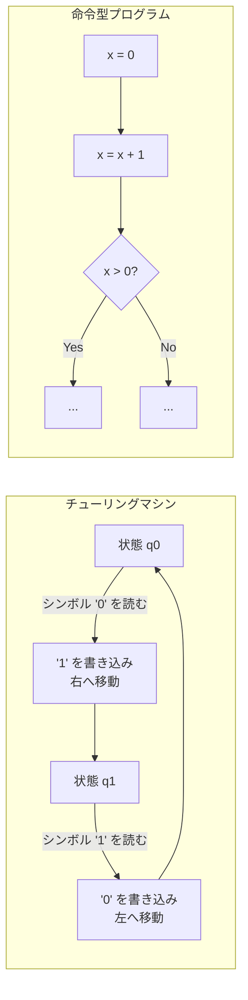
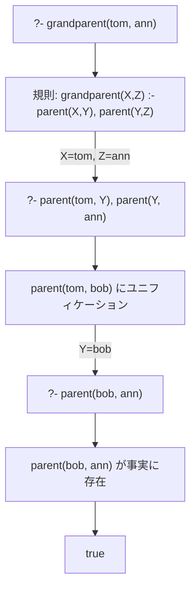
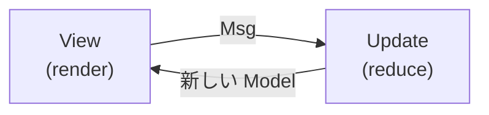

プログラミング言語を学ぶとき、文法やライブラリに目が行きがちですが、本当に重要なのは **パラダイム** — すなわち「どのように問題を捉え、どのように解を構成するか」という根本的な考え方です。

新しい言語を学ぶ場面を思い浮かべてみてください。Python から Haskell に移ったとき、戸惑うのは文法ではなく「ループの代わりに再帰を使う」「変数を再代入しない」という**思考パターンの転換**です。逆に、一度関数型の考え方を身につければ、Scala でも Rust でも Elixir でも同じパターンを応用できます。パラダイムとは、個別の言語を超えて通用する**ソフトウェア設計の共通言語**なのです。

この記事では、1936年のラムダ計算とチューリングマシンにまで遡り、主要なプログラミングパラダイムの系譜をたどります。各パラダイムの理論的基盤、設計思想、そして具体的なコード例をインタラクティブな図解とともに解説します。命令型・宣言型・関数型・オブジェクト指向・論理型・リアクティブ・並行指向——それぞれがどんな問題に対してどう有効なのか、さらには現代のマルチパラダイム言語がそれらをどう統合しているのかを見ていきましょう。

## パラダイムとは何か

**プログラミングパラダイム**とは、プログラムの構造化と問題解決に対する根本的なアプローチを定義する思考様式です。Robert Floyd は 1978 年のチューリング賞講演で、パラダイムの重要性を次のように述べています：

> If the advancement of the general art of programming requires the continuing invention and elaboration of paradigms, advancement of the art of the individual programmer requires that he expand his repertory of paradigms.

パラダイムは言語に束縛されるものではなく、**思考のフレームワーク**です。同じ問題でも、手続き型で考えるか、関数型で考えるか、オブジェクト指向で考えるかによって、まったく異なる解が生まれます。

たとえば「リストから偶数だけを取り出して合計する」というタスクを考えてみましょう。手続き型では `for` ループと `if` 文で一つずつ処理します。関数型では `filter` と `reduce` を合成します。SQL（宣言型）なら `SELECT SUM(x) FROM t WHERE x % 2 = 0` と書くだけです。どれも同じ結果を得ますが、「問題の捉え方」がまったく違います。パラダイムを学ぶとは、この**問題の捉え方のレパートリー**を広げることなのです。

## パラダイムの歴史的系譜

プログラミングパラダイムの歴史は、コンピューティングそのものの歴史と不可分です。現代の開発者が日常的に使うパターンの多くは、数十年前の理論的議論に根ざしています。まず、主要なパラダイムと言語がどのような時系列で登場したのかを俯瞰しましょう。

<ParadigmTimeline />

この年表を見ると、いくつかの重要な流れが見えてきます：

1. **1936年の二つの理論** — Church のラムダ計算と Turing のチューリングマシンが、関数型と命令型という二大パラダイムの数学的基盤をそれぞれ独立に築いた
2. **1960年代の OOP の誕生** — Simula がクラスとオブジェクトの概念を導入し、Smalltalk が純粋 OOP として洗練させた
3. **1990年代以降のマルチパラダイム化** — Scala, Rust, Kotlin など、複数のパラダイムを統合する言語が主流に

注目すべきは、新しいパラダイムが登場しても古いパラダイムが消えるわけではない点です。命令型は今でも OS カーネルや組み込みシステムの主力であり、関数型は 80 年以上の歴史を経てデータ処理や並行システムで再び脚光を浴びています。パラダイムは「置き換わる」のではなく「積み重なる」ものなのです。

## パラダイムの分類

プログラミングパラダイムは大きく **命令型（Imperative）** と **宣言型（Declarative）** に分類されます。クリックして各パラダイムの説明を確認してみましょう。

<ParadigmTaxonomy />

---

## 命令型パラダイム — 「どのように」を記述する

命令型パラダイムは、プログラマが最初に出会うことの多いパラダイムです。C, Python, JavaScript, Go — これらの言語で書くコードの大部分は命令型です。「変数に値を代入し、条件分岐で処理を分け、ループで繰り返す」。この自然な流れが命令型パラダイムの本質ですが、その理論的基盤はコンピュータが誕生する以前に遡ります。

### 理論的基盤：チューリングマシン

命令型プログラミングの理論的基盤は、1936年に Alan Turing が提案した**チューリングマシン**です。チューリングマシンは以下の要素で構成されます：

- **テープ** — 無限に続くメモリ（セルの列）
- **ヘッド** — テープ上の現在位置を読み書きする
- **状態遷移表** — 現在の状態と読み取ったシンボルに基づいて、次の動作を決定する

この「**状態を持ち、命令に従って逐次的にその状態を変更していく**」というモデルが、命令型プログラミングそのものです。現代の CPU がメモリ（テープ）・プログラムカウンタ（ヘッド）・命令セット（状態遷移表）で動作するのも、チューリングマシンの直系の末裔だからです。



### 手続き型プログラミング

命令型パラダイムの最も基本的な形態が**手続き型プログラミング**です。プログラムを**プロシージャ**（手続き/関数）に分割し、それらを順次呼び出して実行します。FORTRAN（1957年）や C（1972年）が代表的な手続き型言語であり、今日でもシステムプログラミングの主力として活躍しています。

```c
// C: 手続き型プログラミングの代表例
#include <stdio.h>

// 手続き（関数）の定義
int factorial(int n) {
    int result = 1;            // ミュータブルな状態
    for (int i = 2; i <= n; i++) {
        result = result * i;   // 状態の変更
    }
    return result;
}

int main(void) {
    int n = 5;
    int result = factorial(n); // 手続きの呼び出し
    printf("%d! = %d\n", n, result);
    return 0;
}
```

手続き型の特徴は：
- **ミュータブルな変数**を使って状態を管理する
- **制御構文**（if/for/while）でフローを制御する
- **関数**（プロシージャ）で処理を分割・再利用する

手続き型は直感的で理解しやすい反面、プログラムの規模が大きくなると「どの関数がどの状態を変更するのか」を追跡するのが困難になります。この課題に対して、2 つの異なるアプローチが生まれました。一つは「コードの構造を改善する」構造化プログラミング、もう一つは「状態とそれを操作する関数をまとめる」オブジェクト指向です。まずは構造化プログラミングを見てみましょう。

### 構造化プログラミング

1968年、Edsger Dijkstra は有名な論文 "Go To Statement Considered Harmful" を発表し、**構造化プログラミング**を提唱しました。

```text
構造化定理（Böhm–Jacopini の定理）:
  任意のフローチャートは、以下の3つの構造の組み合わせで等価に表現できる：

  1. 順次（Sequence）    — 命令を順番に実行
  2. 選択（Selection）   — if-then-else による分岐
  3. 反復（Iteration）   — while ループによる繰り返し

  → goto 文は不要
```

この定理により、**goto 文に頼らない**構造的なプログラムが書けることが数学的に証明されました。C, Pascal, Ada などの言語はこの思想を体現しています。構造化プログラミングは「命令型パラダイムの中での改革」であり、パラダイムそのものを変えるのではなく、命令型の中でより良いコードを書くための指針を確立したのです。

---

## 宣言型パラダイム — 「何を」を記述する

命令型が「**どのように（How）**」計算するかを記述するのに対し、宣言型は「**何を（What）**」求めるかを記述します。具体的な手順は処理系に委ねます。

この違いは日常生活にたとえるとわかりやすいでしょう。レストランで「鶏肉を 180 度のオーブンで 20 分焼いて、塩胡椒をふり、皿に盛り付けてください」と指示するのが命令型。「チキンのグリルをください」と注文するのが宣言型です。SQL が典型的な宣言型言語である理由はここにあります — `SELECT` で**何が欲しいか**を書くだけで、インデックスの走査順序やジョイン方式はデータベースエンジンが最適化してくれます。

以下のインタラクティブなデモで、同じタスクを命令型と宣言型で実行する違いを体感してみましょう。

<ImperativeVsDeclarative />

宣言型のアプローチでは、**フィルタリング**と**変換**という「何をしたいか」を記述するだけで、ループ変数の管理や配列へのプッシュといった「どうやるか」の詳細は処理系に任せています。宣言型パラダイムの大きな利点は、コードの意図が明確になること、そして処理系が実行の最適化を自由に行えることです。関数型・論理型・リアクティブプログラミングは、いずれも宣言型の流れを汲むパラダイムです。

---

## 関数型プログラミング — 数学としてのプログラミング

関数型プログラミングは、宣言型パラダイムの中で最も影響力のある流派です。その核心は「プログラムとは数学的な関数の合成である」という考え方にあります。命令型が「状態を変更する命令の列」としてプログラムを捉えるのに対し、関数型は「入力を出力に変換する関数の組み合わせ」として捉えます。この視点の転換により、副作用のない予測可能なコード、容易なテスト、安全な並行処理が実現されます。

### 理論的基盤：ラムダ計算

関数型プログラミングの理論的基盤は、1936年に Alonzo Church が提案した**ラムダ計算**（λ-calculus）です。ラムダ計算は驚くほどシンプルな3つの要素だけで構成されます：

```text
ラムダ計算の構文:
  e ::= x          // 変数
       | λx. e     // ラムダ抽象（関数定義）
       | e₁ e₂     // 関数適用

これだけで、チューリング完全な計算モデルが構成できる。
```

ラムダ計算の中心的な操作は **β簡約（β-reduction）** です。以下のデモでステップ実行してみましょう。

<LambdaCalculusVisualizer />

Church エンコーディングが示すように、数値もブール値もデータ構造も、**すべてが関数として表現可能**です。これがラムダ計算の驚くべき表現力であり、関数型プログラミングの「**関数がファーストクラス**」という思想の源流です。

ラムダ計算は「計算とは何か」を最も純粋な形で定義した体系です。この理論的基盤の上に、Haskell, ML, Erlang, Lisp といった関数型言語が構築されました。ラムダ計算が実用プログラミングにもたらした概念——無名関数、クロージャ、高階関数、カリー化——は、今や Java, C#, Python, JavaScript といった非関数型言語にも標準的に取り入れられています。

### 純粋関数と参照透過性

ラムダ計算の「関数は入力に対して出力を返すだけ」という考え方を、実用プログラミングのレベルに翻訳したのが**純粋関数**（Pure Function）の概念です。

```haskell
-- Haskell: 純粋関数
-- 同じ入力に対して常に同じ出力を返す（参照透過性）
-- 副作用がない
double :: Int -> Int
double x = x * 2

-- 関数合成
doubleAndAdd3 :: Int -> Int
doubleAndAdd3 = (+3) . double
-- doubleAndAdd3 5 = (5 * 2) + 3 = 13
```

**参照透過性**（Referential Transparency）とは、式を同じ値で常に置き換えられる性質です：

```text
参照透過性の例:
  f(x) が純粋関数であるとき、
  f(3) の結果がいつでも同じなら、
  プログラム中の f(3) をすべてその結果で置き換えても
  プログラムの意味は変わらない。

  これにより:
  - 等式推論（equational reasoning）が可能
  - コンパイラの最適化が容易
  - テストが容易（入力→出力の検証のみ）
  - 並行処理が安全（共有ミュータブル状態がない）
```

### 不変性とデータ変換

純粋関数の恩恵を最大限に活かすためには、データそのものも変更しないことが重要です。関数型プログラミングでは、**データを変更せず、新しいデータを生成する**のが基本です。命令型プログラマが `array.push(item)` と書くところを、関数型プログラマは `[...array, item]` と書きます。元のデータが変更されないため、「この変数はどこで書き換えられたのか」を追跡する必要がなくなり、特に並行処理では競合状態のリスクが根本的に解消されます。

```erlang
%% Erlang: 不変性と再帰
%% 変数は一度束縛したら変更できない（single assignment）

%% リストの各要素を2倍にする — 再帰で新しいリストを生成
double_list([]) -> [];
double_list([H|T]) -> [H * 2 | double_list(T)].

%% ソートも新しいリストを返す（元のリストは不変）
merge_sort([]) -> [];
merge_sort([X]) -> [X];
merge_sort(List) ->
    {Left, Right} = lists:split(length(List) div 2, List),
    merge(merge_sort(Left), merge_sort(Right)).
```

### 高階関数とクロージャ

純粋関数と不変データだけでは、プログラムを柔軟に構成するのは難しいでしょう。関数型プログラミングの表現力を飛躍的に高めるのが、**高階関数**（Higher-Order Function）です。高階関数とは、関数を引数に取るか、関数を返す関数のことです。これにより、処理のパターンを抽象化し、「何を処理するか」と「どう処理するか」を分離できます。

```javascript
// JavaScript: 高階関数
// map, filter, reduce — 関数を引数に取る
const numbers = [1, 2, 3, 4, 5];

const doubled = numbers.map(x => x * 2);        // [2, 4, 6, 8, 10]
const evens = numbers.filter(x => x % 2 === 0); // [2, 4]
const sum = numbers.reduce((acc, x) => acc + x, 0); // 15

// 関数を返す関数（カリー化）
const multiply = (a) => (b) => a * b;
const double = multiply(2);  // (b) => 2 * b
const triple = multiply(3);  // (b) => 3 * b
console.log(double(5));  // 10
console.log(triple(5));  // 15
```

### 代数的データ型とパターンマッチング

関数型プログラミングのもう一つの柱が、データの構造を型で表現する仕組みです。ML系の関数型言語が導入した**代数的データ型**（Algebraic Data Types, ADT）は、データの構造を型で正確に表現する仕組みです。命令型言語では「無効な状態」をランタイムのバリデーションで防ぐことが多いですが、ADT とパターンマッチングを使えば**コンパイル時に無効な状態を排除**できます。

```rust
// Rust: 代数的データ型（enum）とパターンマッチング
enum Shape {
    Circle(f64),           // 半径
    Rectangle(f64, f64),   // 幅, 高さ
    Triangle(f64, f64),    // 底辺, 高さ
}

fn area(shape: &Shape) -> f64 {
    match shape {
        Shape::Circle(r) => std::f64::consts::PI * r * r,
        Shape::Rectangle(w, h) => w * h,
        Shape::Triangle(b, h) => 0.5 * b * h,
    }
}

// コンパイラが網羅性を検証 — case の書き忘れをコンパイル時に検出
```

**直和型**（Sum Type）と**直積型**（Product Type）の組み合わせにより、ドメインモデルを型レベルで正確に表現できます。

```text
代数的データ型の数学的背景:
  直積型（Product Type）: A × B    — 構造体, タプル
    例: (Int, String) は Int の値 × String の値
  直和型（Sum Type）:    A + B     — enum, tagged union
    例: Result<T, E> は Ok(T) | Err(E)
  
  「代数的」と呼ばれる理由:
    型の値の数が代数的に計算できる
    Bool = True | False → 値は 2 個
    Option<Bool> = None | Some(True) | Some(False) → 値は 3 個 = 1 + 2
```

### モナド — 純粋な世界で副作用を扱う

ここまで見てきた純粋関数・不変性・高階関数・ADT は、すべて「副作用のない世界」の話です。しかし現実のプログラムは、ファイルを読み書きし、ネットワーク通信を行い、ユーザー入力を受け取る必要があります。純粋関数型言語 Haskell の最大の挑戦は「純粋なまま現実世界とやり取りする」ことです。**モナド**（Monad）はその解決策です。

```haskell
-- Haskell: IO モナド
-- 副作用のある処理を「値」として扱い、合成可能にする
main :: IO ()
main = do
    putStrLn "What is your name?"  -- IO アクション
    name <- getLine                 -- IO アクションから値を取り出す
    putStrLn ("Hello, " ++ name)

-- モナドの本質: bind (>>=) による処理の連鎖
-- m >>= f は「モナド m の中の値を取り出して f に渡す」
-- Maybe モナドの例:
safeDivide :: Int -> Int -> Maybe Int
safeDivide _ 0 = Nothing
safeDivide x y = Just (x `div` y)

-- 連鎖: どこかで Nothing になったら全体が Nothing
calculate :: Int -> Int -> Int -> Maybe Int
calculate x y z = do
    a <- safeDivide x y    -- y=0 なら Nothing
    b <- safeDivide a z    -- z=0 なら Nothing
    return (a + b)
```

```text
モナドの公理（モナド則）:
  1. 左単位元: return a >>= f  ≡  f a
  2. 右単位元: m >>= return    ≡  m
  3. 結合律:   (m >>= f) >>= g ≡  m >>= (λx → f x >>= g)

モナドは「プログラマブルなセミコロン」とも呼ばれる。
命令型の ; がステートメントを連鎖させるように、
>>= がモナド値の連鎖を制御する。
```

---

## オブジェクト指向プログラミング — メッセージとオブジェクトの世界

オブジェクト指向プログラミング（OOP）は、おそらく最も広く採用されているパラダイムです。Java, C#, Python, Ruby, Swift — 産業界の主力言語の多くが OOP を中心に設計されています。しかし、OOP の「本質」は開発者によって異なる理解をされがちです。クラスと継承が OOP だと考える人もいれば、メッセージパッシングこそが本質だと主張する人もいます。この二つの見方は、OOP の歴史的な二つの系譜に対応しています。

### 二つの系譜：Simula 系と Smalltalk 系

OOP には二つの異なる思想の系譜があります：

1. **Simula 系** — クラスと継承を中心とする「抽象データ型」のアプローチ。C++, Java, C# に影響。
2. **Smalltalk 系** — メッセージパッシングを中心とする「すべてがオブジェクト」のアプローチ。Ruby, Objective-C に影響。

Alan Kay（Smalltalk の設計者）は OOP の本質について次のように述べています：

> I thought of objects being like biological cells and/or individual computers on a network, only able to communicate with messages.

つまり OOP の本質は継承ではなく**メッセージパッシング**なのです。以下のインタラクティブデモで、Simula/C++ 系のクラスベースの OOP と、Smalltalk/Ruby 系のメッセージパッシング OOP の違いを視覚的に確認してみましょう。

<OOPVisualizer />

### SOLID 原則

OOP を使えば自動的に良い設計になるわけではありません。OOP の柔軟さは諸刃の剣でもあり、クラス設計を誤ると変更に弱く、テストしにくいコードが生まれます。Robert C. Martin が提唱した **SOLID 原則** は、OOP で「変更に強い設計」を実現するための 5 つの指針として広く知られています：

| 原則 | 名称 | 説明 |
|------|------|------|
| **S** | Single Responsibility Principle（単一責任の原則） | クラスを変更する理由は一つだけにすべき |
| **O** | Open/Closed Principle（開放/閉鎖の原則） | 拡張に対して開いていて、修正に対して閉じているべき |
| **L** | Liskov Substitution Principle（リスコフの置換原則） | サブタイプはスーパータイプと置換可能であるべき |
| **I** | Interface Segregation Principle（インターフェース分離の原則） | クライアントが使わないメソッドへの依存を強制すべきでない |
| **D** | Dependency Inversion Principle（依存性逆転の原則） | 高レベルモジュールは低レベルモジュールに依存すべきでなく、両者とも抽象に依存すべき |

### Composition over Inheritance

OOP の初期には継承が多用されましたが、実際のプロジェクトでは「深い継承階層が変更を困難にする」という問題が繰り返し報告されました。Gang of Four の『Design Patterns』（1994年）でも「クラス継承よりオブジェクトのコンポジションを好め」と明確に述べられています。現代では **コンポジション（合成）** が推奨されています。

```go
// Go: インターフェースによるコンポジション
// Go にはクラスも継承もない — インターフェースと埋め込みで構成

type Reader interface {
    Read(p []byte) (n int, err error)
}

type Writer interface {
    Write(p []byte) (n int, err error)
}

// インターフェースの合成
type ReadWriter interface {
    Reader
    Writer
}

// 構造体の埋め込み（継承ではなくコンポジション）
type BufferedReadWriter struct {
    reader Reader
    writer Writer
    buf    []byte
}

func (brw *BufferedReadWriter) Read(p []byte) (int, error) {
    return brw.reader.Read(p)
}

func (brw *BufferedReadWriter) Write(p []byte) (int, error) {
    return brw.writer.Write(p)
}
```

Go は意図的にクラスと継承を排除し、**インターフェース**と**構造体の埋め込み**によるコンポジションを採用しました。これは "Composition over Inheritance" の思想を言語レベルで体現しています。

---

## 論理型プログラミング — 宣言と推論の世界

これまで見てきた命令型・関数型・OOP は、いずれも「プログラマがアルゴリズム（手順）を記述する」パラダイムでした。論理型プログラミングは、これとは根本的に異なるアプローチを取ります。プログラマは**何が真であるか**を宣言するだけで、**答えの導き方は推論エンジンに任せる**のです。

この考え方は、データベースの SQL に通じるものがあります。SQL で `SELECT` を書くとき、インデックスの走査方法を指定しないのと同様に、Prolog で問い合わせを書くとき、探索アルゴリズムを指定しません。しかし論理型は SQL よりもはるかに表現力が高く、再帰的な推論やパターンマッチングにより、人工知能・自然言語処理・定理証明といった分野で独自の強みを発揮します。

### 理論的基盤：述語論理

論理型プログラミングの基盤は**一階述語論理**（First-Order Predicate Logic）です。プログラムは**事実**（Fact）と**規則**（Rule）の集合であり、実行とは**問い合わせ**（Query）に対する推論です。

```prolog
%% Prolog: 論理型プログラミング

%% 事実（Fact）— 何が真であるかを宣言
parent(tom, bob).
parent(tom, liz).
parent(bob, ann).
parent(bob, pat).

%% 規則（Rule）— 事実から新しい知識を導出
grandparent(X, Z) :- parent(X, Y), parent(Y, Z).
sibling(X, Y) :- parent(Z, X), parent(Z, Y), X \= Y.
ancestor(X, Y) :- parent(X, Y).
ancestor(X, Y) :- parent(X, Z), ancestor(Z, Y).

%% 問い合わせ（Query）— 推論エンジンが解を探索
%% ?- grandparent(tom, ann).
%% true.
%% ?- ancestor(tom, Who).
%% Who = bob ; Who = liz ; Who = ann ; Who = pat.
```

Prolog の推論エンジンは以下の3つのメカニズムで動作します：

1. **ユニフィケーション（Unification）** — 2つの項を等しくする変数束縛を探す。例えば `parent(X, bob)` と `parent(tom, bob)` を照合すると `X = tom` という束縛が得られる
2. **バックトラッキング（Backtracking）** — 解が見つからない場合、直前の選択点に戻って別の道を探索する。深さ優先探索で解空間を網羅する
3. **SLD 解消（SLD Resolution）** — 節（clause）を選択し、ユニフィケーションで書き換え、残りのゴールを再帰的に解消する



### 制約論理プログラミング

論理型の発展形として、**制約論理プログラミング**（Constraint Logic Programming, CLP）があります。通常の論理型が「事実と規則からの推論」に基づくのに対し、CLP は「制約を満たす値の組を見つける」という問題解決アプローチを取ります。制約を宣言するだけで、制約ソルバが解を見つけます。

```prolog
%% CLP(FD): 有限領域の制約
%% 数独ソルバの例（概念コード）
sudoku(Rows) :-
    length(Rows, 9),
    maplist(length_(9), Rows),
    append(Rows, Vs), Vs ins 1..9,   %% すべてのセルは1-9
    maplist(all_distinct, Rows),       %% 各行は重複なし
    transpose(Rows, Columns),
    maplist(all_distinct, Columns),    %% 各列は重複なし
    Rows = [A,B,C,D,E,F,G,H,I],
    blocks(A,B,C), blocks(D,E,F), blocks(G,H,I), %% 各ブロック
    maplist(label, Rows).              %% 解を探索
```

「どのように解くか」ではなく「何が正しいか」を記述するだけで、推論エンジンが解を導出する。これが論理型プログラミングの真髄です。

---

## リアクティブプログラミング — ストリームと伝播の世界

ここまでのパラダイムは、主に「一回きりの計算」を扱ってきました。入力があり、処理があり、出力がある。しかし現代のアプリケーション——GUI、Webフロントエンド、IoT データ処理、金融システム——は、**継続的に到着するイベントやデータの変化に反応し続ける**必要があります。リアクティブプログラミングは、**データストリーム**と**変更の自動伝播**を中心としたパラダイムで、この課題に正面から取り組みます。

| ステップ | 伝統的なアプローチ | リアクティブなアプローチ |
|----------|--------------------|--------------------------|
| `a = 3, b = 4` | a=3, b=4 | a=3, b=4 |
| `c = a + b` | c = **7** | c = **7** |
| `a = 10` | c = **7**（変わらない） | c = **14**（自動更新！） |

伝統的なアプローチでは `c = a + b` は「その時点での計算結果」を `c` に代入するだけですが、リアクティブなアプローチでは `c` と `a + b` の**関係性**が維持され、`a` の変更が `c` に自動で伝播します。

### 関数リアクティブプログラミング（FRP）

リアクティブプログラミングの理論的基盤を築いたのが、Conal Elliott と Paul Hudak が 1997 年に提案した**関数リアクティブプログラミング**（FRP）です。FRP は「時間変化する値」（Behavior）と「離散的なイベント」（Event）を一級市民として関数型の枠組みで扱います。RxJS、ReactiveX ファミリーは FRP の思想を実用にしたライブラリです。

```typescript
// RxJS: リアクティブプログラミング
import { fromEvent, map, filter, debounceTime, switchMap } from 'rxjs';

// DOM イベントをストリームとして扱う
const searchInput = document.getElementById('search');

const search$ = fromEvent(searchInput, 'input').pipe(
  map(event => (event.target as HTMLInputElement).value),
  filter(query => query.length >= 3),      // 3文字以上
  debounceTime(300),                        // 300ms 待機
  switchMap(query => fetch(`/api/search?q=${encodeURIComponent(query)}`)),
);

// ストリームを購読
search$.subscribe(results => renderResults(results));
```

### Elm Architecture

Elm は当初 FRP の思想に基づいて設計されましたが（Evan Czaplicki の 2012 年の論文は「Elm: Concurrent FRP for Functional GUIs」）、バージョン 0.17 以降は FRP のモデルを離れ、メッセージパッシングに基づくアーキテクチャへと進化しました。その結果として生まれた **The Elm Architecture（TEA）** は React/Redux にも大きな影響を与えました。

The Elm Architecture は3つの要素で構成されます：

- **Model** — アプリケーションの状態（不変のデータ構造）
- **Update** — `(Msg, Model) -> Model`（純粋関数で状態遷移）
- **View** — `Model -> Html Msg`（純粋関数で UI を生成）



View が UI をレンダリングし、ユーザー操作が Msg を生成し、Update が Msg と現在の Model から新しい Model を計算し、その Model で View が再レンダリングされる——この単方向データフローが TEA の本質です。

---

## 並行指向パラダイム

マルチコア CPU が当たり前になった現代、**並行処理の安全性**はソフトウェア開発における最大の課題の一つです。命令型プログラミングでスレッドと共有メモリを使って並行処理を書くと、ロック忘れによる競合状態、デッドロック、ライブロックといった厄介なバグに悩まされます。並行指向パラダイムは、並行処理を**言語やランタイムのレベルで安全にする**ためのアプローチです。代表的なモデルとして、**アクターモデル**と **CSP** があります。

### アクターモデル

1973年に Carl Hewitt が提案した**アクターモデル**は、並行計算の基本単位を「アクター」とするモデルです。各アクターは自分だけの状態を持ち、他のアクターとは**メッセージの送受信だけ**でやり取りします。共有メモリがないため、ロックもミューテックスも不要です。Erlang/OTP はこのモデルを言語レベルで採用し、99.9999999%（ナインナイン）の可用性を達成した通信システムを構築した実績があります。

```elixir
# Elixir: アクターモデル（Erlang VM 上）
defmodule Counter do
  def start(initial_count) do
    spawn(fn -> loop(initial_count) end)
  end

  defp loop(count) do
    receive do
      {:increment, caller} ->
        new_count = count + 1
        send(caller, {:count, new_count})
        loop(new_count)  # 再帰で次のメッセージを待つ

      {:get, caller} ->
        send(caller, {:count, count})
        loop(count)
    end
  end
end

# 使用例
pid = Counter.start(0)
send(pid, {:increment, self()})
receive do
  {:count, n} -> IO.puts("Count: #{n}")  # Count: 1
end
```

```text
アクターモデルの公理:
  アクターは以下の3つの操作のみを行える：
  1. 新しいアクターを生成する（create）
  2. 他のアクターにメッセージを送る（send）
  3. 受信したメッセージに対する振る舞いを決定する（become）

  共有状態なし — すべてがメッセージパッシング
  → デッドロックの原理的な排除
  → 分散システムへの自然な拡張
```

### CSP（Communicating Sequential Processes）

アクターモデルとよく比較されるのが、1978年に Tony Hoare が提唱した **CSP** です。CSP では通信の単位は「アクター（プロセス）」ではなく「**チャネル**」です。プロセスは匿名で、名前付きチャネルを介してデータを送受信します。Go 言語はこのモデルを採用しており、`go` キーワードで goroutine を起動し、`chan` でチャネルを作成して通信するのが Go の並行処理の基本パターンです。

```go
// Go: CSP モデル — goroutine + channel
func producer(ch chan<- int) {
    for i := 0; i < 10; i++ {
        ch <- i  // チャネルに送信
    }
    close(ch)
}

func consumer(ch <-chan int, done chan<- bool) {
    for v := range ch {  // チャネルから受信
        fmt.Printf("received: %d\n", v)
    }
    done <- true
}

func main() {
    ch := make(chan int)  // バッファなしチャネル（同期ランデブー）
    done := make(chan bool)

    go producer(ch)       // goroutine でプロデューサーを起動
    go consumer(ch, done) // goroutine でコンシューマーを起動

    <-done // 完了を待つ
}
```

| | CSP | アクターモデル |
|---|---|---|
| **名前の対象** | チャネルに名前がある（プロセスは匿名） | アクターに名前（アドレス）がある（チャネルは暗黙的） |
| **通信方式** | 同期通信（送信者と受信者がランデブー） | 非同期通信（メールボックスにキューイング） |
| **代表的な言語** | Go（goroutine + channel） | Erlang / Elixir（プロセス） |

---

## マルチパラダイムの時代

ここまで各パラダイムを個別に見てきましたが、現実のソフトウェア開発で「純粋に一つのパラダイムだけで書く」ことは稀です。現代の主要言語の多くは**マルチパラダイム**です。一つのパラダイムに固執するのではなく、問題に応じて最適なアプローチを選択できます。

たとえば Rust は所有権システムという独自の概念を軸に、命令型・関数型・並行プログラミングの要素を統合しています。Scala は OOP と関数型を対等に扱い、ドメインモデリングには OOP を、データ変換には関数型を使うといったスタイルが自然です。

### Rust — 所有権システムとマルチパラダイム

```rust
// Rust: 関数型 + 命令型 + 並行プログラミング

// 関数型スタイル — イテレータとクロージャ
fn functional_sum(numbers: &[i32]) -> i32 {
    numbers.iter()
        .filter(|&&x| x > 0)
        .map(|&x| x * 2)
        .sum()
}

// 命令型スタイル — ミュータブルな状態
fn imperative_sum(numbers: &[i32]) -> i32 {
    let mut sum = 0;
    for &x in numbers {
        if x > 0 {
            sum += x * 2;
        }
    }
    sum
}

// 所有権 + トレイト — Rust 独自のパラダイム
trait Drawable {
    fn draw(&self);
}

struct Circle { radius: f64 }
struct Square { side: f64 }

impl Drawable for Circle {
    fn draw(&self) { println!("○ r={}", self.radius); }
}

impl Drawable for Square {
    fn draw(&self) { println!("□ s={}", self.side); }
}

// トレイトオブジェクトによるポリモーフィズム
fn draw_all(shapes: &[&dyn Drawable]) {
    for shape in shapes {
        shape.draw();
    }
}
```

### Scala — OOP と FP の融合

```scala
// Scala: OOP + 関数型の統合

// case class — 代数的データ型 + OOP
sealed trait Expr
case class Num(value: Double) extends Expr
case class Add(left: Expr, right: Expr) extends Expr
case class Mul(left: Expr, right: Expr) extends Expr

// パターンマッチング — 関数型スタイル
def eval(expr: Expr): Double = expr match {
  case Num(v) => v
  case Add(l, r) => eval(l) + eval(r)
  case Mul(l, r) => eval(l) * eval(r)
}

// 高階関数 + コレクション — 関数型スタイル
val numbers = List(1, 2, 3, 4, 5)
val result = numbers
  .filter(_ % 2 == 0)
  .map(_ * 3)
  .foldLeft(0)(_ + _)  // 18

// for 内包表記 — モナドの構文糖
val pairs = for {
  x <- List(1, 2, 3)
  y <- List('a', 'b')
} yield (x, y)
// List((1,a), (1,b), (2,a), (2,b), (3,a), (3,b))
```

---

## パラダイムの比較

各パラダイムにはそれぞれの強みと適用領域があります。以下のインタラクティブな比較表で、各パラダイムの特徴を比較して、使い分けの指針を得ましょう。

<ParadigmComparison />

---

## パラダイムの選択指針

パラダイムに「最良」はありません。問題の性質に応じて適切なパラダイムが異なります。以下の表は大まかな指針ですが、実際のプロジェクトでは複数のパラダイムを組み合わせることがほとんどです。チームの経験、エコシステムの成熟度、パフォーマンス要件なども選択に影響します。

| 問題の性質 | 適したパラダイム | 代表的な言語 | 理由 |
|------------|-----------------|-------------|------|
| システムプログラミング（OS, ドライバ） | 手続き型 / 命令型 | C, Rust | ハードウェアに近い制御が必要 |
| ビジネスロジック（Web アプリ） | OOP + 関数型 | Java, Kotlin, TypeScript | ドメインモデルの表現 + データ変換 |
| データ処理・変換パイプライン | 関数型 | Elixir, Scala, Haskell | 不変データの変換チェーン |
| 並行・分散システム | アクターモデル / CSP | Erlang, Go | メッセージパッシングによる安全な並行性 |
| AI・知識表現 | 論理型 | Prolog, Datalog | 宣言的な推論と探索 |
| UI・リアルタイム処理 | リアクティブ | Elm, RxJS, React | イベントストリームの宣言的な処理 |

## まとめ

プログラミングパラダイムの歴史は、**計算の本質をどう捉えるか**という哲学的な問いの歴史でもあります。

1. **命令型**は「計算とは状態の変更である」と捉える（チューリングマシン）
2. **関数型**は「計算とは値の変換である」と捉える（ラムダ計算）
3. **OOP**は「計算とはオブジェクト間のメッセージ交換である」と捉える（Smalltalk）
4. **論理型**は「計算とは論理的推論である」と捉える（述語論理）
5. **リアクティブ**は「計算とはデータフローの伝播である」と捉える（FRP）

これらは相互に排他的ではなく、現代の言語はこれらを**融合**しています。重要なのは一つのパラダイムに固執することではなく、**問題に応じて最適な思考の道具を選べるようになること**です。パラダイムを学ぶことは、新しい言語の文法を覚えることとは本質的に異なります。それは**世界の見方を広げること**であり、一度身につけた思考パターンは、言語やフレームワークが変わっても一生の財産として残ります。

Peter Van Roy が分類した ["Programming Paradigms for Dummies"](https://www.info.ucl.ac.be/~pvr/VanRoyChapter.pdf) では、27以上のパラダイムが体系化されています。プログラミングパラダイムの世界は、まだまだ広く深いのです。
