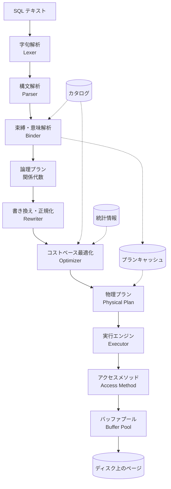

## この記事で追いかけるもの

`SELECT name FROM users WHERE age > 30` と打ち込むと結果が返ってくる。この間に何が起きているのかを、途中で「ここから先はブラックボックス」と言わずに最後まで辿ってみたい、というのがこの記事の動機です。

出発点はただの文字列です。終着点は「ファイル記述子 42 のオフセット 34,988,032 から 8192 バイト読み、そのうち 48 バイトを構造体として解釈する」という、極めて具体的な命令です。その間には十数段の変換があり、各段が固有の中間表現を持っています。

<SQLPipelineVisualizer />

全体の構造はこうなっています。上半分が<strong>クエリを理解する</strong>層、下半分が<strong>データに触る</strong>層です。



点線はデータの流れではなく参照です。カタログと統計情報は上から下へ流れる本流の外側から参照され、プランキャッシュに至っては<strong>本流そのものを飛ばします</strong>——同じ SQL が2度目に来たら、束縛の直後から物理プランへ short-cut できるからです（第9章）。

この記事では各段を Python で実装していきます。実装のスタイルは PostgreSQL に寄せます。具体的な名前（`pd_lower`、`t_hoff`、`clock-sweep`）があったほうが、あとで本物のソースを読むときに地続きになるからです。

1本のクエリを上から下まで貫くのが主筋ですが、途中で `GROUP BY` の集約、`NULL` の三値論理、`work_mem` を超えたときの挙動、プランのキャッシュ、並列実行のコスト計算といった横道にも入ります。どれも「本番でクエリが突然遅くなる」理由に直結する話です。

インデックスそのものの構造（B+木・LSM-Tree）については[データベースインデックスの仕組み](/ja/blog/database-indexing)で扱っているので、この記事では「インデックスをどう<strong>使うか</strong>」に集中します。

---

## 第1章　字句解析 — 文字列を語彙に切る

最初の仕事は、文字の並びを意味のある最小単位（トークン）に切り分けることです。

一見単純ですが、決めるべきことがあります。`>=` は1つのトークンか、`>` と `=` の2つか。`age30` は識別子か、`age` と `30` か。答えは<strong>最長一致（maximal munch）</strong>——その位置から始めて可能な限り長く読む、です。だから `>=` は1トークンになり、`age30` は1つの識別子になります。

```python
from dataclasses import dataclass

KEYWORDS = {
    "SELECT", "FROM", "WHERE", "AND", "OR", "NOT",
    "JOIN", "ON", "AS", "ORDER", "BY", "ASC", "DESC", "LIMIT",
    "GROUP", "HAVING",
}
TWO_CHAR_OPS = (">=", "<=", "<>", "!=")


@dataclass(frozen=True)
class Token:
    kind: str   # KEYWORD / IDENT / NUMBER / STRING / OP / PUNCT / EOF
    text: str
    pos: int


def tokenize(sql: str) -> list[Token]:
    out: list[Token] = []
    i, n = 0, len(sql)
    while i < n:
        if sql[i].isspace():
            i += 1
            continue

        start, c = i, sql[i]

        if c.isalpha() or c == "_":
            while i < n and (sql[i].isalnum() or sql[i] == "_"):
                i += 1
            word = sql[start:i]
            kind = "KEYWORD" if word.upper() in KEYWORDS else "IDENT"
            out.append(Token(kind, word, start))

        elif c.isdigit():
            while i < n and sql[i].isdigit():
                i += 1
            # 小数点は「後ろに数字が続くとき」だけ取り込む。
            # そうしないと "t.1" のようなドット参照を壊す。
            if i + 1 < n and sql[i] == "." and sql[i + 1].isdigit():
                i += 1
                while i < n and sql[i].isdigit():
                    i += 1
            out.append(Token("NUMBER", sql[start:i], start))

        elif c == "'":
            i += 1
            while i < n and sql[i] != "'":
                i += 1
            if i >= n:
                raise SyntaxError("unterminated string literal")
            i += 1                       # 閉じ引用符
            out.append(Token("STRING", sql[start:i], start))

        elif sql[i:i + 2] in TWO_CHAR_OPS:   # ← 1文字演算子より先に試すのが肝
            out.append(Token("OP", sql[i:i + 2], start))
            i += 2

        elif c in "=<>+-*/%":
            out.append(Token("OP", c, start))
            i += 1

        elif c in ",().;":
            out.append(Token("PUNCT", c, start))
            i += 1

        else:
            raise SyntaxError(f"unexpected character {c!r} at position {i}")

    out.append(Token("EOF", "", n))
    return out
```

分岐の順序が意味を持っている点に注意してください。`sql[i:i+2] in TWO_CHAR_OPS` の判定を1文字演算子より<strong>前</strong>に置かないと、`>=` が `>` と `=` に割れます。

以下のデモで、この走査を1トークンずつ動かせます。

<SQLTokenizerVisualizer />

### 予約語をどこで判定するか

上の実装では「英字で始まる語をまず全部読み、あとで予約語表を引く」という設計にしています。逆に「`SELECT` という文字列を先に探す」設計にすると、`selected_at` という列名が `SELECT` + `ed_at` に割れます。<strong>最長一致してから分類する</strong>順序が重要です。

なお、SQL 標準の予約語は 200 語以上あり、実装ごとに差があります。PostgreSQL は語を「予約語」「予約語だが関数名・型名としては使える」「非予約語だが関数名・型名としては使えない」「非予約語」の4段階に分類しており、`kwlist.h` に一覧があります。この段階的な扱いのおかげで、`value` や `name` のような単語（どちらも非予約語）を列名として使えます。

---

## 第2章　構文解析 — トークン列を木にする

次は文法規則に従って木を組み上げます。SQL の文の骨格（`SELECT … FROM … WHERE …`）は<strong>再帰下降</strong>で素直に書けますが、式（`a + b * c > d AND e`）は演算子の優先順位を扱う必要があります。ここでは<strong>優先順位登り（precedence climbing、Pratt 構文解析）</strong>を使います。

### AST の定義

```python
@dataclass
class ColRef:                       # 未解決の列参照
    table: str | None
    column: str

@dataclass
class Const:
    value: object

@dataclass
class BinOp:
    op: str
    left: object
    right: object

@dataclass
class FuncCall:
    name: str
    args: list
    star: bool = False       # COUNT(*) の * を表す

@dataclass
class TableRef:
    name: str
    alias: str | None

@dataclass
class JoinExpr:
    left: object
    right: object
    on: object

@dataclass
class SortKey:
    expr: object
    desc: bool

@dataclass
class Select:
    targets: list
    frm: object
    where: object | None
    group_by: list
    having: object | None
    order_by: list
    limit: int | None
```

### パーサ本体

```python
PRECEDENCE = {
    "OR": 1,
    "AND": 2,
    "=": 3, "<>": 3, "!=": 3, "<": 3, ">": 3, "<=": 3, ">=": 3,
    "+": 4, "-": 4,
    "*": 5, "/": 5,
}


class Parser:
    def __init__(self, tokens: list[Token]):
        self.toks, self.i = tokens, 0

    def peek(self) -> Token:
        return self.toks[self.i]

    def advance(self) -> Token:
        tok = self.toks[self.i]
        self.i += 1
        return tok

    def accept(self, text: str) -> Token | None:
        if self.peek().text.upper() == text.upper():
            return self.advance()
        return None

    def expect(self, text: str) -> Token:
        tok = self.accept(text)
        if tok is None:
            raise SyntaxError(f"expected {text!r}, found {self.peek().text!r}")
        return tok

    # ── 文の骨格：再帰下降 ────────────────────────────
    def parse_select(self) -> Select:
        self.expect("SELECT")
        targets = [self.parse_expr()]
        while self.accept(","):
            targets.append(self.parse_expr())

        self.expect("FROM")
        frm = self.parse_from()

        where = self.parse_expr() if self.accept("WHERE") else None

        group_by = []
        if self.accept("GROUP"):
            self.expect("BY")
            group_by.append(self.parse_expr())
            while self.accept(","):
                group_by.append(self.parse_expr())

        having = self.parse_expr() if self.accept("HAVING") else None

        order_by = []
        if self.accept("ORDER"):
            self.expect("BY")
            while True:
                expr = self.parse_expr()
                desc = self.accept("DESC") is not None
                if not desc:
                    self.accept("ASC")
                order_by.append(SortKey(expr, desc))
                if not self.accept(","):
                    break

        limit = int(self.advance().text) if self.accept("LIMIT") else None
        return Select(targets, frm, where, group_by, having, order_by, limit)

    def parse_from(self):
        node = self.parse_table_ref()
        while self.accept("JOIN"):
            right = self.parse_table_ref()
            self.expect("ON")
            node = JoinExpr(node, right, self.parse_expr())
        return node

    def parse_table_ref(self) -> TableRef:
        name = self.advance().text
        if self.accept("AS"):
            return TableRef(name, self.advance().text)
        if self.peek().kind == "IDENT":          # AS 省略形
            return TableRef(name, self.advance().text)
        return TableRef(name, None)

    # ── 式：優先順位登り ─────────────────────────────
    def parse_expr(self, min_prec: int = 0):
        left = self.parse_primary()
        while True:
            op = self.peek().text.upper()
            prec = PRECEDENCE.get(op, -1)
            if prec < 0 or prec < min_prec:
                return left
            self.advance()
            # 左結合なので、右辺には「自分より強い演算子」しか許さない
            right = self.parse_expr(prec + 1)
            left = BinOp(op, left, right)

    def parse_primary(self):
        tok = self.advance()
        if tok.kind == "NUMBER":
            return Const(float(tok.text) if "." in tok.text else int(tok.text))
        if tok.kind == "STRING":
            return Const(tok.text[1:-1])
        if tok.kind == "IDENT":
            if self.peek().text == "(":          # 集約関数の呼び出し
                self.advance()
                if self.accept("*"):
                    self.expect(")")
                    return FuncCall(tok.text.upper(), [], star=True)
                args = [self.parse_expr()]
                while self.accept(","):
                    args.append(self.parse_expr())
                self.expect(")")
                return FuncCall(tok.text.upper(), args)
            if self.peek().text == ".":
                self.advance()
                return ColRef(tok.text, self.advance().text)
            return ColRef(None, tok.text)
        if tok.text == "(":
            inner = self.parse_expr()
            self.expect(")")
            return inner
        raise SyntaxError(f"unexpected token {tok.text!r}")
```

`parse_expr(prec + 1)` の `+1` が左結合を作っています。`a - b - c` を解析するとき、`-` の右辺で `min_prec = 5` になるので、次の `-`（優先度 4）は右辺に取り込まれず、`(a - b) - c` になります。ここを `parse_expr(prec)` にすると右結合、つまり `a - (b - c)` になって計算結果が変わります。べき乗のような右結合演算子はこちらを使います。

### AST は「書かれた通り」でしかない

この時点で得られる木は、あくまで<strong>構文</strong>の木です。`users` というテーブルが存在するかどうか、`age` という列があるかどうか、`age > 30` の比較が型として妥当かどうかは、まだ一切検証されていません。`SELECT nonexistent FROM nowhere` も何事もなく解析を通過します。

---

## 第3章　束縛 — 名前を実体に結びつける

意味を与えるのが<strong>束縛（binding）</strong>、あるいは意味解析と呼ばれる工程です。ここでカタログ（システムテーブル）を引き、名前を実体に対応づけます。

### カタログ

```python
@dataclass
class Column:
    name: str
    type: str            # "int" / "text" / "numeric"

@dataclass
class Relation:
    name: str
    columns: list[Column]
    n_rows: int          # pg_class.reltuples 相当
    n_pages: int         # pg_class.relpages 相当
    oid: int = 0         # pg_class.oid
    relfilenode: int = 0 # 実ファイル名。VACUUM FULL 等で変わりうる

CATALOG = {
    "users": Relation(
        "users",
        [Column("id", "int"), Column("name", "text"), Column("age", "int")],
        n_rows=100_000, n_pages=1_000, oid=16384, relfilenode=16384,
    ),
    "orders": Relation(
        "orders",
        [Column("id", "int"), Column("user_id", "int"), Column("total", "numeric")],
        n_rows=1_000_000, n_pages=10_000, oid=16390, relfilenode=16390,
    ),
}
```

### レンジテーブルと Var

束縛後の列参照は、名前ではなく<strong>位置</strong>になります。PostgreSQL でいう `Var(varno, varattno)` です。`varno` は FROM 句に現れたテーブルの通し番号（レンジテーブルの添字）、`varattno` は列番号です。

```python
@dataclass(frozen=True)
class Var:
    rel: int        # レンジテーブル内の添字
    attno: int      # 列番号（0起点。PostgreSQL 本体は1起点）
    type: str
    label: str      # 表示用。実行には使わない


COMPARISONS = {"=", "<>", "!=", "<", ">", "<=", ">="}
NUMERIC_TYPES = {"int", "numeric"}


class Binder:
    def __init__(self, catalog):
        self.catalog = catalog
        self.range_table: list[tuple[str, Relation]] = []

    def collect_from(self, node) -> None:
        if isinstance(node, TableRef):
            if node.name not in self.catalog:
                raise NameError(f'relation "{node.name}" does not exist')
            rel = self.catalog[node.name]
            self.range_table.append((node.alias or node.name, rel))
        elif isinstance(node, JoinExpr):
            self.collect_from(node.left)
            self.collect_from(node.right)
        else:
            raise TypeError(node)

    def bind_expr(self, expr) -> tuple[object, str]:
        if isinstance(expr, Const):
            if isinstance(expr.value, bool):
                return expr, "bool"
            if isinstance(expr.value, int):
                return expr, "int"
            if isinstance(expr.value, float):
                return expr, "numeric"
            return expr, "text"

        if isinstance(expr, ColRef):
            hits = []
            for rel_idx, (alias, rel) in enumerate(self.range_table):
                if expr.table is not None and expr.table != alias:
                    continue
                for attno, col in enumerate(rel.columns):
                    if col.name == expr.column:
                        hits.append(Var(rel_idx, attno, col.type,
                                        f"{alias}.{col.name}"))
            if not hits:
                raise NameError(f'column "{expr.column}" does not exist')
            if len(hits) > 1:
                raise NameError(f'column reference "{expr.column}" is ambiguous')
            return hits[0], hits[0].type

        if isinstance(expr, BinOp):
            left, lt = self.bind_expr(expr.left)
            right, rt = self.bind_expr(expr.right)

            if expr.op in ("AND", "OR"):
                if (lt, rt) != ("bool", "bool"):
                    raise TypeError(f"argument of {expr.op} must be boolean")
                return BinOp(expr.op, left, right), "bool"

            if lt != rt and not {lt, rt} <= NUMERIC_TYPES:
                raise TypeError(
                    f"operator does not exist: {lt} {expr.op} {rt}")

            result = "bool" if expr.op in COMPARISONS else lt
            return BinOp(expr.op, left, right), result

        if isinstance(expr, FuncCall):
            args = [self.bind_expr(a) for a in expr.args]
            bound = FuncCall(expr.name, [a for a, _ in args], expr.star)
            if expr.name == "COUNT":
                return bound, "int"                # COUNT は常に整数
            if not args:
                raise TypeError(f"{expr.name} requires an argument")
            arg_type = args[0][1]
            if expr.name == "AVG":
                return bound, "numeric"            # 整数の平均でも小数になる
            if expr.name in ("SUM", "MIN", "MAX"):
                # MIN/MAX は実際にこの型。SUM だけ簡略化してある——PostgreSQL は
                # 桁溢れを避けるため sum(int4) を int8、sum(int8) を numeric に広げる
                return bound, arg_type
            raise NameError(f'function "{expr.name}" does not exist')

        raise TypeError(f"cannot bind {expr!r}")
```

ここで初めて次のようなエラーが出せます。

- `column "ago" does not exist` — カタログに無い列
- `column reference "id" is ambiguous` — 両方のテーブルに `id` がある
- `operator does not exist: text > integer` — 型が合わない

`lt != rt and not {lt, rt} <= NUMERIC_TYPES` の部分は<strong>暗黙の型変換</strong>を1行で済ませています。実際の PostgreSQL はもっと精緻で、`pg_operator` から候補となる演算子をすべて集め、`pg_cast` に定義された変換規則で優先順位づけをして解決します。`o.total > 100` の `100` が `numeric` に昇格されるのはこの仕組みです。

### 束縛が生む「同じ意味の別表現」

束縛後は、`u.age`、`users.age`、（曖昧でなければ）`age` がすべて同じ `Var(0, 2, "int")` になります。以降の最適化はこの正規化された表現の上で動くので、書き方の違いを気にせずに済みます。これは意図的な設計です。

---

## 第4章　論理プラン — 関係代数に落とす

束縛済みの AST を、<strong>関係代数</strong>の演算子木に変換します。ここから先は SQL の構文とは無関係になり、「どの集合演算をどの順で適用するか」だけの世界になります。

```python
@dataclass
class Scan:
    rel: int
    relation: Relation
    alias: str
    predicate: object | None = None    # 走査しながら評価する条件

@dataclass
class Filter:
    child: object
    predicate: object

@dataclass
class Join:
    left: object
    right: object
    predicate: object

@dataclass
class Project:
    child: object
    exprs: list

@dataclass
class Sort:
    child: object
    keys: list

@dataclass
class Aggregate:
    child: object
    group_keys: list
    aggs: list           # [FuncCall("COUNT", [], star=True), …]

@dataclass
class Limit:
    child: object
    n: int
```

変換規則は素直です。

| SQL 句 | 関係代数演算子 |
| --- | --- |
| `FROM t` | `Scan(t)` |
| `FROM a JOIN b ON p` | `Join(Scan(a), Scan(b), p)` |
| `WHERE p` | `Filter(child, p)` |
| `GROUP BY g` | `Aggregate(child, [g], aggs)` |
| `HAVING h` | `Filter(Aggregate(…), h)` |
| `SELECT e1, e2` | `Project(child, [e1, e2])` |
| `ORDER BY k` | `Sort(child, [k])` |
| `LIMIT n` | `Limit(child, n)` |

この表には<strong>SQL の直感的な規則の根拠が埋まっています</strong>。`WHERE` は `Aggregate` の<strong>下</strong>に、`HAVING` は<strong>上</strong>に展開されます。だから `HAVING` は集約結果を参照でき、`WHERE` はできない。「集約されていない値しか見えない位置にある」というだけの話です。

素直に組むと、こういう木ができます。

```text
Limit(10)
└─ Sort(o.total DESC)
   └─ Project(u.name, o.total)
      └─ Filter(u.age > 30 AND o.total > 100)
         └─ Join(u.id = o.user_id)
            ├─ Scan(users AS u)
            └─ Scan(orders AS o)
```

演算子の入れ子の順番は SQL の評価順序（`FROM` → `WHERE` → `SELECT` → `ORDER BY` → `LIMIT`）に対応しています。`SELECT` 句が `WHERE` より<strong>上</strong>に来るので、`WHERE` の中では `SELECT` で定義した別名を参照できない、という SQL の制約もここから説明できます。

この木は<strong>正しい</strong>けれど<strong>遅い</strong>。1,000,000 行の `orders` と 100,000 行の `users` を全部結合してから絞り込むからです。

---

## 第5章　書き換え — 意味を変えずに形を変える

最適化の第一段は、コストを計算するまでもなく明らかに得な変形です。関係代数の等価変換規則を使います。

### 述語プッシュダウン

$$\sigma_{p}(R \bowtie S) \equiv \sigma_{p}(R) \bowtie S \quad (p \text{ が } R \text{ の列だけを参照するとき})$$

選択（フィルタ）を結合より下に降ろす。結合に入る行が減るので、ほぼ常に得です。

実装の鍵は<strong>AND を連言項に分解してから個別に降ろす</strong>ことです。`u.age > 30 AND o.total > 100` はひとかたまりでは片方のテーブルにしか降ろせませんが、分解すれば両方に降ろせます。

```python
def conjuncts(expr) -> list:
    """AND の連鎖を平坦なリストに分解する。"""
    if isinstance(expr, BinOp) and expr.op == "AND":
        return conjuncts(expr.left) + conjuncts(expr.right)
    return [expr]


def and_all(preds: list):
    if not preds:
        return None
    node = preds[0]
    for p in preds[1:]:
        node = BinOp("AND", node, p)
    return node


def used_rels(expr) -> set[int]:
    """式が参照しているレンジテーブル添字の集合。"""
    if isinstance(expr, Var):
        return {expr.rel}
    if isinstance(expr, BinOp):
        return used_rels(expr.left) | used_rels(expr.right)
    return set()


def rels_of(node) -> set[int]:
    if isinstance(node, Scan):
        return {node.rel}
    if isinstance(node, Join):
        return rels_of(node.left) | rels_of(node.right)
    return rels_of(node.child)


def push_down(node, preds: list):
    """preds をできるだけ深い位置へ降ろす。
       戻り値は (書き換えた部分木, まだ降ろせなかった述語)。"""
    if isinstance(node, Scan):
        mine, stays = [], []
        for p in preds:
            (mine if used_rels(p) <= {node.rel} else stays).append(p)
        node.predicate = and_all(mine)
        return node, stays

    if isinstance(node, Join):
        node.left, preds = push_down(node.left, preds)
        node.right, preds = push_down(node.right, preds)
        here, stays = [], []
        scope = rels_of(node)
        for p in preds:
            (here if used_rels(p) <= scope else stays).append(p)
        return (Filter(node, and_all(here)) if here else node), stays

    raise TypeError(node)
```

`WHERE` を `conjuncts()` で分解して `push_down()` に渡すと、木はこうなります。

```text
Limit(10)
└─ Sort(o.total DESC)
   └─ Project(u.name, o.total)
      └─ Join(u.id = o.user_id)
         ├─ Scan(users)   filter: age > 30
         └─ Scan(orders)  filter: total > 100
```

結合に入る行数は 100,000 × 1,000,000 から 55,000 × 100,000 に減りました。

### OR は降ろせない

`WHERE u.age > 30 OR o.total > 100` は分解できません。`OR` はどちらか一方が真であれば真なので、片方のテーブルだけで評価すると答えが変わります。実際にはこの形は結合後にしか評価できず、多くの遅いクエリの原因になります。対策としては、`UNION` に書き換える（各枝を独立に最適化できる）か、そもそも `OR` を避ける設計にします。

### そのほかの書き換え

- <strong>列プルーニング</strong>: 上位で参照されない列を読み出し対象から外す。列指向ストレージでは効果が桁違いに大きく、`SELECT *` を避けるべき理由がこれです。
- <strong>定数畳み込み</strong>: `WHERE created_at > now() - interval '7 days'` の右辺をプラン時に1回だけ評価する。ただし `now()` は<strong>安定（stable）</strong>関数——同一文の中では値が変わらない——であることが前提で、`random()` のような揮発性関数は畳み込めません。
- <strong>述語推移閉包</strong>: `a.x = b.x AND a.x = 10` から `b.x = 10` を導出して、`b` 側にも降ろせるようにする。
- <strong>サブクエリのデコリレーション</strong>: 相関サブクエリを結合に書き換える。これは効果が最も大きい書き換えの一つです。

推移閉包は短いので実装を示します。実際、「なぜか片方のテーブルだけ索引が使われない」の多くはこの書き換えが効いているかどうかで決まります。

```python
def transitive_closure(preds: list) -> list:
    """x = y の同値クラスを作り、定数条件をクラス全体へ複写する。"""
    classes: list[set] = []                     # 同値と判明した Var の集合
    for p in preds:
        if (isinstance(p, BinOp) and p.op == "="
                and isinstance(p.left, Var) and isinstance(p.right, Var)):
            merged = {p.left, p.right}
            rest = []
            for c in classes:                   # 重なるクラスを統合する
                (merged.update(c) if merged & c else rest.append(c))
            classes = rest + [merged]

    derived = []
    for p in preds:
        if isinstance(p, BinOp) and isinstance(p.left, Var) and isinstance(p.right, Const):
            for c in classes:
                if p.left in c:
                    derived += [BinOp(p.op, v, p.right) for v in c if v != p.left]
    return preds + derived
```

`a.x = b.x AND a.x = 10` に適用すると `b.x = 10` が生まれ、`push_down()` がそれを `b` の走査直上まで降ろせるようになります。PostgreSQL ではこの仕組みを<strong>等価クラス（EquivalenceClass）</strong>と呼び、`equivclass.c` が担当します。

デコリレーションの例を挙げます。

```sql
-- 相関サブクエリ：外側の1行ごとに内側を評価する（ナイーブには N 回）
SELECT u.name FROM users u
WHERE EXISTS (SELECT 1 FROM orders o WHERE o.user_id = u.id AND o.total > 100);

-- 半結合（semi join）に書き換え：ハッシュ表を1回作れば済む
SELECT u.name FROM users u
SEMI JOIN orders o ON o.user_id = u.id AND o.total > 100;
```

`SEMI JOIN` は SQL の構文としては書けませんが、プランナ内部の演算子としては実在します。PostgreSQL の `EXPLAIN` で `Hash Semi Join` と表示されるのがこれです。

### 書き換えを壊すもの：三値論理と外部結合

ここまでの書き換えは、暗黙のうちに2つのことを仮定していました。<strong>述語は真か偽かのどちらか</strong>であること、そして<strong>結合は交換できる</strong>こと。SQL ではどちらも成り立ちません。

<strong>一つ目：NULL と三値論理</strong>。SQL の論理値は TRUE / FALSE / UNKNOWN の3つです。`NULL > 30` は FALSE ではなく UNKNOWN になります。

```text
AND    | T | F | U          OR     | T | F | U
-------+---+---+---        -------+---+---+---
   T   | T | F | U             T   | T | T | T
   F   | F | F | F             F   | T | F | U
   U   | U | F | U             U   | T | U | U
```

ここから実務上重要な帰結が2つ出ます。

1. <strong>`WHERE` が行を通すのは述語が TRUE のときだけ</strong>で、UNKNOWN は落ちます。だから述語の評価は `if pred(row) is True` と書くのが正確です（第15章で実ストレージ版の走査を書くときに、実際にそう書きます）。
2. <strong>`CHECK` 制約は逆</strong>で、UNKNOWN を合格扱いにします。同じ式を書いても、置かれる場所によって NULL の扱いが反転します。

さらに `NOT IN (… NULL を含むリスト)` が常に空集合を返すのもこの帰結です。`x NOT IN (1, NULL)` は `x <> 1 AND x <> NULL` と同義で、右辺が永久に UNKNOWN なので全体が TRUE になり得ません。このためプランナは `NOT IN` を安全に反結合（anti join）へ変換できず、`NOT EXISTS` に比べて遅くなりがちです。

<strong>二つ目：外部結合</strong>。述語プッシュダウンは内部結合にしか無条件では適用できません。

```sql
-- 元のクエリ：注文の無いユーザも残る
SELECT u.name, o.total
FROM users u LEFT JOIN orders o ON u.id = o.user_id
WHERE o.total > 100;          -- ← NULL 側を落とすので内部結合と同義になる

-- こちらはプッシュダウンできない
SELECT u.name, o.total
FROM users u LEFT JOIN orders o ON u.id = o.user_id AND o.total > 100;
```

上の例は `o.total > 100` が NULL を弾くので、プランナはこれを<strong>内部結合に降格（join strength reduction）</strong>して自由に並べ替えられます。下の例は `ON` 句の条件なので、降ろすと「条件を満たさないユーザが消える」という別の答えになってしまいます。

さらに外部結合は<strong>結合順序の自由度を奪う</strong>。$(A \bowtie B) \mathbin{⟕} C$ と $A \bowtie (B \mathbin{⟕} C)$ は一般に異なる結果になります。第8章の動的計画法は「どんな分割でも同じ結果になる」という内部結合の性質に依存しているので、外部結合が混ざるとそのままでは使えません。結合をグラフの辺ではなく<strong>超辺（hyperedge）</strong>で表し、「この結合をやる前にこれらのテーブルが揃っていなければならない」という依存関係を直接表現するのが、後で触れる DPhyp の発想です。

---

## 第6章　統計とカーディナリティ推定

ここからが最適化の本体です。そして、<strong>クエリ最適化で最も壊れやすい部分</strong>でもあります。

コストを比較するには、各演算子が何行返すかを知る必要があります。しかし実際に実行するまで正確な行数は分かりません。だから統計情報から推定します。

### ヒストグラム

PostgreSQL は `ANALYZE` でテーブルをサンプリングし、`pg_statistic` に以下を記録します。

- <strong>最頻値（MCV）とその頻度</strong> — 等値条件の選択率に使う
- <strong>等深度ヒストグラムの境界値</strong> — 範囲条件の選択率に使う
- <strong>n_distinct</strong> — 相異なる値の数（負値なら行数に対する比率）
- <strong>相関係数</strong> — 列の物理的な並び順との相関。インデックススキャンのランダム I/O 量に効く

等深度ヒストグラムは「各バケットに同じ行数が入るように境界を決める」方式です。バケット幅が狭い区間は値が密集している区間を意味します。

```python
@dataclass
class ColumnStats:
    n_distinct: int
    bounds: list         # 等深度ヒストグラムの境界値。len(bounds) - 1 個のバケット


def selectivity_gt(stats: ColumnStats, value) -> float:
    """col > value の選択率。バケット内は一様分布を仮定して線形補間する。"""
    bounds = stats.bounds
    nb = len(bounds) - 1                     # バケット数
    if value < bounds[0]:
        return 1.0
    if value >= bounds[-1]:
        return 0.0
    for i in range(nb):
        lo, hi = bounds[i], bounds[i + 1]
        if lo <= value < hi:
            above_in_bucket = (hi - value) / (hi - lo)
            return (nb - i - 1) / nb + above_in_bucket / nb
    return 0.0
```

`users.age` の十分位境界が次のようになっているとします。

```python
age_stats = ColumnStats(
    n_distinct=63,
    bounds=[18, 22, 25, 27, 29, 31, 34, 38, 44, 53, 80],
)
selectivity_gt(age_stats, 30)     # → 0.55
```

計算を追うと、`30` はバケット 4（`[29, 31)`）に入ります。バケット 5〜9 は丸ごと 30 より上なので $5/10 = 0.5$。バケット 4 の中では $(31-30)/(31-29) = 0.5$ が上側なので $0.5 \times 0.1 = 0.05$。合計 $0.55$、つまり 55,000 行です。

### 結合のカーディナリティ

等結合の推定には、教科書的にはこの式を使います。$\mathrm{NDV}$ は number of distinct values——上の `n_distinct` のことです。

$$|R \bowtie_{R.a = S.b} S| \approx \frac{|R| \cdot |S|}{\max(\mathrm{NDV}(R.a), \mathrm{NDV}(S.b))}$$

```python
def join_cardinality(left_rows, right_rows, ndv_left, ndv_right) -> float:
    """含有仮定（containment assumption）に基づく等結合の見積り。
       値の少ない側のすべての値が、多い側にも現れると仮定する。"""
    return left_rows * right_rows / max(ndv_left, ndv_right)
```

`users` 55,000 行（フィルタ後）と `orders` 100,000 行（フィルタ後）、`NDV(users.id) = NDV(orders.user_id) = 100,000` なので、

$$\frac{55{,}000 \times 100{,}000}{100{,}000} = 55{,}000$$

### 推定が壊れるとき

この推定は3つの強い仮定に依存しています。

1. <strong>一様性</strong> — ヒストグラムの各バケット内で値が一様に分布している
2. <strong>独立性</strong> — 複数の条件の選択率は互いに独立で、掛け算できる
3. <strong>含有性</strong> — 結合キーの値域が一方に含まれる

現実にはどれも成り立ちません。特に独立性の仮定は簡単に破れます。`WHERE city = '横浜市' AND prefecture = '神奈川県'` は、独立と仮定すると $0.01 \times 0.05 = 0.0005$ ですが、実際には $0.01$ です（横浜市なら神奈川県は確定するので）。20倍の過小推定です。

そして誤差は結合を1段登るごとに掛け算で伝播します。

<CardinalityErrorDiagram />

Leis らの論文 *"How Good Are Query Optimizers, Really?"*（VLDB 2015）は、実データ（IMDB）に対する結合クエリで、主要な商用・OSS 実装の推定誤差が結合段数とともに指数的に悪化し、2段を超える結合では 1,000 倍を超える誤差が珍しくない（外れ値はさらに数桁大きい）ことを示しました。この論文の結論は示唆的です——<strong>コストモデルの精度よりもカーディナリティ推定の精度のほうが、最終的なプランの質にはるかに大きく効く</strong>。

対策としては次のものがあります。

- <strong>多変量統計</strong> — 相関する列の組に対して統計を取る。PostgreSQL の `CREATE STATISTICS (dependencies, ndistinct, mcv)` がこれです。
- <strong>適応的クエリ実行</strong> — 実行中に実際の行数を観測し、プランを差し替える。Oracle の Adaptive Plans、SQL Server の Adaptive Joins、Spark AQE。
- <strong>学習ベースの推定器</strong> — 実行履歴からカーディナリティを学習する。研究段階の話題ですが、実運用に入りつつあります。

---

## 第7章　コストモデル — 何を数えるのか

行数が推定できたら、次はコストです。ここで測るのは秒でもミリ秒でもなく、<strong>無次元の相対値</strong>です。「順次ページ読み1回を 1.0 とすると、他はその何倍か」という比だけを持ちます。

```python
import math

SEQ_PAGE_COST        = 1.0      # 順次読みでページを1枚読む
RANDOM_PAGE_COST     = 4.0      # ランダム読みでページを1枚読む
CPU_TUPLE_COST       = 0.01     # タプルを1件処理する
CPU_INDEX_TUPLE_COST = 0.005    # 索引エントリを1件処理する
CPU_OPERATOR_COST    = 0.0025   # 演算子や関数を1回評価する
```

`random_page_cost = 4.0` は「ランダム読みは順次読みの4倍高い」という HDD 前提の既定値です。SSD では実測でこの比は 1.1〜2 程度まで縮むので、SSD 環境では `random_page_cost` を 1.1 前後に下げるのが定番のチューニングになります。この1つの定数が、インデックススキャンとシーケンシャルスキャンの分岐点を動かします。

### 走査コスト

```python
def seq_scan_cost(rel: Relation, n_quals: int) -> float:
    """全ブロックを順に読み、全タプルに対して n_quals 個の条件を評価する。"""
    return (rel.n_pages * SEQ_PAGE_COST
            + rel.n_rows * CPU_TUPLE_COST
            + rel.n_rows * n_quals * CPU_OPERATOR_COST)
```

```python
seq_scan_cost(CATALOG["users"],  1)   # 1,000 + 1,000 +   250 =  2,250
seq_scan_cost(CATALOG["orders"], 1)   # 10,000 + 10,000 + 2,500 = 22,500
```

重要なのは、この式が<strong>選択率に依存しない</strong>ことです。1行しか返さなくても全ブロックを読みます。逆にインデックススキャンは選択率に比例してコストが増えます。この2本の直線が交わる点が、プランが切り替わる境界です。

<AccessPathComparison />

### インデックススキャンのコスト

もう一本の直線を引きます。素直に考えると「$n$ 行取り出すならランダム読み $n$ 回」になりそうですが、実際には違います。同じページに複数の行が乗っているので、取り出す行が増えるほど「すでに読んだページ」に当たる確率が上がります。

この効果を定量化したのが Mackert と Lohman の式（1989）で、PostgreSQL はそのまま使っています。

```python
def index_pages_fetched(tuples_fetched, pages, index_pages,
                        total_table_pages, effective_cache_size=524_288):
    """Mackert-Lohman。有限バッファのもとで実際に読むページ数。
       effective_cache_size の既定は 4GB = 524,288 ページ。"""
    T = float(pages) if pages > 1 else 1.0
    # クエリ内の全テーブルとこの索引でキャッシュを奪い合うと仮定し、T の割合で按分する
    total_pages = max(total_table_pages + index_pages, 1.0)
    b = max(1.0, math.ceil(effective_cache_size * T / total_pages))

    if T <= b:                                  # 表全体がキャッシュに収まる
        pf = (2.0 * T * tuples_fetched) / (2.0 * T + tuples_fetched)
        return T if pf >= T else math.ceil(pf)

    lim = (2.0 * T * b) / (2.0 * T - b)         # 再読みが発生し始める点
    if tuples_fetched <= lim:
        return math.ceil((2.0 * T * tuples_fetched) / (2.0 * T + tuples_fetched))
    return math.ceil(b + (tuples_fetched - lim) * (T - b) / T)
```

`users`（1,000 ページ / 100,000 行）から 5,000 行を取り出す場合を計算してみます。

$$\mathrm{PF} = \frac{2 \times 1{,}000 \times 5{,}000}{2 \times 1{,}000 + 5{,}000} = 1{,}428.6 \;\longrightarrow\; T = 1{,}000 \text{ でクランプ}$$

<strong>5,000 回のランダム読みではなく、多くても表全体分の 1,000 ページ</strong>です。「1行につき1ページ」という直感は、行数が増えると崩れます。

### 相関——同じ索引が 75 倍違う

もう一つの要因が索引の順序とヒープの物理順の<strong>相関</strong>です。PostgreSQL は2つの端点を計算し、その間を補間します。

```python
def index_scan_cost(rel, index_pages, selectivity, correlation=0.0,
                    random_page_cost=RANDOM_PAGE_COST, total_table_pages=11_000):
    tuples = rel.n_rows * selectivity

    # 索引側：該当するエントリを読む
    idx_pages = math.ceil(selectivity * index_pages)
    idx_cost = (idx_pages * random_page_cost
                + tuples * (CPU_INDEX_TUPLE_COST + CPU_OPERATOR_COST))

    # ヒープ側：無相関と完全相関の2つの端点を相関の二乗で補間する
    pf = index_pages_fetched(tuples, rel.n_pages, index_pages, total_table_pages)
    max_io = pf * random_page_cost                       # correlation = 0
    seq_pages = math.ceil(selectivity * rel.n_pages)
    min_io = random_page_cost + max(seq_pages - 1, 0) * SEQ_PAGE_COST  # = 1
    heap_cost = max_io + correlation ** 2 * (min_io - max_io)

    return idx_cost + heap_cost + tuples * CPU_TUPLE_COST
```

選択率 5%（5,000 行）で相関だけを動かすとこうなります。

| 相関 | ヒープ I/O コスト | 意味 |
| --- | ---: | --- |
| 0.0 | 4,000 | 1,000 ページを全部ランダムに読む |
| 0.5 | 3,013 | 中間（二乗で補間するので 0.5 でも 0 寄り） |
| 1.0 | 53 | 50 ページを順次に読む（4.0 + 49 × 1.0） |

同じ索引で同じ行数を取り出しても、相関の違いだけで <strong>75 倍</strong>の差がつきます。`CLUSTER` や、時系列データの挿入順が自然に昇順になることの価値は、この一行の補間式に集約されています。

なお、重みに相関の<strong>二乗</strong>を使うことに厳密な導出があるわけではありません。`costsize.c` のコメントはこう書いています。

> We currently interpolate linearly between the estimates based on the correlation squared (XXX is that appropriate?).

本番データベースのコストモデルにも、自覚されたやっつけ仕事が入っています。

### 交差点を求める

`users(age)` の索引を 275 ページ、相関 0 として、Seq Scan の 2,250 と比べます。

| 選択率 | 取得行数 | ML のページ数 | Index Scan | 判定 |
| ---: | ---: | ---: | ---: | --- |
| 0.1% | 100 | 96 | 390 | 索引の勝ち |
| 0.5% | 500 | 400 | 1,617 | 索引の勝ち |
| 0.8% | 800 | 572 | 2,314 | ほぼ互角 |
| 1.0% | 1,000 | 667 | 2,698 | 全走査の勝ち |
| 5.0% | 5,000 | 1,000 | 4,144 | 全走査の勝ち |

<strong>交差点はおよそ 0.8%</strong>です。これが HDD 前提の `random_page_cost = 4.0` での結論。ここを SSD 向けの 1.1 に下げると、同じテーブル・同じ索引で交差点は<strong>数十%のオーダーまで跳ね上がります</strong>。ランダム読みが安くなれば ML 式のクランプと相まって、全行に CPU コストを払う Seq Scan のほうが不利になるからです。

（このモデルは索引側の下降コストや B+木の高さを省略しているので、実際の PostgreSQL の交差点はこれより低めに出ます。数値そのものより、<strong>定数1つで境界が桁単位で動く</strong>ことのほうが要点です。）

### 結合コスト

1つのテーブルをどう読むかは決まりました。次は2つの入力をどう突き合わせるかです。結合アルゴリズムごとにコスト式を用意します。

```python
@dataclass
class Plan:
    rows: float
    cost: float
    desc: str


def hash_join_cost(build: Plan, probe: Plan, out_rows: float) -> float:
    return (build.cost + probe.cost
            + build.rows * CPU_OPERATOR_COST     # ハッシュ表の構築
            + probe.rows * CPU_OPERATOR_COST     # プローブ
            + out_rows   * CPU_TUPLE_COST)       # 出力タプルの生成


def sort_cost(input_cost: float, rows: float, limit: int | None = None) -> float:
    """PostgreSQL に倣い、比較1回のコストを 2 * cpu_operator_cost とする。
       LIMIT が付くと上位 n 件だけを保つヒープになり、log の底が小さくなる。"""
    comparison_cost = 2.0 * CPU_OPERATOR_COST
    keep = rows if limit is None else min(rows, limit)
    return input_cost + comparison_cost * rows * math.log2(max(keep, 2.0))


def merge_join_cost(left: Plan, right: Plan, out_rows: float) -> float:
    ls = sort_cost(left.cost, left.rows)
    rs = sort_cost(right.cost, right.rows)
    return (ls + rs
            + (left.rows + right.rows) * CPU_OPERATOR_COST
            + out_rows * CPU_TUPLE_COST)
```

（`sort_cost` の有界ケースは簡略化してあります。PostgreSQL の `cost_tuplesort` は top-N ヒープソートに対して $N \log_2 2K$ を使います。定数倍の差なのでプラン選択の順位には影響しませんが、実際の `EXPLAIN` 出力と数字を照らし合わせるときは注意してください。）

冒頭のクエリで3つの候補を比べます。

| 候補 | 内訳 | コスト |
| --- | --- | --- |
| NestedLoop（`users` × IndexScan） | $2{,}250 + 55{,}000 \times 48.175$ | 2,651,875 |
| MergeJoin（両側ソート） | $6{,}580 + 30{,}805 + 938$ | 38,323 |
| <strong>HashJoin</strong>（build = `users`） | $2{,}250 + 22{,}500 + 938$ | <strong>25,688</strong> |

NestedLoop の 48.175 は「外側1行あたりの内側インデックス参照コスト」です。`users` 1人につき平均10件の `orders` があるので、索引ページ2枚とヒープページ10枚をランダムに読み、CPU コストが $10 \times (0.005 + 0.01 + 0.0025)$。合計 $12 \times 4.0 + 0.175 = 48.175$。これを 55,000 回繰り返すので圧倒的に高くつきます。

一方、`WHERE u.id = 42` のように外側が1行なら、同じ NestedLoop が最速になります。<strong>アルゴリズムに絶対的な優劣はなく、行数によって順位が入れ替わる</strong>——これがコストベース最適化が存在する理由そのものです。

### ハッシュ結合の build 側の選び方

`hash_join_cost` は build と probe を対称に扱っているように見えますが、実際には build 側を小さくすべき理由があります。ハッシュ表はメモリ（PostgreSQL なら `work_mem`）に収まらなければならず、収まらなければ<strong>grace hash join</strong>——両側をハッシュ値でパーティションに分割し、一時ファイルに書き出してからパーティション単位で処理する——に切り替わり、追加の I/O が発生します。プランナは build 側の推定サイズが `work_mem` を超えるとバッチ数を増やす形でこれをコストに織り込みます。

### 起動コストと総コスト

ここまでコストをスカラー1つとして扱ってきましたが、`EXPLAIN` の出力はこうなっています。

```text
Hash Join  (cost=2387.50..25687.50 rows=55000 width=36)
```

数字が2つあります。前が<strong>起動コスト（startup cost）</strong>、つまり最初の1行を返すまでに支払うコスト。後が<strong>総コスト（total cost）</strong>で、全行を返し切るまでのコストです。

この2つを分けて持つのは、<strong>上位ノードが全行を必要としない場合があるから</strong>です。`costsize.c` の冒頭にある式がそのまま答えです。

```python
@dataclass
class CostedPlan:
    rows: float
    startup_cost: float
    total_cost: float


def cost_for(plan: CostedPlan, tuples_to_fetch: float) -> float:
    """部分取得のコスト。起動コストはどうせ払うので按分しない。"""
    frac = min(tuples_to_fetch, plan.rows) / plan.rows
    return plan.startup_cost + (plan.total_cost - plan.startup_cost) * frac
```

### ブロッキングとは「起動コストが高い」こと

ハッシュ結合の起動コストには、<strong>build 側の総コストが丸ごと入ります</strong>。ハッシュ表を作り終わるまで 1 行も出せないからです。このように「入力を読み切るまで 1 行も返せない」性質を持つ演算子を<strong>ブロッキング</strong>と呼びます（実装は第10章）。

```python
def hash_join_startup(build: Plan) -> float:
    """build を読み切り、ハッシュ表を埋め切るまでが startup。"""
    return build.cost + build.rows * CPU_OPERATOR_COST
```

冒頭のプランなら $2{,}250 + 55{,}000 \times 0.0025 = 2{,}387.5$、総コストが $25{,}687.5$。この一組の数字が、プランナにとっての「ブロッキング」の定義そのものです。

（PostgreSQL の `initial_cost_hashjoin` はさらに `cpu_tuple_cost` を build 行ごとに課すので $2{,}250 + 55{,}000 \times (0.0025 + 0.01) = 2{,}937.5$ になります。ここでは本章の簡易モデルに合わせています。）

### LIMIT を付けると順位がひっくり返る

第9章で「`LIMIT` が下位のアルゴリズム選択を変える」と書くことになりますが、その主張はこの2つの数字だけで計算できます。

| クエリ | プラン | 計算 | コスト |
| --- | --- | --- | ---: |
| `… ORDER BY o.total DESC LIMIT 10` | Sort がブロック | startup ≈ total | 26,601 |
| `… LIMIT 10`（ORDER BY 無し） | HashJoin | $2{,}387.5 + 23{,}300 \times \frac{10}{55{,}000}$ | <strong>2,392</strong> |
| `… LIMIT 10`（ORDER BY 無し） | NestedLoop + IndexScan | $0 + 2{,}651{,}875 \times \frac{10}{55{,}000}$ | <strong>482</strong> |

全行を返す場合は HashJoin（25,688）が NestedLoop（2,651,875）に 100 倍以上の差をつけて勝ちます。ところが 10 行だけでよければ、<strong>順位が逆転します</strong>。NestedLoop は起動コストがほぼ 0 なので、必要な分だけ外側を回せば済むからです。

同時に、これが<strong>「`LIMIT 10` を付けたら 1000 倍遅くなった」という古典的な障害の正体</strong>です。プランナは「外側 10 行も回せば 10 行揃う」と見積もってゼロ起動の NestedLoop を選びますが、実際には条件を満たす行が稀だった場合、外側を最後まで走査する羽目になります。カーディナリティ推定の誤りが、LIMIT のもとでは最も残酷な形で現れます。

なおカーソル（`DECLARE … CURSOR`）はこの仕組みを常時使います。`cursor_tuple_fraction`（既定 0.1）に従って「全体の 10% だけ取り出す」前提でプランを選ぶので、同じ SQL でもカーソル経由だと違うプランになることがあります。

---

## 第8章　結合順序 — 探索空間との戦い

3テーブル以上の結合では、<strong>どの順で結合するか</strong>がアルゴリズム選択より大きな差を生みます。

### 探索空間の大きさ

$n$ 個のテーブルの結合順序は、左深優先木（left-deep tree）だけに限っても $n!$ 通り。ブッシー木（bushy tree）まで含めると $\frac{(2n-2)!}{(n-1)!}$ 通りです。

<PlanSpaceTable />

全列挙は無理ですが、<strong>部分構造の最適性</strong>という性質が使えます。ある全体プランが $\{A, B, C\}$ の結合結果を中間結果として使っているなら、その中間結果を作る部分木は $\{A, B, C\}$ 単体の最適プランに差し替えてよい——コスト関数が単調なら、全体のコストは悪化しないからです。だから部分集合ごとに最適プランを1つだけ覚えておけば十分で、状態数は $2^n$ に落ちます。これが 1979 年の System R が導入した動的計画法です。

```python
def dp_join_order(rels, cardinality, connected):
    """部分集合の小さい順に最適プランを確定していく（DPsize）。"""
    n = len(rels)
    best = {}
    for i in range(n):
        best[1 << i] = Plan(rows=rels[i].n_rows, cost=0.0, desc=rels[i].name)

    for size in range(2, n + 1):
        for mask in range(1, 1 << n):
            if bin(mask).count("1") != size:
                continue
            if not connected(mask):          # 直積になる部分集合は刈る
                continue
            rows = cardinality(mask)
            for right in submasks(mask):     # mask の真部分集合を列挙
                left = mask ^ right
                if left == 0 or right == 0:
                    continue
                if left not in best or right not in best:
                    continue
                if not has_join_edge(left, right):
                    continue
                cost = rows + best[left].cost + best[right].cost   # C_out
                if mask not in best or cost < best[mask].cost:
                    best[mask] = Plan(rows, cost,
                                      f"({best[left].desc} ⋈ {best[right].desc})")
    return best[(1 << n) - 1]


def submasks(mask: int):
    """mask の空でない真部分集合をすべて列挙する定番のイディオム。"""
    sub = (mask - 1) & mask
    while sub > 0:
        yield sub
        sub = (sub - 1) & mask
```

`submasks` のイディオムは覚えておく価値があります。`(sub - 1) & mask` で「mask の部分集合を降順に1つずつ辿る」ことができ、全部分集合の全部分集合を列挙する計算量は $O(3^n)$ になります。

ここでは `C_out` というコストモデルを使っています——<strong>中間結果の行数の総和</strong>だけを最小化する、という割り切った定義です。走査コストや結合アルゴリズムのコストは無視しますが、結合順序の良し悪しはこれでかなり捉えられます。

実際に動かしてみましょう。

<JoinOrderDPVisualizer />

デモの結論は、SQL に書いた順序 $((u \bowtie o) \bowtie i) \bowtie p$ が 605,000、最適な $((i \bowtie p) \bowtie o) \bowtie u$ が 15,000 で、<strong>約 40 倍の差</strong>です。「最も選択的なテーブルから結合を始める」という直感が、コストという形で裏づけられます。

### 直積を刈る

DP の中で `connected(mask)` を確認しているのが効いています。結合述語で繋がっていない部分集合を作ることは直積を意味し、行数が爆発します。この枝刈りだけで探索空間は大幅に縮み、たとえばチェーン状の結合グラフでは候補数が $O(n^3)$ まで落ちます。

ただし刈りすぎには副作用があります。片方が極端に小さいテーブル（次元表など）では直積のほうが速いことが実際にあり、多くの実装は「連結な部分集合が1つも作れないときだけ直積を許す」というフォールバックを持っています。

### n が大きいとき

PostgreSQL は結合テーブル数が `geqo_threshold`（既定 12）以上になると、動的計画法をやめて<strong>遺伝的アルゴリズム（GEQO）</strong>に切り替えます。プランが最適である保証は失われますが、プラン生成時間が有限に収まります。

ただし、<strong>実際に先に効いてくるのは `join_collapse_limit`（既定 8）のほうです</strong>。明示的な `JOIN` 構文で 8 テーブルを超えると、プランナは `FROM` 句を平坦化するのをやめ、<strong>書いた順序をそのまま保ちます</strong>。この章の DP を 10 テーブルの実クエリで再現しようとして「並べ替えてくれない」となったら、まずこの値を疑ってください（サブクエリの平坦化には別途 `from_collapse_limit` があります）。

逆に、`join_collapse_limit = 1` にすると探索が完全に止まるので、<strong>結合順序を人間が手で固定する</strong>定石の方法になります。推定がどうしても当てにならない場面での最後の手段です。

他の実装も同様の逃げ道を持ちます。

- <strong>DPccp / DPhyp</strong>（Moerkotte & Neumann）— 結合グラフの連結部分グラフだけを効率的に列挙し、無駄な部分集合を最初から作らない。単純な結合グラフ向けの DPccp が VLDB 2006、超グラフ（外部結合や複雑な述語を含む形）へ一般化した DPhyp が SIGMOD 2008 の *"Dynamic Programming Strikes Back"* です。DuckDB や HyPer が採用。
- <strong>Cascades / Volcano フレームワーク</strong>（Graefe）— 変換規則の集合とメモ化（memo 構造）による top-down 探索。SQL Server、Apache Calcite、CockroachDB がこの系統です。ボトムアップ DP と違い、規則を足すだけで探索空間を拡張できるのが利点です。
- <strong>Interesting orders</strong> — 「ソート順」を状態の一部として持つ。ソート済みの結果は後段の MergeJoin や `ORDER BY` で再利用できるので、単体では高くても全体では得になることがあります。System R の論文で既に提案されていた概念です。

---

## 第9章　物理プラン — アルゴリズムを確定する

論理演算子1つに対して、複数の物理演算子が対応します。

| 論理演算子 | 物理演算子の候補 |
| --- | --- |
| `Scan` | Seq Scan / Index Scan / Index Only Scan / Bitmap Heap Scan |
| `Join` | Nested Loop / Hash Join / Merge Join |
| `Sort` | Quicksort（メモリ内）/ External Merge Sort / Top-N Heapsort |
| `Aggregate` | Hash Aggregate / Sorted Aggregate |
| `Distinct` | Hash / Sort + Unique |

最終的な物理プランはこうなります。

```text
Limit(10)                              rows=10       cost≈26,601
└─ Sort(o.total DESC) top-N heapsort   rows=10       cost≈26,601
   └─ HashJoin(u.id = o.user_id)       rows=55,000   cost≈25,688
      ├─ SeqScan(orders)               rows=100,000  cost≈22,500   [probe]
      │    Filter: total > 100
      └─ Hash                          rows=55,000
         └─ SeqScan(users)             rows=55,000   cost≈2,250    [build]
              Filter: age > 30
```

`Sort` が top-N heapsort になっているのは `LIMIT 10` のおかげです。55,000 行を全部ソートするコストは $0.005 \times 55{,}000 \times \log_2 55{,}000 \approx 4{,}330$ ですが、上位10件だけを保つヒープなら $0.005 \times 55{,}000 \times \log_2 10 \approx 914$ で済みます。メモリ使用量も $O(n)$ から $O(10)$ に落ちます。

<strong>上位ノードの要求が下位のアルゴリズム選択を変える</strong>——これは物理最適化の一般的なパターンです。`LIMIT` は「必要な行数」という情報を下に流し、`ORDER BY` は「必要なソート順」という情報を下に流します。

こうした「結果の中身には影響しないが、実現方法に制約を与える性質」を<strong>物理プロパティ（physical property）</strong>と呼びます。代表的なものはソート順（PostgreSQL の `PathKey`）とデータの分布方法（分散エンジンならパーティション）です。Cascades 系のオプティマイザはこれを探索の状態に含め、「この部分集合を、このソート順で、最安に作るプラン」を順序ごとに覚えます。第8章の interesting orders はこの考え方の先駆けです。

### プランを使い回す — プリペアドステートメントと汎用プラン

第1章からここまでの工程は安くありません。同じクエリを秒間何千回も投げるアプリケーションが、毎回字句解析からやり直すのは無駄です。だから実装はプランをキャッシュします。

ところが、ここにトレードオフがあります。パラメータ付きのクエリをキャッシュするには、<strong>パラメータの値を知らないままプランを作らなければなりません</strong>。しかし第6章の `selectivity_gt` は値がなければ何も言えません。

```python
DEFAULT_INEQ_SEL = 0.3333333333333333    # selfuncs.h
DEFAULT_EQ_SEL   = 0.005
UNKNOWN = object()                       # 値未定のバインドパラメータ


def selectivity_gt(stats: ColumnStats, value) -> float:
    if value is UNKNOWN:
        return DEFAULT_INEQ_SEL          # ヒストグラムを引けないので定数を返す
    ...                                  # 以降は第6章と同じ
```

同じヒストグラムに対して `WHERE u.age > $1` を評価すると、こうなります。

| プラン | 選択率 | 推定行数 | 選ばれるプラン |
| --- | ---: | ---: | --- |
| カスタム（`$1 = 30`） | 0.55 | 55,000 | HashJoin、コスト 25,688 |
| カスタム（`$1 = 79`） | 0.0037 | 370 | 索引付き NestedLoop |
| <strong>汎用</strong>（値不明） | 0.3333 | 33,333 | どちらにも合わない中間プラン |

汎用プランは 33,333 行を前提に作られます。`$1 = 30` にとっては小さすぎ、`$1 = 79` にとっては大きすぎる。

PostgreSQL の妥協策は「まず試す」です。`plancache.c` の `choose_custom_plan()` は、

1. 最初の<strong>5回</strong>は必ずカスタムプランを作る
2. その平均推定コストと、一度だけ作った汎用プランのコストを比べる
3. 汎用プランが安ければ以降はそれを使い回す（プラン時間が不要になる）

という規則で判断します。<strong>「最初の数回は速かったのに、突然 100 倍遅くなった」という障害の正体はこれ</strong>です。強制したければ `plan_cache_mode` を `force_custom_plan` または `force_generic_plan` に設定します。

この問題は<strong>パラメータ化しないと避けられない</strong>わけではありません。パラメータを使わず SQL 文字列を毎回組み立てると、推定は正確になる代わりに<strong>プランキャッシュが一切効かなくなり、SQL インジェクションの窓口を開ける</strong>ことになります。推定精度とプラン再利用は、原理的にトレードオフの関係にあります。

---

## 第10章　実行エンジン — Volcano 反復子モデル

プランができました。動かします。

1990 年に Goetz Graefe が提案した<strong>Volcano モデル</strong>（反復子モデル、あるいは pull ベース実行）は、すべての演算子に同じ3つのメソッドを持たせます。

```python
class Operator:
    def open(self) -> None: ...          # 状態を初期化する
    def next(self) -> dict | None: ...   # 1タプル返す。もう無ければ None
    def close(self) -> None: ...         # 資源を解放する
```

このインタフェースが統一されているおかげで、任意の演算子を任意の演算子の上に積めます。木の形はプランナが自由に決められる。これが Volcano モデルの本質的な価値です。

### 実装

```python
class SeqScanExec:
    def __init__(self, rows, predicate=None):
        self.rows, self.predicate = rows, predicate
        self.cursor = 0

    def open(self):
        self.cursor = 0

    def next(self):
        while self.cursor < len(self.rows):
            row = self.rows[self.cursor]
            self.cursor += 1
            if self.predicate is None or self.predicate(row):
                return row
        return None

    def close(self):
        pass


class NestedLoopJoinExec:
    def __init__(self, outer, inner, predicate):
        self.outer, self.inner, self.predicate = outer, inner, predicate
        self.outer_tuple = None

    def open(self):
        self.outer.open()
        self.inner.open()
        self.outer_tuple = None

    def next(self):
        while True:
            if self.outer_tuple is None:
                self.outer_tuple = self.outer.next()
                if self.outer_tuple is None:
                    return None
                self.inner.open()          # 内側を先頭に巻き戻す（rescan）
            inner_tuple = self.inner.next()
            if inner_tuple is None:
                self.outer_tuple = None    # 内側を1周した。次の外側へ
                continue
            if self.predicate(self.outer_tuple, inner_tuple):
                return {**self.outer_tuple, **inner_tuple}

    def close(self):
        self.outer.close()
        self.inner.close()
```

次のデモで、この呼び出し連鎖を1イベントずつ追えます。`next()` が根から葉へ降りていき、タプルが葉から根へ登っていく様子が見えます。

<VolcanoIteratorVisualizer />

### ブロッキング演算子

すべての演算子が1タプルずつ返せるわけではありません。`Sort` は最後の1行を見るまで最初の1行を返せません。`HashJoin` は build 側を全部読むまで probe を始められません。こういう演算子を<strong>ブロッキング（pipeline breaker）</strong>と呼びます。第7章の「起動コストと総コスト」では「起動コストが総コストに張り付く演算子」としてコストの側から見ましたが、ここではその中身を実装として書きます。

```python
from collections import defaultdict

class HashJoinExec:
    def __init__(self, build, probe, build_key, probe_key):
        self.build, self.probe = build, probe
        self.build_key, self.probe_key = build_key, probe_key

    def open(self):
        # ── build フェーズ：ここで build 側を最後まで読み切る（ブロッキング）
        self.build.open()
        self.table = defaultdict(list)
        while (row := self.build.next()) is not None:
            self.table[self.build_key(row)].append(row)
        self.build.close()

        # ── probe フェーズの準備
        self.probe.open()
        self.matches = iter(())
        self.current = None

    def next(self):
        while True:
            m = next(self.matches, None)
            if m is not None:
                return {**m, **self.current}
            self.current = self.probe.next()
            if self.current is None:
                return None
            self.matches = iter(self.table.get(self.probe_key(self.current), ()))

    def close(self):
        self.probe.close()
        self.table = None
```

ブロッキング演算子の位置は実行時の体感を大きく左右します。`LIMIT 10` を付けても `ORDER BY` があれば全行を読むのは、`Sort` がブロッキングだからです。逆に `ORDER BY` の無い `LIMIT 10` は、10 行取れた時点で `next()` の呼び出しが止まります。

### Top-N ヒープ

`ORDER BY … LIMIT n` は、全件ソートせずに大きさ $n$ のヒープで処理できます。

```python
import heapq
import itertools

class TopNExec:
    def __init__(self, child, key, n, desc=True):
        self.child, self.key, self.n, self.desc = child, key, n, desc

    def open(self):
        self.child.open()
        heap = []                       # (整列キー, 連番, 行) の最小ヒープ
        seq = itertools.count()
        while (row := self.child.next()) is not None:
            k = self.key(row)
            if not self.desc:
                k = -k                  # ASC のときは符号を反転して向きを揃える
            if len(heap) < self.n:
                heapq.heappush(heap, (k, next(seq), row))
            elif k > heap[0][0]:        # 現在の最下位より良いものだけ入れ替える
                heapq.heapreplace(heap, (k, next(seq), row))
        heap.sort(key=lambda x: x[0], reverse=True)
        self.out = iter([row for _, _, row in heap])

    def next(self):
        return next(self.out, None)

    def close(self):
        self.out = None
```

連番 `next(seq)` をタプルの2番目に入れているのは、キーが同値のときに `row`（辞書）同士の比較が起きて `TypeError` になるのを防ぐためです。Python でヒープを使うときの定番の防御です。

### 式の評価は木を歩かない

ここまでの演算子は `predicate(row)` を Python の関数として済ませてきました。実際の実装は、ここにもう一層入れています。

素直に書けば、束縛済みの式木を 1 行ごとに再帰的に歩くことになります。しかし木の形は実行中に変わりません。だから PostgreSQL はエグゼキュータの初期化時に式木を<strong>1回だけ平坦なステップ列にコンパイル</strong>し、以降はその配列を `for` ループで回します。`ExprState` と `EEOP_*` ステップがそれです。

`Filter: (total > 100 AND user_id = 42)` は、おおよそこういう列になります。

```text
 0  EEOP_SCAN_FETCHSOME       last_var=3     # 参照する最大 attnum までしか deform しない
 1  EEOP_SCAN_VAR             attnum=3       # total
 2  EEOP_CONST                value=100
 3  EEOP_FUNCEXPR_STRICT      numeric_gt     # 引数のどちらかが NULL なら関数を呼ばない
 4  EEOP_QUAL                 jumpdone=9     # FALSE も NULL も即座に不合格
 5  EEOP_SCAN_VAR             attnum=2       # user_id
 6  EEOP_CONST                value=42
 7  EEOP_FUNCEXPR_STRICT      int4eq
 8  EEOP_QUAL                 jumpdone=9
 9  EEOP_DONE
```

（オペコード名はバージョンで動きます。上は PostgreSQL 17 までの名前で、18 では `EEOP_DONE` が `EEOP_DONE_RETURN` / `EEOP_DONE_NO_RETURN` に分割され、引数 2 個の strict 関数は `EEOP_FUNCEXPR_STRICT_2` になりました。また `attnum` は構造体上は 0 始まり（`varattno - 1`）で、1 始まりの属性番号なのは `last_var` だけです。ここでは形を見れば十分です。）

この平らな列には、この記事の他の章で見てきたことが3つ、機械の形で埋まっています。

<strong>`EEOP_SCAN_FETCHSOME` の `last_var`</strong> — ここが第15章の `deform_tuple` を呼ぶ場所です。しかも<strong>式が参照する最大の属性番号までで止めます</strong>。列は先頭から順にしか取り出せないので、attnum 3 までしか使わないなら 4 番目以降は触らない。40 列のテーブルで `SELECT *` が 3 列指定より遅い理由の一つがこれです——ネットワークに 1 バイトも出ないうちに、このループの長さぶんをエグゼキュータが払っています（実際にはこの上に、列ごとの出力関数の呼び出しや転送量も乗ります）。

<strong>`_STRICT` という接尾辞</strong> — 第5章の三値論理そのものです。厳格（strict）な関数は引数に NULL があれば結果も NULL なので、ステップは関数を<strong>呼ばずに</strong> NULL を返します。

<strong>`EEOP_QUAL`</strong> — 「`WHERE` が通すのは TRUE のときだけ」という規則の実体です。直前の結果が FALSE でも NULL でも同じく末尾へジャンプし、不合格として抜けます。内側に `AND` を書いた場合はこれとは別に `EEOP_BOOL_AND_STEP_*` が使われます。こちらは FALSE と UNKNOWN を区別しなければならないので、`anynull` フラグをステップ間で引き回します——FIRST がフラグを落とし、中間ステップは NULL でフラグを立てて FALSE なら即座に脱出し、LAST が「FALSE は無いが NULL はあった」を NULL に変換する。この役割分担を実行時の分岐ではなくオペコードの3分割（FIRST / 中間 / LAST）で表現しているのは、速度のための特別扱いです。

そしてこの平坦な配列こそが、<strong>PostgreSQL の JIT がコンパイルする対象</strong>です。ステップごとに間接分岐するインタプリタループが、直線的なネイティブコードになる。第12章で「PostgreSQL の JIT は式の評価とタプルの deform をコンパイルするものだ」と書くのは、この配列のことを指しています。

---

## 第11章　メモリが足りなくなったとき — 外部ソートとハッシュ集約

前章の演算子は、すべての中間結果がメモリに収まることを前提にしていました。現実には収まらないことがあります。この章では「収まらなかったときに何が起きるか」を、ソートと集約の2つの代表例で見ます。両者の<strong>崩れ方が全く違う</strong>のがこの章の見どころです。

### 外部マージソート

`work_mem` は第7章で「ハッシュ表が収まるかどうかの境界」として一度出てきましたが、超えると何が起きるかはまだ説明していません。ソートの場合はこうなります。

```python
def sort_external(rows, key, work_mem_rows, tmp):
    """run 生成 → マージ。tuplesort.c の骨格。"""
    runs, buf = [], []
    for row in rows:
        buf.append(row)
        if len(buf) == work_mem_rows:      # work_mem を使い切った
            buf.sort(key=key)
            runs.append(tmp.spill(buf))    # ソート済みの塊を一時ファイルへ
            buf = []
    if buf:
        buf.sort(key=key)
        runs.append(tmp.spill(buf))

    # 各 run から1行ずつヒープに載せ、最小値を取り出しては補充する
    return heapq.merge(*(tmp.read(r) for r in runs), key=key)
```

一度に全部マージできれば1パスで済みます。できない理由は、<strong>マージ中の各テープにも読み出しバッファが要る</strong>からです。PostgreSQL は 32 ブロック（`MERGE_BUFFER_SIZE` = 256KB）にテープ分のオーバヘッドを加えた分を 1 本あたりに見積もるので、`work_mem = 4MB` なら同時にマージできるのは 15 本前後（`tuplesort_merge_order()`）。run がそれより多ければ、マージを何段か重ねることになります。

$$\text{パス数} = \lceil \log_M r \rceil \qquad (r = \text{run 数},\; M = \text{マージ次数})$$

PostgreSQL の `cost_tuplesort` はこれをそのまま式にしています。

$$\text{startup} = c\,N \log_2 N \;+\; 2\,\text{npages} \cdot \lceil \log_M r \rceil \times (0.75\,c_{\text{seq}} + 0.25\,c_{\text{rand}})$$

最後の重み付けについてのコメントが率直です。

> The disk traffic is assumed to be 3/4ths sequential and 1/4th random accesses (XXX can't we refine that guess?)

<strong>数字を入れてみます</strong>。1行 60 バイトとして、

- <strong>55,000 行 ≈ 3.3MB</strong> — 既定の `work_mem = 4MB` に収まるので、メモリ内クイックソート。ディスクは一切使いません。
- <strong>5,500,000 行 ≈ 330MB</strong> — $r = 330/4 \approx 79$ run、$M \approx 15$ なので $\lceil \log_{15} 79 \rceil = 2$ パス。
  - $\text{npages} = \lceil 330{,}000{,}000 / 8192 \rceil = 40{,}284$
  - $\text{npageaccesses} = 2 \times 40{,}284 \times 2 = 161{,}136$
  - ディスク $= 161{,}136 \times 1.75 \approx 282{,}000$
  - CPU $= 0.005 \times 5{,}500{,}000 \times \log_2 5{,}500{,}000 \approx 616{,}000$

つまり<strong>ディスクへ溢れても、このコストモデル上は比較コストの上に 46% 上乗せされるだけ</strong>です。100 倍にはなりません。ソートは `work_mem` を超えても<strong>なだらかに劣化する</strong>——これは覚えておく価値があります。崖から落ちるのはハッシュのほうです。ハッシュ結合は<strong>両側</strong>の入力をパーティションに書き直し、ハッシュ集約は（入力が1つしかないので）その1つを再帰的に分割し直します。

もう一つ重要なのは、<strong>一時ファイルはバッファプールを通らない</strong>ことです。第14章の `shared_buffers` はテーブルとインデックスのためのもので、ソートの中間結果は `base/pgsql_tmp/` に直接読み書きされます。だから「メモリは余っているのにソートが遅い」という状況が起こり得ます。

実行時の実測は `EXPLAIN ANALYZE` に出ます。第9章の表の3つのソート方式が、そのまま文字列として現れます。

```text
Sort Method: top-N heapsort  Memory: 25kB
Sort Method: quicksort       Memory: 3400kB
Sort Method: external merge  Disk: 341000kB
```

### 集約 — ハッシュかソートか

第9章の物理演算子の表に `Aggregate → Hash Aggregate / Sorted Aggregate` と書きました。両方を実装します。違いは<strong>ブロッキングかどうか</strong>の一点です。

```python
class HashAggExec:
    """ブロッキング。グループごとの状態をハッシュ表に持つ。"""

    def __init__(self, child, group_keys, init, accum, final):
        self.child, self.group_keys = child, group_keys
        self.init, self.accum, self.final = init, accum, final

    def open(self):
        self.child.open()
        table = {}
        while (row := self.child.next()) is not None:      # ← 全部読む
            k = tuple(row[c] for c in self.group_keys)
            # `table.get(k) or self.init()` と書いてはいけない。累算器の状態が
            # 偽値（0 や False）になった瞬間に初期値へ巻き戻ってしまう。
            state = table[k] if k in table else self.init()
            table[k] = self.accum(state, row)
        self.out = iter([(k, self.final(s)) for k, s in table.items()])

    def next(self):
        return next(self.out, None)

    def close(self):
        self.child.close()


class SortedAggExec:
    """非ブロッキング。キーが変わった瞬間に1行出せる。入力はソート済みが前提。"""

    def __init__(self, child, group_keys, init, accum, final):
        self.child, self.group_keys = child, group_keys
        self.init, self.accum, self.final = init, accum, final

    def open(self):
        self.child.open()
        self.cur_key, self.state = None, None

    def next(self):
        while True:
            row = self.child.next()
            if row is None:
                if self.cur_key is None:
                    return None
                out = (self.cur_key, self.final(self.state))    # 最後のグループ
                self.cur_key = None
                return out

            k = tuple(row[c] for c in self.group_keys)
            if self.cur_key is None:
                self.cur_key = k
                self.state = self.accum(self.init(), row)
            elif k == self.cur_key:
                self.state = self.accum(self.state, row)
            else:
                out = (self.cur_key, self.final(self.state))    # キーが変わった
                self.cur_key = k
                self.state = self.accum(self.init(), row)
                return out

    def close(self):
        self.child.close()
```

<strong>そして、この2つのコストは等しくなります。</strong>`costsize.c` の `cost_agg` にこう書いてあります。

> Note: in this cost model, AGG_SORTED and AGG_HASHED have exactly the same total CPU cost, but AGG_SORTED has lower startup cost.

実際に計算してみます。`SELECT user_id, count(*) FROM orders GROUP BY user_id`。入力は `SeqScan(orders)` で 1,000,000 行、コスト 20,000。グループ数は `NDV(user_id) = 100,000`。

| | 起動コスト | 総コスト |
| --- | ---: | ---: |
| HashAgg | $20{,}000 + 0.0025 \times 10^6 = 22{,}500$ | $22{,}500 + 0.01 \times 10^5 = 23{,}500$ |
| SortedAgg（入力がソート済み） | $\approx 0$ | $20{,}000 + 2{,}500 + 1{,}000 = 23{,}500$ |

総コストは同じ 23,500。違うのは起動コストだけで、0 と 22,500 です。第7章の起動コストの話がそのまま効いてきます。

ただし<strong>「入力がソート済み」が成り立つのは、それ自体が無料で手に入るときだけ</strong>です。わざわざソートするなら、

$$20{,}000 + 0.005 \times 10^6 \times \log_2 10^6 \approx 119{,}700$$

となり、HashAgg の 23,500 に 5 倍以上の差をつけられます。<strong>だから既存の索引や下位の MergeJoin が偶然ソート順を提供しているかどうかが、集約方式を決める</strong>——第8章の interesting orders が実際に金銭的価値を持つ場面です。

HashAgg にも弱点があります。ハッシュ表がメモリに収まらなければ溢れる。予算は `work_mem` そのものではなく `work_mem × hash_mem_multiplier`（PostgreSQL 15 以降の既定は 2.0）です——ハッシュ結合のハッシュ表も同じ予算を使います。溢れた場合、`cost_agg` は書き出しページに `random_page_cost`、読み戻しページに `seq_page_cost` を課し、さらに両方を2倍に膨らませます。コメントいわく「HashAgg has somewhat worse IO behavior than Sort on typical hardware/OS combinations」。ここでも、溢れたときに素直なのはソートのほうです。

両方の壊れ方を並べて見ると、違いがはっきりします。`work_mem` を動かしてみてください。なお下のデモは、直前の表（1,000,000 行 / 100,000 グループ）ではなく<strong>本章前半のソート例と同じ入力</strong>——5,500,000 行・330MB をキー 1,000,000 種でグループ化した場合——を、ソートと集約の両方に流しています。

<SpillVisualizer />

実測値は `EXPLAIN ANALYZE` の `HashAggregate` ノードに出ます。

```text
HashAggregate  (actual rows=100000 loops=1)
  Peak Memory Usage: 6273 kB  Disk Usage: 21456 kB
```

---

## 第12章　Volcano から先へ — ベクトル化・コード生成・並列実行

ここまで作ってきた Volcano モデルは美しいのですが、性能上の弱点があります。1行返すたびに演算子の数だけ関数呼び出しが起きます。1,000 万行 × 5 演算子で 5,000 万回。1回あたり数十ナノ秒でも、それだけで数秒です。しかも仮想関数呼び出しは分岐予測が効きにくく、実際の処理（比較1回）よりオーバーヘッドのほうが大きくなります。

この章では、この制約を取り除くための3つの方向を見ます。<strong>粒度を変える</strong>（ベクトル化）、<strong>契約そのものを消す</strong>（コード生成）、そして<strong>木を複製して並べる</strong>（並列実行）。

### ベクトル化とコード生成

<ExecutionModelComparison />

<strong>ベクトル化実行</strong>は `next()` が1タプルではなく1024行程度のバッチを返すようにします。呼び出し回数が3桁減り、バッチ内はタイトなループになるので SIMD やループ展開が効きます。MonetDB/X100 の論文（CIDR 2005）が起点で、DuckDB や ClickHouse が採用しています。

<strong>コード生成</strong>はさらに踏み込み、演算子木そのものを消して1つのループに融合します。Neumann の論文 *"Efficiently Compiling Efficient Query Plans for Modern Hardware"*（VLDB 2011）が定式化した<strong>プッシュベースのパイプライン</strong>がこれで、ブロッキング演算子の境界（pipeline breaker）でパイプラインを区切り、各パイプラインを1つのループにコンパイルします。中間タプルが物質化されず、値がレジスタに載ったまま処理されます。

なお、PostgreSQL の JIT（LLVM）は演算子木を消すわけではなく、<strong>式の評価</strong>とタプルの deform をネイティブコードにコンパイルするものです。プラン全体のコード生成とは別物なので、混同しないよう注意が必要です。第10章の `EEOP_*` の列が、そのコンパイル対象です。

### 並列実行 — Gather をどこに置くか

3つ目の方向は、演算子木の一部を複数プロセスで同時に回すことです。ここまでのプランがすべて直列だったのには理由があって、それを説明するにはコストを見るのが一番早い。

<strong>まずワーカ数が決まります。</strong>PostgreSQL はテーブルサイズから対数的に決めます。`min_parallel_table_scan_size`（既定 8MB = 1,024 ページ）を超えたところから始まり、以降は 3 倍ごとに1本増えます。

| ページ数 | サイズ | ワーカ |
| ---: | ---: | ---: |
| < 1,024 | < 8MB | 0（直列） |
| ≥ 1,024 | 8MB | 1 |
| ≥ 3,072 | 24MB | 2 |
| ≥ 9,216 | 72MB | 3 |
| ≥ 27,648 | 216MB | 4 |

`users` は 1,000 ページ。<strong>24 ページ足りないので並列化されません</strong>。`orders` は 10,000 ページなので 3 本になりそうですが、`max_parallel_workers_per_gather`（既定 2）で頭打ちして <strong>2 本</strong>です。

<strong>次に除数です。</strong>リーダーも作業に参加するので、単純なワーカ数ではありません。ただしワーカが増えるほどリーダーは受け取りに忙しくなるので、寄与は 1 本につき 0.3 ずつ目減りし、正でなくなったら（ワーカ 4 本以上）リーダーは数に入りません。

$$\text{divisor} = 2 + (1.0 - 0.3 \times 2) = 2.4$$

<strong>そして、割り算されるのは CPU コストだけです。</strong>ページ読み取りの総量は変わらないので、I/O コストはそのまま残ります。

$$\text{Parallel Seq Scan(orders)} = \underbrace{10{,}000}_{\text{I/O（割らない）}} + \frac{10{,}000 + 2{,}500}{2.4} = 15{,}208.3$$

ここで終われば大勝利ですが、ワーカからリーダーへ行を送るのにコストがかかります。`parallel_tuple_cost` は既定 <strong>0.1</strong>——`cpu_tuple_cost` の 10 倍です。起動にも `parallel_setup_cost` = 1,000 がかかります。

<strong>走査の真上に `Gather` を置くと、負けます。</strong>

$$15{,}208.3 + \underbrace{1{,}000}_{\text{setup}} + \underbrace{0.1 \times 100{,}000}_{\text{行の受け渡し}} = 26{,}208 \;>\; 22{,}500\ \text{(直列)}$$

<strong>結合の上に置くと、勝ちます。</strong>キューを渡る行が 100,000 から 55,000 に減るからです。

| ノード | コスト |
| --- | ---: |
| Seq Scan users（内側。割らない） | 2,250 |
| Parallel Seq Scan orders | 15,208.3 |
| build + probe + 出力の CPU | ≈ 471 |
| Hash Join 小計 | ≈ 17,929 |
| + setup 1,000 + 0.1 × 55,000 | <strong>24,429</strong> |
| （参考）直列の Hash Join | 25,688 |

```text
Gather  (cost=3387.50..24429.00 rows=55000 width=36)
  Workers Planned: 2
  ->  Hash Join  (cost=2387.50..17929.00 rows=22917 width=36)
        Hash Cond: (o.user_id = u.id)
        ->  Parallel Seq Scan on orders o  (cost=0.00..15208.33 rows=41667 width=20)
              Filter: (total > '100'::numeric)
        ->  Hash  (cost=2250.00..2250.00 rows=55000 width=24)
              ->  Seq Scan on users u  (cost=0.00..2250.00 rows=55000 width=24)
                    Filter: (age > 30)
```

`Gather` の下の `rows=` が小さいのはミスではありません。<strong>ワーカ1本あたりの行数</strong>です（100,000 / 2.4 = 41,667、 55,000 / 2.4 = 22,917）。初めて並列プランを読むときに必ずつまずく点です。

ここから規則が2つ導かれます。

<strong>1. `Gather` は木のなるべく上に置きたい</strong> — 境界を越える行1行につき `cpu_operator_cost` の 40 倍かかります。PostgreSQL が部分パス（partial path）をボトムアップに組み上げ、最後に `Gather` で蓋をするのはこのためです。`Gather Merge` が存在するのも同じ理由で、順序を保ったまま集められれば `Sort` を `Gather` の上に出さずに済みます。

<strong>2. 結合の内側は分割されない</strong> — 上のプランでは各ワーカが `users` のハッシュ表を<strong>それぞれ作ります</strong>（PostgreSQL 11 以降の `Parallel Hash` は共有します）。つまりハッシュの予算は<strong>ノードごと・プロセスごと</strong>にかかり、リーダーも実行に参加します。ワーカ 2 本 + リーダー = 3 プロセス × ハッシュノード 1 つ × 8MB（前章の `work_mem` 4MB × `hash_mem_multiplier` 2.0）= 24MB。ハッシュノードが複数あるプランなら、さらに掛け算されます。「溢れたら `work_mem` を上げればいい」という通俗的な助言が危険なのは、この掛け算のせいです。

なお、すべてが `Gather` の下に行けるわけではありません。書き込みや行ロックを伴う操作、途中で中断されうる実行（`DECLARE … CURSOR` や PL/pgSQL の `FOR … IN query LOOP`）、`PARALLEL UNSAFE` な関数は並列化を禁止します（`SERIALIZABLE` も PostgreSQL 11 までは禁止でしたが、12 で解除されました）。`max_parallel_workers_per_gather` が 0 でないことは必要条件であって、十分条件ではありません。

お気づきのとおり、<strong>この記事の走ってきた例題は、既定設定の PostgreSQL では実際に並列プランになります</strong>（24,429 &lt; 25,688）。他の章で直列プランを提示してきたのは、議論を 1 本の実行経路に限定するための簡略化（`max_parallel_workers_per_gather = 0` 相当）です。

---

## 第13章　アクセスメソッド — 論理的な行から物理的な位置へ

第10章で作った `SeqScanExec` が読んでいたのは Python のリストでした。ここからが本物のストレージです。

### TID — 行の物理アドレス

PostgreSQL では、行の物理位置を <strong>TID（tuple identifier、`ctid`）</strong>で表します。中身は `(ブロック番号, ラインポインタ番号)` の組です。

```sql
SELECT ctid, id, name FROM users LIMIT 3;
--  ctid  | id  | name
-- -------+-----+------
--  (0,1) |   1 | Ann
--  (0,2) |   2 | Bob
--  (0,3) |   3 | Cid
```

TID はブロック内の「バイトオフセット」ではなく「スロット番号」である点が重要です。この間接参照のおかげで、ページ内でタプルを移動しても TID が変わらず、インデックスを書き換えずに済みます。詳細は第15章で見ます。

### シーケンシャルスキャン

```python
PAGE_SIZE = 8192

class HeapScan:
    """ブロック単位でヒープファイルを走査する。"""

    def __init__(self, rel, buffer_pool, snapshot):
        self.rel, self.pool, self.snapshot = rel, buffer_pool, snapshot

    def open(self):
        self.blkno = 0
        self.slot = 0
        self.page = None

    def next(self):
        while self.blkno < self.rel.n_pages:
            if self.page is None:
                self.page = self.pool.read_buffer(self.rel, self.blkno)  # pin される
                self.slot = 0

            while self.slot < self.page.n_slots:
                slot, raw = self.slot, self.page.item(self.slot)
                self.slot += 1
                if raw is None:            # LP_UNUSED / LP_DEAD は飛ばす
                    continue
                tup = parse_tuple(raw)
                if not visible(tup, self.snapshot):    # MVCC の可視性判定
                    continue
                return tup, (self.blkno, slot + 1)

            self.pool.release_buffer(self.rel, self.blkno)   # unpin
            self.page = None
            self.blkno += 1
        return None
```

注目すべきは<strong>可視性判定</strong>です。ページ上に物理的に存在する行が、すべて自分から見えるわけではありません。MVCC のもとでは、同じ論理行の複数バージョンがページ上に共存します。

```python
def visible(tup, snapshot) -> bool:
    """PostgreSQL の HeapTupleSatisfiesMVCC を大幅に簡略化したもの。"""
    if not committed(tup.xmin, snapshot):
        return False                       # まだコミットされていない挿入
    if tup.xmin >= snapshot.xmax or tup.xmin in snapshot.in_progress:
        return False                       # スナップショット取得より後の挿入
    if tup.xmax == 0:
        return True                        # 削除されていない
    if not committed(tup.xmax, snapshot):
        return True                        # 削除がまだコミットされていない
    if tup.xmax >= snapshot.xmax or tup.xmax in snapshot.in_progress:
        return True                        # スナップショット取得より後の削除
    return False
```

この判定が「ヒープに触らないと結果が分からない」ことが、PostgreSQL の Index Only Scan を難しくしています。索引エントリには可視性情報が無いので、原則としてヒープを確認する必要がある。そこで<strong>可視性マップ（visibility map）</strong>——「このブロックの全タプルが全トランザクションから見える」ことを1ビットで記録した補助ファイル——を用意し、ビットが立っているブロックについてはヒープ参照を省略します。`VACUUM` がこのビットを立てるので、更新の激しいテーブルでは Index Only Scan が期待どおり効かないことがあります。

### インデックススキャンとビットマップスキャン

インデックススキャンは索引を辿って TID を得て、TID ごとにヒープを参照します。問題は、索引の順序（キー順）とヒープの順序（物理順）が一致しないことです。100 行取り出すのに 100 回のランダム読みが発生しうるし、同じヒープページを何度も読むことすらあります。第7章の Mackert–Lohman の式は、この「同じページに何度も当たる」効果を<strong>コストとして織り込む</strong>ものでした。ここでは同じ問題に、実行の仕組みの側から手を入れます。

<strong>ビットマップスキャン</strong>はこれを解決します。

1. 索引を最後まで辿り、該当する TID を<strong>ビットマップ</strong>（ブロック番号のビット集合）に集める
2. ビットマップをブロック番号順に走査してヒープを読む

これでランダム読みが順次読みに変わり、同じページを2度読むこともなくなります。複数の索引の結果を `AND` / `OR` でビット演算的に合成できるのも利点です。

一方で、ビットマップが `work_mem` に収まらなくなると、ブロック単位の粗いビットマップ（lossy bitmap）に劣化し、そのブロックの全タプルに対して条件を再評価する必要が生じます。`EXPLAIN ANALYZE` の `Heap Blocks: exact=… lossy=…` がこれを示しています。

---

## 第14章　バッファプール — ページのキャッシュ

実行エンジンはページを直接ディスクから読みません。必ず<strong>バッファプール</strong>を経由します。

バッファプールは固定サイズのフレーム配列と、`(データベース, リレーション, フォーク, ブロック番号)` からフレーム番号を引くハッシュ表でできています。

```python
MAX_USAGE = 5                # PostgreSQL の BM_MAX_USAGE_COUNT


@dataclass
class Frame:
    page: object | None = None    # Page オブジェクト（第15章で定義）
    tag: tuple | None = None
    usage: int = 0
    pin: int = 0
    dirty: bool = False


class BufferPool:
    def __init__(self, n_frames: int, storage):
        self.frames = [Frame() for _ in range(n_frames)]
        self.table = {}          # buffer tag -> フレーム番号
        self.hand = 0            # clock-sweep の針
        self.storage = storage

    def read_buffer(self, rel, blkno) -> "Page":
        tag = (rel.relfilenode, "main", blkno)
        idx = self.table.get(tag)
        if idx is not None:                       # ── ヒット
            f = self.frames[idx]
            f.usage = min(f.usage + 1, MAX_USAGE)
            f.pin += 1
            return f.page

        idx = self.evict_one()                    # ── ミス
        victim = self.frames[idx]
        if victim.tag is not None:
            if victim.dirty:
                old_node, _, old_blkno = victim.tag
                self.storage.flush_wal_up_to(victim.page.lsn)   # WAL 先行書き込み
                self.storage.write_page(old_node, old_blkno, victim.page)
            del self.table[victim.tag]

        victim.page = Page(self.storage.read_page(rel.relfilenode, blkno))
        victim.tag, victim.usage, victim.pin, victim.dirty = tag, 1, 1, False
        self.table[tag] = idx
        return victim.page

    def release_buffer(self, rel, blkno) -> None:
        """pin を一つ返す。ゼロになったフレームは再び置換の候補に戻る。"""
        idx = self.table[(rel.relfilenode, "main", blkno)]
        self.frames[idx].pin -= 1

    def evict_one(self) -> int:
        """clock-sweep（second chance）で犠牲フレームを選ぶ。"""
        for _ in range(len(self.frames) * (MAX_USAGE + 2)):
            f = self.frames[self.hand]
            here = self.hand
            self.hand = (self.hand + 1) % len(self.frames)
            if f.pin > 0:
                continue                    # 使用中のページは追い出せない
            if f.usage > 0:
                f.usage -= 1                # 猶予を与えて次へ
                continue
            return here
        raise RuntimeError("no unpinned buffers available")
```

<BufferPoolVisualizer />

ここには3つの重要な規則が埋まっています。

<strong>1. pin されたページは追い出せない</strong>

`pin_count > 0` は「今まさに誰かがこのページのメモリを指している」ことを意味します。追い出すとポインタが宙に浮きます。実行エンジンはタプルを読んでいる間ページを pin し、次のブロックに移るときに `release_buffer()` で unpin します。この対を落とすとバッファリークになり、やがて全フレームが pin されて PostgreSQL なら `ERROR: no unpinned buffers available` で倒れます（上の `evict_one` の上限付きループはその再現です）。

<strong>2. LRU ではなく clock-sweep</strong>

厳密な LRU は、ヒットのたびにリンクリストを付け替えるためロック競合が激しくなります。clock-sweep は「参照カウンタを持ち、針が来たら1減らし、0なら追い出す」という近似で、ヒット時の更新がカウンタのインクリメントだけで済みます。PostgreSQL の `usage_count` は 0〜5 の範囲です。

なお PostgreSQL には<strong>リングバッファ</strong>という追加の仕組みもあります。大きなテーブルのシーケンシャルスキャン（`shared_buffers` の 1/4 を超えるサイズ）は専用の小さなリング（既定 256KB）だけを使い、バッファプール全体を汚さないようにします。1回の全表走査でキャッシュが全部入れ替わってしまう事故を防ぐためです。

<strong>3. dirty ページの追い出しは WAL の flush を伴う</strong>

これが<strong>WAL 先行書き込み規則（write-ahead logging）</strong>です。データページを永続化する前に、そのページに対する変更を記録した WAL レコードが永続化されていなければなりません。順序が逆だと、クラッシュ時に「データは新しいが、それを作った操作のログが無い」状態になり、復旧できなくなります。

この規則があるおかげで、トランザクションのコミット時にデータページを書き出す必要がありません（NO-FORCE）。逆に、コミットしていないトランザクションの変更をデータページに書き出してもよくなります（STEAL）。この STEAL/NO-FORCE の組み合わせが最も高速で、そのぶん復旧時には REDO と UNDO の両方が必要になります。

---

## 第15章　スロット付きページ — 行がバイトになる場所

ついに最下層です。8192 バイトの中に行がどう詰まっているのか。

### レイアウト

PostgreSQL のヒープページは<strong>スロット付きページ（slotted page）</strong>という構造です。

```text
+--------------------------------------------------+
| PageHeaderData (24B)                             |
+--------------------------------------------------+
| ItemIdData[0] | ItemIdData[1] | ItemIdData[2] |… |  ← 前から伸びる
+--------------------------------------------------+
|                                                  |
|                   free space                     |
|                                                  |
+--------------------------------------------------+
| … | tuple 2 | tuple 1 | tuple 0                  |  ← 後ろから伸びる
+--------------------------------------------------+
```

両端から中央に向かって伸びるのがポイントです。可変長のタプルとポインタ配列を1ページに同居させるのに、これが最も無駄が少ない。空き領域は `pd_upper - pd_lower` で一発で求まります。

<SlottedPageVisualizer />

### なぜ間接参照を挟むのか

ラインポインタ配列は明らかに1段の間接参照です。なぜ TID が直接バイトオフセットを指さないのか。

答えは<strong>ページ内でタプルを移動できるようにするため</strong>です。削除された行の隙間を詰める（`PageRepairFragmentation`）とき、タプルのバイト位置は変わりますが、ラインポインタ番号は変わりません。インデックスは TID を保持しているので、この間接参照が無ければ、ページを詰め直すたびに全インデックスの該当エントリを書き換える必要が出てきます。

`ItemIdData` は 4 バイトのビットフィールドです。

```c
/* src/include/storage/itemid.h */
typedef struct ItemIdData
{
    unsigned    lp_off:15,      /* ページ先頭からのオフセット */
                lp_flags:2,     /* 状態 */
                lp_len:15;      /* タプルのバイト長 */
} ItemIdData;
```

`lp_flags` は4つの状態を取ります。

| 値 | 名前 | 意味 |
| --- | --- | --- |
| 0 | `LP_UNUSED` | 未使用。再利用可能 |
| 1 | `LP_NORMAL` | 有効なタプルを指している |
| 2 | `LP_REDIRECT` | 別のラインポインタへの転送（HOT チェーン用） |
| 3 | `LP_DEAD` | 死んだタプル。バイトはまだ残っている |

`LP_REDIRECT` は <strong>HOT（Heap-Only Tuple）</strong>という最適化のためのものです。インデックス対象の列を変更しない `UPDATE` で、新バージョンが同じページに収まる場合、インデックスを更新せずに済ませます。古いラインポインタを `LP_REDIRECT` にして新しいスロットへ転送し、インデックスは古い TID を指したまま追跡できるようにする仕組みです。

### ページを読む

```python
import struct

PAGE_SIZE = 8192
SIZEOF_PAGE_HEADER = 24
SIZEOF_ITEM_ID = 4

LP_UNUSED, LP_NORMAL, LP_REDIRECT, LP_DEAD = 0, 1, 2, 3


def parse_page(buf: bytes):
    """8192 バイトのページから有効なタプルのバイト列を取り出す。"""
    # PageHeaderData: pd_lsn(8) pd_checksum(2) pd_flags(2)
    #                 pd_lower(2) pd_upper(2) pd_special(2)
    #                 pd_pagesize_version(2) pd_prune_xid(4)
    pd_lower, pd_upper = struct.unpack_from("<HH", buf, 12)
    n_slots = (pd_lower - SIZEOF_PAGE_HEADER) // SIZEOF_ITEM_ID

    for slot in range(n_slots):
        (item_id,) = struct.unpack_from(
            "<I", buf, SIZEOF_PAGE_HEADER + slot * SIZEOF_ITEM_ID)
        # リトルエンディアン環境の一般的なビットフィールド配置
        lp_off = item_id & 0x7FFF
        lp_flags = (item_id >> 15) & 0x0003
        lp_len = (item_id >> 17) & 0x7FFF
        if lp_flags != LP_NORMAL:
            continue
        yield slot + 1, buf[lp_off:lp_off + lp_len]   # TID の offset は1起点
```

`pd_lower` が 12 バイト目にあることが、ヘッダの各フィールドのサイズから決まっています。この種の「オフセットを数えて構造体を読む」作業がストレージ層の日常です。

これを第13・14章が期待するオブジェクトに包んでおきます。第14章の `BufferPool` が `Page` を返し、第13章の `HeapScan` が `page.item(i)` を呼ぶのでした。

```python
class Page:
    def __init__(self, buf: bytes):
        self.buf = buf
        (pd_lower,) = struct.unpack_from("<H", buf, 12)
        self.n_slots = (pd_lower - SIZEOF_PAGE_HEADER) // SIZEOF_ITEM_ID
        live = dict(parse_page(buf))                     # {ラインポインタ番号: raw}
        # 添字 i をラインポインタ番号 i+1 に揃える。詰めてしまうと TID がずれる
        self.slots = [live.get(i + 1) for i in range(self.n_slots)]
        (self.lsn,) = struct.unpack_from("<Q", buf, 0)   # pd_lsn

    def item(self, i: int) -> bytes | None:
        """0起点のスロット添字。LP_UNUSED / LP_DEAD なら None。"""
        return self.slots[i]
```

`Storage.read_page()` は `bytes` を返すので、バッファプール側で `victim.page = Page(self.storage.read_page(…))` と包めば、第14章の `victim.page.lsn` も繋がります。

### タプルの中身

<HeapTupleAnatomy />

固定部は 23 バイトですが、`t_hoff`（データ開始位置）は MAXALIGN されるので、NULL が無ければ実効ヘッダ長は 24 バイトになります。

```python
HEAP_HASNULL = 0x0001
HEAP_NATTS_MASK = 0x07FF

@dataclass(frozen=True)
class HeapTuple:
    xmin: int
    xmax: int
    n_atts: int
    null_bits: bytes
    data: bytes


def parse_tuple(raw: bytes) -> HeapTuple:
    t_xmin, t_xmax, t_field3 = struct.unpack_from("<III", raw, 0)
    # t_ctid は 12..17（BlockIdData 4B + OffsetNumber 2B）
    t_infomask2, t_infomask = struct.unpack_from("<HH", raw, 18)
    (t_hoff,) = struct.unpack_from("<B", raw, 22)

    n_atts = t_infomask2 & HEAP_NATTS_MASK        # 下位11ビットが属性数
    has_nulls = bool(t_infomask & HEAP_HASNULL)
    null_bits = raw[23:t_hoff] if has_nulls else b""
    return HeapTuple(t_xmin, t_xmax, n_atts, null_bits, raw[t_hoff:])
```

<strong>NULL ビットマップは、NULL が1つも無ければ丸ごと省略されます</strong>。だから「NULL 可能な列を追加すると全行が太る」ということはありません。逆に1つでも NULL があると、列数ぶんのビット（切り上げてバイト単位）が消費されます。ただし 8 列までなら 1 バイトで済み、それは直前の MAXALIGN（23 → 24）がすでに空けている隙間にそのまま収まるので、実質タダです。ビットが <strong>1</strong> のとき NOT NULL、<strong>0</strong> のとき NULL である点に注意してください（直感と逆に感じる人が多い）。

### 列の切り出し（deform）

```python
def align_to(offset: int, boundary: int) -> int:
    return (offset + boundary - 1) & ~(boundary - 1)


def read_varlena(data: bytes, offset: int) -> tuple[bytes, int]:
    """PostgreSQL の可変長表現。1バイトヘッダと4バイトヘッダがある。"""
    first = data[offset]
    if first == 0x01:                      # 外部 TOAST ポインタ
        raise NotImplementedError("external TOAST pointer")
    if first & 0x01:                       # 短い値（ヘッダ込みで最大127バイト）
        size = (first >> 1) & 0x7F         # size はヘッダを含む長さ
        return data[offset + 1:offset + size], offset + size
    # 4バイトヘッダ。この場合は4バイト境界に整列している
    (header,) = struct.unpack_from("<I", data, offset)
    size = (header >> 2) & 0x3FFFFFFF
    return data[offset + 4:offset + size], offset + size


def deform_tuple(data: bytes, columns, null_bits: bytes) -> list:
    values, offset = [], 0
    for i, col in enumerate(columns):
        if null_bits and not (null_bits[i // 8] >> (i % 8)) & 1:
            values.append(None)            # ビットが 0 → NULL。オフセットは進めない
            continue
        if col.type == "int":
            offset = align_to(offset, 4)
            values.append(struct.unpack_from("<i", data, offset)[0])
            offset += 4
        elif col.type == "text":
            # 短い varlena は整列不要。4バイトヘッダのときだけ整列が要る
            if data[offset] & 0x01 == 0:
                offset = align_to(offset, 4)
            raw, offset = read_varlena(data, offset)
            values.append(raw.decode("utf-8"))
        else:
            raise NotImplementedError(col.type)
    return values
```

ここに<strong>列の順序が性能に効く</strong>理由があります。`deform_tuple` は先頭から順に走査するので、$k$ 番目の列を読むには $k-1$ 個の列のオフセットを計算しなければなりません。可変長列や NULL があると事前計算もできません。実際、PostgreSQL は「先頭から連続して固定長かつ NOT NULL の列」に限り、キャッシュしたオフセットで直接アクセスします。

さらに整列パディングの問題もあります。`(a boolean, b bigint, c boolean, d bigint)` という定義だと、`bigint` の8バイト整列のために各 `boolean` の後ろに7バイトの穴が空きます。大きい型から順に並べるだけで、1行あたり十数バイト縮むことがあります。

### TOAST

1つのタプルはページをまたげません。しかも、1ページに複数行が入るようにするため、PostgreSQL は1タプルをページの約 1/4 に収めようとします。この上限を超える行はどうするのか。<strong>TOAST（The Oversized-Attribute Storage Technique）</strong>で対処します。タプルが `TOAST_TUPLE_THRESHOLD`（既定 2032 バイト、8KB ページの約 1/4）を超えると、大きな可変長列を順に

1. 圧縮する（`pglz` または `lz4`）
2. それでも収まらなければ、専用の TOAST テーブルにチャンク分割して追い出し、本体には18バイトのポインタだけを残す

という処理を行います。この結果、`SELECT id FROM docs`（TOAST された列に触らない）は非常に速く、`SELECT body FROM docs` は TOAST テーブルへの追加アクセスが発生します。列を絞ることの効果がここでも効いてきます。

### 層を繋ぐ — SeqScanExec を実ストレージ版にする

第10章の `SeqScanExec` は Python のリストを読んでいました。ここまでの部品が揃ったので、置き換えます。

```python
class HeapScanExec:
    """第10章の SeqScanExec を、実ストレージを読む版に差し替えたもの。"""

    def __init__(self, scan: HeapScan, columns, predicate=None):
        self.scan, self.columns, self.predicate = scan, columns, predicate

    def open(self):
        self.scan.open()

    def next(self):
        while (hit := self.scan.next()) is not None:
            tup, tid = hit                                    # 第13章
            row = deform_tuple(tup.data, self.columns, tup.null_bits)  # 第15章
            row = dict(zip((c.name for c in self.columns), row))
            if self.predicate is None or self.predicate(row) is True:
                return row
        return None

    def close(self):
        pass
```

<strong>差し替えても上の層は一切変わりません。</strong>`NestedLoopJoinExec` も `HashJoinExec` も `TopNExec` も、子が `open/next/close` を実装していることしか知らないからです。これが第10章で「インタフェースが統一されている価値」と書いたことの、具体的な帰結です。

同時に、境界で何が起きているかも見えます。`next()` を1回呼ぶたびに 48 バイトの構造体が Python の辞書へと解きほぐされる。この<strong>タプルの解体（deform）が、行指向データベースの実行時プロファイルで常に上位に来る</strong>のはこのためです。PostgreSQL が JIT でコンパイルする対象が「式の評価とタプルの deform」なのも、ベクトル化エンジンが列指向レイアウトを選ぶのも、ここを避けたいからにほかなりません。

なお `self.predicate(row) is True` と書いているのは第5章の三値論理のためです。`UNKNOWN` を `None` で表すなら、真偽値として扱うのではなく TRUE との一致で判定する必要があります。

---

## 第16章　ディスクまで — 最後の一歩

バッファプールがミスしたら、実際にファイルを読みます。

```python
import os

class Storage:
    """PostgreSQL の smgr（storage manager）相当。"""

    SEGMENT_SIZE = 1 << 30            # 1GB でファイルを分割する

    def __init__(self, base_dir):
        self.base_dir, self.fds = base_dir, {}

    def _fd(self, relfilenode: int, segno: int) -> int:
        key = (relfilenode, segno)
        if key not in self.fds:
            suffix = "" if segno == 0 else f".{segno}"
            path = os.path.join(self.base_dir, f"{relfilenode}{suffix}")
            self.fds[key] = os.open(path, os.O_RDWR)
        return self.fds[key]

    def read_page(self, relfilenode: int, blkno: int) -> bytes:
        blocks_per_segment = self.SEGMENT_SIZE // PAGE_SIZE   # 131072
        segno, local = divmod(blkno, blocks_per_segment)
        offset = local * PAGE_SIZE
        buf = os.pread(self._fd(relfilenode, segno), PAGE_SIZE, offset)
        if len(buf) != PAGE_SIZE:
            raise IOError(f"short read at block {blkno}")
        return buf
```

これが終着点です。`SELECT u.name, o.total FROM …` という宣言的な文字列は、最終的に

```text
pread(fd=42, buf, 8192, offset=34988032)
```

という1本のシステムコールになります。ブロック 4271 のオフセットは $4271 \times 8192 = 34{,}988{,}032$ です。

### なぜ 1GB で分割するのか

歴史的には、32bit 環境や一部のファイルシステムに 2GB のファイルサイズ上限があったためです。現在ではその制約は無くなりましたが、テーブル削除時に大きなファイルを一気に `unlink` するとファイルシステムが固まる、といった実務上の理由で残っています。ビルド時に `--with-segsize` で変更できます。

### O_DIRECT を使わない理由

PostgreSQL は既定でカーネルのページキャッシュを経由します。つまり<strong>二重キャッシュ</strong>です。同じページが `shared_buffers` とページキャッシュの両方に載ることがあります。

一見無駄ですが、意図的な設計です。`O_DIRECT` を使うなら、データベース側が先読み・書き戻しスケジューリング・非同期 I/O をすべて自前で実装しなければなりません。Oracle や MySQL/InnoDB はそれをやっていますが、PostgreSQL はカーネルに任せる方針を選びました。とはいえ近年は非同期 I/O（`io_uring`）の導入が進んでおり、この設計判断は変わりつつあります（[io_uring と epoll](/ja/blog/io-uring-and-epoll) も参照）。

### fsync と耐久性

コミット時に永続化されなければならないのは WAL だけです。

```python
def commit(self, xid: int) -> None:
    self.wal.append(CommitRecord(xid))
    os.write(self.wal_fd, self.wal.pending_bytes())
    os.fsync(self.wal_fd)          # ← ここが返るまでクライアントに OK を返さない
```

`write(2)` が返ってもデータは永続化されていません。カーネルのページキャッシュに載っただけです。`fsync(2)` を呼んで初めて、ストレージデバイスへの到達が保証されます（デバイスの書き込みキャッシュが有効なら、それも問題になります）。

`fsync` は速くて数百マイクロ秒、遅ければ数ミリ秒かかります。1トランザクションごとに呼ぶとスループットが `fsync` の回数で頭打ちになる。だから<strong>グループコミット</strong>——複数トランザクションの WAL をまとめて1回の `fsync` で永続化する——が使われます。PostgreSQL の `commit_delay` / `commit_siblings` がこれを制御します。

`synchronous_commit = off` にすると `fsync` を待たずにクライアントへ応答します。応答は劇的に速くなりますが、クラッシュ時に直近数百ミリ秒ぶんのコミット済みトランザクションが失われる可能性があります。ここが「速さと耐久性のトレードオフ」の最前線です。

---

## 第17章　全部つなげる

ここまでの部品を1本の関数に繋ぎます。

```python
PLAN_CACHE: dict[str, object] = {}


def execute(sql: str, catalog, stats, pool, snapshot, params=None):
    # ── フロントエンド
    tokens = tokenize(sql)                       # 第1章
    ast = Parser(tokens).parse_select()          # 第2章
    binder = Binder(catalog)
    binder.collect_from(ast.frm)                 # 第3章
    bound = bind_statement(binder, ast)

    # ── プランナ（同じ SQL なら第9章のプランキャッシュを引く。
    #    ここでは常に初回のプランを保持する──カスタム/汎用の再評価は省略）
    if sql not in PLAN_CACHE:
        logical = to_logical_plan(bound)                        # 第4章
        logical = rewrite(logical)                              # 第5章
        estimated = estimate_cardinality(logical, stats, params)  # 第6章
        PLAN_CACHE[sql] = optimize(estimated, stats)            # 第7〜9章
    physical = PLAN_CACHE[sql]

    # ── エグゼキュータ
    op = build_executor(physical, pool, snapshot)      # 第10〜15章
    op.open()
    try:
        while (row := op.next()) is not None:
            yield row
    finally:
        op.close()
```

各段の入出力を並べると、この記事の全体像が1つの型の連鎖として見えます。

```text
str
  → list[Token]
  → Select                  （未束縛の AST）
  → Select                  （束縛済み。ColRef が Var になった）
  → LogicalPlan             （関係代数）
  → LogicalPlan             （書き換え後）
  → LogicalPlan + 推定行数
  → PhysicalPlan            （アルゴリズム確定）
  → Operator                （open/next/close を持つ実行可能な木）
  → Iterator[dict]
```

<strong>1つの層が次の層のためだけに存在し、層をまたぐ知識を持たない</strong>——この分離が、たとえば「実行エンジンを Volcano からベクトル化に差し替える」ことを、パーサに一切触れずに可能にしています。

### EXPLAIN で答え合わせをする

最後に、冒頭のクエリの実行計画を並べてみます。すべての数字に、この記事のどこかの章が対応します。

（以下は本記事のコストモデルで計算した値を `EXPLAIN` の書式に流し込んだものです。実際の PostgreSQL は top-N ソートに $N \log_2 2K$ を使うので、Sort の起動コストはこれよりわずかに大きく出ます。）

```text
Limit  (cost=26601.03..26601.06 rows=10 width=36) (actual time=241.88..241.89 rows=10 loops=1)
  Buffers: shared hit=1024 read=9976
  ->  Sort  (cost=26601.03..26738.53 rows=55000 width=36) (actual time=241.88..241.88 rows=10 loops=1)
        Sort Key: o.total DESC
        Sort Method: top-N heapsort  Memory: 27kB
        ->  Hash Join  (cost=2387.50..25687.50 rows=55000 width=36) (actual time=18.40..228.12 rows=54812 loops=1)
              Hash Cond: (o.user_id = u.id)
              Buffers: shared hit=1024 read=9976
              ->  Seq Scan on orders o  (cost=0.00..22500.00 rows=100000 width=20) (actual time=0.02..191.44 rows=99873 loops=1)
                    Filter: (total > '100'::numeric)
                    Rows Removed by Filter: 900127
                    Buffers: shared hit=24 read=9976
              ->  Hash  (cost=2250.00..2250.00 rows=55000 width=24) (actual time=18.30..18.30 rows=54903 loops=1)
                    Buckets: 65536  Batches: 1  Memory Usage: 3584kB
                    ->  Seq Scan on users u  (cost=0.00..2250.00 rows=55000 width=24) (actual time=0.01..9.88 rows=54903 loops=1)
                          Filter: (age > 30)
                          Rows Removed by Filter: 45097
                          Buffers: shared hit=1000 read=0
Planning Time: 0.284 ms
Execution Time: 241.94 ms
```

| 断片 | どこから来たか |
| --- | --- |
| `'100'::numeric` | 第3章 — 束縛器が整数リテラルを暗黙キャストした結果 |
| `Filter:` が結合ではなく走査に付いている | 第5章 — 述語プッシュダウン |
| `rows=55000` | 第6章 — `selectivity_gt = 0.55` × 100,000 |
| `rows=100000` と `actual rows=99873` | 第6章 — 誤差 0.13%。この程度なら第7章の順位は崩れない |
| `cost=0.00..22500.00` | 第7章 — $10{,}000 + 10^6 \times 0.01 + 10^6 \times 0.0025$ |
| `cost=2387.50..25687.50` | 第7章 — 起動コストに build 側の総コストが乗っている |
| `Hash` が独立したノードになっている | 第10章 — `HashJoinExec.open()` の build フェーズ |
| `Batches: 1` | 第11章 — ハッシュの予算に収まった。2 以上なら grace hash join |
| `Memory Usage: 3584kB` | 第11章 — ハッシュの予算 8MB（`work_mem` 4MB × `hash_mem_multiplier` 2.0）の下なので溢れていない |
| `Sort Method: top-N heapsort` | 第9章 — `LIMIT` がアルゴリズムを選ばせた。実装は第10章の `TopNExec` |
| $26{,}601.03 - 25{,}687.50 \approx 913.5$ | 第9章 — $0.005 \times 55{,}000 \times \log_2 10$ |
| `shared hit=1024 read=9976` | 第14章 — 1,024 ページが常駐していて、残りはミス |
| `read=9976` | 第16章 — 9,976 回の `pread(2)` |
| `Planning Time: 0.284 ms` | 第9章 — プランキャッシュが消すのはこの時間 |

運用で見るべき行は2つだけです。`Batches: 1` が `Batches: 8` になっていたら、または `Sort Method: quicksort` が `external merge` になっていたら——第11章が発動しています。

---

## 第18章　実在のデータベースとの対応

ここまで PostgreSQL 寄りに書いてきましたが、設計判断は実装ごとに異なります。

| | PostgreSQL | SQLite | MySQL / InnoDB | DuckDB |
| --- | --- | --- | --- | --- |
| 最適化方式 | ボトムアップ DP（+ GEQO） | コストベース + 貪欲探索（NGQP） | コストベース | ボトムアップ DP（DPhyp） |
| 実行モデル | Volcano（式は JIT 可） | バイトコード VM | Volcano（8.0 以降ハッシュ結合） | ベクトル化（列指向バッチ） |
| 行の格納 | ヒープ + 非クラスタード索引 | B木にレコードを直接格納 | 主キーのクラスタード索引 | 列指向（行グループ単位） |
| MVCC | ページ上に複数バージョン | ロールバックジャーナル / WAL | UNDO ログ + read view | ローカル差分ベース |
| ページサイズ | 8KB（ビルド時に変更可） | 4KB（既定） | 16KB（既定） | 256KB ブロック |

いくつか補足します。

<strong>SQLite の実行モデル</strong>は Volcano ではなく、独自のバイトコード VM（`sqlite3_stmt` は VDBE プログラム）です。`EXPLAIN` を打つと `OpenRead` / `Rewind` / `Column` / `Next` といった命令列が出てきます。反復子の入れ子ではなく、明示的なジャンプでループを表現します（[バイトコード VM の記事](/ja/blog/bytecode-vm)も参照）。

<strong>InnoDB のクラスタード索引</strong>では、行データそのものが主キーの B+木のリーフに格納されます。だから二次索引のリーフには TID ではなく<strong>主キーの値</strong>が入り、二次索引を使った検索は必ず「二次索引 → 主キー索引」の2段の探索になります。PostgreSQL のヒープ + TID とは根本的に違う設計です。

<strong>DuckDB</strong> は列指向 + ベクトル化で、この記事で説明した「1タプルずつ」の世界とはかなり違います。ただし、パーサ（PostgreSQL の文法をフォークしている）から論理プラン、DP による結合順序決定までの<strong>前半は驚くほど似ています</strong>。層の分離が効いている証拠です。

---

## まとめ

1本の SQL がバイト列に届くまでを追いかけてきました。要点を整理します。

<strong>変換の連鎖として設計されている</strong> — 文字列 → トークン → AST → 束縛済み AST → 論理プラン → 物理プラン → 実行木。各段は前段の出力だけを見て、次段の入力だけを作ります。

<strong>意味づけは束縛で起きる</strong> — 名前が実体に結びつくのは意味解析の工程です。ここを境に、以降の最適化は正規化された表現の上で動きます。

<strong>最適化はカーディナリティ推定に賭けている</strong> — コストモデルがどれだけ精密でも、行数の推定が2桁ずれれば無意味です。クエリが突然遅くなる原因の大半はここにあります。

<strong>コストは1つの数ではなく2つの数である</strong> — 起動コストと総コストを別々に持つからこそ、`LIMIT` やカーソルのように「全行は要らない」上位ノードが、下位のアルゴリズム選択をひっくり返せます。ブロッキング演算子とは、この2つがほぼ等しい演算子のことです。

<strong>推定精度とプラン再利用は原理的にトレードオフ</strong> — 値を知らないまま作る汎用プランはプラン時間を節約する代わりに推定を損ね、値ごとに作れば正確だがキャッシュが効きません。「最初の数回は速かったのに突然遅くなった」は、この綱引きが表に出た姿です。

<strong>実行モデルは統一インタフェースの上に立つ</strong> — `open/next/close` という3メソッドの契約が、任意の演算子の組み合わせを可能にしています。同時にそれが呼び出しオーバーヘッドの原因でもあり、ベクトル化やコード生成はその契約の粒度を変えることで性能を得ています。

<strong>メモリ不足の壊れ方は演算子ごとに違う</strong> — ソートは `work_mem` を超えても外部マージへ移行してなだらかに劣化しますが、ハッシュは崖から落ちます。ハッシュ結合は両側の入力を、ハッシュ集約は唯一の入力を分割し直すからです。同じ「メモリが足りない」でも、出方がまったく違います。

<strong>NULL は第3の真理値として全層に影響する</strong> — 三値論理は「書き方の問題」ではなく、<strong>書き換えの可否を決める制約</strong>です。`WHERE` が UNKNOWN を落とすこと、`NOT IN` を反結合にできないこと、外部結合の下に述語を降ろせないこと——すべてここから導かれます。

<strong>物理層は1段の間接参照で柔軟性を買っている</strong> — TID がスロット番号を指すことで、ページ内でタプルを動かしてもインデックスを書き換えずに済みます。バッファプールも、実行エンジンとディスクの間に挟まる間接参照です。

<strong>耐久性はすべて WAL の順序規則に載っている</strong> — 「データページより先に WAL を永続化する」という1つの規則が、STEAL/NO-FORCE という高速なバッファ管理を可能にしています。

`EXPLAIN (ANALYZE, BUFFERS)` の出力が、これで違って見えるはずです。`Hash Join` の下にぶら下がる `Hash` はブロッキング演算子であり、`cost=2387.50..25687.50` の左の数字は第7章の起動コストであり、`rows=55000` は第6章の推定であり、`Buffers: shared hit=1024 read=9976` は第14章のバッファプールの挙動であり、`read=9976` の1枚1枚が第16章の `pread(2)` です。

---

## 参考資料

### 論文

- Selinger, P. G. et al. *Access Path Selection in a Relational Database Management System*. SIGMOD 1979. — コストベース最適化と結合順序 DP の原典。interesting orders もここで提案されている。
- Mackert, L. F., Lohman, G. M. *Index Scans Using a Finite LRU Buffer: A Validated I/O Model*. ACM TODS 14(3):401–424, 1989. — 第7章の `index_pages_fetched` の原典。
- Graefe, G. *Volcano — An Extensible and Parallel Query Evaluation System*. IEEE TKDE 1994. — 反復子モデルの定式化。初出は SIGMOD 1990 の *Encapsulation of Parallelism in the Volcano Query Processing System*。
- Graefe, G. *The Cascades Framework for Query Optimization*. IEEE Data Eng. Bull. 1995. — 規則ベース top-down 最適化。
- Boncz, P., Zukowski, M., Nes, N. *MonetDB/X100: Hyper-Pipelining Query Execution*. CIDR 2005. — ベクトル化実行の起点。
- Neumann, T. *Efficiently Compiling Efficient Query Plans for Modern Hardware*. VLDB 2011. — プッシュベースのコード生成。
- Moerkotte, G., Neumann, T. *Analysis of Two Existing and One New Dynamic Programming Algorithm for the Generation of Optimal Bushy Join Trees without Cross Products*. VLDB 2006. — DPccp（連結部分グラフ対の列挙）。
- Moerkotte, G., Neumann, T. *Dynamic Programming Strikes Back*. SIGMOD 2008. — DPhyp。超グラフへの一般化。
- Leis, V. et al. *How Good Are Query Optimizers, Really?* VLDB 2015. — カーディナリティ推定誤差の実測。
- Mohan, C. et al. *ARIES: A Transaction Recovery Method Supporting Fine-Granularity Locking and Partial Rollbacks Using Write-Ahead Logging*. ACM TODS 1992. — WAL と復旧の標準的な定式化。

### ソースコード

- [`src/backend/parser/gram.y`](https://github.com/postgres/postgres/blob/master/src/backend/parser/gram.y) — PostgreSQL の文法定義（Bison）
- [`src/backend/optimizer/path/joinrels.c`](https://github.com/postgres/postgres/blob/master/src/backend/optimizer/path/joinrels.c) — 結合順序の探索
- [`src/backend/optimizer/path/costsize.c`](https://github.com/postgres/postgres/blob/master/src/backend/optimizer/path/costsize.c) — コストモデルの実装
- [`src/backend/utils/adt/selfuncs.c`](https://github.com/postgres/postgres/blob/master/src/backend/utils/adt/selfuncs.c) — 選択率の推定
- [`src/backend/executor/execMain.c`](https://github.com/postgres/postgres/blob/master/src/backend/executor/execMain.c) — エグゼキュータの入口
- [`src/backend/storage/buffer/freelist.c`](https://github.com/postgres/postgres/blob/master/src/backend/storage/buffer/freelist.c) — clock-sweep の実装
- [`src/include/storage/bufpage.h`](https://github.com/postgres/postgres/blob/master/src/include/storage/bufpage.h) — ページレイアウトの定義
- [`src/include/access/htup_details.h`](https://github.com/postgres/postgres/blob/master/src/include/access/htup_details.h) — HeapTupleHeader の定義

### 書籍

- Hellerstein, J. M., Stonebraker, M., Hamilton, J. *Architecture of a Database System*. Foundations and Trends in Databases, 2007.
- Moerkotte, G. *Building Query Compilers*. （オンラインで公開されている草稿）
- Petrov, A. *Database Internals*. O'Reilly, 2019.

### 関連記事

- [データベースインデックスの仕組み — B+木とLSM-Treeの内部構造](/ja/blog/database-indexing)
- [ORMの内部構造 — ゼロから理解するオブジェクト関係マッピングの設計と実装](/ja/blog/orm-internals)
- [io_uring と epoll — Linux 非同期 I/O の系譜とカーネル内部の深層](/ja/blog/io-uring-and-epoll)
