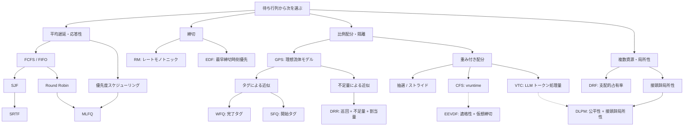

同じ待ち行列を見ても、「次に何を実行するか」の正解は 1 つではありません。平均待ち時間を短くしたいのか、操作への応答を早くしたいのか、締切を守りたいのか、複数ユーザーへ資源を公平に配りたいのかで、選ぶべきアルゴリズムは変わります。

本記事では、CPU スケジューリングからネットワークの公平キューイング、そして LLM 推論基盤までを、<strong>何を最適化するために、前世代の何を変えたのか</strong>という系譜で整理します。後半では、[Start-time Fair Queueing](https://imoz.jp/scraps/202607_start_time_fair_queueing.html) を中心に、なぜ SFQ の「選んでから課金する」構造が LLM リクエストの投入順序に合うのか、推論エンジン内部の VTC とは何が違うのかを掘り下げます。

## 1. まず「良いスケジュール」を定義する

タスク $i$ を、到着時刻 $a_i$、必要処理量 $p_i$、完了時刻 $C_i$、締切 $d_i$、重み $w_i$ で表します。代表的な評価軸は次のとおりです。

| 目的 | 指標 | 典型的な問い |
|---|---|---|
| 完了を早める | ターンアラウンド時間 $C_i-a_i$、平均フロー時間 | 各ジョブを平均して早く完了させたい |
| 最初の反応を早める | 応答時間（初回実行時刻 $-a_i$） | UI や対話をすぐ反応させたい |
| 締切を守る | 締切違反数、最大遅刻時間 | 制御・音声・映像を期限内に処理したい |
| 公平に分ける | 正規化済み処理量の差、最大最小公平性 | 大量利用者からほかの利用者を隔離したい |
| 能力を使い切る | スループット、稼働率、仕事保存性 | 処理可能なのに遊ばせたくない |
| 予測可能にする | テールレイテンシ、最大待ち時間、揺らぎ | P99 や最悪値を抑えたい |

ここで重要なのは、これらがしばしば競合することです。短い仕事を優先すれば平均待ち時間は下がりますが、長い仕事は飢餓し得ます。公平に細かく切り替えれば応答性は上がりますが、切替コストやキャッシュ局所性が悪化します。

さらに、設計前に少なくとも次の前提を固定する必要があります。

- <strong>プリエンプション可能か</strong>：途中停止して再開できるか
- <strong>処理量を事前に知れるか</strong>：$p_i$ は正確か、推定か、完了まで未知か
- <strong>資源は 1 種類か</strong>：CPU だけか、GPU メモリ・帯域・KV キャッシュも競合するか
- <strong>公平性の主体は何か</strong>：プロセス、ユーザー、組織、API キー、モデルのどれか
- <strong>決定の層はどこか</strong>：受付、サーバー配置、投入順序、実行中のトークン生成反復のどこか

## 2. 系譜：1 本の進化ではなく、目的ごとの分岐

次の図は発明の年代順や厳密な親子関係ではなく、<strong>目的と選択規則の概念地図</strong>です。実線は分類または対比しやすい設計遷移、破線は Linux での採用移行や、VTC の厳密な順序を局所性のために緩める LLM 向けの発展を表します。DLPM の割当量と不足カウンターは DRR の影響も受けています。



これは「新しい方式ほど常に優秀」という図ではありません。たとえばルーターで数万フローを線速処理するなら $O(1)$ の DRR が魅力的で、ユーザー数が数十の LLM ゲートウェイなら $O(\log n)$ のタグ方式でも十分です。目的と制約が変わるたびに、別の枝が有力になります。

## 3. 完了時間と応答性の枝

### 3.1 FCFS / FIFO：到着順という強い説明可能性

先着順（First-Come, First-Served: FCFS）は、到着順のキュー先頭を選び、通常は完了まで走らせます。

```text
実行待ち = 到着順の待ち行列
CPU が空いていれば:
    実行中 = 実行待ちの先頭を取り出す
実行中のタスクを完了まで実行
```

利点はキューへの追加・取り出しと 1 回の選択が $O(1)$ で、決定的かつ説明が容易なことです（$n$ 個のジョブからスケジュール全体を作る処理は $O(n)$）。一方、長い仕事の直後に多数の短い仕事が到着すると、全員が長い仕事を待つ <strong>コンボイ効果</strong>が起きます。平均値だけでなく、短い対話タスクの応答時間も悪化します。

### 3.2 SJF / SRTF：処理量が分かるなら短い仕事から

最短ジョブ優先（Shortest Job First: SJF）は CPU が空くたび、到着済みタスクの中から $p_i$ が最小のものを選びます。全ジョブが同時に利用可能で処理時間が既知、単一 CPU・非プリエンプティブという古典的条件では、平均待ち時間を最小化します。

最短残余時間優先（Shortest Remaining Time First: SRTF。SRPT / STCF とも呼ばれる）は、そのプリエンプティブ版です。各判断点で残り時間 $r_i$ が最小のタスクを選び直します。到着時刻と処理時間が既知で、処理速度が一定の 1 台の計算機を使い、プリエンプションの費用を 0 とするモデルでは、SRTF は総フロー時間、したがって平均フロー時間を最小化します。ただし次の代償があります。

- 長いタスクは短いタスクが来続けると飢餓状態になる
- 実行時間の予測誤差に敏感
- 頻繁なプリエンプションの保存・復元コストが必要
- 「短い」と偽る利用者が得をするため、信頼できない自己申告には不向き

### 3.3 ラウンドロビン：完了順より「すぐ一度動く」ことを優先

ラウンドロビン（Round Robin: RR）は、各タスクへ最大 $q$ のタイムクォンタムを与え、未完了ならキュー末尾へ戻します。

```text
実行待ちが空でない間:
    タスク = 実行待ちの先頭を取り出す
    min(q, タスクの残り時間) だけ実行
    未完了なら:
        実行待ちの末尾へ戻す
```

$q\to\infty$ なら FCFS に近づき、$q$ を小さくすると各タスクの初回応答は早まります。ただし実機では $q$ を小さくしすぎるとコンテキストスイッチとキャッシュミスが増えます。また、RR が揃えるのは CPU <strong>時間</strong>であり、後述する「リクエスト件数のラウンドロビン」は、1 件の重さが違えば資源を公平にしません。

### 3.4 MLFQ：未来を知らずに短い・対話的な仕事を推測する

多段フィードバックキュー（Multi-Level Feedback Queue: MLFQ）は複数の優先度キューを持ち、新規タスクを高優先度から始め、CPU を使い切るほど降格させ、短時間でブロックしたり自発的に実行権を譲ったりする対話的タスクを上位に保ちます。周期的に全タスクを上位へ戻す全体優先度引き上げは、低優先度タスクの飢餓を抑えます。待ち時間に応じて個別に優先度を上げるエージングも、別の代表的な対策です。

SJF が必要とする「総実行時間の予言」を、<strong>これまでの振る舞いからのオンライン推定</strong>へ置き換えたと見ると理解しやすいでしょう。ただし規則によっては、タイムクォンタムの直前に実行権を譲って降格を逃れる悪用が起きるため、実装は累積 CPU 使用量などで対策します。

固定優先度スケジューリングでは、常に最も高い優先度の実行可能タスクを選びます。単純な実装では低優先度タスクが飢餓し得るため、エージングや上限付き優先度引き上げが必要になります。共有ロックを持つ低優先度タスクが高優先度タスクを待たせ、中優先度タスクに割り込まれる<strong>優先度逆転</strong>は別の問題です。優先度継承はロック保持者を一時的に待機者の優先度へ引き上げ、優先度上限プロトコルは資源ごとの上限優先度に基づいてロック取得を制限または昇格し、逆転やデッドロックを抑えます。

## 4. 締切と重み付き比例配分の枝

### 4.1 EDF とレートモノトニック：公平性より締切実行可能性

最早締切時刻優先（Earliest Deadline First: EDF）は、実行可能な仕事のうち絶対締切 $d_i$ が最も早いものを選び、より早い締切が到着すればプリエンプトします。独立ジョブ、単一 CPU、プリエンプション可能、切替コストを無視できるという標準モデルでは、実行可能なスケジュールが存在するなら EDF も締切を満たせる、という最適性があります。

レートモノトニック（Rate Monotonic: RM）は周期が短いタスクほど高い固定優先度を与えます。独立した周期タスク、暗黙的締切 $D_i=T_i$、プリエンプティブな単一 CPU、固定した最悪実行時間 $e_i$、ブロッキングと切替オーバーヘッドなし、という Liu–Layland モデルでは、$n$ タスクに対する十分条件として次の利用率上限が有名です。

$$
U=\sum_{i=1}^{n}\frac{e_i}{T_i}\le n\left(2^{1/n}-1\right)
$$

同じ独立周期タスク・暗黙的締切のモデルでプリエンプションと切替コストを理想化するなら、EDF は総利用率 $U\le1$ のとき、つまり単一 CPU の 100% まで締切を満たせることが必要十分条件になります。

EDF/RM は「全員を同じだけ動かす」方式ではありません。期限を守るという制約のために順序を変える方式です。

### 4.2 抽選 / ストライド：重みを CPU 配分へ変換する

抽選スケジューリング（Lottery scheduling）は重みに比例する枚数の抽選券を配り、抽選で次の<strong>固定サイズの割当量</strong>を受け取るタスクを決めます。長期の期待値では比例配分になりますが、短期にはばらつきがあります。

ストライドスケジューリング（Stride scheduling）はこれを決定的にします。大きな定数 $L$ に対して

$$
\operatorname{stride}_i=\frac{L}{w_i}
$$

を定義し、`pass` が最小のタスクへ同じサイズの割当量を与え、実行後に `pass += stride` とします。割当量が可変なら、消費した処理量に比例して `pass += service_used × L / w_i` と進めます。重みが大きいほど同じ処理量あたりの `pass` の進みが遅く、より頻繁に選ばれます。「累積した正規化処理量が最小の主体を選ぶ」という骨格は、後の CFS、SFQ、VTC にも現れます。

### 4.3 CFS から EEVDF へ

Linux の Completely Fair Scheduler（CFS）は「すべての実行可能タスクが理想 CPU 上で同時に重み付き実行される」状態を近似し、実際の CPU では正規化済み実行時間 `vruntime` が最小のタスクを選びます。実行したタスクの `vruntime` が進むと、別のタスクが左端になります。

EEVDF（Earliest Eligible Virtual Deadline First）は 1995 年に提案された方式で、Linux は 6.6 から Peter Zijlstra による 2023 年版の EEVDF へ移行を始めました。したがって 2026 年時点の mainline Linux では、通常タスクの fair class を「古い CFS の `vruntime` 最小選択がそのまま既定」と説明するのは正確ではなく、CFS の仮想時間の系譜を引き継いだ EEVDF が既定の選択規則です。EEVDF は公平な配分に対する遅れを `lag` として表し、`lag >= 0` の適格なタスクのうち仮想締切が最も早いものを選びます。これにより比例公平性を保ちながら、短い実行時間を要求する遅延に敏感なタスクを表現しやすくします。CFS と EEVDF は同じ「仮想時間」の家系ですが、EEVDF は適格性と締切を選択規則へ明示的に入れた発展です。

## 5. ネットワークが育てた公平キューイング

CPU 時間は細かくプリエンプトできますが、ネットワークパケットは通常、送信を始めたら途中で別フローのパケットと入れ替えられません。この「不可分な仕事を複数フローへ公平に配る」研究が、LLM リクエストの議論へ直接つながります。

### 5.1 GPS：公平性を定義する理想モデル

一般化プロセッサ共有（Generalized Processor Sharing: GPS）は、待ちパケットを持つ各フローを無限に細かい流体とみなし、重み $w_i$ に比例して 1 本の回線を同時共有する理想モデルです。現実のパケットスケジューラは、GPS の完了順や処理量の差を不可分なパケットで近似します。

### 5.2 WFQ：仮想完了時刻が最小のパケット

フロー $i$ の $k$ 番目のパケットに、開始タグと完了タグを付けます。

$$
S_i^k=\max\left(V(a_i^k),F_i^{k-1}\right),\qquad
F_i^k=S_i^k+\frac{L_i^k}{w_i}
$$

重み付き公平キューイング（Weighted Fair Queueing: WFQ）は概ね $F_i^k$ が最小のパケットを選び、GPS の完了順を近似します。選択前にパケット長 $L_i^k$ が必要です。

### 5.3 SFQ：完了タグではなく開始タグで選ぶ

開始時刻公平キューイング（Start-time Fair Queueing: SFQ）は、待ちパケットを持つ各フローの FIFO 先頭を比べ、$S_i^k$ が最小のものを選びます。選択したパケットの長さは、そのパケット自身を「今選ぶか」ではなく、完了タグ、すなわち同じフローの<strong>次の選択</strong>へ効きます。

この時間方向のずれが、処理量を推定する LLM ルーターで重要になります。現在のリクエストを先に通し、見積もった分をメーターに記録し、その後ほかのユーザーが追いつくまで待たせる――「後払い型」と呼べる構造です。

### 5.4 DRR：タグ計算を割当量と不足カウンターに置き換える

不足ラウンドロビン（Deficit Round Robin: DRR）はフロー $i$ ごとに不足カウンター $D_i$ を持ち、待ちパケットのあるフローを訪れるたび割当量 $Q_i$ を加えます。先頭パケットの長さが残高以下である間は<strong>繰り返し</strong>送信して長さを差し引き、足りなければ残高を保持して次のフローへ進みます。キューが空になれば $D_i=0$ に戻し、アイドル中の権利は貯めません。重み付き DRR では $Q_i\propto w_i$ とします。パケット長の上限 $L_{\max}$ に対して $Q_i\ge L_{\max}$ とできれば各訪問で少なくとも 1 パケットが進み、償却 $O(1)$ の議論が成り立ちます。

タグ方式との違いは、DRR が<strong>先に利用枠を配る</strong>のに対し、SFQ は<strong>先に通して利用量を後から記録する</strong>ことです。MTU のような安定した最大パケット長があるネットワークでは割当量を決めやすい一方、LLM のリクエスト上限はモデルや処理内容によって大きく変わります。

### 5.5 DRF：CPU だけでなく複数資源を同時に見る

クラスターでは、あるジョブは CPU を、別のジョブはメモリを支配します。支配的資源公平性（Dominant Resource Fairness: DRF）は、各ユーザーについて資源ごとの占有率の最大値を支配的占有率とし、その値が小さいユーザーを優先します。単一の「処理時間」へ無理に畳まず、複数資源で最大最小公平性を定義した枝です。

## 6. 実際に動かして違いを見る

次のラボには 2 つのモードがあります。LLM モードでは、各テナントの設定件数が参加時刻にまとめて到着し、論理時刻は投入ごとに 1 進みます。待ち行列が残る境界では、参加処理をその時刻の投入より先に行います。直前の投入ですべての待ち行列が空になった境界では、同時刻の参加より先に SFQ のアイドルリセットを行います。すべての待ち行列が空のまま未来の到着を待つ場合はその時刻まで飛び、リセットと参加を投入とは別の段階として表示します。未来の到着がない最後のリセットは最終投入に注記します。

1. <strong>CPU</strong>：到着時刻、実行時間、RR のタイムクォンタムを変え、FCFS / SJF / SRTF / RR の実行時間軸と待ち時間を比較する
2. <strong>LLM</strong>：各テナントの推定コスト・件数・重みと、テナント C の参加時刻を変え、全体 FIFO / 件数 RR / 最短優先 / SFQ の投入順序を比較する

まず CPU モードで長い A の後ろに短い C が待つ様子を見てから、SRTF へ切り替えてください。次に LLM モードで A のコストを 8、B を 2 にし、テナント別ラウンドロビンと SFQ の投入列から件数を数え、両者がともに待ち仕事を持つ区間の正規化済みコスト棒と比べると、目的の違いが見えます。

<TaskSchedulingVisualizer />

シミュレーターは教育用の離散モデルです。特に LLM モードは GPU の実行時間ではなく、<strong>サーバー群へ投入する順序</strong>だけを表します。有限の待ち行列を最後まで流した最終状態では総需要の差が出るため、公平性は両者がともに待ち仕事を持つ途中区間で観察してください。

## 7. LLM リクエストは何が特殊か

LLM 推論は「長さの違う HTTP リクエスト」というだけではありません。

### 7.1 出力長が選択時に分からない

入力トークン数は分かりますが、出力は生成が終了するまで確定しません。終了理由は EOS だけでなく、出力上限、停止文字列、取り消し、エラーもあります。`max_tokens` は上限であり、実際の生成長ではありません。SJF や WFQ のように現在の仕事の正確な長さで順位を決める方式は、予測器なしでは直接使えません。

### 7.2 プリフィルとデコードの費用構造が違う

プリフィル（prefill）はプロンプトのトークンを並列に処理する演算量の多い段階、デコード（decode）は自己回帰的に 1 回ずつトークンを生成し、KV キャッシュを読み続ける段階です。同じ 1 トークンでも、処理段階、バッチ構成、系列長、ハードウェアによって限界となる資源が違います。単純なトークン数は便利な処理量の代理指標ですが、GPU 時間そのものではありません。

### 7.3 リクエストは外側では不可分、内側では反復処理に分かれる

ロードバランサーがサーバーへ投入した後、そのリクエストを別のサーバーへ安全に移すのは一般に高コストです。そのため外側のルーターでは非プリエンプティブな仕事として扱うのが自然です。

一方、Orca は反復単位スケジューリング（iteration-level scheduling）と選択的バッチ処理（selective batching）を提案しました。現在、継続的バッチ処理またはインフライトバッチ処理と総称される方式では、推論エンジンはデコード反復の境界でバッチを組み替えられます。実装によっては KV キャッシュの退避・再計算を伴うプリエンプションも可能です。したがって「LLM リクエストは絶対に中断不能」ではなく、<strong>どの層のスケジューラか</strong>を明示すべきです。

### 7.4 バッチ処理・KV キャッシュ・接頭辞局所性が相互作用する

同じ接頭辞を共有するリクエストを近くに配置すれば KV キャッシュを再利用できます。しかし厳密な公平順序は同じテナントのリクエストを散らし、局所性を壊すことがあります。さらに、空き KV ブロックに収まらない先頭リクエストを飛ばすか待つかで、仕事保存性と順序の説明可能性が衝突します。

### 7.5 公平性の単位はリクエスト数ではない

短いチャットを 100 件送るテナントと、長文生成を 100 件送るテナントを同件数通しても、消費資源は揃いません。公平にしたい主体をテナントとし、少なくとも

$$
c(r)=\alpha n_{\text{input}}+\beta\widehat{n}_{\text{output}}
$$

のような正の推定コストで処理量を測る必要があります。接頭辞キャッシュのヒット、モデル、LoRA アダプター、SLO のサービス階層まで含めるなら、$c$ は計測結果から校正する設計になります。

## 8. ルーター層には SFQ が合う

ここでは、同じモデルを提供するサーバー群の手前に 1 つのスケジューラがあり、各テナント内は FIFO、スケジューラは空きができるたびに 1 リクエストの投入順序だけを決める、とします。

### 8.1 テナントごとの 1 変数へ畳み込む

各テナント $i$ に「次のリクエストの開始タグ」を表すメーター $M_i$、全体に仮想時刻 $V$ を持たせます。等重みなら 1 回の判断は次の 4 行です。

```text
選択: i = argmin(active_tenants) M_i   # 同値はテナント ID 順
時計: V = M_i
投入: テナント i の FIFO 先頭 r をサーバー群へ送る
課金: M_i = M_i + c(r)
```

重み付きなら最後を $M_i\leftarrow M_i+c(r)/w_i$ にします。現在のリクエストの $c(r)$ は `argmin` に入っていない点が核心です。見積もり誤差は「このリクエストを通すか」ではなく、通した後の休み時間へ現れます。

### 8.2 離脱と復帰：アイドル中の権利を貯めさせない

待ち行列が空のテナントは候補から外します。空から非空へ戻るときは

$$
M_i\leftarrow\max(M_i,V)
$$

として現在の基準線へ合流させます。長くアイドルだったテナントが「使わなかった配分」を貯金し、後の集中送信で独占することを防ぎます。

全テナントの待ち行列が空になったら、次の混雑期間へ古い利用残高を持ち越さないため、

$$
V\leftarrow\max\left(V,\max_i M_i\right)
$$

とします。インタラクティブ・ラボでは、C の途中参加と最後の `V` のリセットを段階表示で確認できます。

### 8.3 なぜ「後から実測値でメーターを直さない」のか

このルーター版 SFQ では、投入時に $c(r)$ を確定し、完了後に追徴・返金しません。そうすればメーターは単調に進み、完了時の実測値をどの順で反映するかという競合を除去できます。ただし、完了によって空きが生じた時刻と到着時刻の前後関係は候補集合を変えます。決定的に再現するには、到着、取り消し、投入可能化の各イベントを 1 本の順序に並べ、判断を直列化し、同値規則も固定した<strong>同じイベント列</strong>が必要です。実測との系統的なずれは、個別リクエストのメーターを巻き戻すのではなく、将来のリクエストに使う $\alpha,\beta$ や出力長予測をゆっくり校正します。

これは唯一の設計ではありません。後述する VTC の出力長予測版は予測と実測の差を調整します。ただし、その場合は SFQ の固定課金に対する単純な不変量とは別の解析が必要です。

### 8.4 何が保証されるか

[SFQ 原論文](https://doi.org/10.1145/248156.248171)のタグと、[ルーター向けの離散的な読み替え](https://imoz.jp/scraps/202607_start_time_fair_queueing.html)を使います。

等重み、1 件ずつ選ぶ逐次モデル、投入時に固定した正のコストを仮定します。任意の観測区間を含む混雑期間の開始から区間末までに課金された最大コスト、または全リクエストに適用する設定上の一様上界を $\bar c$ とします。<strong>観測区間内だけ</strong>の最大値では、区間前に生じた利用残高を覆えません。この定義なら、待機中テナントのメーターは各判断境界で正確に次の帯へ収まります。

$$
V\le M_i\le V+\bar c
$$

そのため、区間を通して待ち仕事を持つ 2 テナント $i,j$ について、区間内に課金された推定コストを $W_i,W_j$ とすると、両端のメーター差から

$$
|W_i-W_j|\le 2\bar c
$$

を導けます。重み付きでは正規化課金量 $q(r)=c(r)/w_{\operatorname{owner}(r)}$ と、その混雑期間を覆う上界 $\bar q$ を使い、重みが固定された 2 テナントに対して

$$
\left|\frac{W_i}{w_i}-\frac{W_j}{w_j}\right|\le 2\bar q
$$

となります。不可分なリクエストを 1 件通した瞬間には最大 1 件分だけ先行し得るので、$\bar c$（重み付きなら $\bar q$）程度の粒度は避けられません。

保証の範囲は<strong>課金した推定コストの投入順序</strong>です。実測 GPU 秒、KV キャッシュ占有、個別リクエストの締切、複数のスケジューラ複製をまたぐ公平性までは保証しません。また、SFQ 原論文の単一回線に対する遅延・スループット上限を、並列サーバー群へそのまま移したものでもありません。

### 8.5 実装量と計算量

待ち仕事のあるテナント数を $T$ とすると、毎回走査しても $O(T)$、`(M_i, tenant_id)` をキーにしたヒープまたは順序付き集合なら、更新を含めて $O(\log T)$ です。数十〜数百テナントなら線形走査でも十分現実的で、監査しやすい利点があります。

実装上の要点は次のとおりです。

- テナント内 FIFO と、同値時のテナント ID 順で決定性を持たせる
- 整数または固定小数点のコスト単位を使い、浮動小数点の曖昧な同値判定を避ける
- `M_i-V` だけが重要なので、$M_i\leftarrow M_i-V$ を全テナントへ適用するのと同時に $V\leftarrow0$ として再基準化できる
- 取り消しや失敗が起きても投入時の課金は返金しない（固定課金モデルの場合）
- 受付制御、サーバー配置、自動拡縮は別の層にする

## 9. エンジン内部なら VTC、局所性も見るなら DLPM

### 9.1 VTC：未知の出力をトークンが出るたび課金する

[VTC の原論文（OSDI 2024）](https://www.usenix.org/conference/osdi24/presentation/sheng)が定義する推論エンジン内の公平化です。

仮想トークンカウンター（Virtual Token Counter: VTC）は継続的バッチ処理のスケジューラ内部に入り、利用者ごとのカウンターを持ちます。新しいリクエストをバッチへ加えると入力トークンの処理量を課金し、各デコード反復で実際に生成された出力トークンの処理量を加算します。バッチに空きができたとき、カウンターが最小の利用者を優先します。

VTC も、利用者が待ち行列へ復帰したときに、利用中カウンターの基準まで値を引き上げ、アイドル中の権利の貯金を防ぎます。出力長を事前に知る必要がなく、実際に処理したトークン単位で処理量を測れる点が、外側のルーターで使う SFQ との最大の違いです。

| 観点 | ルーター層の SFQ | 推論エンジン内の VTC |
|---|---|---|
| 決めるもの | サーバー群への投入順序 | 実行中バッチへ追加するリクエスト |
| コストが効く時点 | 投入直後に推定値を一括課金 | 選択・プリフィル時に既知の入力トークン処理量、各デコード後に生成済み出力トークン処理量を課金 |
| 出力長 | 推定して固定 | 完了前でも生成分を逐次観測 |
| エンジン改造 | 不要 | スケジューラとカウンター更新への組み込みが必要 |
| 主な保証対象 | 推定コスト上の投入順序の公平性 | 定義したトークン処理量上の実行公平性 |
| 両者の関係 | 上流 | 下流。併用可能 |

VTC の理論上限は、単一エンジンでプリエンプションを行わない継続的バッチ処理モデルにおいて、観測区間を通して<strong>待ち行列に仕事を持つ利用者</strong>間の、定義済みトークン処理量の差に対するものです。上界は最大入力コストと、実行中バッチが保持できるトークン容量に依存します。「実行公平性」は任意の GPU 指標や分散した複製全体を意味しません。また出力長予測版は実験上の平均的な差を下げ得ますが、論文の最悪時の下界自体を改善しません。

VTC 論文が「未知の出力長のため古典 SFQ を直接適用できない」と述べることと、ここで SFQ を推すことは矛盾しません。VTC は<strong>実測トークン処理量に基づくエンジン内公平性</strong>を狙い、ルーター版 SFQ は<strong>投入時に確定した推定コストの順序公平性</strong>へ問題を狭めています。保証する量が違います。

VTC の出力長予測版は、リクエスト選択時に予測出力コストを先にカウンターへ加え、デコード中に実際の生成量との差を追徴し、完了時に過大予測分を戻します。平均的な処理量の差を小さくできますが、予測誤差と完了イベントがカウンター更新へ入る点で、固定課金のルーター版 SFQ とは別の方式です。

### 9.2 DLPM / D²LPM：公平順序を少し緩めて接頭辞を再利用する

[DLPM / D²LPM の 2025 年プレプリント](https://arxiv.org/abs/2501.14312)は、VTC の厳密な順序と接頭辞局所性の衝突を扱います。

VTC は接頭辞局所性を見ません。2025 年の arXiv プレプリントが提案した Deficit Longest Prefix Match（DLPM）は、利用者ごとの割当量 $Q_u$ と不足カウンターを使い、残高が許す範囲では最長接頭辞一致を優先し、使い切るとほかの利用者へ譲ります。Double Deficit LPM（D²LPM）はこれに利用者・ワーカーごとの割当量 $Q_w$ を加え、特定ワーカーへの固定化の強さを制御して、分散配置の接頭辞局所性と負荷分散も扱います。

$Q_u$ を大きくするほど局所性を優先する自由度は増える一方、DLPM の処理量上限も緩みます。$Q_w$ はワーカーへの固定化、局所性、負荷分散の兼ね合いを主に制御します。2 つを混同せず、「公平性と効率を同じ順序で同時に最大化できない」ことを明示的な調整値にした設計として読む必要があります。

### 9.3 Equinox：トークン数 1 軸では足りないという問題提起

[Equinox の 2025 年プレプリント](https://arxiv.org/abs/2508.16646)は、複数指標を予測して統合する別の方向を示します。

2025 年のプレプリント Equinox は、プリフィルとデコードの非対称性により、トークン数だけでは遅延、スループット、GPU 稼働率を同時に表せないとして、利用者側と資源側の複数カウンターを予測値で統合します。興味深い発展ですが、予測器と複数の重みが必要で、単純な SFQ / VTC より方針の意味と検証範囲が複雑です。プレプリントの実験結果を一般的な本番環境の保証とはみなさず、多目的スケジューラの一例として捉えるのが安全です。

## 10. どれを選ぶか：目的と層から逆算する

| 状況 | 第一候補 | 理由 / 注意 |
|---|---|---|
| バッチで平均完了時間を下げたい、処理量が既知 | SJF / SRTF | 飢餓対策と予測誤差への配慮が必要 |
| 対話的な CPU タスクを早く一度動かしたい | RR / MLFQ | タイムクォンタムとコンテキストスイッチの兼ね合い |
| 厳しい締切または緩い締切が中心 | EDF / RM | 先にタスクモデルと実行可能性を分析する |
| CPU 配分を重み通りに分けたい | Stride / CFS / EEVDF 系 | タスクの休止・復帰と粒度を考慮 |
| 多数フローのパケットを高速かつ公平に配分したい | DRR | $L_{\max}$ と割当量を設計できる場合 |
| 複数資源をクラスター利用者へ配りたい | DRF | 支配的資源と配置は別問題になり得る |
| 無改造の LLM サーバー群への投入順序を公平にしたい | 推定コスト + SFQ | 保証は推定コストと単一スケジューラの順序まで |
| 継続的バッチ処理内で未知出力を公平に扱いたい | VTC | エンジンへの組み込みとコスト関数が必要 |
| LLM の接頭辞局所性も守りたい | DLPM / D²LPM | 割当量が公平性と局所性の調整値になる |
| SLO・遅延と GPU 効率を多目的化したい | 計測・予測機構を持つスケジューラ | 予測誤差と方針の重みを継続検証 |

実運用では 1 方式ですべてを担わせず、次のように層を分ける方が明快です。


流量制限は不正利用や予算上限を守り、公平スケジューラは混雑時の配分を分け、配置層は局所性と負荷を扱い、エンジン内スケジューラは実際のトークン処理量を制御します。責務を直交させるほど、「なぜこのリクエストが待ったか」を説明しやすくなります。

## 11. 導入前の検証チェックリスト

1. <strong>目的関数</strong>：平均、P99、締切、テナント隔離のどれを優先するか
2. <strong>待ち仕事の定義</strong>：待ち行列に 1 件ある状態か、追加投入してもスループットが増えない状態か
3. <strong>コスト関数</strong>：入出力トークン、計測済み GPU 時間、キャッシュヒットをどう数えるか
4. <strong>重みの意味</strong>：契約階層か、優先度か。$w=2$ が処理量 2 倍を意味するか
5. <strong>離脱と復帰</strong>：未使用配分を貯金させないか、集中送信用の権利として意図的に許すか
6. <strong>不可分性</strong>：プリエンプション可能な層と、取り消せない投入の境界はどこか
7. <strong>仕事保存性</strong>：公平性のために GPU を遊ばせる条件がないか
8. <strong>攻撃的な入力列</strong>：裾の重い分布、ON/OFF、1 件ずつの再参加、誤予測、取り消しを試す
9. <strong>分散状態</strong>：カウンターを複製ごとに分けたとき、全体の公平性を失わないか
10. <strong>観測</strong>：テナント別待ち時間、正規化済み処理量、カウンター、キャッシュヒット、TTFT、TPOT を同時に記録する

Jain の公平性指標

$$
J(x_1,\ldots,x_n)=\frac{(\sum_i x_i)^2}{n\sum_i x_i^2}
$$

は便利ですが、$x_i$ にリクエスト件数を入れるか、トークン処理量を入れるか、GPU 秒を入れるかで意味が変わります。また需要が少ないテナントまで同量を要求する指標ではなく、全 $x_i=0$ なら未定義です。ラボでは、比較対象が変わるたび基準をリセットし、同じ対象が共通して待ち仕事を持つ区間内の増分だけで表示します。実運用でも、全員が待ち仕事を持つ区間、SLO、仕事保存性と合わせて評価してください。

## 12. まとめ

- スケジューラは「次を選ぶ関数」ではなく、<strong>目的、前提、課金単位、層</strong>の組です。
- FCFS → SJF/SRTF は平均遅延、RR/MLFQ は応答性、EDF/RM は締切、Lottery/Stride/CFS/EEVDF と公平キューイングは比例配分を追求した別の枝です。
- GPS を不可分なパケットで近似する過程から、タグの最小値を選ぶ WFQ/SFQ と、全体での `argmin` を使わず巡回と不足量で近似する DRR という 2 つの実装方向が生まれました。
- LLM では出力長が未知であり、プリフィル / デコード、継続的バッチ処理、KV キャッシュ、接頭辞局所性があるため、リクエスト件数の RR だけでは公平になりません。
- 無改造のサーバー群の前で順序だけを決めるなら、投入時に固定した推定コストを<strong>選択後に課金</strong>する SFQ は単純で説明可能です。ただし保証は推定コスト上の投入順序の公平性に限られます。
- 推論エンジン内部を制御できるなら、実際に処理したトークンを逐次課金する VTC、局所性も必要なら DLPM 系が問題設定に近くなります。

最も重要なのは、アルゴリズム名から選ばないことです。公平にしたい主体と処理量の単位を決め、決定可能な層を特定し、その条件で初めて選択規則を比較する――これが、古典から LLM まで変わらないスケジューラ設計の順序です。

## 参考文献

1. Remzi H. Arpaci-Dusseau, Andrea C. Arpaci-Dusseau, [*Operating Systems: Three Easy Pieces — Scheduling: Introduction*](https://pages.cs.wisc.edu/~remzi/OSTEP/cpu-sched.pdf) / [*Multi-Level Feedback Queue*](https://pages.cs.wisc.edu/~remzi/OSTEP/cpu-sched-mlfq.pdf).
2. Linus E. Schrage, ["A Proof of the Optimality of the Shortest Remaining Processing Time Discipline"](https://doi.org/10.1287/opre.16.3.687), *Operations Research*, 1968.
3. C. L. Liu, James W. Layland, ["Scheduling Algorithms for Multiprogramming in a Hard-Real-Time Environment"](https://doi.org/10.1145/321738.321743), *JACM*, 1973.
4. Carl A. Waldspurger, William E. Weihl, ["Stride Scheduling: Deterministic Proportional-Share Resource Management"](https://dspace.mit.edu/handle/1721.1/149244), MIT/LCS/TM-528, 1995.
5. Linux Kernel documentation, [CFS Scheduler](https://docs.kernel.org/scheduler/sched-design-CFS.html) / [EEVDF Scheduler](https://docs.kernel.org/scheduler/sched-eevdf.html).
6. Alan Demers, Srinivasan Keshav, Scott Shenker, ["Analysis and Simulation of a Fair Queueing Algorithm"](https://doi.org/10.1145/75246.75248), SIGCOMM, 1989.
7. Abhay K. Parekh, Robert G. Gallager, ["A Generalized Processor Sharing Approach to Flow Control in Integrated Services Networks"](https://doi.org/10.1109/90.234856), 1993.
8. Pawan Goyal, Harrick M. Vin, Haichen Cheng, ["Start-time Fair Queueing"](https://doi.org/10.1145/248156.248171), SIGCOMM, 1996.
9. M. Shreedhar, George Varghese, ["Efficient Fair Queuing Using Deficit Round-Robin"](https://doi.org/10.1109/90.502236), 1996.
10. Ali Ghodsi et al., ["Dominant Resource Fairness: Fair Allocation of Multiple Resource Types"](https://www.usenix.org/conference/nsdi11/dominant-resource-fairness-fair-allocation-multiple-resource-types), NSDI, 2011.
11. Gyeong-In Yu et al., ["Orca: A Distributed Serving System for Transformer-Based Generative Models"](https://www.usenix.org/conference/osdi22/presentation/yu), OSDI, 2022.
12. Woosuk Kwon et al., ["Efficient Memory Management for Large Language Model Serving with PagedAttention"](https://doi.org/10.1145/3600006.3613165), SOSP, 2023.
13. Ying Sheng et al., ["Fairness in Serving Large Language Models"](https://www.usenix.org/conference/osdi24/presentation/sheng), OSDI, 2024.
14. Shiyi Cao et al., ["Locality-aware Fair Scheduling in LLM Serving"](https://arxiv.org/abs/2501.14312), 2025.
15. Zhixiang Wei et al., ["Equinox: Holistic Fair Scheduling in Serving Large Language Models"](https://arxiv.org/abs/2508.16646), preprint, 2025.
16. Carl A. Waldspurger, William E. Weihl, ["Lottery Scheduling: Flexible Proportional-Share Resource Management"](https://www.usenix.org/conference/osdi-94/lottery-scheduling-flexible-proportional-share-resource-management), OSDI, 1994.
17. Raj Jain, Dah-Ming Chiu, William Hawe, ["A Quantitative Measure of Fairness and Discrimination for Resource Allocation in Shared Computer Systems"](https://www.cs.wustl.edu/~jain/papers/ftp/fairness.pdf), DEC TR-301, 1984.
18. 今城健太郎, ["Start-time Fair Queueing: 後払い型公平スケジューリング"](https://imoz.jp/scraps/202607_start_time_fair_queueing.html), 2026.
