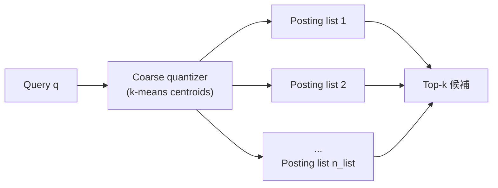
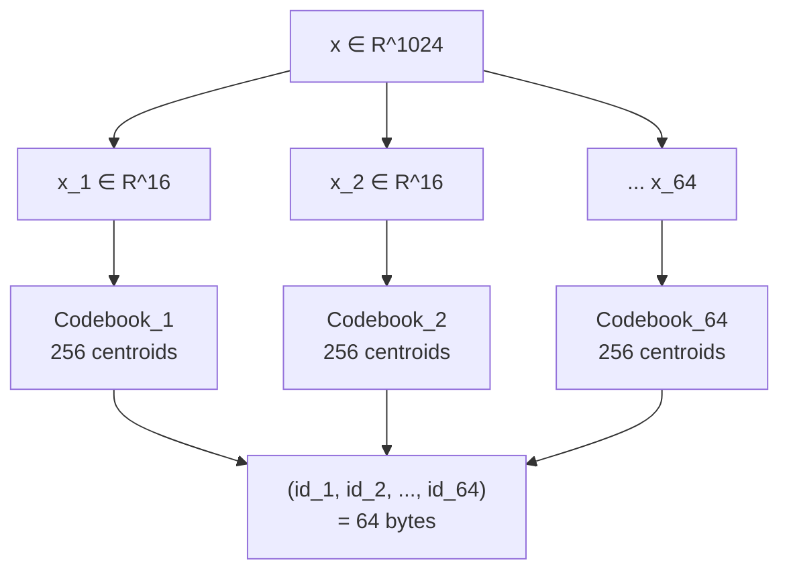
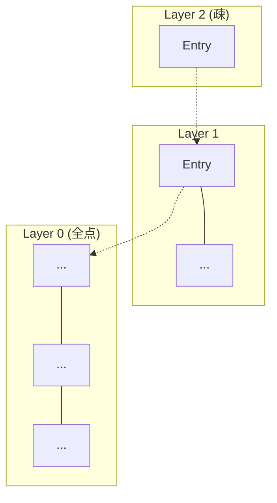
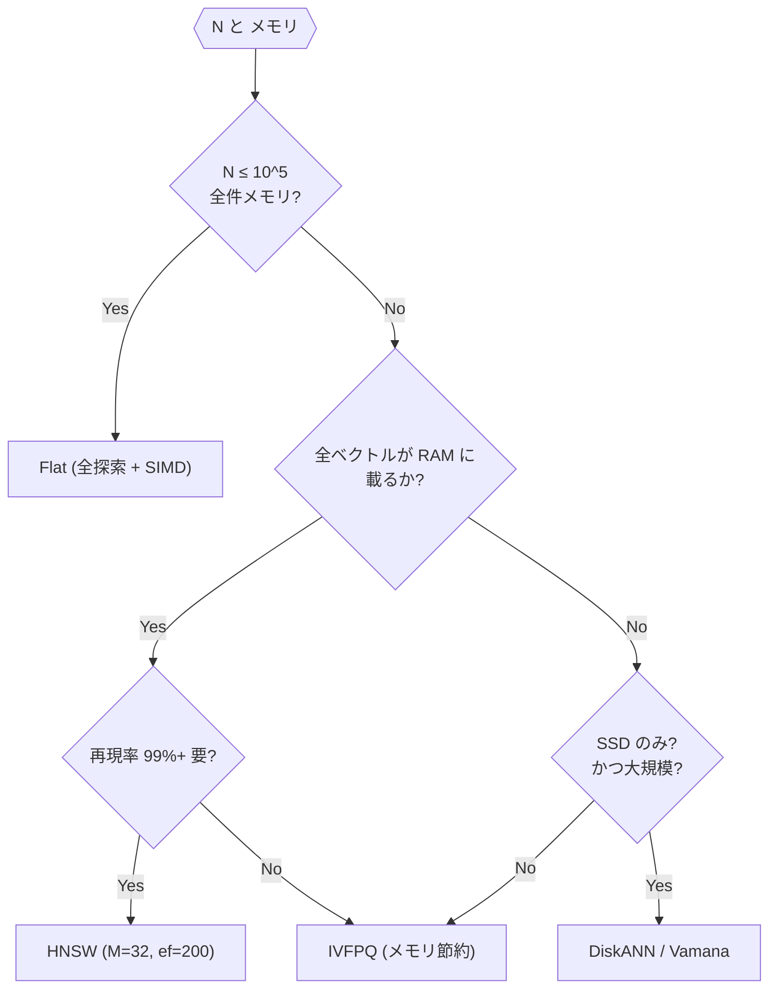
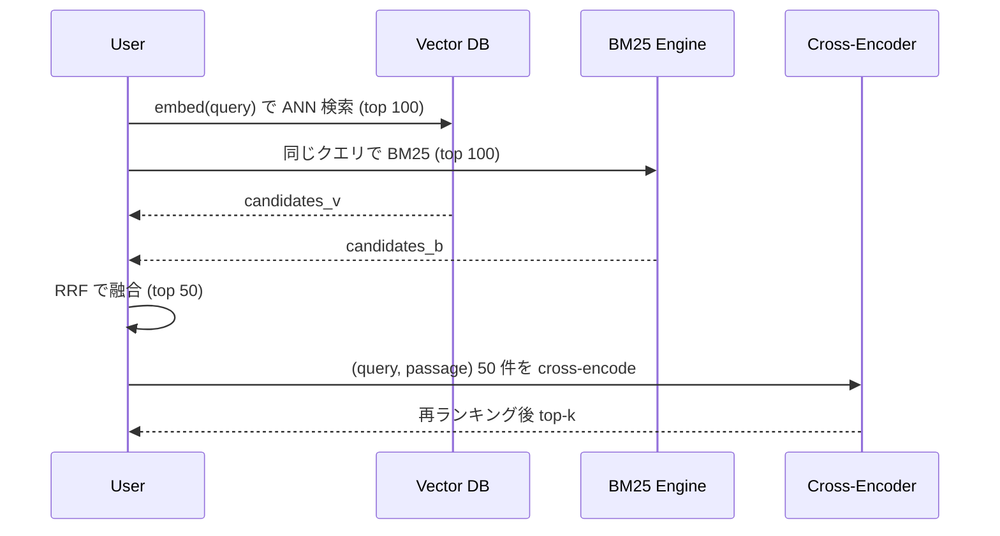

大規模言語モデル (LLM) の実用化とともに、埋め込み (embedding) ベクトルを保存し高速に検索する「ベクトルデータベース」は、検索・推薦・RAG (Retrieval-Augmented Generation) の基盤として一気に主流になりました。しかしその内部では、<strong>高次元空間における近似最近傍探索 (Approximate Nearest Neighbor Search; ANN)</strong> という、数十年にわたって研究されてきた難問が解かれています。

この記事では、ベクトルデータベースの中核アルゴリズムを、素朴な全探索から出発して <strong>IVF (Inverted File)</strong> → <strong>Product Quantization (PQ)</strong> → <strong>HNSW (Hierarchical Navigable Small World)</strong> → <strong>DiskANN (Vamana)</strong> まで積み上げるように解説します。論文・OSS 実装（FAISS、Milvus、pgvector、Qdrant）の実コードに根ざした具体的な設計判断まで踏み込みます。

> <strong>たとえ話で押さえる全体像</strong>
>
> 巨大な図書館を想像してください。全探索は「1 冊ずつ手に取って『近いか？』と確かめる」司書。当然、蔵書 10 億冊なら一生かかります。
>
> - <strong>IVF</strong> は本棚ごとに『分類カード』を立てる司書。いきなり 10 億冊は見ず、まずカードで「探している本」に近い本棚を 10 棚選び、そこだけ見る。
> - <strong>Product Quantization</strong> は「本の表紙写真を 256 色パレットから 64 個の色コードで要約する」司書。本そのものではなく色コード同士の一致度で距離を測る。比較がめちゃくちゃ速い代わりに、少しだけ精度を捨てる。
> - <strong>HNSW</strong> は「知り合いネットワーク」。本同士が『似ている友達』のリンクを持っていて、疎な世界地図→密な市街地図とズームしながら目的の本にたどり着く。
> - <strong>DiskANN</strong> はそのネットワークを <strong>SSD に寝かせた</strong> バージョン。RAM には<strong>全棚の縮刷版サムネイル</strong> (PQ で圧縮したベクトル) だけ並べておき、気になった本だけ SSD から原本を引っ張り出す。
>
> この記事では全部『ちゃんと中身を見る』ので最初は抽象的な図式だけ覚えていただければ大丈夫です。

## 1. なぜベクトル検索が難しいのか

### 1.1 埋め込みベクトルとは

テキスト・画像・音声などを、意味的な近さがユークリッド空間上の距離に対応するよう、<strong>固定次元の実数ベクトル</strong> に写像したものが埋め込みベクトルです。代表的なモデルの次元数は以下のようになります。

| モデル | 次元 | 距離指標 |
| --- | --- | --- |
| OpenAI `text-embedding-3-small` | 1536 | cosine |
| OpenAI `text-embedding-3-large` | 3072 | cosine |
| Cohere `embed-v3` | 1024 | cosine / dot |
| BGE-M3 | 1024 | cosine |
| CLIP ViT-L/14 | 768 | cosine |

次元数 $d$ が 1000 を超えるのが普通で、このスケールでは <strong>全探索が現実的でない</strong> ことが問題の出発点です。

### 1.2 距離・類似度の定義

ベクトル $\mathbf{x}, \mathbf{y} \in \mathbb{R}^d$ に対して、代表的な指標は 3 つです。

<strong>ユークリッド距離（L2）:</strong>

$$
d_{L2}(\mathbf{x}, \mathbf{y}) = \sqrt{\sum_{i=1}^{d} (x_i - y_i)^2}
$$

<strong>内積 (Inner Product, IP; 対応する要素同士を掛けて足し合わせた値):</strong>

$$
\text{IP}(\mathbf{x}, \mathbf{y}) = \sum_{i=1}^{d} x_i y_i
$$

<strong>コサイン類似度:</strong>

$$
\cos(\mathbf{x}, \mathbf{y}) = \frac{\mathbf{x} \cdot \mathbf{y}}{\|\mathbf{x}\|\,\|\mathbf{y}\|}
$$

重要な性質として、ベクトルを単位ベクトルに正規化 ($\|\mathbf{x}\|=1$) すると、

$$
d_{L2}(\mathbf{x}, \mathbf{y})^2 = 2 - 2\,\mathbf{x}\cdot\mathbf{y}
$$

が成り立ち、<strong>コサイン類似度・内積・L2 距離は単調変換 (大小関係を保ったままスケールをつけ替える変換) で等価</strong> になります。つまり順位だけが意味を持つ検索では三者を使い分ける必要がなく、多くの ANN ライブラリは内部的に L2 または内積に統一し、事前正規化で三者を切り替えます。

### 1.3 次元の呪い (Curse of Dimensionality)

高次元空間では直感が通じなくなります。具体的には：

- <strong>距離の集中</strong>: 任意の点対の距離の比 $\max/\min$ が $1$ に収束し、「最近傍」と「遠点」の差が相対的に消える。
- <strong>ボリュームの偏り</strong>: 単位球の体積のほぼすべてが「表皮近傍」に集中する。
- <strong>空間分割の非効率</strong>: 低次元で有効な kd-tree (座標軸と平行に空間を二分木で区切る古典的な最近傍索引) のような軸平行分割は、$d > 20$ 程度で全探索と同等のノード訪問を要する。

そのため <strong>近似的に解く</strong> （厳密解でなく、再現率 (真の上位 k 件のうち ANN が実際に返せた件数の割合) 95%+ を狙う）という割り切りが、実用的なベクトル検索の前提となります。これが ANN の本質です。

## 2. ベースライン: 全探索 (Flat)

最初に押さえるべきは「全探索が十分速い条件ではそれで良い」という事実です。FAISS でいう `IndexFlatL2` / `IndexFlatIP` がこれに相当します。

```python
# 素朴な全探索 (pseudocode)
def search(query: np.ndarray, xb: np.ndarray, k: int):
    # xb: (N, d), query: (d,)
    dists = np.linalg.norm(xb - query, axis=1)  # O(Nd)
    idx = np.argpartition(dists, k)[:k]         # O(N)
    return idx[np.argsort(dists[idx])]
```

計算量は $O(Nd)$ で、$N=10^6$、$d=1024$、単精度 float で、1 クエリあたり <strong>4GB メモリ走査</strong> (≒ フル HD 映画 1 本分のバイト数を毎クエリ読む) が必要です。ただし SIMD (AVX-512 / NEON; CPU の 1 命令で複数の数値をまとめて計算する機構) と BLAS GEMM (高度に最適化された行列積ルーチン) を使うと、$N \le 10^5$ 程度までは全探索のほうが HNSW より速いことすらあります。FAISS の `IndexFlat` が「真値計算用のリファレンス」として残っているのはこのためです。

ANN の工夫は、この $O(Nd)$ を <strong>(a) アクセスするベクトル数を減らす</strong> か <strong>(b) 1 本あたりの距離計算を圧縮する</strong> の 2 方向で削ります。IVF が前者、PQ が後者、HNSW が前者を別角度で、DiskANN が両者を組み合わせます。

## 3. IVF: 空間分割による候補削減

> <strong>一言で言うと</strong>: 「全部見ないで、近くの本棚だけ見る」アプローチ。まずデータを「似たもの同士のグループ」に分けておく（インデックス構築）、検索時はそのグループのうちクエリに近いものを数個だけ開いて中を見る。グループ内は全探索するので、<strong>「見ないグループに正解が潜んでいたらライバル</strong>」になるのがこの手法の弱点です。

### 3.1 k-means クラスタリングによる粗分割

IVF (Inverted File index) は、古典的な文字列転置索引のアナロジーです。

> <strong>発想のたとえ</strong>: 街中で「近くの美味しいラーメン店」を探すとき、まず東京 23 区ぜんぶを回るのではなく、<strong>クエリ地点 (例えば自宅) に近い渋谷区・新宿区・目黒区の 3 区だけに絞ってから店を探す</strong>、あの動き方です。最初に粗い地区 (セントロイド) で絞り、次に地区内だけ全探索する、という二段構えです。

1. 学習: 全データに k-means を走らせ $n_{\text{list}}$ 個のセントロイド (各グループの中心に立てる代表ベクトル) $\{\mathbf{c}_1, \dots, \mathbf{c}_{n_{\text{list}}}\}$ を作る（典型値 $n_{\text{list}} = \sqrt{N}$）。
2. 構築: 各ベクトルを「最も近いセントロイド」に割り当て、<strong>セントロイドごとの posting list (そのセントロイドに所属する点の ID 一覧。本の巻末索引で 1 つの見出し語にぶら下がるページ番号リストと同じ構造)</strong> に格納する。
3. 検索: クエリ $\mathbf{q}$ に対して近いセントロイド上位 $n_{\text{probe}}$ 個を選び、それらの posting list 内だけを走査する。



### 3.2 パラメータの設計

- <strong>`nlist`</strong> — 大きいほど 1 リストが短くなり検索は速いが、再現率のために `nprobe` も増やす必要がある。経験則 $n_{\text{list}} \approx 4\sqrt{N} \sim 16\sqrt{N}$。
- <strong>`nprobe`</strong> — 検索時に訪問するセル数。$n_{\text{probe}} = 1$ は非常に速いが再現率が低下。つまり「真の最近傍が隣のセルにいたら見逃す」リスクが大きくなるということ。実用的には 10 〜 128 で再現率 90-99% に到達する。
- <strong>訓練データ量</strong> — FAISS のクラスタリング既定値は `min_points_per_centroid = 39`、`max_points_per_centroid = 256`。目安として `nlist` の 39-256 倍のサンプルが「安心して学習できる」レンジ（下回ると警告、上回ると自動サブサンプリング）。

### 3.3 IVF 単体の限界

IVF はセル内では依然として全探索であり、セルが長いと速度が稼げません。次節の Product Quantization と組み合わせるのが定石です（FAISS の `IndexIVFPQ`）。

## 4. Product Quantization (PQ)

> <strong>一言で言うと</strong>: 本そのものではなく<strong>「要約コード」同士を比べる</strong> 方式です。長いベクトルをいくつかの短い区間に切り、区間ごとに<strong>256 色パレットから 1 色を選ぶようにラベルを付ける</strong>ことで、ベクトル 1 本を最終的に数十バイトの整数列に圧縮します。記憶量も距離計算も桁違いに速くなる代わり、要約の粒度だけ精度を捨てます。

### 4.1 アイデア: ベクトルを「部分ベクトルのコード」に分解

PQ は 2011 年の Jégou ら<sup>[1]</sup> による手法で、<strong>高次元ベクトルを少ビット整数に圧縮</strong> して距離計算を高速化します。

1. ベクトル $\mathbf{x} \in \mathbb{R}^d$ を $m$ 個の部分ベクトルに分割: $\mathbf{x} = [\mathbf{x}^{(1)}, \dots, \mathbf{x}^{(m)}]$、各 $\mathbf{x}^{(i)} \in \mathbb{R}^{d/m}$。
2. 部分空間ごとに独立に k-means を走らせ、$k^* = 256$ 個のコードブック (部分空間ごとに用意する 256 色のパレット) $\{\mathbf{c}^{(i)}_1, \dots, \mathbf{c}^{(i)}_{256}\}$ を得る。
3. 各 $\mathbf{x}^{(i)}$ を最も近いコードブックの <strong>8 ビット ID</strong> で置き換える。

結果として、$d$ 次元 float32（$4d$ バイト）のベクトルが <strong>$m$ バイト</strong> に圧縮されます。$d=1024$, $m=64$ なら 4096 → 64 バイト、<strong>64 倍の圧縮</strong>です。



### 4.2 非対称距離計算 (ADC)

PQ の速さの鍵は <strong>Asymmetric Distance Computation</strong> です。クエリ $\mathbf{q}$ は圧縮せず浮動小数のまま保持し、検索時に次のようなルックアップテーブル (LUT) を事前計算します。

1. クエリを同じく $m$ 個の部分に分割: $\mathbf{q} = [\mathbf{q}^{(1)}, \dots, \mathbf{q}^{(m)}]$。
2. 各部分空間 $i$ について、コードブックの全 256 セントロイドとの距離を事前計算:
   $$
   \text{LUT}_i[j] = \|\mathbf{q}^{(i)} - \mathbf{c}^{(i)}_j\|^2, \quad j \in \{0, \dots, 255\}
   $$
3. あるデータ点 $\mathbf{x}$ のコード $(id_1, \dots, id_m)$ に対する距離の近似は、単なる <strong>$m$ 回のテーブル参照の総和</strong>:
   $$
   d(\mathbf{q}, \mathbf{x})^2 \approx \sum_{i=1}^{m} \text{LUT}_i[id_i]
   $$

<strong>1 回の距離計算に浮動小数乗算が 0 回</strong>。$m=64$ なら 64 回の 8 ビット加算のみ。さらに SIMD と組み合わせると、1 クエリで数百万ベクトルをミリ秒単位でスキャンできます（FAISS の `pq4_fast_scan`、ADC の SIMD ルックアップ）。

<strong>要するに</strong>: PQ の距離計算は「浮動小数演算」から「あらかじめ作った表の足し算」にすり替わっており、これが PQ が桁違いに速い本質的な理由です。

<ProductQuantizationVisualizer />


<strong>小さな具体例</strong>: $d=4$、$m=2$（部分ベクトル次元 2）、$k^*=4$（2 ビット ID）とします。クエリ $\mathbf{q} = [1, 0, 0, 1]$ を 2 分割して $\mathbf{q}^{(1)} = [1, 0]$、$\mathbf{q}^{(2)} = [0, 1]$。部分空間 1 のコードブックが $\{[1,0], [0,1], [-1,0], [0,-1]\}$（ID 0〜3）なら、

$$
\text{LUT}_1 = [\,0,\ 2,\ 4,\ 2\,]
$$

（各 $\|\mathbf{q}^{(1)} - \mathbf{c}^{(1)}_j\|^2$）。部分空間 2 も同様に $\text{LUT}_2 = [2, 0, 2, 4]$。格納済みベクトルの PQ コードが $(id_1, id_2) = (0, 1)$（つまり $\hat{\mathbf{x}} \approx [1, 0, 0, 1]$）なら、近似距離の二乗は $\text{LUT}_1[0] + \text{LUT}_2[1] = 0 + 0 = 0$。乗算は一度もなく、<strong>2 回のテーブル参照と 1 回の加算</strong> のみです。実データでは $m=64$、256 エントリの LUT が 64 個並び、同じ操作を SIMD で 16-32 本並列に回します。

### 4.3 誤差とチューニング

PQ は圧縮なので誤差が出ます。経験的なパラメータ：

- <strong>`m`</strong> — 部分ベクトル数。$d$ を割り切ること、$d/m$ が 4-16 程度が精度・速度のバランスが良い。
- <strong>`nbits`</strong> — 通常 8（256 セントロイド）。16 ビット（65536 セントロイド）もあるがコードブック訓練が重い。
- <strong>Optimized Product Quantization (OPQ)</strong><sup>[2]</sup> — 部分空間に分ける前に直交行列 $R$ で回転させ、部分空間ごとの分散を均す前処理。再現率を数 %〜10% 向上させる。

### 4.4 IVFPQ: 二段構成

実用的なベクトルDBで最も広く使われる構成の 1 つが IVF + PQ です。

- IVF でクエリが落ちるセルを数個に絞り込む。
- セル内のベクトルは PQ コードで保持。
- セル重心からの残差 $\mathbf{x} - \mathbf{c}$ を PQ 符号化する（<strong>residual PQ</strong>）ことで、PQ の表現力を最大化。

<strong>残差の幾何的な直観</strong>: 生のベクトル $\mathbf{x}$ は「原点から遠く、広い空間に散らばった点」ですが、所属セルの重心 $\mathbf{c}$ を引くと、残差 $\mathbf{x} - \mathbf{c}$ は<strong>そのセルの内側の「ずれ」だけ</strong>を表す、ずっと小さいベクトルになります。分布がコンパクトになる分、同じ 256 個のセントロイドでも細かい差を表現でき、量子化誤差が下がります。セル数 $n_{\text{list}}$ が多いほどこの効果は強くなります。

FAISS の `IndexIVFPQ` は $N=10^9$ 規模 (≒ 10 億ベクトル。英語版 Wikipedia 全記事を 100 倍にしたぐらいの量) までスケール可能で、`nprobe` を抑えれば単機で数 ms〜数十 ms 程度のレイテンシに到達します（具体的な値はハード・`nprobe`・再現率目標に強く依存 — FAISS wiki の [Indexing 1G vectors](https://github.com/facebookresearch/faiss/wiki/Indexing-1G-vectors) 参照）。再現率は HNSW より低くなりがちで、GPU 検索（FAISS GPU）、大量メモリが許されない環境、ディスクバックアップ用途で第一候補になります。

<strong>本番でのハマりどころ</strong>: 学習データがドメインに合わないと、<strong>コードブック崩壊</strong>（ほぼ全ベクトルが一握りのセントロイドに割り当てられ、残りが空になる現象）が起きて再現率が急落します。FAISS が警告するように `min_points_per_centroid` 以上の学習サンプルを確保すること、そして<strong>本番と同じ分布からサンプリングして訓練する</strong>（例: 多言語 BGE を使うなら言語比率も本番に合わせる）のが予防策です。IVF 側でも、データが一部トピックに偏っているとセルのサイズが不均衡になり、`nprobe` を増やしてもロングテール posting list が p99 を押し上げます。定期的にクラスタの最大/最小サイズをメトリクス化しておくと早期に気付けます。

## 5. HNSW: 階層的ナビゲーション可能スモールワールド

> <strong>一言で言うと</strong>: ベクトル同士を<strong>「似た友達のリンク」</strong>でつないだグラフを前もって作っておき、検索時は<strong>どこか 1 点から「よりクエリに近い友達」へどんどん歩いていく</strong>方式です。世界地図 → 国地図 → 市街地図と層を下りながら近づくので、実効速度・再現率共に現在のデファクト候補。ただし <strong>全データが RAM に載る前提</strong>です。

### 5.1 着想: スキップリスト × スモールワールドグラフ

HNSW<sup>[3]</sup>（Malkov & Yashunin, 2016）は、<strong>グラフベースの ANN</strong> で現在最も広く使われる手法です。2 つの洞察を組み合わせています。

1. <strong>Navigable Small World (NSW)</strong>: 近傍だけでなく長距離エッジも持つグラフは、貪欲ルーティング (各ステップで『今いる点の隣人のうち、クエリに最も近い 1 本』にだけ進み続ける単純な探索) が対数時間で任意のノードに到達できる（Kleinberg 2000 の小さな世界モデル）。Kleinberg の要諦は、<strong>ノード間距離 $r$ に対して確率 $\propto 1/r^d$ で長距離エッジを張るとき、そしてその時に限って</strong>、局所情報だけを見る貪欲アルゴリズムが $O(\log^2 N)$ ホップで目的地に着く、というものです。HNSW の階層グラフはこの型のエッジ分布を埋め込み的に再現します。
2. <strong>スキップリスト</strong>: 確率的に階層を作ると、高次元探索が「粗く始めて徐々に細かく」できる。

### 5.2 構造

HNSW は <strong>多層グラフ</strong> です。



- すべての点は <strong>Layer 0</strong> に含まれる。
- 各点の最上位層は指数分布 $\ell = \lfloor -\ln(U(0,1)) \cdot m_L \rfloor$ に従ってランダムに決まる（$m_L = 1/\ln(M)$ が既定）。
- 各層のノードは最大 $M$ 本のエッジ（Layer 0 は $M_{\max 0} = 2M$）を持つ。

### 5.3 検索アルゴリズム

<HNSWSearchVisualizer />

文字で書くと次のようになります。

```text
search(q, k):
    ep = entry_point
    for level L in [top_level ... 1]:
        ep = greedy_search_layer(q, ep, ef=1, level=L)
    W = greedy_search_layer(q, ep, ef=efSearch, level=0)
    return top-k of W

greedy_search_layer(q, ep, ef, level):
    visited = {ep}
    candidates = min-heap([(dist(q, ep), ep)])   # 優先度: 距離小
    W         = max-heap([(dist(q, ep), ep)])    # 上位 ef 件保持
    while candidates not empty:
        c = candidates.pop_min()
        f = W.peek_max()
        if dist(q, c) > dist(q, f): break        # 枝刈り条件
        for each neighbor n of c at `level`:
            if n in visited: continue
            visited.add(n)
            if dist(q, n) < dist(q, f) or |W| < ef:
                candidates.push((dist(q, n), n))
                W.push((dist(q, n), n))
                if |W| > ef: W.pop_max()
    return W
```

重要な点：

- <strong>`efSearch`</strong> — 候補集合のサイズ。大きいほど再現率が上がるが遅くなる。実運用では 50-200 が多い。再現率 99% を狙うなら 300+ も。
- <strong>上位層は `ef=1`</strong>: 貪欲に一番近い方向へ進むだけ。
- <strong>Layer 0 で `ef=efSearch`</strong>: ビームサーチ (候補を複数本同時に保持しながら並行に歩く幅優先的な探索) で候補を広げる。

<strong>要するに</strong>: 上層で「ざっくり近い方向」へ一直線に降り、下層で「複数の有望候補を並行にたどる」二段構えになっています。

### 5.4 挿入アルゴリズムとエッジ選択

```text
insert(x):
    ℓ = floor(-ln(rand()) * m_L)
    ep = entry_point
    for L in [top_level ... ℓ+1]:
        ep = greedy_search_layer(x, ep, ef=1, L)
    for L in [min(top_level, ℓ) ... 0]:
        W = search_layer(x, ep, ef=efConstruction, L)
        neighbors = select_neighbors_heuristic(x, W, M)
        add bidirectional edges between x and neighbors
        for each n in neighbors:
            if degree(n) > M_max:
                W' = neighbors(n)
                neighbors(n) = select_neighbors_heuristic(n, W', M_max)
        ep = W
    if ℓ > top_level: top_level = ℓ; entry_point = x
```

エッジの<strong>選び方</strong>が HNSW の品質を決めます。単純な「最も近い $M$ 本」ではなく、<strong>多様性を保つヒューリスティック (select_neighbors_heuristic)</strong> が使われます。

```text
select_neighbors_heuristic(x, W, M):
    R = []
    sort W by dist(x, ·) ascending
    for e in W:
        if |R| == M: break
        if ∀ r ∈ R: dist(x, e) < dist(r, e):
            R.append(e)
    return R
```

これは「既に採用した近傍より、$x$ のほうが $e$ に近い場合だけ採用する」ルール。<strong>異なる方向に分散した近傍</strong>を選ぶことで、グラフが局所クラスタに縮退するのを防ぎ、後の検索で行き詰まりにくくします。`faiss/impl/HNSW.cpp` の `shrink_neighbor_list` がこれを実装しています。

<strong>要するに</strong>: 「近い順に $M$ 本」ではなく「既存の近傍と方向が被らないやつを優先して $M$ 本」に変えるだけで、グラフの枝が四方八方に伸び、検索中に局所最適に閉じ込められにくくなります。

論文の完全版 Algorithm 4 は、さらに 2 つのオプション引数を持ちます: <strong>`extendCandidates`</strong>（候補集合 $W$ をその近傍で拡張してから選別 — 疎な層で有効）と <strong>`keepPrunedConnections`</strong>（$|R| < M$ で終わった場合、捨てた候補から距離順に補填）。FAISS を含む多くの実装は既定で両方 false にしていますが、論文の推奨設定は高層でのみ `extendCandidates=true` です。

### 5.5 パラメータと性能

- <strong>`M`</strong>: 12-48 が標準。値が大きいほど再現率が上がるがメモリを食う（1 点あたり $M \cdot 4 \text{B}$ のリンク）。
- <strong>`efConstruction`</strong>: 100-500。構築時のみ影響。大きいほどインデックス品質が上がるが構築時間が線形に伸びる。
- <strong>計算量</strong>: 検索は期待 $O(\log N)$、構築は $O(N \log N)$。
- <strong>メモリ</strong>: $N$ ベクトル + 約 $N \cdot M_0 \cdot 4$ バイトのリンク（大半のノードは Layer 0 のみに存在するため、上位層のリンクは無視できるほど小さい）。$M=16$ ($M_0=2M=32$), $d=1024$, $N=10^6$ → ベクトル 4GB + リンク 約 128MB（リンクのオーバーヘッドはベクトル本体の 3% 程度に収まる）。

HNSW の弱点は <strong>メモリフットプリントが大きい</strong> ことと <strong>削除が難しい</strong> ことです。グラフからノードを実際に抜いてエッジを貼り替えると連結性が壊れる可能性があるため、多くの実装は <strong>tombstone（墓石：削除済みフラグをつけてグラフには残しつつ検索結果から除外する方式）</strong> でマークし、定期的な再構築 (compaction; 墓石が付いたノードをまとめて物理削除してインデックスを作り直す処理) でグラフから物理削除します。この方式は<strong>削除が累積するほどグラフのスカスカが進み</strong>（到達不能になるクラスタが生まれる）、最悪の場合 efSearch を大きくしても再現率が戻らなくなるので、<strong>tombstone 比率 5〜10% を超えたら再構築</strong>という運用ルールを持つチームが多いです。

## 6. DiskANN / Vamana: SSD 向けグラフ索引

> <strong>一言で言うと</strong>: HNSW と同じ 「友達リンクをたどる」 方式のまま、本体を <strong>SSD に寝かせて RAM には縮刻版だけ置く</strong> 設計。RAM が載らない 10 億本規模まで扱えるが、同時クエリが增えると SSD の IOPS がボトルネックになりやすいのが特徴です。

### 6.1 動機

HNSW は全データが RAM に載る前提のアルゴリズムです。$10^9$ 次元 1024 の float32 ベクトルは素で 4TB (≒ ハイエンドサーバ 1 台の DRAM 容量 512GB〜1TB の数倍。明らかに単機 RAM には収まらない) になり、単機メモリに収まりません。DiskANN<sup>[4]</sup> は Microsoft が 2019 年に発表した、<strong>SSD を前提とする単層グラフ索引</strong> です。

### 6.2 Vamana グラフ

HNSW と同じく貪欲検索ベースですが、階層を持たず <strong>単層で長短のエッジを混在</strong> させます。検索エントリーポイントはグラフ全体の<strong>メドイド（medoid）</strong>で、構築時に一度計算して固定します。メドイドは平均 (centroid) と違い — セントロイドは計算された数学的な点であり実データ点ではないのに対し、メドイドは<strong>既存データ点の中でそれらの平均に最も近いもの</strong>です。全データの「重心に位置する実在のノード」なので、ここから始めればどんなクエリに対しても最短経路の期待値が短くなります。構築は次の手順で、$\alpha$-pruning と呼ばれる規則を使います。

```text
build_vamana(X, R, α):
    G = ランダムグラフ (各点 R 個のエッジ)
    for two passes (α=1.0, then α=1.2):
        for p in random permutation of X:
            V = greedy_search(G, p, ep, L)   # 候補集合
            neighbors(p) = robust_prune(p, V, α, R)
            for n in neighbors(p):
                add edge n→p
                if degree(n) > R:
                    neighbors(n) = robust_prune(n, N(n)∪{p}, α, R)
```

<strong>robust_prune ($\alpha$-pruning)</strong>:

```text
robust_prune(p, V, α, R):
    V = V sorted by dist(p, ·)
    P = []
    while V not empty and |P| < R:
        p* = V.pop_closest()
        P.append(p*)
        V = {v ∈ V : α · dist(p*, v) > dist(p, v)}   # p* に「覆われた」v を除外し、多様な (長距離) エッジを残す
    return P
```

論文では<strong>第 1 パスで $\alpha=1.0$、第 2 パスで $\alpha > 1$（典型的に 1.2）</strong>と設定します。$\alpha > 1$ にすることで、HNSW の多様性ヒューリスティックより <strong>意図的に長距離エッジを残します</strong>。これが SSD 上の探索を強力にする理由です。

<strong>要するに</strong>: $\alpha$ を 1 より大きくするほど「近くて似た隣人」を切り捨てて「遠いが別方向の隣人」を残す、つまり 1 ホップでグラフ上をより遠くまで飛べるようにします。SSD は 1 ホップ = 1 回のランダムリードなので、ホップ数を減らすことが直接レイテンシに効きます。

### 6.3 SSD レイアウト

- ベクトル本体と隣接リストを一緒にディスク上のページに配置（<strong>Vamana page layout</strong>）。
- 検索経路上のノードを訪問するとき、<strong>1 回の 4KB ランダムリード</strong> でベクトルと隣接リスト両方を取得できる。
- 精度損失を防ぐため、メモリには <strong>PQ 圧縮版</strong> を常駐させ「粗距離」で枝刈り、ディスクからは数十ノード分の「真距離」だけ読む。

### 6.4 ディスク IOPS と再現率

DiskANN の典型的な性能は、NVMe SSD 1 台で <strong>クエリあたり 50-150 の 4KB ランダムリード</strong>（論文の SIFT1B ベンチマークでは recall@1=95% で約 100 回前後）、p99 レイテンシ 5-10ms。同じ予算の RAM 制約では HNSW が不可能な規模（10 億ベクトル超）を扱えます。FreshDiskANN（2021）では <strong>挿入/削除と再構築を背景で行う</strong> スキームも提案されています。

<strong>本番でのハマりどころ</strong>: 上記の数値は低並行度時のもので、同時クエリが増えると SSD の<strong>IOPS (1 秒あたりのランダム I/O 回数) が飽和してテールレイテンシが急激に悪化</strong>します。典型的なコンシューマー SSD は 4KB ランダム読み出しが 50-200 k IOPS、サーバー向け NVMe で 500 k-1 M IOPS 程度なので、QPS ×（クエリあたりリード数）がこの上限に近づくと待ち行列が発生し、p99 (ワースト 1% のレイテンシ) が一気に二桁伸びます。RAID0 での複数 SSD ストライピング、より大きい PQ 圧縮率によるメモリ側枝刈り強化、あるいは算出ノード数を抑える `beam_width` の調整が定石の対策です。

## 7. ScaNN: Google の異方性量子化

ここで §4 の PQ に戻り、一つの精度拡張を見ておきます。Google が 2020 年に発表した ScaNN<sup>[5]</sup> は、内積最大化に特化した量子化 (ベクトルを少数のビット列に圧縮する操作の総称) を提案しました。

通常の PQ は <strong>再構成誤差 $\|\mathbf{x} - \hat{\mathbf{x}}\|^2$</strong> を最小化します。しかし検索で重要なのは内積 $\mathbf{q} \cdot \mathbf{x}$ の誤差であり、これはクエリ方向の成分への誤差が支配的です。ScaNN の <strong>anisotropic quantization loss</strong>:

$$
L(\mathbf{x}, \hat{\mathbf{x}}) = h_\parallel(\mathbf{x}) \cdot \|(\mathbf{x} - \hat{\mathbf{x}})_\parallel\|^2 + h_\perp(\mathbf{x}) \cdot \|(\mathbf{x} - \hat{\mathbf{x}})_\perp\|^2
$$

ここで $\parallel$ は $\mathbf{x}$ と平行な成分、$\perp$ は直交成分、$h_\parallel \gg h_\perp$ とすることで「ノルム方向の誤差を小さく」する量子化器を学習します。内積検索では同じビット数の PQ より 5-10% 再現率が高くなる傾向があります。

## 8. フィルタ付き検索 (Pre-filter / Post-filter / In-filter)

実用では「公開済みドキュメントのみ」「ユーザー X の保有データのみ」といった <strong>メタデータフィルタ付き ANN</strong> が必要です。

- <strong>Post-filter</strong>: ANN で $k'$ 件（$k' \gg k$）を取り、その後にフィルタ適用。選択率 (全件中フィルタを通過する行の割合) が低いと壊滅的に遅くなる。
- <strong>Pre-filter</strong>: フィルタに合致する ID 集合を作り、その集合内だけで全探索。小さい部分集合には強いが、ANN グラフが活かせない。
- <strong>In-filter (統合)</strong>: グラフ探索中に「フィルタ合致ノードだけを候補に残す」。到達可能性が壊れるのを防ぐため、各 DB は独自の工夫を入れる。Milvus は現行ドキュメント上 <strong>standard filtering（スカラー索引で先に絞り込む pre-filter）</strong> と <strong>iterative filtering（ベクトル検索を iterator 化してスカラーで逐次フィルタ）</strong> の 2 モードを提供し、クエリプランナが選択。Qdrant は <strong>filterable HNSW index</strong> を採用し、payload のカテゴリに基づいて HNSW グラフに<strong>追加のリンク</strong>を張ることで、フィルタ適用後も連結性を維持する（カーディナリティが低い場合は HNSW を諦め payload index の走査にフォールバック）。

方式の得意不得意をまとめると：

| 方式 | 強い場面 | 弱い場面 | 代表例 |
| --- | --- | --- | --- |
| Post-filter | 選択率 ≥ 50%（ほとんど通る） | 選択率 ≤ 1% だと top-$k$ が空になり破綻 | pgvector、素朴な Elasticsearch |
| Pre-filter | 選択率 ≤ 1%（部分集合が小さい） | 中間だと ANN が効かず遅い | Milvus standard filtering |
| In-filter | 選択率 1〜50% の中間帯 | 実装が複雑、グラフ連結性の維持が難しい | Qdrant filterable HNSW、Filtered-DiskANN |

最近の研究 (ACORN, 2024; Filtered-DiskANN, 2023) は、グラフ構築時にフィルタラベルも考慮する手法を提案しています。

## 9. 実装の比較

ここまでの §2–§8 で見てきたアルゴリズム群を、実際の OSS / SaaS が <strong>どう組み合わせて出荷しているか</strong> の早見表です。「FAISS = ライブラリ」「Milvus / Qdrant / Weaviate = 分散・永続化まで含む DB 製品」「pgvector = PostgreSQL の拡張」「Pinecone = フルマネジド SaaS」と言う金行レイヤーを頭に入れると表が読みやすくなります。

| ライブラリ | 主なアルゴリズム | 特徴 |
| --- | --- | --- |
| <strong>FAISS</strong> | Flat, IVF, IVFPQ, HNSW, OPQ | Meta 製。GPU/SIMD 最適化。研究のリファレンス実装。 |
| <strong>Milvus</strong> | FAISS/HNSW/DiskANN をラップ | 分散・永続化・フィルタ・マルチテナント。Kubernetes 前提。 |
| <strong>Qdrant</strong> | HNSW (独自 Rust 実装) | Payload フィルタとの統合が強い。gRPC / REST。 |
| <strong>Weaviate</strong> | HNSW | モジュール型ベクトライザ。GraphQL API。 |
| <strong>pgvector</strong> | IVFFlat, HNSW | PostgreSQL 拡張。既存 SQL と JOIN 可能。 |
| <strong>Pinecone</strong> | 独自ハイブリッド（非公開） | フルマネージド SaaS。 |
| <strong>LanceDB</strong> | IVFPQ, HNSW + Arrow/Parquet | カラムナ永続化。埋め込み版 DuckDB 的位置づけ。 |
| <strong>Elasticsearch/OpenSearch</strong> | Lucene HNSW | 既存全文検索との BM25 ハイブリッド。 |

### 9.1 アルゴリズム選択の指針



## 10. ハイブリッド検索: BM25 + ベクトル

実務では ANN 単独より、<strong>語彙一致 (BM25; クエリと文書に同じ単語がどれだけ現れるかを TF-IDF 系の重みで測る古典的なスコア) と意味類似 (vector)</strong> を組み合わせる方が品質が高くなります。代表的な結合手法：

### 10.1 Reciprocal Rank Fusion (RRF)

$$
\text{score}(d) = \sum_{r \in R} \frac{1}{k + \text{rank}_r(d)}
$$

$R$ は複数検索系（BM25, vector, 他）、$k \approx 60$ が経験則。<strong>スコアスケールを正規化する必要がない</strong> のが利点で、Elasticsearch や Weaviate のデフォルトでも採用されています。

### 10.2 Learned fusion / Cross-encoder re-rank

ANN で 100 件取り、その上で BERT 系 cross-encoder で再スコアリング。RAG のプロダクションでほぼ標準的なパイプラインです。

<strong>bi-encoder と cross-encoder の違い</strong>: ベクトル検索で使うのは <strong>bi-encoder</strong> で、クエリと文書を<strong>独立に</strong>埋め込み、コサイン類似度で比べます（文書側の埋め込みをオフラインで事前計算できるので高速）。一方の <strong>cross-encoder</strong> はクエリと文書を「連結して 1 回の Transformer に流し、Attention で相互作用させて直接関連スコアを出す」モデルで、<strong>精度は高いがクエリごとに全文書を計算し直さないといけないので遅い</strong>。そこで、安い bi-encoder で 100 件まで絞り、高い cross-encoder でその 100 件だけ再評価するという 2 段構成がコストパフォーマンスの最適解になります。



## 11. ベクトルDBの運用で見るべき指標

| 指標 | 意味 |
| --- | --- |
| <strong>Recall@k</strong> | ANN が返す top-k に真の top-k がどれだけ含まれるか |
| <strong>QPS (Queries/sec)</strong> | スループット |
| <strong>p50 / p95 / p99 レイテンシ</strong> | 中央値 / 上位 5% / 上位 1% のレイテンシ。特に p99 (テール) は GC・ディスクIO の影響を大きく受ける |
| <strong>構築時間</strong> | バッチ全再構築の所要時間 |
| <strong>インデックスサイズ</strong> | ベクトル圧縮効率を示す |
| <strong>Insert / delete 速度</strong> | ストリーミング更新可能か |

[ann-benchmarks](https://github.com/erikbern/ann-benchmarks) は HNSW / IVFPQ / ScaNN などを統一条件で比較するデファクトです。再現率を x 軸、QPS を y 軸にとった <strong>Pareto frontier プロット</strong> で比較するのが標準です。Pareto frontier（パレート境界）は<strong>「再現率を下げずに QPS を上げる」あるいは「その逆」がもう不可能な点を結んだ曲線</strong>で、つまり「トレードオフを継ぐ命綱の線」です。この曲線が外側にあるアルゴリズムほど「どんな動作点でも他より優れている」ことを意味します。「方法 A が B より速い」という単一数値の勝負ではなく、<strong>再現率 95% の点で A が速いが、99% では B が速い</strong>といったトレードオフを見るのが目的です。

## 12. 最新動向 (〜2026)

ここまでの「定番手法」の延長線上で、<strong>2026 年時点で「次の定番」候補</strong>になりそうな研究を拾っておきます。共通テーマは「<strong>更なる大規模化」「更なる圧縮」「更なる更新容易性</strong>」です。

- <strong>SPANN / SPFresh</strong> (Microsoft, 2021-2023) — IVF の枝だけを SSD に置き、posting list をクラスタリングして更新容易性を得る。DiskANN の後継系。
- <strong>Learned indexes</strong> — セントロイド選択や階層構造をニューラルネットで学習し、データ分布に適応させる研究分野（FAISS 本体には未取り込み）。
- <strong>RaBitQ</strong> — PQ よりも厳しい誤差上限保証を持つランダム化バイナリ量子化（Gao & Long, 2024）。FAISS は `faiss::IndexRaBitQ` / `IndexIVFRaBitQ` として実装を追加済み。pgvector 0.8 でも採用検討中。
- <strong>GPU 向け HNSW (CAGRA, 2023)</strong> — NVIDIA RAPIDS の一部。HNSW をグラフ的に GPU 展開する CUDA 実装。
- <strong>Hybrid DRAM-PMem レイアウト</strong> — Intel Optane 終息後は NVMe + 大 RAM が主流だが、CXL メモリプールを使った新トポロジが研究段階。

## 13. まとめ

ベクトル検索の設計空間を 3 軸で整理すると以下になります。

| 軸 | 手法 |
| --- | --- |
| <strong>候補を減らす</strong> | IVF / Graph (HNSW, Vamana) |
| <strong>距離計算を圧縮</strong> | PQ / OPQ / ScaNN / RaBitQ |
| <strong>メモリ階層の活用</strong> | DiskANN / SPANN (SSD), CAGRA (GPU) |

実用プロジェクトでは、<strong>「データ量・メモリ予算・更新頻度・再現率目標」</strong> の 4 点で選択肢が絞り込まれます。

- $N \le 10^5$ → Flat
- $10^5 \le N \le 10^7$ かつ RAM 潤沢 → HNSW
- $10^7 \le N$ かつ RAM 制約 → IVFPQ
- $N \ge 10^9$ → DiskANN / SPANN
- 既存 PostgreSQL → pgvector (HNSW)
- 分散必要 → Milvus / Qdrant / Weaviate

ベクトルDB は「魔法の箱」ではなく、<strong>古典的な転置索引のアイデアを高次元空間に拡張したもの</strong> と見ると全体像が透けて見えるはずです。内部で何が起きているかを理解しているかどうかで、再現率のデグレを追い込む時の判断力、コスト試算、障害対応力が大きく変わります。

## 参考文献

1. H. Jégou, M. Douze, C. Schmid, "Product quantization for nearest neighbor search", *IEEE TPAMI*, 2011.
2. T. Ge et al., "Optimized Product Quantization", *IEEE TPAMI*, 2014.
3. Y. Malkov, D. Yashunin, "Efficient and robust approximate nearest neighbor search using Hierarchical Navigable Small World graphs", 2016. [arXiv:1603.09320](https://arxiv.org/abs/1603.09320)
4. S. Jayaram Subramanya et al., "DiskANN: Fast Accurate Billion-point Nearest Neighbor Search on a Single Node", *NeurIPS*, 2019.
5. R. Guo et al., "Accelerating Large-Scale Inference with Anisotropic Vector Quantization", *ICML*, 2020.
6. [FAISS wiki](https://github.com/facebookresearch/faiss/wiki) — ベクトルDBの事実上のリファレンス実装。
7. [ann-benchmarks](https://github.com/erikbern/ann-benchmarks) — 再現率/スループット比較。
