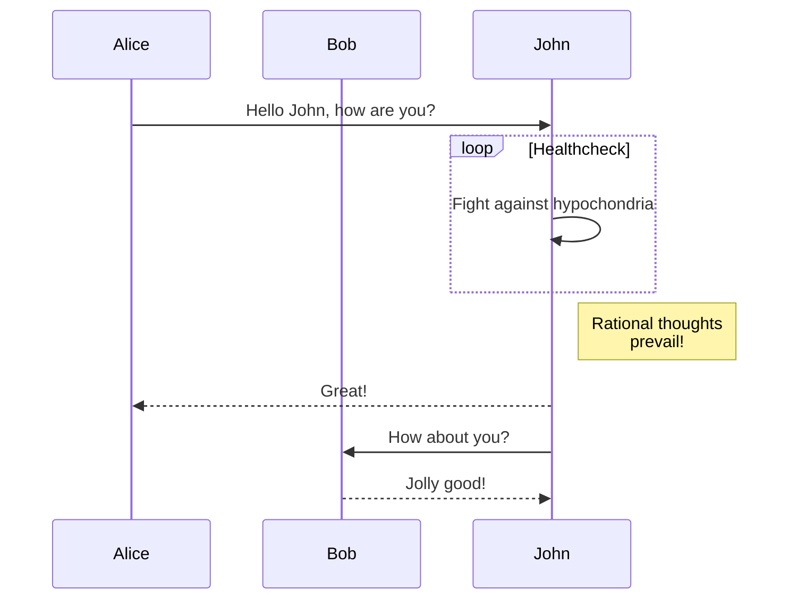

+++
title = 'Markdown Cheatsheet'
date = 2024-05-03T18:44:05+09:00
draft = true
+++

# H1

## H2

### H3

#### H4

##### H5

###### H6


---


---

hello :wave:

:bow:



this is warning



this is note



this is info



this is tip



```go {linenos=table,hl_lines=[8,"15-17"],linenostart=199}
// GetTitleFunc returns a func that can be used to transform a string to
// title case.
//
// The supported styles are
//
// - "Go" (strings.Title)
// - "AP" (see https://www.apstylebook.com/)
// - "Chicago" (see https://www.chicagomanualofstyle.org/home.html)
//
// If an unknown or empty style is provided, AP style is what you get.
func GetTitleFunc(style string) func(s string) string {
  switch strings.ToLower(style) {
  case "go":
    return strings.Title
  case "chicago":
    return transform.NewTitleConverter(transform.ChicagoStyle)
  default:
    return transform.NewTitleConverter(transform.APStyle)
  }
}
```


```goat
      .               .                .               .--- 1          .-- 1     / 1
     / \              |                |           .---+            .-+         +
    /   \         .---+---.         .--+--.        |   '--- 2      |   '-- 2   / \ 2
   +     +        |       |        |       |    ---+            ---+          +
  / \   / \     .-+-.   .-+-.     .+.     .+.      |   .--- 3      |   .-- 3   \ / 3
 /   \ /   \    |   |   |   |    |   |   |   |     '---+            '-+         +
 1   2 3   4    1   2   3   4    1   2   3   4         '--- 4          '-- 4     \ 4

```



<script type="module">
import mermaid from 'https://cdn.jsdelivr.net/npm/mermaid/dist/mermaid.esm.min.mjs';
mermaid.initialize({ startOnLoad: true });
</script>