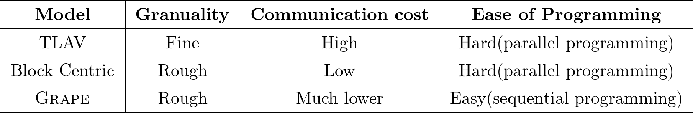
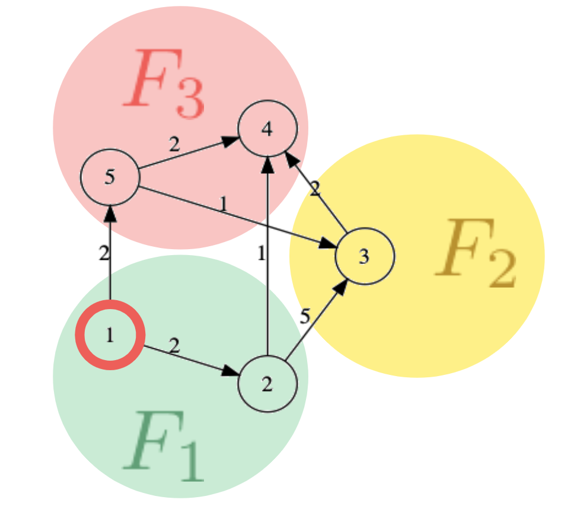
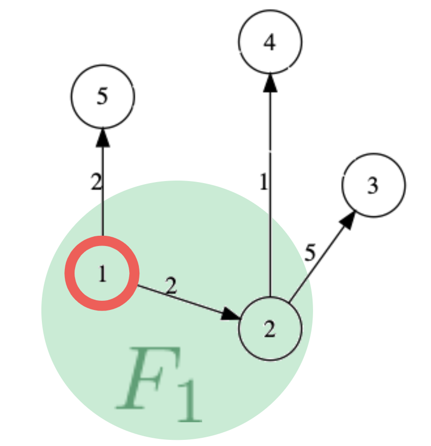
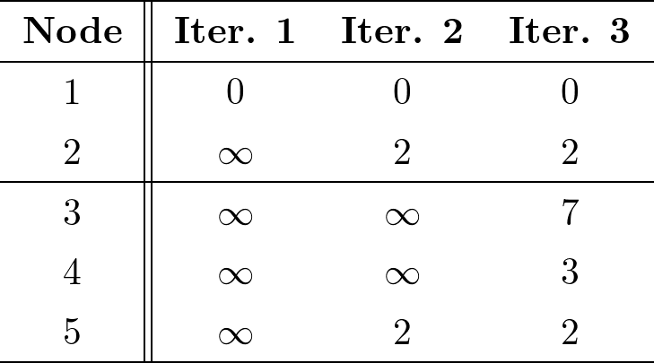
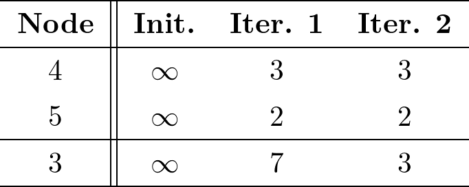
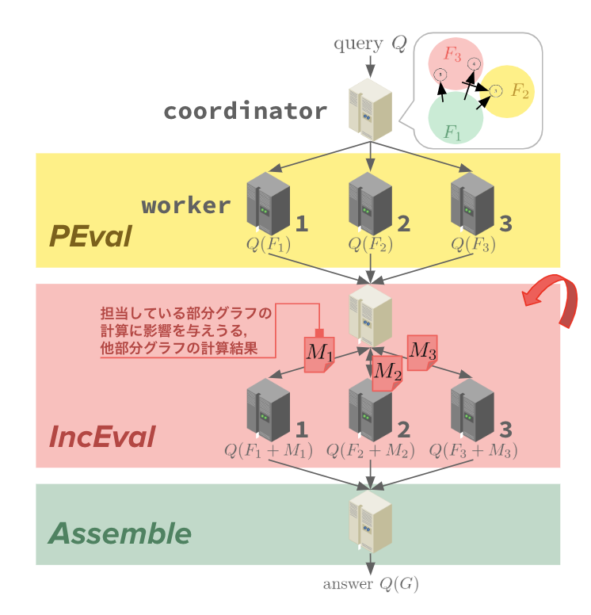
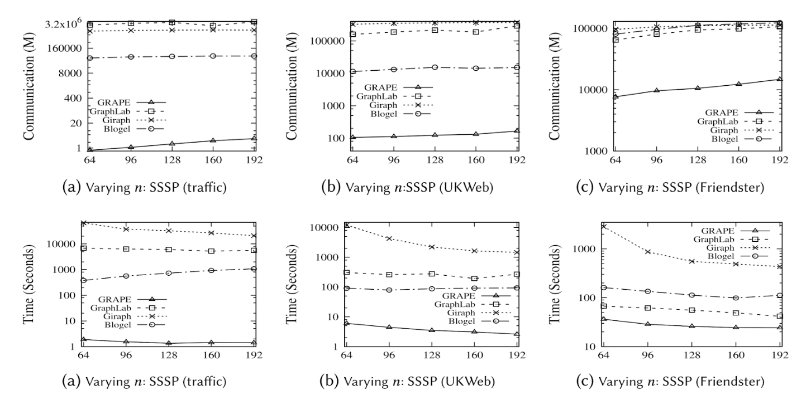
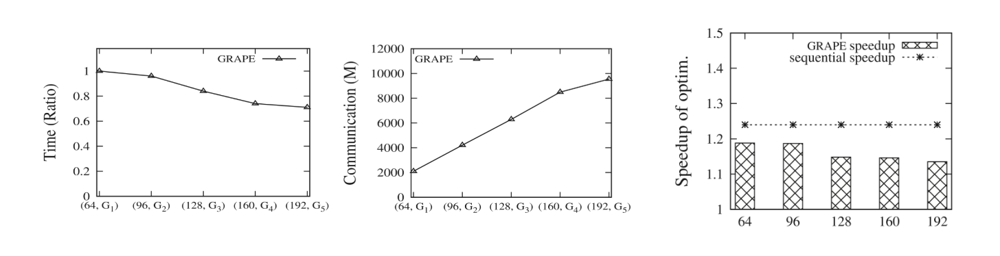

## 0. これは何

僕が最近研究している「並行グラフ処理系」に関連して，僕自身のテーマにおいて非常に参考になった論文であるParallelizing Sequential Graph Computations[^0]について，その詳細をまとめました．なお，以下の資料の内容は大学のカリキュラムの一環として行われた発表会で用いたハンドアウトです．

## 1. 背景

一台のメモリに載り切らないほど巨大なグラフに対する計算需要の高まりを受け，グラフ計算を並列実行するPregel[^1]やGraphLab[^2]をはじめとする処理系が考案された．これらは「各頂点を一台の計算機と見なし，頂点ごとに処理を実行し，頂点間でコミュニケーションをとりながら状態を更新し，その収束を以って全体の解とする」ようなThink Like A Vertex(TLAV)という計算モデルを実装している．

しかし，既存のグラフアルゴリズムは並列実行されることを前提としていないため，これらの処理系を利用するためには実行したいアルゴリズムをTLAVに書き下す必要があるが，これは容易な作業ではない．グラフアルゴリズムはTLAVの登場以前から研究されていて，問題を解決する最適なアルゴリズムが既に存在しているにも関わらず，TLAVな処理系ではアルゴリズムの変換が伴うため，敷居が十分に下がったとは言えない．

そこで，既存のグラフアルゴリズムのロジックをそのまま用いながらも，並列実行することができるような処理系 $GRAPE$ を提案する． $GRAPE$ では，計算モデルとして，既存の分散グラフ処理系が採用するTLAVではなく，Partial evaluation & Incremental Computationモデル(以下$GRAPE$モデル)を採用し，既存のアルゴリズムのロジックを変更することなく並列化させる．同時に，$GRAPE$モデルはTLAVと比較してコミュニケーションコストを少なく抑えることができることからより効率的な計算の実行が可能となる．

## 2. 関連研究

分散グラフ処理の計算モデルの変遷と$GRAPE$モデルの位置付けを述べる．分散グラフ処理を実現する計算モデルとして以下の二つがよく用いられる．

### Think Like A Vertex
最初に提案された計算モデル．PregelやGiraph[^3]，GraphLab[^2]に実装されている．頂点ごとに処理を実行し，頂点間でコミュニケーションをとりながら状態を更新．全頂点の状態の収束を以って全体の解とする．

### Think Like A Graph (or Block Centric)
TLAVを高速化しようとする研究の中で提案されたモデル．$n$個の頂点をまとめて扱うことでコミュニケーションコストを抑え，実行効率の向上を図る．Blogel[^4]で実装されている．

TLAVとBlock Centricモデルおよび$GRAPE$モデルを，処理単位の粒度，コミュニケーションコストの大小，プログラミングのしやすさという三つの観点から整理すると下表のようになる．

## 3. Partial evaluation & Incremental computation
$GRAPE$では，Partial evaluation & Incremental computationという計算モデルを採用している．これは，最初に部分グラフに対して実行したい処理を行って部分解を求め，その部分解の更新を繰り返していくことで全体の解を求めるというモデルである．

### Partial evaluation
コンパイラによるプログラム最適化の文脈で登場し，XML文章中の要素を指定するXPathを分散環境下で評価する研究などでも取り上げられている[^7]．

### Incremental computation
巨大な動的グラフ$G$に対するクエリ$Q$の応答速度を向上させる技術．グラフの変化$\Delta G$から$Q(G \oplus \Delta G) = Q(G) \oplus \Delta O$を満たすようなクエリ出力の差分$\Delta O$を求めることで，グラフ全体を用いて再計算することなく，変化後のグラフに対するクエリ結果を求める[^8]．

例えば，図1のような5ノードからなるグラフ$G$を三つの部分グラフ$F_1$，$F_2$，$F_3$に分割する．部分グラフは，それを構成するノードとそのノードを始点とするエッジの終点も含めるものとして与える．例えば，部分グラフ$F_1$は図2となる．ここで，グラフ$G$に対してノード$1$を始点とする単一始点最短経路問題(SSSP)を考える．$GRAPE$ではまず，部分グラフ$F_1$に対してダイクストラ法を用いて計算する．この結果は$G$全体に対するSSSPの解ではないが，この結果は全体の解のたたき台となっている．この「部分グラフ$F_1$に対するダイクストラ法の適用」がPartial evaluationである．

$F_1$にダイクストラ法を適用することで表2を得る．ここで，ノード$4$および$5$のコストが計算されていることに注目する．これは，$F_1$のpartial evaluationの結果から，$F_3$の状態が変化した(表3におけるノード$4$および$5$の初期状態からの変化)ということであり，この変化を元に$F_3$に対してダイクストラ法を適用することで全体解に収束していく．これが，$GRAPE$のIncremental computationである．

## 4. $GRAPE$
Partial evaluation \& Incremental computationを図3のように組み上げることで処理系$GRAPE$を実現する．

$GRAPE$の利用者は実行したい処理を，$\sf PEval$(Partial evaluation相当)，$\sf IncEval$(Incremental computation)相当，部分解をまとめる$\sf Assemble$という三つのプログラムとして$GRAPE$に与える．$GRAPE$は一つの$\tt coordinator$と複数の$\tt worker$で構成され，$\tt coordinator$は部分グラフ間の接続関係やどの$\tt worker$がどの部分グラフを担当するかを管理している．$\tt worker$は各自が担当する部分グラフに$\sf PEval$や$\sf IncEval$を適用する．

$GRAPE$での演算は三つのフェーズから成る．まず$\tt coordinator$がクエリの実行を受け付け，$\tt worker$が各自が担当している部分グラフに対して$\sf PEval$を実行する．次に,
各$\tt worker$が部分グラフの状態変化を$\tt coordinator$に通知する．$\tt coordinator$は部分グラフ同士の接続関係を考慮し，対応する$\tt worker$に変化を伝達する．知らせを受けた$\tt worker$は，状態変化に基づく$\sf IncEval$を実行し自分の担当している部分グラフの状態を更新する．$\sf IncEval$は更新が発生しなくなるまで繰り返される．$\sf IncEval$が収束すると，$\tt coordinator$は各$\tt worker$から部分解を回収し，最終的な出力を得る．

## 5. $GRAPE$のアドバンテージ
$GRAPE$は処理効率と$GRAPE$モデルの表現力において，既存の処理系に対してアドバンテージがある．$GRAPE$では部分グラフ間の状態変化をやり取りするコストのみで済むため，TLAVと比較して大幅にコミュニケーションコストが抑えられる．これによって，TLAVよりも効率的な処理が実行できる．さらに$GRAPE$で実行されるアルゴリズムのロジックは既存のものと変わらないため，既存のグラフ最適化技法を適用することができ，さらなる高速化も見込むことができる．加えて，$\sf MapReduce$など他の分散計算モデルを$GRAPE$上に表現することも可能である．例えば$\sf IncEval$でやり取りする情報を`<key: value>`として$\sf PEval$と偶数回目の$\sf IncEval$を$\sf Map$に，奇数回目の$\sf IncEval$を$\sf Reduce$とすれば$\sf MapReduce$を表現できる．

## 6. 評価
$GRAPE$モデルがTLAVよりも

- 処理時間
- コミュニケーションコスト
- グラフの規模に対するスケーラビリティ

の三点において，TLAVとの性能を比較し$GRAPE$モデルの優位性を検証した．プロセッサの数を64から192まで変化させながら，liveJournal[^6]など複数の実世界グラフに対して単一始点最小経路問題をGiraph，GraphLab，Blogel，$GRAPE$で実行した結果を図4に示す．$GRAPE$はGiraph，GraphLab，Blogeと比べて484，36，15倍高速に処理を実行し，$\tt worker$間でやり取りされるデータ量を0.07%，0.12%，0.7%に抑えられている．

グラフの規模に対するスケーラビリティを，入力グラフを5Mノード50Mエッジから25Mノード250Mエッジまで変化させながら実行時間とコミュニケーションコストを計測した．その結果を図5の左二図に示す．グラフ規模に対して十分にスケールしていることがわかる．

図5の右端図から，${GRAPE}$では，並列実行に伴うオーバーヘッドを考慮してもなお，既存のアルゴリズムに対する高速化技法の効果が得られることがわかる．

## 7. 結論
Partial evaluation & Incremental computationという計算モデルはグラフに対しても有効であり，この計算モデルを用いることで
既存のグラフアルゴリズムのロジックをほぼ変更することなく並列化を実現でき，分散グラフ処理系を利用する敷居を下げられる．そこでPartial evaluation & Incremental computationを実装する処理系$GRAPE$を提案する．Partial evaluationに相当する$\sf PEval$とIncremental computationに相当する$\sf IncEval$，部分解を集める$\sf Assemble$を定義することで既存のグラフアルゴリズムの並列化を実現する．

[^0]: Wenfei Fan, Wenyuan Yu, Jingbo Xu, Jingren Zhou, Xiaojian Luo, Qiang Yin, Ping Lu, Yang Cao, and Ruiqi Xu. 2018. Parallelizing Sequential Graph Computations. ACM Trans. Database Syst. 43, 4, Article 18 (December 2018), 39 pages. DOI: https://doi.org/10.1145/3282488
[^1]: Grzegorz Malewicz, Matthew H. Austern, Aart J.C Bik, JamesC. Dehnert, Ilan Horn, Naty Leiser, and Grzegorz Czajkowski.2010. Pregel: a system for large-scale graph processing. In Pro-ceedings of the 2010 ACM SIGMOD International Conferenceon Management of data (SIGMOD ’10). ACM, New York, NY,USA, 135-146.
[^2]: Yucheng Low, Danny Bickson, Joseph Gonzalez, CarlosGuestrin, Aapo Kyrola, and Joseph M. Hellerstein. 2012. Dis-tributed GraphLab: a framework for machine learning and datamining in the cloud. Proc. VLDB Endow. 5, 8 (April 2012),716-727.
[^3]: Giraph. http://giraph.apache.org/
[^4]: Da Yan, James Cheng, Yi Lu, and Wilfred Ng. 2014. Blogel:a block-centric framework for distributed computation on real-world graphs. Proc. VLDB Endow. 7, 14 (October 2014), 1981-1992.
[^5]: Yuanyuan Tian, Andrey Balmin, Severin Andreas Corsten,Shirish Tatikonda, and John McPherson. 2013. From ”think likea vertex” to ”think like a graph”. Proc. VLDB Endow. 7, 3(November 2013), 193-204.
[^6]: Snap. http://snap.stanford.edu/data/index.html
[^7]: Peter Buneman, Gao Cong, Wenfei Fan, and Anastasios Ke-mentsietsidis. 2006. Using partial evaluation in distributedquery evaluation. In Proceedings of the 32nd international con-ference on Very large data bases (VLDB ’06), UmeshwarDayal, Khu-Yong Whang, David Lomet, Gustavo Alonso, GuyLohman, Martin Kersten, Sang K. Cha, and Young-Kuk Kim(Eds.). VLDB Endowment 211-222
[^8]: Wenfei Fan, Chunming Hu, and Chao Tian. 2017. Incremen-tal Graph Computations: Doable and Undoable. In Proceedingsof the 2017 ACM International Conference on Management ofData (SIGMOD ’17). ACM, New York, NY, USA, 155-169.

- https://docs.google.com/presentation/d/e/2PACX-1vR18vtYd3XhDHVbLaP4DXmGELqvX_OV6s7OIdkwhNv4Wi6hLPREQ7wr1r4ki3PDX2mPhugO248Y4DG3/embed?start=false&loop=false&delayms=3000